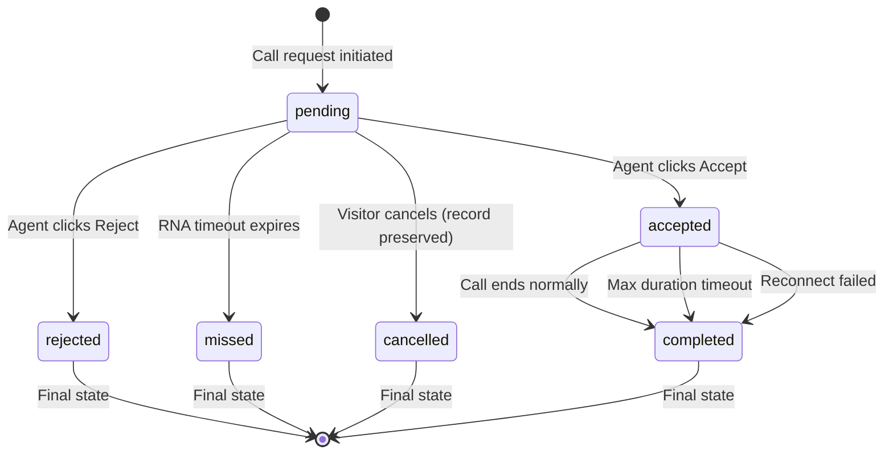

# Feature: Call Logs (D7)

## Quick Summary
Call Logs provides historical call records and real-time analytics for admins and agents. Admins see organization-wide call data with filtering, statistics, and CSV export capabilities. Agents see only their own call history with personal performance metrics.

## Affected Users
- [ ] Website Visitor
- [x] Agent
- [x] Admin
- [ ] Platform Admin

---

## 1. WHAT IT DOES

### Purpose
Call Logs serves as the primary reporting interface for all call data in the platform. It enables:
- Historical review of all calls (completed, missed, rejected, etc.)
- Performance analytics and KPI tracking
- Call recording playback and download
- Transcription and AI summary access
- Data export for external analysis
- Coverage gap identification (visitors without available agents)

### User Goals
| User Type | What They Want | How This Feature Helps |
|-----------|---------------|----------------------|
| Admin | Monitor team performance | Shows aggregate stats: answer rate, avg call duration, total talk time |
| Admin | Identify staffing gaps | Coverage card shows missed opportunities when no agent available |
| Admin | Export data for reports | CSV export with all call details including recording links |
| Admin | Review specific calls | Searchable/filterable table with recording playback |
| Agent | Track personal performance | Shows individual stats: rings, answers, avg answer time |
| Agent | Review past calls | Access to own call history with recordings and transcriptions |

---

## 2. HOW IT WORKS

### High-Level Flow (Happy Path)
1. User navigates to Call Logs page (`/admin/calls` for admin, `/dashboard/calls` for agent)
2. Server fetches call data from `call_logs` table for the date range (default: last 30 days, 50 records per page)
3. Server calculates statistics from the fetched data
4. Client renders statistics cards, optional filters panel, call table, and pagination controls
5. User can apply filters (date, agent, status, disposition, pool, URL, duration, country) - resets to page 1
6. User can navigate between pages using Previous/Next buttons or page numbers - preserves filters
7. User can play recordings, view transcriptions, expand AI summaries
8. User can export filtered results to CSV

### Data Flow Diagram

```
┌─────────────────────────────────────────────────────────────────────────────┐
│                           CALL LOG CREATION                                  │
│                                                                              │
│  Call Request    ┌─────────────┐   Ring Starts    ┌────────────────────┐    │
│  ─────────────►  │ Server      │  ──────────────► │ call_logs          │    │
│                  │ (Socket)    │                  │ status: "pending"  │    │
│                  └─────────────┘                  │ ring_started_at    │    │
│                                                   └────────────────────┘    │
│                                                                              │
│  Agent Accepts   ┌─────────────┐   Update         ┌────────────────────┐    │
│  ─────────────►  │ call-logger │  ──────────────► │ call_logs          │    │
│                  │ .ts         │                  │ status: "accepted" │    │
│                  └─────────────┘                  │ answered_at        │    │
│                                                   │ answer_time_seconds│    │
│                                                   └────────────────────┘    │
│                                                                              │
│  Call Ends       ┌─────────────┐   Update         ┌────────────────────┐    │
│  ─────────────►  │ call-logger │  ──────────────► │ call_logs          │    │
│                  │ .ts         │                  │ status: "completed"│    │
│                  └─────────────┘                  │ duration_seconds   │    │
│                                                   │ ended_at           │    │
│                                                   └────────────────────┘    │
└─────────────────────────────────────────────────────────────────────────────┘

┌─────────────────────────────────────────────────────────────────────────────┐
│                           CALL LOG RETRIEVAL                                 │
│                                                                              │
│  ┌────────────┐    Query with      ┌────────────┐   Fetch        ┌────────┐ │
│  │ Admin/     │    Filters         │ page.tsx   │   via          │Supabase│ │
│  │ Agent UI   │ ────────────────►  │ (Server    │ ──────────────►│   DB   │ │
│  │            │                    │  Component)│                │        │ │
│  └────────────┘                    └────────────┘                └────────┘ │
│       ▲                                  │                            │     │
│       │                                  │                            │     │
│       │    Render UI      ┌─────────────┴────────────┐               │     │
│       │◄──────────────────│ calls-client.tsx         │◄──────────────┘     │
│                           │ (Client Component)       │  call data          │
│                           │ - Statistics cards       │  + stats            │
│                           │ - Filter panel           │                     │
│                           │ - Call table             │                     │
│                           │ - Recording player       │                     │
│                           └──────────────────────────┘                     │
└─────────────────────────────────────────────────────────────────────────────┘
```

### State Machine



### State Definitions
| State | Description | How to Enter | How to Exit |
|-------|-------------|--------------|-------------|
| `pending` | Call ringing, awaiting agent response | Call request created | Accept, reject, missed, or cancel |
| `accepted` | Call in progress | Agent accepts call | Call ends (any reason) |
| `rejected` | Agent declined the call | Agent clicks reject | Final state |
| `missed` | RNA timeout, agent didn't answer | Timeout expires | Final state |
| `cancelled` | Visitor cancelled call during ring | Visitor clicks cancel | Final state |
| `completed` | Call finished normally | Call ended by either party | Final state |

---

## 3. DETAILED LOGIC

### Triggers & Events
| Event/Trigger | Where It Fires | What It Does | Side Effects |
|--------------|---------------|--------------|--------------|
| Page load | Browser navigation | Fetches call data for date range | DB query with filters |
| Date range change | DateRangePicker component | Re-fetches data for new range | URL params updated, page reload |
| Filter apply | Apply button click | Re-fetches with new filters | URL params updated, page reload |
| Recording play | Play button click | Opens video modal or plays audio | Audio/video playback |
| Transcription expand | Transcribed badge click | Expands row to show transcription | Local state change |
| AI Summary expand | AI Summary badge click | Expands row to show summary | Local state change |
| CSV export | Export CSV button click | Generates CSV using Web Worker with progress tracking | File download, non-blocking UI |
| Page change | Previous/Next/Page button click | Fetches data for specified page | URL params updated (page, limit), preserves filters |

### Key Functions/Components
| Function/Component | File | Purpose |
|-------------------|------|---------|
| `CallsPage` | `apps/dashboard/src/app/(app)/admin/calls/page.tsx` | Server component - fetches data, applies server-side filters |
| `CallsClient` | `apps/dashboard/src/app/(app)/admin/calls/calls-client.tsx` | Client component - renders UI, handles interactions |
| `AgentCallsPage` | `apps/dashboard/src/app/(app)/dashboard/calls/page.tsx` | Server component for agent view |
| `AgentCallsClient` | `apps/dashboard/src/app/(app)/dashboard/calls/agent-calls-client.tsx` | Client component for agent view |
| `calculateAgentStats` | `apps/dashboard/src/lib/stats/agent-stats.ts` | Calculates all call statistics from call data |
| `exportCallLogsToCSV` | `apps/dashboard/src/features/call-logs/exportCSV.ts` | Exports call logs to CSV using Web Worker |
| `csvWorker` | `apps/dashboard/src/features/call-logs/csvWorker.ts` | Web Worker for non-blocking CSV generation |
| `goToPage` | `apps/dashboard/src/app/(app)/admin/calls/calls-client.tsx` | Navigates to specific page while preserving filters |
| `createCallLog` | `apps/server/src/lib/call-logger.ts` | Creates new call log entry on call request |
| `markCallAccepted` | `apps/server/src/lib/call-logger.ts` | Updates log when call accepted |
| `markCallEnded` | `apps/server/src/lib/call-logger.ts` | Updates log when call completes |
| `markCallMissed` | `apps/server/src/lib/call-logger.ts` | Updates log on RNA timeout |
| `markCallRejected` | `apps/server/src/lib/call-logger.ts` | Updates log when agent rejects |
| `markCallCancelled` | `apps/server/src/lib/call-logger.ts` | Marks call as cancelled when visitor cancels (preserves audit trail) |

### Data Fields Retrieved
| Field | Type | Description |
|-------|------|-------------|
| `id` | UUID | Unique call identifier |
| `status` | enum | pending, accepted, rejected, completed, missed, cancelled |
| `page_url` | string | URL where visitor initiated call |
| `duration_seconds` | number | Call length (completed calls only) |
| `recording_url` | string | Recording ID (UUID) for signed URL generation |
| `created_at` | timestamp | When call request was made |
| `ring_started_at` | timestamp | When ring began |
| `answered_at` | timestamp | When agent answered |
| `answer_time_seconds` | number | Seconds from ring to answer |
| `disposition_id` | UUID | Call outcome category |
| `pool_id` | UUID | Agent pool that handled call |
| `visitor_city` | string | GeoIP city |
| `visitor_region` | string | GeoIP state/region |
| `visitor_country` | string | GeoIP country name |
| `visitor_country_code` | string | ISO country code |
| `transcription` | text | Full call transcription |
| `transcription_status` | enum | pending, processing, completed, failed |
| `ai_summary` | text | AI-generated call summary |
| `ai_summary_status` | enum | pending, processing, completed, failed |
| `agent` | relation | Agent profile (id, display_name) |
| `site` | relation | Site info (id, name, domain) |
| `disposition` | relation | Disposition (id, name, color) |

### Statistics Calculated
| Statistic | Calculation | Notes |
|-----------|-------------|-------|
| Total Rings | Count of all calls | Every call counts as a ring (including cancelled) |
| Total Answers | Count where status = accepted OR completed | Answered calls |
| Missed Calls | Count where status = missed | RNA timeouts |
| Rejected | Count where status = rejected | Agent declined |
| Answer Rate | (Total Answers / Total Rings) × 100 | Percentage |
| Avg Answer Time | Average of `answer_time_seconds` | Only for answered calls |
| Avg Call Duration | Average of `duration_seconds` | Only for completed calls |
| Total Talk Time | Sum of `duration_seconds` | All completed calls |
| Conversion Rate | (Total Answers / Pageviews with Agent) × 100 | Admin view only |
| Disposition Breakdown | Count per disposition / Total with disposition | Percentage per outcome |

---

## 4. EDGE CASES

### Complete Scenario Matrix
| # | Scenario | Trigger | Current Behavior | Correct? | Notes |
|---|----------|---------|------------------|----------|-------|
| 1 | Normal completed call | Call ends normally | Shows in table with duration | ✅ | |
| 2 | Missed call (RNA) | Agent doesn't answer | Status = "missed", no duration | ✅ | |
| 3 | Rejected call | Agent rejects | Status = "rejected", no duration | ✅ | |
| 4 | Cancelled call | Visitor cancels during ring | Status = "cancelled", preserves in DB | ✅ | Appears in logs with cancelled status for audit trail |
| 5 | Very long call (>1hr) | Call duration exceeds 1 hour | Duration displayed as "1h 23m" | ✅ | formatDuration handles |
| 6 | Call with no agent assigned | Abandoned/orphan | agent column shows "Unknown" | ✅ | Null agent handled |
| 7 | Filtering returns zero results | No matching calls | Empty state shown | ✅ | "No calls found" message |
| 8 | Many calls in date range | Large data set | Shows paginated results (50 per page) | ✅ | Pagination controls shown |
| 9 | Deleted agent's calls | Agent soft-deleted | Shows "Unknown" for agent name | ✅ | Null handling |
| 10 | Deleted pool's calls | Pool deleted | Pool filter excludes, call shows | ⚠️ | pool_id remains in call record |
| 11 | Call from blocked country | Geo-blocked visitor | Excluded from coverage stats | ✅ | Blocklist filtering applied |
| 12 | Transcription failed | Processing error | Shows "Failed" badge | ✅ | Error state displayed |
| 13 | AI summary failed | Processing error | Shows "Failed" badge | ✅ | Error state displayed |
| 14 | Recording not available | No recording URL | Shows dash "-" | ✅ | Graceful fallback |
| 15 | URL parsing fails in filter | Malformed URL in call | Falls back to raw string match | ✅ | try/catch in filter logic |
| 16 | Timezone display | Different timezone user | Uses browser's locale | ✅ | toLocaleTimeString |
| 17 | Call in progress (accepted) | Active call | Appears with status "Accepted" | ✅ | No duration yet |
| 18 | Agent without profile | Missing profile setup | "No Agent Profile" message | ✅ | Agent page only |
| 19 | Filter change on later page | User on page 3 applies new filter | Returns to page 1 with new results | ✅ | Prevents viewing non-existent pages |

### Error States
| Error | When It Happens | What User Sees | Recovery Path |
|-------|-----------------|----------------|---------------|
| DB query failure | Supabase unavailable | Empty table / error | Refresh page |
| Recording URL expired | S3 presigned URL timeout | Playback fails | Re-fetch page |
| Large CSV export (5000+ rows) | Very large data set | Shows progress indicator during generation | Export completes in background without blocking UI |
| Invalid date range | from > to | Empty results | Fix date selection |
| Filter with special chars | Regex injection attempt | Escaped, no match | Clear filter |

---

## 5. UI/UX REVIEW

### User Experience Audit

**Admin View:**
| Step | User Action | System Response | Clear? | Issues |
|------|------------|-----------------|--------|--------|
| 1 | Navigate to /admin/calls | Page loads with last 30 days | ✅ | |
| 2 | View stats cards | 10 stat cards displayed | ✅ | Many cards may overwhelm |
| 3 | View coverage card | Shows missed opportunities | ✅ | Color-coded (amber=warning) |
| 4 | Click Filters button | Filter panel expands | ✅ | |
| 5 | Select date range | Picker opens | ✅ | Preset options helpful |
| 6 | Apply filters | Page reloads with results | ✅ | URL params persist |
| 7 | Click Play on recording | Video modal opens | ✅ | Auto-plays |
| 8 | Click Transcribed badge | Row expands with text | ✅ | Scrollable if long |
| 9 | Click AI Summary badge | Row expands with summary | ✅ | Formatted text |
| 10 | Click Export CSV | Progress indicator shows export status (0-100%), file downloads when complete | ✅ | UI remains responsive during export |
| 11 | Navigate pages | Previous/Next buttons or page numbers | Page loads with next/previous set of results | ✅ | Filters preserved across pages |

**Agent View:**
| Step | User Action | System Response | Clear? | Issues |
|------|------------|-----------------|--------|--------|
| 1 | Navigate to /dashboard/calls | Page loads with my calls | ✅ | |
| 2 | View stats cards | 8 personal stat cards | ✅ | |
| 3 | Filter by status/disposition | Results filtered | ✅ | |
| 4 | Play own recording | Video/audio plays | ✅ | |

### Accessibility
- Keyboard navigation: ⚠️ Table rows not focusable, filter inputs are
- Screen reader support: ⚠️ Icons lack aria-labels in some places
- Color contrast: ✅ Status badges have sufficient contrast
- Loading states: ⚠️ No loading spinner during page transitions (server components)

---

## 6. TECHNICAL CONCERNS

### Performance
| Concern | Implementation | Status |
|---------|----------------|--------|
| Large data sets | Paginated queries (50 records per page) | ✅ Mitigated |
| Complex joins | Single query with relations | ✅ Efficient |
| Client-side filtering | URL conditions filtered after fetch | ✅ Fast with 50 records per page |
| Stats calculation | Done on full result set client-side | ✅ Fast for paginated results |
| CSV generation | Web Worker-based, non-blocking | ✅ Exports run off main thread with progress tracking |

### Security
| Concern | Mitigation |
|---------|------------|
| Cross-org data access | Server query filters by organization_id |
| Agent sees other agent's calls | Agent query filters by agent_id |
| Recording URL exposure | Supabase storage presigned URLs |
| SQL injection | Supabase parameterized queries |
| XSS in URLs/transcriptions | React escapes by default |

### Reliability
| Concern | Mitigation |
|---------|------------|
| DB connection failure | Page shows error, user can refresh |
| Recording storage down | Recording buttons fail gracefully |
| Transcription service down | Shows "Processing" or "Failed" status |
| Call logger fails | Fire-and-forget pattern, call continues |

---

## 7. FIRST PRINCIPLES REVIEW

### Does This Make Sense?

1. **Is the mental model clear?** ✅ Yes - Table of calls with filters and stats is intuitive
2. **Is the control intuitive?** ✅ Yes - Standard date picker, dropdowns, search patterns
3. **Is feedback immediate?** ⚠️ Partial - Filter changes require Apply button, URL updates trigger reload
4. **Is the flow reversible?** ✅ Yes - Can clear filters, change date range
5. **Are errors recoverable?** ✅ Yes - Can retry filters, refresh page
6. **Is the complexity justified?** ✅ Yes - Many filters necessary for large call volumes

### Identified Issues
| Issue | Impact | Severity | Suggested Fix |
|-------|--------|----------|--------------|
| No server-side pagination | 500 record limit cuts off data | 🟡 Medium | Add cursor-based pagination |
| URL filter is client-side | Can't search >500 calls by URL | 🟡 Medium | Move to server-side filter |
| No sorting options | Can't sort by duration, etc. | 🟢 Low | Add column sorting |
| No search by visitor | Can't find specific visitor's calls | 🟢 Low | Add visitor search |
| Loading states missing | Page appears stuck during load | 🟢 Low | Add loading skeleton |

---

## 8. CODE REFERENCES

| Purpose | File | Lines | Notes |
|---------|------|-------|-------|
| Admin page server component | `apps/dashboard/src/app/(app)/admin/calls/page.tsx` | 1-258 | Query construction, filter parsing |
| Admin page client component | `apps/dashboard/src/app/(app)/admin/calls/calls-client.tsx` | 1-1320 | Full UI with filters, stats, table |
| Agent page server component | `apps/dashboard/src/app/(app)/dashboard/calls/page.tsx` | 1-147 | Agent-specific query |
| Agent page client component | `apps/dashboard/src/app/(app)/dashboard/calls/agent-calls-client.tsx` | 1-1040 | Agent UI |
| Statistics calculation | `apps/dashboard/src/lib/stats/agent-stats.ts` | 1-145 | All stat calculations |
| CSV export interface | `apps/dashboard/src/features/call-logs/exportCSV.ts` | 1-78 | Web Worker orchestration and file download |
| CSV worker | `apps/dashboard/src/features/call-logs/csvWorker.ts` | 1-126 | CSV generation in Web Worker with progress reporting |
| Call logger (create) | `apps/server/src/lib/call-logger.ts` | 55-123 | createCallLog function |
| Call logger (update) | `apps/server/src/lib/call-logger.ts` | 129-302 | markCallAccepted, markCallEnded, etc. |
| Database types | `packages/domain/src/database.types.ts` | 282-317 | call_logs table schema |

---

## 9. RELATED FEATURES
- [Call Lifecycle (P3)](../platform/call-lifecycle.md) - How calls are created and managed
- [Agent Stats (STATS1)](../stats/agent-stats.md) - Detailed stats calculation (not yet documented)
- [Routing Rules (D2)](./routing-rules.md) - How calls are routed to pools
- [Dispositions](./dispositions.md) - Call outcome categories (not yet documented)
- [Recording & Transcription](./recording-settings.md) - How recordings are made (not yet documented)

---

## 10. OPEN QUESTIONS

1. **Data retention policy?** - No explicit retention period found in code. Call logs appear to be kept indefinitely. Should there be automatic cleanup for older records?

2. **Why 500 record limit?** - Likely for performance, but could paginate instead for complete access to historical data.

3. **Real-time updates?** - Call logs page does not update in real-time. User must refresh to see new calls. Should it poll or use websockets?

4. **Timezone handling for CSV export** - Exports use browser locale. Should export include timezone info or use UTC?

5. **Visitor info beyond geo-IP?** - Only location data captured. No visitor email/name unless provided elsewhere. Is this intentional for privacy?

6. **Recording storage costs** - Recordings stored in Supabase storage. No visibility into storage costs from this UI. Should there be storage usage metrics?


