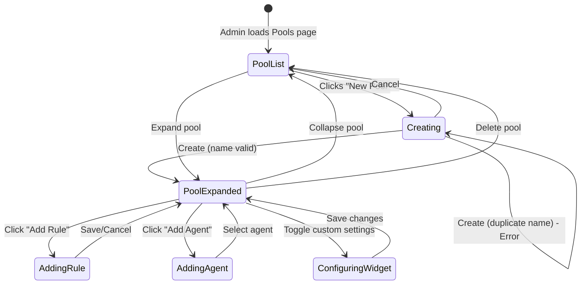

# Feature: Pool Management (D1)

## Quick Summary
Pool Management allows admins to create, edit, and delete agent pools—containers that group agents together for visitor routing. Each pool can have its own routing rules, assigned agents with priority tiers, custom widget settings, and example videos for agent training.

## Affected Users
- [ ] Website Visitor (indirectly - routed to appropriate pool)
- [ ] Agent (assigned to pools, sees pool-specific settings)
- [x] Admin (creates, configures, and manages pools)
- [ ] Platform Admin

---

## 1. WHAT IT DOES

### Purpose
Pool Management enables organizations to:
1. **Organize agents by team/function** - Sales, Support, Enterprise, etc.
2. **Route visitors to appropriate teams** - Via routing rules defined per pool
3. **Configure pool-specific settings** - Custom widget appearance, intro scripts, example videos
4. **Prioritize agents within pools** - Primary, Standard, and Backup tiers for lead distribution

### User Goals
| User Type | What They Want | How This Feature Helps |
|-----------|---------------|----------------------|
| Admin | Group sales agents together | Create "Sales Team" pool and assign sales agents |
| Admin | Route /pricing visitors to sales | Add routing rule to Sales pool matching "/pricing" |
| Admin | Have custom widget for enterprise pages | Configure custom widget settings for Enterprise pool |
| Admin | Ensure top performers get leads first | Set top agents as "Primary" tier in the pool |
| Admin | Catch unmatched traffic | Catch-all pool automatically receives all unrouted visitors |

---

## 2. HOW IT WORKS

### High-Level Flow (Happy Path)
1. Admin navigates to Admin → Pools page
2. Admin clicks "New Pool" button
3. Admin enters pool name and optional description
4. Admin clicks "Create Pool" - pool is saved to database
5. Admin expands pool to configure routing rules
6. Admin adds agents to the pool with priority tiers
7. (Optional) Admin configures custom widget settings
8. (Optional) Admin sets example videos and intro script
9. Configuration syncs to signaling server for routing

### State Machine


### State Definitions
| State | Description | How to Enter | How to Exit |
|-------|-------------|--------------|-------------|
| PoolList | List of all pools displayed | Page load | Expand any pool |
| Creating | New pool form visible | Click "New Pool" | Create or Cancel |
| PoolExpanded | Single pool's details shown | Click pool header | Collapse or navigate away |
| AddingRule | Rule builder modal active | Click "Add Rule" | Save or Cancel |
| AddingAgent | Agent selection dropdown visible | Click "Add Agent" | Select agent or click away |
| ConfiguringWidget | Widget settings panel expanded | Toggle "Custom for This Pool" | Save or reset to defaults |

---

## 3. DETAILED LOGIC

### Triggers & Events
| Event/Trigger | Where It Fires | What It Does | Side Effects |
|--------------|---------------|--------------|--------------|
| Page load | `pools/page.tsx` | Fetches pools, agents, org config | Syncs config to signaling server |
| Create Pool | `handleAddPool()` | INSERT into `agent_pools` | Expands new pool, syncs to server |
| Delete Pool | `handleDeletePool()` | DELETE from `agent_pools` | Removes from UI, syncs to server |
| Add Agent | `handleAddAgentToPool()` | INSERT into `agent_pool_members` | Updates UI, syncs to server |
| Remove Agent | `handleRemoveAgentFromPool()` | DELETE from `agent_pool_members` | Updates UI |
| Update Priority | `handleUpdateAgentPriority()` | UPDATE `agent_pool_members.priority_rank` | Immediate UI update, syncs to server |
| Save Widget Settings | `handleSaveCustomSettings()` | UPDATE `agent_pools.widget_settings` | Collapses settings panel |

### Key Functions/Components
| Function/Component | File | Purpose |
|-------------------|------|---------|
| `PoolsClient` | `pools-client.tsx:1515` | Main component managing all pool state |
| `handleAddPool` | `pools-client.tsx:1637` | Creates new pool with validation |
| `handleDeletePool` | `pools-client.tsx:1772` | Deletes pool (blocks catch-all) |
| `handleAddAgentToPool` | `pools-client.tsx:1680` | Adds agent with priority rank |
| `handleRemoveAgentFromPool` | `pools-client.tsx:1753` | Removes agent from pool |
| `handleUpdateAgentPriority` | `pools-client.tsx:1722` | Changes agent's priority tier |
| `syncConfigToServer` | `pools-client.tsx:1541` | POSTs pool config to signaling server |
| `PoolWidgetSettings` | `pools-client.tsx:829` | Custom widget settings per pool |
| `AgentPriorityCard` | `pools-client.tsx:102` | Agent card with priority selector |
| `RuleBuilder` | `pools-client.tsx:308` | Routing rule creation UI |

### Data Flow

#### 1. Page Load
```
Admin visits /admin/pools
    ↓
pools/page.tsx (Server Component)
    ↓
Supabase SELECT agent_pools + pool_routing_rules + agent_pool_members
    ↓
PoolsClient receives data as props
    ↓
useEffect → syncConfigToServer(pools)
    ↓
POST /api/config/org to signaling server
```

#### 2. Create Pool
```
Admin fills form → clicks "Create Pool"
    ↓
handleAddPool()
    ↓
Validate: name not empty
    ↓
Supabase INSERT agent_pools
    ↓
On success: Add to local state, expand pool, clear form
On error (duplicate): Show alert with specific message
    ↓
syncConfigToServer() triggered by useEffect
```

#### 3. Add Agent to Pool
```
Admin clicks "Add Agent" → selects agent
    ↓
handleAddAgentToPool(poolId, agentId, priorityRank=1)
    ↓
Supabase INSERT agent_pool_members
    ↓
Update local state with new member
    ↓
syncConfigToServer()
```

---

## 4. EDGE CASES

### Complete Scenario Matrix
| # | Scenario | Trigger | Current Behavior | Correct? | Notes |
|---|----------|---------|------------------|----------|-------|
| 1 | Create first pool | Admin creates pool when none exist | Shows empty state first, then pool list | ✅ | |
| 2 | Create pool with duplicate name | Admin uses existing name | Shows alert: "A pool named X already exists" | ✅ | Enforced by UNIQUE constraint |
| 3 | Create pool with empty name | Admin leaves name blank | "Create Pool" button disabled | ✅ | |
| 4 | Delete catch-all pool | Admin clicks delete on catch-all | Delete button not shown for catch-all | ✅ | Protected in UI and code |
| 5 | Delete regular pool | Admin clicks delete | Pool removed immediately (no confirmation) | ⚠️ | No confirmation dialog |
| 6 | Pool with active visitors deleted | Admin deletes pool with visitors | Visitors routed to catch-all on next match | ✅ | CASCADE deletes rules |
| 7 | Add agent already in pool | Admin tries to add existing member | Agent not shown in available list | ✅ | `getAvailableAgents()` filters |
| 8 | Remove last agent from pool | Admin removes only agent | Pool shows "No agents assigned" | ✅ | Pool remains functional |
| 9 | Pool with no agents | Visitor routed to empty pool | Falls back to ANY available agent | ⚠️ | May get agent from different pool |
| 10 | Add routing rule to catch-all | Admin tries to add rule | Rule builder not shown, info message displayed | ✅ | Protected in UI |
| 11 | Edit pool name | Not implemented | Cannot edit pool name after creation | ⚠️ | Feature gap |
| 12 | Reorder agents by priority | Admin changes priority dropdown | Immediate update, grouped by tier | ✅ | |
| 13 | All agents in pool set to Backup | Admin sets all to tier 3 | Leads still go to them (lowest priority first) | ✅ | Priority is relative |

### Error States
| Error | When It Happens | What User Sees | Recovery Path |
|-------|-----------------|----------------|---------------|
| Duplicate pool name | CREATE with existing name | Alert: "A pool named X already exists" | Choose different name |
| Database save fails | Network error on any save | Error in console (silent fail) | Refresh page, retry |
| Server sync fails | Signaling server unreachable | Console warning only | Rules saved to DB, will sync on next load |
| RLS permission denied | Non-admin tries to modify | Operation fails silently | Must be admin |

---

## 5. UI/UX REVIEW

### User Experience Audit
| Step | User Action | System Response | Clear? | Issues |
|------|------------|-----------------|--------|--------|
| 1 | Admin opens Pools page | Pools load with catch-all first | ✅ | |
| 2 | Admin clicks "New Pool" | Form appears above pool list | ✅ | |
| 3 | Admin enters name | Live input | ✅ | |
| 4 | Admin clicks Create | Pool appears, expands automatically | ✅ | Nice UX |
| 5 | Admin clicks pool header | Pool expands/collapses | ✅ | |
| 6 | Admin clicks delete on regular pool | Pool deleted immediately | ⚠️ | No confirmation |
| 7 | Admin sees catch-all pool | Has "Catch-All" badge, no delete button | ✅ | Clear special status |
| 8 | Admin adds agent | Agent added as "Primary" by default | ✅ | Clear default |
| 9 | Admin changes agent priority | Dropdown updates, agent moves to new tier | ✅ | |
| 10 | Admin toggles custom widget | Settings panel expands | ✅ | |
| 11 | Admin tries to edit pool name | No option available | ❌ | Feature missing |

### Accessibility
- Keyboard navigation: Form inputs work with Tab, Enter to submit
- Screen reader support: Labels present on all form fields
- Color contrast: Priority tiers use colors but also have text labels
- Loading states: Video upload shows spinner, Save button shows "Saving..."

---

## 6. TECHNICAL CONCERNS

### Performance
| Concern | Implementation | Status |
|---------|----------------|--------|
| Pool list loading | Single query with joins | ✅ Efficient |
| Config sync on every change | Debounced via useEffect | ⚠️ Could batch |
| Video upload | Direct to Supabase storage | ✅ Streaming |
| Large number of agents | List with overflow scroll | ✅ Max-height applied |

### Security
| Concern | Mitigation |
|---------|------------|
| Non-admins modifying pools | RLS policy `is_user_admin()` check |
| Cross-org pool access | RLS policy `get_user_organization_id()` check |
| Catch-all deletion | UI hides button + code check |
| Catch-all routing rules | DB trigger prevents INSERT |

### Reliability
| Concern | Mitigation |
|---------|------------|
| Server restart | Dashboard page load triggers config sync |
| DB is source of truth | Signaling server state rebuilt from DB |
| Orphaned pool members | CASCADE DELETE on pool deletion |

---

## 7. FIRST PRINCIPLES REVIEW

### Does This Make Sense?

1. **Is the mental model clear?** ✅ Yes - "Pools contain agents and routing rules" is intuitive.

2. **Is the control intuitive?** ⚠️ Mostly - Priority tiers are clear, but lacking edit/rename for pools.

3. **Is feedback immediate?** ✅ Yes - Changes reflect immediately in UI.

4. **Is the flow reversible?** ⚠️ Partial - Can delete pools but no undo. Cannot rename pools.

5. **Are errors recoverable?** ✅ Yes - Duplicate name shows clear message, can retry.

6. **Is the complexity justified?** ✅ Yes - Pools enable sophisticated routing without complexity overload.

### Identified Issues
| Issue | Impact | Severity | Suggested Fix |
|-------|--------|----------|--------------|
| No pool rename/edit | Admin must delete and recreate to rename | 🟡 Medium | Add inline edit for pool name |
| No delete confirmation | Accidental deletion possible | 🟡 Medium | Add confirmation modal |
| Silent failures | Admin may not know save failed | 🟡 Medium | Add toast notifications |
| Cannot sort/reorder pools | Pools shown in creation order | 🟢 Low | Add drag-and-drop reorder |
| Empty pool fallback | Visitors may get wrong agent | 🟡 Medium | Show warning when pool empty |

---

## 8. CODE REFERENCES

| Purpose | File | Lines | Notes |
|---------|------|-------|-------|
| Server data fetching | `apps/dashboard/src/app/(app)/admin/pools/page.tsx` | 1-96 | Fetches pools, agents, paths |
| Main client component | `apps/dashboard/src/app/(app)/admin/pools/pools-client.tsx` | 1515-2778 | `PoolsClient` |
| Pool creation handler | `apps/dashboard/src/app/(app)/admin/pools/pools-client.tsx` | 1637-1677 | `handleAddPool()` |
| Pool deletion handler | `apps/dashboard/src/app/(app)/admin/pools/pools-client.tsx` | 1772-1780 | `handleDeletePool()` |
| Agent add handler | `apps/dashboard/src/app/(app)/admin/pools/pools-client.tsx` | 1680-1718 | `handleAddAgentToPool()` |
| Agent priority update | `apps/dashboard/src/app/(app)/admin/pools/pools-client.tsx` | 1722-1751 | `handleUpdateAgentPriority()` |
| Agent remove handler | `apps/dashboard/src/app/(app)/admin/pools/pools-client.tsx` | 1753-1770 | `handleRemoveAgentFromPool()` |
| Server sync function | `apps/dashboard/src/app/(app)/admin/pools/pools-client.tsx` | 1541-1574 | `syncConfigToServer()` |
| Widget settings component | `apps/dashboard/src/app/(app)/admin/pools/pools-client.tsx` | 829-1366 | `PoolWidgetSettings` |
| Agent priority card | `apps/dashboard/src/app/(app)/admin/pools/pools-client.tsx` | 102-158 | `AgentPriorityCard` |
| DB schema - pools | `supabase/migrations/20251126005000_create_agent_pools.sql` | 9-18 | `agent_pools` table |
| DB schema - members | `supabase/migrations/20251126005000_create_agent_pools.sql` | 23-29 | `agent_pool_members` table |
| Catch-all auto-create | `supabase/migrations/20251126010000_pool_centric_schema.sql` | 64-76 | Auto-creates "All" pool |
| Catch-all rule validation | `supabase/migrations/20251203100000_catch_all_pool_validation.sql` | 1-36 | Prevents rules on catch-all |
| Agent auto-add to catch-all | `supabase/migrations/20251126010000_pool_centric_schema.sql` | 114-132 | Trigger for new agents |

---

## 9. RELATED FEATURES
- [Routing Rules (D2)](./routing-rules.md) - Rules that route visitors to specific pools
- [Tiered Routing (D3)](./tiered-routing.md) - Priority-based agent assignment within pools
- [Agent Assignment (P2)](../platform/agent-assignment.md) - How agents are selected within a pool
- [Widget Lifecycle (V1)](../visitor/widget-lifecycle.md) - Triggers pool matching on widget init

---

## 10. OPEN QUESTIONS

1. **Should there be a delete confirmation?** Currently pools are deleted immediately without confirmation, which could lead to accidental data loss.

2. **Why can't pool names be edited?** There's no UI to rename a pool after creation. Is this intentional or an oversight?

3. **What should happen when all agents in a pool are offline?** Currently falls back to any available agent. Should there be an option for "strict pool routing" that shows "no agents available" instead?

4. **Should pool order be customizable?** Pools are currently shown with catch-all first, then by creation date. Should admins be able to reorder them?

5. **Should there be pool statistics?** The UI shows agent count and rule count, but not visitor/call counts per pool.

---

## APPENDIX: Database Schema

### agent_pools table
```sql
CREATE TABLE IF NOT EXISTS public.agent_pools (
    id UUID PRIMARY KEY DEFAULT gen_random_uuid(),
    organization_id UUID NOT NULL REFERENCES public.organizations(id) ON DELETE CASCADE,
    name TEXT NOT NULL,
    description TEXT,
    intro_script TEXT DEFAULT 'Hi! How can I help you today?',
    example_wave_video_url TEXT,
    example_intro_video_url TEXT,
    example_loop_video_url TEXT,
    is_default BOOLEAN NOT NULL DEFAULT false,
    is_catch_all BOOLEAN NOT NULL DEFAULT false,
    widget_settings JSONB,  -- null = use org defaults
    created_at TIMESTAMPTZ NOT NULL DEFAULT NOW(),
    updated_at TIMESTAMPTZ NOT NULL DEFAULT NOW(),
    UNIQUE(organization_id, name)
);
```

### agent_pool_members table
```sql
CREATE TABLE IF NOT EXISTS public.agent_pool_members (
    id UUID PRIMARY KEY DEFAULT gen_random_uuid(),
    pool_id UUID NOT NULL REFERENCES public.agent_pools(id) ON DELETE CASCADE,
    agent_profile_id UUID NOT NULL REFERENCES public.agent_profiles(id) ON DELETE CASCADE,
    priority_rank INTEGER DEFAULT 1,  -- 1=Primary, 2=Standard, 3=Backup
    created_at TIMESTAMPTZ NOT NULL DEFAULT NOW(),
    UNIQUE(pool_id, agent_profile_id)
);
```

### Key Constraints
- `UNIQUE(organization_id, name)` - No duplicate pool names within an org
- `UNIQUE(pool_id, agent_profile_id)` - Agent can only be in pool once
- `ON DELETE CASCADE` - Deleting pool removes all members and rules

### Auto-Creation Triggers
1. **New organization** → Creates "All" catch-all pool automatically
2. **New agent** → Automatically added to the organization's catch-all pool
3. **Catch-all rule prevention** → DB trigger blocks routing rules on catch-all pools

