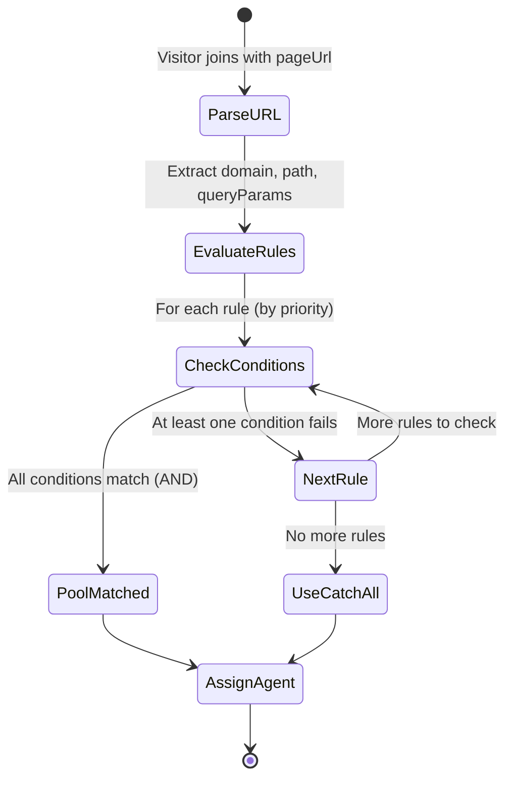

# Feature: Routing Rules (D2)

## Quick Summary
Routing Rules allow admins to configure URL-based routing of visitors to specific agent pools. Based on the visitor's page URL (domain, path, or query parameters), the system automatically assigns them to the appropriate pool of agents, enabling specialized teams to handle different pages or traffic sources.

## Affected Users
- [ ] Website Visitor (indirectly - routed to correct pool)
- [ ] Agent (receives visitors from their assigned pools)
- [x] Admin (configures routing rules)
- [ ] Platform Admin

---

## 1. WHAT IT DOES

### Purpose
Routing Rules enable organizations to:
1. **Route traffic by page** - Visitors on `/pricing` go to Sales, visitors on `/support` go to Support
2. **Route by traffic source** - UTM parameters like `?utm_source=google` can route to specialized teams
3. **Route by domain** - Multi-domain orgs can have different agents for different sites
4. **Specialize agent teams** - Each pool can have its own intro videos, widget settings, and agent roster

### User Goals
| User Type | What They Want | How This Feature Helps |
|-----------|---------------|----------------------|
| Admin | Route pricing page visitors to sales team | Create rule: path contains "/pricing" → Sales Pool |
| Admin | Route support pages to support team | Create rule: path starts_with "/support" → Support Pool |
| Admin | Route paid traffic differently | Create rule: query_param "utm_source" is_exactly "google" → Google Ads Pool |
| Admin | Catch unmatched traffic | Catch-all pool automatically receives all traffic not matching other rules |

---

## 2. HOW IT WORKS

### High-Level Flow
1. Visitor loads page with widget (e.g., `example.com/pricing?utm_source=google`)
2. Widget sends `visitor:join` with page URL to signaling server
3. Server calls `poolManager.matchPathToPool(orgId, pageUrl)`
4. Rules are evaluated in priority order (highest first)
5. First matching rule determines the pool; if none match, catch-all pool is used
6. Visitor is assigned to an available agent in the matched pool

### State Machine


### State Definitions
| State | Description | How to Enter | How to Exit |
|-------|-------------|--------------|-------------|
| ParseURL | URL is broken into domain, path, queryParams | Visitor joins | Always proceeds to EvaluateRules |
| EvaluateRules | Rules checked in priority order | After URL parsing | When rule matches or all checked |
| CheckConditions | Each condition in a rule is tested (AND logic) | For each rule | Match (all pass) or NextRule (any fail) |
| PoolMatched | A rule matched - use its pool | All conditions in a rule passed | Assign agent from pool |
| UseCatchAll | No rules matched - use default pool | All rules exhausted | Assign agent from catch-all pool |

---

## 3. DETAILED LOGIC

### Triggers & Events
| Event Name | Where It Fires | What It Does | Side Effects |
|------------|---------------|--------------|--------------|
| `visitor:join` | Widget on page load | Triggers pool matching | None |
| `POST /api/config/org` | Admin saves routing config | Syncs rules to signaling server | Server updates in-memory config |

### Key Functions/Components
| Function/Component | File | Purpose |
|-------------------|------|---------|
| `matchPathToPool()` | `apps/server/src/features/routing/pool-manager.ts:169` | Main URL→Pool matching algorithm |
| `parseUrlContext()` | `apps/server/src/features/routing/pool-manager.ts:206` | Extracts domain, path, queryParams from URL |
| `matchConditions()` | `apps/server/src/features/routing/pool-manager.ts:245` | Checks all conditions (AND logic) |
| `matchCondition()` | `apps/server/src/features/routing/pool-manager.ts:253` | Matches single condition |
| `matchDomainPattern()` | `apps/server/src/features/routing/pool-manager.ts:299` | Legacy domain wildcard matching |
| `matchPathPattern()` | `apps/server/src/features/routing/pool-manager.ts:322` | Legacy path wildcard matching |
| `setOrgConfig()` | `apps/server/src/features/routing/pool-manager.ts:92` | Loads org routing configuration |
| `RuleBuilder` | `apps/dashboard/src/app/(app)/admin/pools/pools-client.tsx:308` | Admin UI for building rules |
| `RuleConditionRow` | `apps/dashboard/src/app/(app)/admin/pools/pools-client.tsx:208` | Individual condition editor row |
| `RoutingRuleCard` | `apps/dashboard/src/app/(app)/admin/pools/pools-client.tsx:470` | Displays a routing rule in the UI |

### Data Flow

#### 1. Admin Creates/Updates Rules
```
Admin UI (pools-client.tsx)
    ↓
Supabase INSERT/UPDATE pool_routing_rules
    ↓
syncConfigToServer() called
    ↓
POST /api/config/org { orgId, defaultPoolId, pathRules }
    ↓
poolManager.setOrgConfig() stores in memory
```

#### 2. Visitor Routing
```
Widget → visitor:join { orgId, pageUrl }
    ↓
socket-handlers.ts VISITOR_JOIN handler
    ↓
poolManager.findBestAgentForVisitor(orgId, pageUrl)
    ↓
poolManager.matchPathToPool(orgId, pageUrl)
    ↓
Parse URL → Evaluate rules → Return poolId
    ↓
poolManager.findBestAgent(poolId) 
    ↓
Agent assigned, visitor notified
```

### Rule Matching Algorithm

#### Condition Types
| Type | Tests Against | Example |
|------|---------------|---------|
| `domain` | `URL.hostname` | `example.com`, `shop.example.com` |
| `path` | `URL.pathname` | `/pricing`, `/support/contact` |
| `query_param` | `URL.searchParams.get(paramName)` | `utm_source=google` |

#### Match Types
| Match Type | Behavior | Example |
|------------|----------|---------|
| `is_exactly` | Exact string match (case-insensitive) | path is_exactly "/pricing" |
| `contains` | Substring match (case-insensitive) | path contains "pricing" |
| `does_not_contain` | Negative substring match | path does_not_contain "admin" |
| `starts_with` | Prefix match (case-insensitive) | path starts_with "/shop" |
| `ends_with` | Suffix match (case-insensitive) | path ends_with "/checkout" |

#### Algorithm Priority
1. **Rules are sorted by priority** (higher value = checked first)
2. **Within a rule, conditions are ANDed** - ALL conditions must match
3. **Between rules, first match wins** (OR logic)
4. **If no rules match, catch-all pool is used**

```typescript
// From pool-manager.ts:177-196
for (const rule of config.pathRules) {
  // Use conditions if available (AND logic within a rule)
  if (rule.conditions && rule.conditions.length > 0) {
    if (this.matchConditions(urlContext, rule.conditions)) {
      return rule.poolId;  // First match wins
    }
  } 
  // Fallback to legacy pattern matching
  else {
    const domainMatches = rule.domainPattern === "*" || 
      this.matchDomainPattern(urlContext.domain, rule.domainPattern);
    const pathMatches = this.matchPathPattern(urlContext.path, rule.pathPattern);
    
    if (domainMatches && pathMatches) {
      return rule.poolId;
    }
  }
}
// Fall back to default pool
return config.defaultPoolId;
```

### Legacy Pattern Matching

For backward compatibility, rules can also use legacy `domain_pattern` and `path_pattern` fields:

#### Domain Patterns
| Pattern | Matches |
|---------|---------|
| `*` | Any domain |
| `example.com` | Exact match |
| `*.example.com` | `example.com` AND `shop.example.com` |

#### Path Patterns
| Pattern | Matches |
|---------|---------|
| `*` | Any path |
| `/pricing` | Exact `/pricing` |
| `/pricing*` | `/pricing`, `/pricing-page`, `/pricing/enterprise` |
| `/pricing/*` | `/pricing/enterprise`, `/pricing/startup` (direct children only) |
| `/pricing/**` | `/pricing` and ALL descendants |

---

## 4. EDGE CASES

### Complete Scenario Matrix

| # | Scenario | Trigger | Current Behavior | Correct? | Notes |
|---|----------|---------|------------------|----------|-------|
| 1 | Happy path - rule matches | Visitor on `/pricing` | Routed to Sales pool | ✅ | Works as designed |
| 2 | No rules match | Visitor on `/random-page` | Routed to catch-all pool | ✅ | Catch-all is fallback |
| 3 | Multiple rules could match | Visitor on `/pricing/enterprise` | First matching rule (by priority) wins | ✅ | Higher priority checked first |
| 4 | Invalid URL format | Visitor sends malformed URL | Treated as path, may not match | ⚠️ | See note 1 |
| 5 | Query param with missing param | Rule checks `utm_source`, URL has no params | Condition fails (non-match) | ✅ | Correct behavior |
| 6 | Query param with empty value | `?utm_source=` | Matches if rule value is empty string | ⚠️ | Edge case |
| 7 | Case sensitivity | `/Pricing` vs `/pricing` | Case-insensitive match | ✅ | All comparisons lowercased |
| 8 | Catch-all with rules | Admin tries to add rule to catch-all pool | Database trigger prevents insert | ✅ | Enforced at DB level |
| 9 | No catch-all pool exists | Org missing catch-all | Returns `null`, agent from any pool | ⚠️ | Rare - auto-created |
| 10 | All agents in matched pool busy | Visitor on `/pricing`, all Sales busy | Falls back to ANY available agent | ⚠️ | Design choice |
| 11 | URL with hash fragment | `example.com/page#section` | Hash ignored (not sent to server) | ✅ | Standard URL behavior |
| 12 | Encoded URL characters | `/pricing%20page` | Depends on how URL is constructed | ⚠️ | May need normalization |

**Notes:**
1. **Invalid URL**: The `parseUrlContext()` function has a try/catch that falls back to treating the input as a path if URL parsing fails.
2. **Pool fallback**: When the matched pool has no available agents, `findBestAgentForVisitor()` falls back to finding ANY agent, ignoring pool constraints. This is intentional - showing any agent is better than no agent.

### Error States
| Error | When It Happens | What User Sees | Recovery Path |
|-------|-----------------|----------------|---------------|
| No org config loaded | Server restart, config not synced | Visitor gets no agent | Admin must reload page (triggers sync) |
| Database save fails | Network error on rule save | Error toast in UI | Retry save |
| Server sync fails | Signaling server unreachable | Rules saved but not active | Rules will sync on next save or server restart |

---

## 5. UI/UX REVIEW

### User Experience Audit
| Step | User Action | System Response | Clear? | Issues |
|------|------------|-----------------|--------|--------|
| 1 | Admin opens Pools page | Pools displayed with routing rules | ✅ | - |
| 2 | Admin clicks "Add Rule" on a pool | RuleBuilder modal opens | ✅ | - |
| 3 | Admin adds condition | Condition row appears | ✅ | - |
| 4 | Admin types condition value | Live preview shows human-readable summary | ✅ | Nice feature |
| 5 | Admin saves rule | Rule appears in pool card | ✅ | - |
| 6 | Admin tries to add rule to catch-all | Database error | ⚠️ | Error message could be clearer |
| 7 | Admin reorders rules | Not supported | ❌ | Priority is set but manual reorder isn't exposed |

### Accessibility
- Keyboard navigation: Standard form controls work
- Screen reader support: Form labels present
- Color contrast: Condition type badges use colors but also have text labels
- Loading states: Saving shows loading indicator

---

## 6. TECHNICAL CONCERNS

### Performance
- **Rule evaluation**: O(n) where n = number of rules. Rules are pre-sorted by priority.
- **Memory**: Rules stored in-memory Map per org. Thousands of rules would be fine.
- **Regex-free**: Uses simple string operations, no regex performance concerns.

### Security
- **RLS protection**: Only admins can create/modify routing rules (via `is_user_admin()` check)
- **Org isolation**: Rules fetched per-org, no cross-org access possible
- **No injection risk**: Conditions are data, not executed as code

### Reliability
- **Server restart**: Rules must be re-synced via `setOrgConfig()` call. Dashboard triggers this on page load.
- **Redis failover**: Redis version (`redis-pool-manager.ts`) persists config, survives restart.
- **Database is source of truth**: In-memory state is derived from DB on dashboard page load.

---

## 7. FIRST PRINCIPLES REVIEW

### Does This Make Sense?

1. **Is the mental model clear?** ✅ Yes - "Rules route visitors to pools based on URL" is straightforward.

2. **Is the control intuitive?** ⚠️ Mostly - The condition builder is good, but some advanced scenarios (OR logic between conditions) require multiple rules.

3. **Is feedback immediate?** ✅ Yes - Live preview shows what the rule will match.

4. **Is the flow reversible?** ✅ Yes - Rules can be deleted, edited, or deactivated.

5. **Are errors recoverable?** ✅ Yes - Failed saves show errors, user can retry.

6. **Is the complexity justified?** ✅ Yes - The condition system is more flexible than simple path prefixes.

### Identified Issues
| Issue | Impact | Severity | Suggested Fix |
|-------|--------|----------|--------------|
| No manual rule reordering | Admin can't easily adjust priority order | 🟡 Medium | Add drag-and-drop reorder in UI |
| OR logic requires multiple rules | Admin wanting "path = /a OR path = /b" must create 2 rules | 🟢 Low | Consider adding OR support within a rule (condition_groups exists but not exposed) |
| Pool fallback ignores routing | If Sales pool empty, visitor goes to ANY agent | 🟡 Medium | Consider option to strictly enforce pool (no fallback) |
| No rule testing tool | Admin can't test "which pool would /xyz match?" | 🟢 Low | Add test URL input with preview of matched pool |
| Server sync on every save | Each save POSTs to signaling server | 🟢 Low | Works but could batch |

---

## 8. CODE REFERENCES

| Purpose | File | Lines | Notes |
|---------|------|-------|-------|
| Main matching algorithm | `apps/server/src/features/routing/pool-manager.ts` | 169-201 | `matchPathToPool()` |
| URL parsing | `apps/server/src/features/routing/pool-manager.ts` | 206-240 | `parseUrlContext()` |
| Condition matching | `apps/server/src/features/routing/pool-manager.ts` | 245-294 | AND logic within rule |
| Legacy domain matching | `apps/server/src/features/routing/pool-manager.ts` | 299-316 | Wildcard support |
| Legacy path matching | `apps/server/src/features/routing/pool-manager.ts` | 322-352 | `*`, `/*`, `/**` patterns |
| Config loading | `apps/server/src/features/routing/pool-manager.ts` | 92-99 | `setOrgConfig()` |
| API endpoint | `apps/server/src/index.ts` | 300-321 | `POST /api/config/org` |
| Admin UI - Rule builder | `apps/dashboard/src/app/(app)/admin/pools/pools-client.tsx` | 308-460 | `RuleBuilder` component |
| Admin UI - Condition row | `apps/dashboard/src/app/(app)/admin/pools/pools-client.tsx` | 208-295 | `RuleConditionRow` component |
| Admin UI - Save handler | `apps/dashboard/src/app/(app)/admin/pools/pools-client.tsx` | 1783-1825 | `handleAddRoutingRule()` |
| DB schema - rules table | `supabase/migrations/20251126010000_pool_centric_schema.sql` | 11-20 | `pool_routing_rules` table |
| DB schema - conditions | `supabase/migrations/20251126070000_add_rule_conditions.sql` | 1-76 | JSONB conditions column |
| DB schema - catch-all validation | `supabase/migrations/20251203100000_catch_all_pool_validation.sql` | 1-36 | Trigger prevents rules on catch-all |
| Routing types | `apps/server/src/features/routing/pool-manager.ts` | 13-36 | `RuleCondition`, `PathRule` interfaces |

---

## 9. RELATED FEATURES
- [Pool Management (D1)](./pool-management.md) - Creating/managing pools that rules route to
- [Tiered Agent Assignment (D3)](./tiered-routing.md) - Priority within pools after routing
- [Agent Assignment Algorithm (P2)](../platform/agent-assignment.md) - How agents are selected within a pool
- [Widget Lifecycle (V1)](../visitor/widget-lifecycle.md) - Triggers pool matching on widget init

---

## 10. OPEN QUESTIONS

1. **Should OR logic between conditions be exposed in UI?** The database supports `condition_groups` for OR logic, but the UI only exposes AND logic within a single rule.

2. **What should happen when the matched pool is completely empty?** Currently falls back to any agent. Should there be a strict mode that shows "no agents available" instead?

3. **Should rules support regex matching?** Current match types cover most cases, but some users might want full regex power.

4. **How to handle SPA navigation?** If visitor navigates within an SPA without page reload, `pageUrl` doesn't update unless widget explicitly re-joins.

---

## APPENDIX: Database Schema

### pool_routing_rules table
```sql
CREATE TABLE pool_routing_rules (
    id UUID PRIMARY KEY DEFAULT gen_random_uuid(),
    pool_id UUID NOT NULL REFERENCES agent_pools(id) ON DELETE CASCADE,
    name TEXT,                           -- Human-readable rule name
    domain_pattern TEXT DEFAULT '*',     -- Legacy domain pattern
    path_pattern TEXT DEFAULT '*',       -- Legacy path pattern
    conditions JSONB DEFAULT '[]',       -- New flexible conditions
    condition_groups JSONB DEFAULT '[]', -- OR groups (not yet exposed in UI)
    priority INTEGER NOT NULL DEFAULT 0, -- Higher = checked first
    is_active BOOLEAN NOT NULL DEFAULT true,
    created_at TIMESTAMPTZ NOT NULL DEFAULT NOW(),
    updated_at TIMESTAMPTZ NOT NULL DEFAULT NOW()
);
```

### conditions JSONB format
```json
[
  {
    "type": "path",
    "matchType": "starts_with",
    "value": "/pricing"
  },
  {
    "type": "query_param",
    "matchType": "is_exactly",
    "value": "google",
    "paramName": "utm_source"
  }
]
```

All conditions in the array are ANDed together (all must match).

