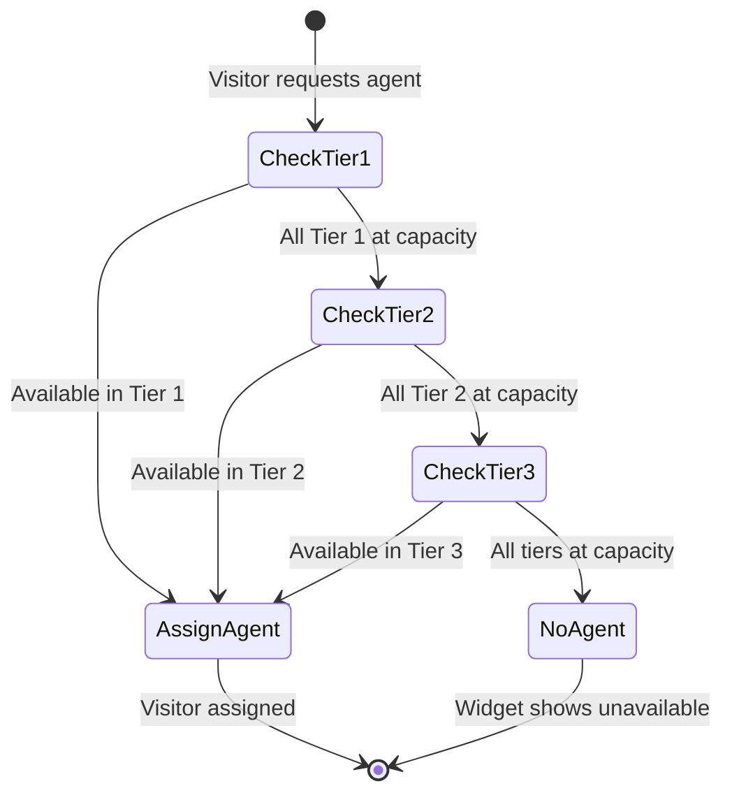

# Feature: Tiered Agent Assignment

## Quick Summary
Tiered agent assignment allows admins to set priority ranks for agents within a pool, enabling senior reps to receive leads first while junior reps provide overflow coverage. The system routes visitors to the highest-priority available agents, only falling back to lower tiers when higher tiers are at capacity.

## Affected Users
- [x] Website Visitor (indirectly - routed to appropriate agent)
- [x] Agent (receives leads based on their tier)
- [x] Admin (configures tiers in pool management)
- [ ] Platform Admin

---

## 1. WHAT IT DOES

### Purpose
Enable organizations to create a lead distribution hierarchy within agent pools. Senior sales reps or top performers can be designated as "Primary" to receive leads first, while newer reps or backup staff only receive leads when primary agents are at capacity. This ensures the best-qualified agents handle leads when available while maintaining coverage during busy periods.

### User Goals
| User Type | What They Want | How This Feature Helps |
|-----------|---------------|----------------------|
| Admin | Prioritize best reps for lead handling | Assign Primary/Standard/Backup tiers to agents |
| Admin | Ensure coverage when top reps are busy | Lower tiers automatically receive overflow |
| Senior Agent | Get first crack at incoming leads | Primary tier routes leads to them first |
| Junior Agent | Get leads when seniors are busy | Standard/Backup tiers receive overflow |
| Visitor | Talk to an available agent quickly | System finds best available agent across tiers |

---

## 2. HOW IT WORKS

### High-Level Flow
1. Admin assigns agents to a pool with a priority rank (1=Primary, 2=Standard, 3=Backup)
2. Visitor lands on page matching pool's routing rules
3. Server groups pool agents by priority rank
4. Server tries Tier 1 (Primary) agents first using round-robin + least-connections
5. If all Tier 1 agents are at capacity, tries Tier 2 (Standard)
6. Continues through tiers until an agent is found or no agents available
7. Visitor is assigned to the found agent for simulation/call

### State Machine


### State Definitions
| State | Description | How to Enter | How to Exit |
|-------|-------------|--------------|-------------|
| CheckTier1 | Searching for available Primary agents | Visitor requests agent assignment | Found agent OR all at capacity |
| CheckTier2 | Searching for available Standard agents | Tier 1 exhausted | Found agent OR all at capacity |
| CheckTier3 | Searching for available Backup agents | Tier 2 exhausted | Found agent OR all at capacity |
| AssignAgent | Agent found and assigned | Available agent in any tier | Assignment complete |
| NoAgent | No agents available in any tier | All tiers exhausted | Visitor sees unavailable state |

---

## 3. DETAILED LOGIC

### Triggers & Events
| Event Name | Where It Fires | What It Does | Side Effects |
|------------|---------------|--------------|--------------|
| Admin sets priority_rank | pools-client.tsx | Updates `agent_pool_members.priority_rank` | Syncs to server via API |
| Agent connects | socket-handlers.ts | Loads pool memberships with ranks | `setAgentPoolMemberships()` called |
| Visitor requests agent | pool-manager.ts | Runs tiered routing algorithm | Agent assigned, simulation starts |
| Agent goes offline/away | pool-manager.ts | Reassignment respects tiers | Visitor may move to lower-tier agent |

### Key Functions/Components
| Function/Component | File | Purpose |
|-------------------|------|---------|
| `findBestAgent()` | `apps/server/src/features/routing/pool-manager.ts` | Main tiered routing algorithm |
| `findBestAgentInTier()` | `apps/server/src/features/routing/pool-manager.ts` | Round-robin + least-connections within a tier |
| `setAgentPoolMemberships()` | `apps/server/src/features/routing/pool-manager.ts` | Load agent's pool memberships with priorities |
| `getAgentPriorityInPool()` | `apps/server/src/features/routing/pool-manager.ts` | Get agent's rank in a specific pool |
| `addAgentToPool()` | `apps/server/src/features/routing/pool-manager.ts` | Add agent with priority to tracking |
| `AgentPriorityCard` | `apps/dashboard/src/app/(app)/admin/pools/pools-client.tsx` | UI for changing agent tier |
| `handleUpdateAgentPriority()` | `apps/dashboard/src/app/(app)/admin/pools/pools-client.tsx` | Save priority change to database |
| `fetchAgentPoolMemberships()` | `apps/server/src/lib/auth.ts` | Fetch agent's pools from database on connect |

### Data Flow

#### Agent Connection
```
Agent connects to socket
    ↓
verifyAgentToken() - verify JWT
    ↓
fetchAgentPoolMemberships(agentId) - query database
    ↓
Returns: [{ poolId, priorityRank }, ...]
    ↓
poolManager.setAgentPoolMemberships(agentId, memberships)
    ↓
Stores in: agentPoolPriorities Map (agentId → poolId → rank)
```

#### Visitor Assignment
```
Visitor requests agent for pool X
    ↓
findBestAgent(poolId)
    ↓
Get all agents in pool
    ↓
Group by priority_rank: { 1: [A, B], 2: [C], 3: [D, E] }
    ↓
Sort tier keys: [1, 2, 3]
    ↓
For each tier:
    ↓
    findBestAgentInTier(tierAgents)
        ↓
        Skip: in_call, offline, away agents
        Skip: agents at maxSimultaneousSimulations
        ↓
        For idle agents with 0 load:
            Pick oldest assignmentOrder (round-robin)
        For agents with load:
            Pick lowest currentSimulations.length
        ↓
    If agent found: return agent
    If not: continue to next tier
    ↓
No agent found: return undefined
```

#### Database Schema
```sql
-- agent_pool_members table
CREATE TABLE agent_pool_members (
    id UUID PRIMARY KEY,
    pool_id UUID REFERENCES agent_pools(id),
    agent_profile_id UUID REFERENCES agent_profiles(id),
    priority_rank INTEGER DEFAULT 1,  -- 1-99, lower = higher priority
    created_at TIMESTAMPTZ
);

-- Constraint ensures valid range
CHECK (priority_rank >= 1 AND priority_rank <= 99)

-- Index for efficient routing queries
CREATE INDEX idx_agent_pool_members_pool_priority 
ON agent_pool_members(pool_id, priority_rank);
```

---

## 4. EDGE CASES

### Complete Scenario Matrix

| # | Scenario | Trigger | Current Behavior | Correct? | Notes |
|---|----------|---------|------------------|----------|-------|
| 1 | Happy path - Primary available | Visitor requests agent | Routes to Primary agent | ✅ | Uses round-robin within tier |
| 2 | All Primary busy, Standard available | Visitor requests agent | Routes to Standard agent | ✅ | Overflow works correctly |
| 3 | All tiers at capacity | Visitor requests agent | Returns undefined, widget hides | ✅ | Missed opportunity logged |
| 4 | Only one agent in pool (Primary) | Agent at capacity | No agent returned | ✅ | Single-agent pools have no overflow |
| 5 | Agent in multiple pools, different ranks | Visitor in Pool A | Uses rank from Pool A, not Pool B | ✅ | Rank is per-pool |
| 6 | Priority_rank not set (null) | Agent assigned | Defaults to 1 (Primary) | ✅ | `?? 1` fallback in code |
| 7 | Same priority rank, same load | Two agents both rank 1, 0 load | Routes by assignmentOrder (round-robin) | ✅ | Fair distribution |
| 8 | Admin changes tier mid-session | Via pools UI | Next assignment uses new rank | ✅ | Server config synced |
| 9 | Agent reconnects | Page refresh | Priority ranks reloaded from database | ✅ | `fetchAgentPoolMemberships()` called |
| 10 | Pool has no agents | Visitor requests | Falls back to any agent (null poolId) | ⚠️ | May violate pool intent |

### Error States
| Error | When It Happens | What User Sees | Recovery Path |
|-------|-----------------|----------------|---------------|
| No agents available in any tier | All at capacity or offline | Widget shows "unavailable" state | Visitor can wait or try later |
| Database fetch fails | Agent connection | Agent gets empty pool list | Logged, agent may not receive routed leads |
| Invalid priority_rank | Should never happen (constraint) | N/A | Database constraint prevents |

---

## 5. UI/UX REVIEW

### User Experience Audit

| Step | User Action | System Response | Clear? | Issues |
|------|------------|-----------------|--------|--------|
| 1 | Admin opens pool settings | Pool card expands showing agents grouped by tier | ✅ | Clear tier groupings with labels |
| 2 | Admin clicks agent priority dropdown | Shows 🥇 Primary, 🥈 Standard, 🥉 Backup | ✅ | Medal emojis provide clear hierarchy |
| 3 | Admin selects new tier | Dropdown closes, tier updates immediately | ✅ | Optimistic UI update |
| 4 | Admin adds new agent | Added as Primary by default | ✅ | "(Added as Primary)" shown |

### Admin UI Tier Display

```
Pool: Sales Team
├── 🟢 Primary — Gets leads first
│   ├── [Alice] 🥇 Primary ▼  [X]
│   └── [Bob]   🥇 Primary ▼  [X]
├── 🔵 Standard — Overflow when Primary is busy  
│   └── [Carol] 🥈 Standard ▼ [X]
└── 🟠 Backup — Only when others are at capacity
    └── [Dave]  🥉 Backup ▼   [X]
```

### Accessibility
- Keyboard navigation: Select dropdown is native, fully keyboard accessible
- Screen reader: Dropdown options include tier names
- Color contrast: Tier colors (green/blue/orange) have sufficient contrast
- Visual indicators: Both color AND text AND emoji indicate tier

---

## 6. TECHNICAL CONCERNS

### Performance
- **Tier grouping**: O(n) to group agents by priority, O(k) tiers to iterate
- **Round-robin tracking**: Global `assignmentCounter` increments atomically
- **Memory**: `agentPoolPriorities` Map stores O(agents × pools) entries
- **Efficient lookup**: `getAgentPriorityInPool()` is O(1) via nested Maps

### Security
- Priority rank validated: Database constraint 1-99 (UI exposes 1-3)
- Admin-only UI: Pool management behind admin role check
- Server-side enforcement: Routing logic is server-side, not client-controllable

### Reliability
- **Server restart**: Pool memberships reloaded from database on agent reconnect
- **Database slow**: Agent connects without pool memberships, may miss routed leads
- **Race conditions**: JS single-threaded + atomic counter prevents double-assignment

---

## 7. FIRST PRINCIPLES REVIEW

### Does This Make Sense?

1. **Is the mental model clear?** ✅
   - Primary/Standard/Backup maps to real-world sales team hierarchies
   - Medal emojis (🥇🥈🥉) are universally understood

2. **Is the control intuitive?** ✅
   - Simple dropdown to change tier
   - Visual grouping shows current state at a glance

3. **Is feedback immediate?** ✅
   - UI updates immediately on tier change
   - Server config synced in background

4. **Is the flow reversible?** ✅
   - Can change tier at any time
   - No destructive actions

5. **Are errors recoverable?** ✅
   - Database constraint prevents invalid values
   - Default to Primary if rank missing

6. **Is the complexity justified?** ✅
   - Solves real business need (prioritize top performers)
   - Implementation is straightforward (sort + iterate)

### Identified Issues
| Issue | Impact | Severity | Suggested Fix |
|-------|--------|----------|--------------|
| Round-robin is global, not per-pool | Agent in 2 pools uses same order in both | 🟢 Low | Could track per-pool order |
| No tier statistics | Admins can't see tier utilization | 🟢 Low | Add metrics to pool dashboard |
| Priority 4-99 unused | UI only exposes 1-3, DB allows 1-99 | 🟢 Low | Fine for now, extensible later |

---

## 8. CODE REFERENCES

| Purpose | File | Lines | Notes |
|---------|------|-------|-------|
| Main tiered routing algorithm | `apps/server/src/features/routing/pool-manager.ts` | 588-635 | `findBestAgent()` with tier grouping |
| Within-tier selection | `apps/server/src/features/routing/pool-manager.ts` | 641-678 | `findBestAgentInTier()` round-robin + least-connections |
| Priority rank storage | `apps/server/src/features/routing/pool-manager.ts` | 77-78 | `agentPoolPriorities` Map structure |
| Add agent with priority | `apps/server/src/features/routing/pool-manager.ts` | 105-125 | `addAgentToPool()` |
| Load memberships on connect | `apps/server/src/features/routing/pool-manager.ts` | 140-155 | `setAgentPoolMemberships()` |
| Get priority in pool | `apps/server/src/features/routing/pool-manager.ts` | 161-163 | `getAgentPriorityInPool()` |
| Fetch from database | `apps/server/src/lib/auth.ts` | 80-110 | `fetchAgentPoolMemberships()` |
| On agent connect | `apps/server/src/features/signaling/socket-handlers.ts` | 432-435 | Loads pool memberships |
| Database schema | `packages/domain/src/database.types.ts` | 378-391 | `agent_pool_members` type |
| Migration | `supabase/migrations/20251129500000_agent_priority_ranking.sql` | 1-94 | Adds priority_rank column |
| Admin UI - tier card | `apps/dashboard/src/app/(app)/admin/pools/pools-client.tsx` | 102-158 | `AgentPriorityCard` component |
| Admin UI - tier grouping | `apps/dashboard/src/app/(app)/admin/pools/pools-client.tsx` | 2660-2742 | Grouped display by tier |
| Admin UI - update handler | `apps/dashboard/src/app/(app)/admin/pools/pools-client.tsx` | 1721-1751 | `handleUpdateAgentPriority()` |

---

## 9. RELATED FEATURES
- [Agent Assignment Algorithm](../platform/agent-assignment.md) - Parent algorithm that uses tiering
- [Routing Rules](./routing-rules.md) - Determines which pool a visitor routes to
- [Pool Management](./pool-management.md) - Creating and managing pools
- [Bullpen States](../agent/bullpen-states.md) - Agent availability that affects routing

---

## 10. OPEN QUESTIONS

1. **Should tier assignment be per-pool or per-agent?**
   - Currently per-pool (agent can be Primary in Pool A, Backup in Pool B)
   - This is correct - verified in code

2. **What happens if all Primary agents go away simultaneously?**
   - Visitors are reassigned, respecting tiered routing
   - May cascade to lower tiers quickly during team meetings

3. **Should there be analytics on tier utilization?**
   - Not currently implemented
   - Could help admins balance tiers better

4. **Could an agent be in the same pool with multiple priorities?**
   - No - UNIQUE constraint on (pool_id, agent_profile_id)
   - Correct behavior

---

## APPENDIX: Algorithm Pseudocode

```typescript
function findBestAgent(poolId: string): AgentState | undefined {
  const candidates = getAgentsInPool(poolId);
  
  // Group by priority rank
  const tiers = new Map<number, AgentState[]>();
  for (const agent of candidates) {
    const rank = getAgentPriorityInPool(agent.agentId, poolId);
    if (!tiers.has(rank)) tiers.set(rank, []);
    tiers.get(rank).push(agent);
  }
  
  // Sort tiers (1 first, then 2, then 3...)
  const sortedRanks = [...tiers.keys()].sort((a, b) => a - b);
  
  // Try each tier
  for (const rank of sortedRanks) {
    const tierAgents = tiers.get(rank);
    const agent = findBestAgentInTier(tierAgents);
    if (agent) return agent; // Found!
    // Continue to next tier if all at capacity
  }
  
  return undefined; // No agent available
}

function findBestAgentInTier(agents: AgentState[]): AgentState | undefined {
  let bestAgent: AgentState | undefined;
  let lowestLoad = Infinity;
  let oldestOrder = Infinity;
  
  for (const agent of agents) {
    // Skip unavailable agents
    if (agent.status === 'in_call' || agent.status === 'offline' || agent.status === 'away') continue;
    if (agent.currentSimulations.length >= agent.maxSimultaneousSimulations) continue;
    
    const load = agent.currentSimulations.length;
    const order = lastAssignmentOrder.get(agent.agentId) ?? 0;
    
    // For idle agents with 0 load: round-robin (oldest assignment order wins)
    if (agent.status === 'idle' && load === 0) {
      if (order < oldestOrder) {
        oldestOrder = order;
        bestAgent = agent;
      }
      continue;
    }
    
    // For agents with load: least-connections
    if (load < lowestLoad) {
      lowestLoad = load;
      bestAgent = agent;
    }
  }
  
  return bestAgent;
}
```

---

*Documentation created: December 3, 2024*
*Feature ID: D3 - Tiered Agent Assignment*
