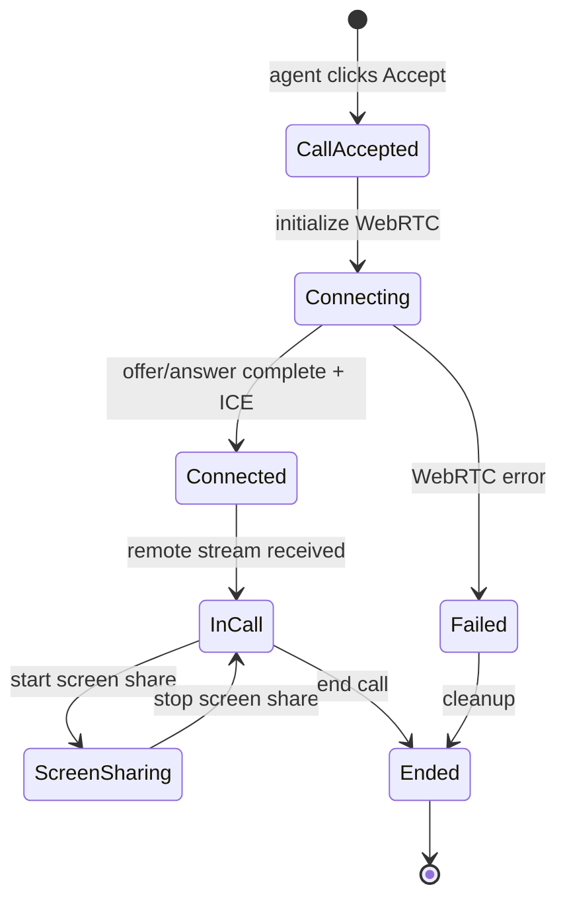

# Feature: Agent Active Call (A4)

## Quick Summary
The Agent Active Call feature handles the agent's experience once a call has been accepted. It includes a real-time video call interface with controls for mute, video toggle, screen sharing, a live call duration timer, WebRTC connection management, and co-browse integration to view the visitor's screen during the call.

## Affected Users
- [ ] Website Visitor
- [x] Agent
- [ ] Admin
- [ ] Platform Admin

---

## 1. WHAT IT DOES

### Purpose
Once an agent accepts an incoming call, this feature provides the full active call experience. It manages the WebRTC video connection, displays both parties' video feeds, provides call controls, tracks call duration, enables screen sharing for demos, shows recording status, and integrates co-browse to let the agent see exactly what the visitor is viewing.

### User Goals
| User Type | What They Want | How This Feature Helps |
|-----------|---------------|----------------------|
| Agent | Have a face-to-face video call with the visitor | Establishes WebRTC connection and displays video feeds |
| Agent | Control their audio/video during call | Provides mute and video toggle buttons |
| Agent | Share their screen for demos | Screen share button with renegotiation support |
| Agent | Know how long the call has been running | Live call duration timer |
| Agent | See what the visitor is looking at | Co-browse viewer showing visitor's DOM |
| Agent | End the call when finished | End call button with proper cleanup |

---

## 2. HOW IT WORKS

### High-Level Flow
1. Agent accepts incoming call via `CALL_ACCEPT` event
2. Server clears RNA timeout, marks call as accepted, generates reconnect token
3. `useWebRTC` hook initiates WebRTC peer connection
4. Agent's local media (camera/mic) is captured via `getUserMedia`
5. WebRTC offer is created and sent to visitor via socket signaling
6. Visitor responds with answer, ICE candidates are exchanged
7. Once connected, remote video stream is displayed
8. Recording starts (if enabled) when both streams are available
9. Co-browse data streams in real-time from visitor
10. Call continues until either party ends it or max duration is reached
11. On end: WebRTC cleanup, recording upload, disposition modal shows

### State Machine


### State Definitions
| State | Description | How to Enter | How to Exit |
|-------|-------------|--------------|-------------|
| CallAccepted | Server has processed CALL_ACCEPT | Agent accepts incoming call | WebRTC initialization starts |
| Connecting | WebRTC offer sent, waiting for answer | initializeCall() called | Answer received + ICE complete |
| Connected | Peer connection established | connectionState === 'connected' | Remote track received |
| InCall | Active video call with remote stream | ontrack event fires | End call or connection fails |
| ScreenSharing | Agent sharing their screen | startScreenShare() called | stopScreenShare() or track ends |
| Failed | WebRTC connection failed | connectionState === 'failed' | cleanup() |
| Ended | Call has ended | endCall() or disconnect | Post-call disposition |

---

## 3. DETAILED LOGIC

### Triggers & Events
| Event Name | Where It Fires | What It Does | Side Effects |
|------------|---------------|--------------|--------------|
| `CALL_ACCEPT` | Dashboard → Server | Accepts call request | Clears RNA timeout, marks call accepted, reassigns visitors |
| `CALL_STARTED` | Server → Dashboard | Notifies agent call is ready | Contains callLogId for recording |
| `CALL_END` | Both → Server | Ends active call | Clears max duration timeout, marks complete, notifies both |
| `WEBRTC_SIGNAL` | Both ↔ Server | Relay WebRTC signaling | Forwards offer/answer/ICE between peers |
| `COBROWSE_SNAPSHOT` | Visitor → Server → Agent | DOM snapshot | Agent sees visitor's page |
| `COBROWSE_MOUSE` | Visitor → Server → Agent | Mouse position | Agent sees cursor position |
| `COBROWSE_SCROLL` | Visitor → Server → Agent | Scroll position | Agent's view syncs scroll |

### Key Functions/Components
| Function/Component | File | Purpose |
|-------------------|------|---------|
| `ActiveCallStage` | `apps/dashboard/src/features/webrtc/active-call-stage.tsx` | Main UI component for active call |
| `useWebRTC` | `apps/dashboard/src/features/webrtc/use-webrtc.ts` | WebRTC connection management hook |
| `useCallRecording` | `apps/dashboard/src/features/webrtc/use-call-recording.ts` | Recording both streams |
| `CobrowseViewer` | `apps/dashboard/src/features/cobrowse/CobrowseViewer.tsx` | Renders visitor's DOM |
| `WorkbenchClient` | `apps/dashboard/src/features/workbench/workbench-client.tsx` | Parent component orchestrating call state |
| `startMaxCallDurationTimeout` | `apps/server/src/features/signaling/socket-handlers.ts` | Auto-ends calls after max duration |

### Data Flow
```
Agent accepts call:
  Dashboard → CALL_ACCEPT → Server
    → Server clears RNA timeout
    → Server marks call as accepted in DB
    → Server generates reconnect token
    → Server emits CALL_ACCEPTED to visitor
    → Server reassigns other visitors watching agent
    → Server emits CALL_STARTED to agent
    → Server starts max call duration timeout

WebRTC Connection:
  Agent → getUserMedia() → local stream
  Agent → createOffer() → WEBRTC_SIGNAL(offer) → Server → Visitor
  Visitor → createAnswer() → WEBRTC_SIGNAL(answer) → Server → Agent
  Both → ICE candidates → WEBRTC_SIGNAL(candidate) → Server → Peer
  Connected → ontrack → remote stream displayed

Recording (if enabled):
  WebRTC connected + both streams
    → Create AudioContext to mix audio
    → Create canvas for side-by-side video
    → MediaRecorder starts
    → On call end: upload to Supabase storage
    → Update call_logs with recording_url
    → Trigger transcription processing

Call End:
  Agent/Visitor → CALL_END → Server
    → Server clears max duration timeout
    → Server marks call as ended in DB
    → Server notifies both parties
    → Recording stops and uploads
    → Post-call disposition modal shows
```

---

## 4. EDGE CASES

### Complete Scenario Matrix

| # | Scenario | Trigger | Current Behavior | Correct? | Notes |
|---|----------|---------|------------------|----------|-------|
| 1 | Happy path - full call | Accept → video → end | Both parties connect, call tracked, recording saved | ✅ | Works well |
| 2 | WebRTC connection fails | ICE failure | Error state shown, connection retry not automatic | ⚠️ | No retry mechanism |
| 3 | Camera/mic permission denied | getUserMedia rejects | Error message in preview | ✅ | Clear error handling |
| 4 | Visitor disconnects mid-call | Socket disconnect | Call ends, agent notified with reason | ✅ | Clean handling |
| 5 | Agent disconnects mid-call | Socket disconnect | Call ends, visitor notified, recording may be incomplete | ⚠️ | Recording upload may fail |
| 6 | Screen share cancelled via browser | Track ended event | Screen share stops, UI updates | ✅ | Handles browser stop button |
| 7 | Max call duration reached | Timer fires | Both parties notified, call auto-ends | ✅ | Configurable per org |
| 8 | Recording fails to upload | Supabase error | Error logged, call continues | ✅ | Non-blocking |
| 9 | Visitor starts screen sharing | Renegotiation offer | Agent sees screen share stream | ✅ | PiP for visitor camera |
| 10 | Both parties screen sharing | Dual streams | Agent sees visitor share, visitor sees agent share | ❓ | Untested edge case |

### Error States
| Error | When It Happens | What User Sees | Recovery Path |
|-------|-----------------|----------------|---------------|
| Camera access denied | getUserMedia fails | Error icon + message in preview | "Retry" button to request again |
| WebRTC connection failed | ICE/DTLS fails | "Connection failed" message | End call, try again |
| Socket disconnect | Network issues | Call ends with reason | Reconnection handled by call reconnection feature |
| Recording failed | MediaRecorder error | Error logged (silent) | Call continues without recording |
| Max duration reached | Timer fires | Notification message | Call ends automatically |

---

## 5. UI/UX REVIEW

### User Experience Audit
| Step | User Action | System Response | Clear? | Issues |
|------|------------|-----------------|--------|--------|
| Call starts | Accept call | Loading spinner, "Connecting to visitor..." | ✅ | Good feedback |
| Connected | - | Green "Connected" badge appears | ✅ | Clear status |
| Mute audio | Click mic button | Button turns red, audio track disabled | ✅ | Visual feedback |
| Turn off video | Click video button | Button turns red, "camera off" overlay | ✅ | Shows preview |
| Screen share | Click monitor button | OS picker, then "You're Sharing" badge | ✅ | Clear status |
| End call | Click red phone button | Call ends, disposition modal | ✅ | Expected flow |
| Fullscreen | Click expand button | Stage fills screen | ✅ | Can exit with Escape |

### Accessibility
- ✅ Keyboard navigation - buttons are focusable
- ⚠️ Screen reader support - buttons have no aria-labels
- ✅ Color contrast - good contrast on controls
- ✅ Loading states - spinners during connection
- ❌ No keyboard shortcuts for common actions (mute, video toggle)

---

## 6. TECHNICAL CONCERNS

### Performance
- **Video compositing for recording**: Canvas draws both videos at 30fps - CPU intensive
- **AudioContext mixing**: Continuous audio processing during call
- **DOM streaming for co-browse**: Large DOM snapshots could be heavy
- Memory cleanup on call end is thorough (streams stopped, refs cleared)

### Security
- ✅ TURN credentials are in code but are server-side credentials (metered.ca service)
- ✅ WebRTC connections are encrypted (DTLS/SRTP)
- ✅ Signaling goes through authenticated socket connection
- ⚠️ Recording uploads go to public Supabase bucket - URLs are guessable if you know the pattern

### Reliability
- **Server restart**: Active calls are lost, but reconnection feature helps
- **TURN servers**: Multiple TURN endpoints for fallback (UDP, TCP, TLS)
- **Recording**: Non-blocking - if it fails, call continues
- **Max call duration**: Prevents runaway calls consuming resources

---

## 7. FIRST PRINCIPLES REVIEW

### Does This Make Sense?
1. **Is the mental model clear?** Yes - video call with controls is familiar UX pattern.
2. **Is the control intuitive?** Yes - standard mute/video/end buttons in expected positions.
3. **Is feedback immediate?** Yes - button states change instantly, status badges update.
4. **Is the flow reversible?** Partially - mute/video can toggle, but end call is final.
5. **Are errors recoverable?** Partially - camera retry works, but WebRTC failures require new call.
6. **Is the complexity justified?** Yes - WebRTC is inherently complex, abstraction is appropriate.

### Identified Issues
| Issue | Impact | Severity | Suggested Fix |
|-------|--------|----------|--------------|
| No WebRTC reconnection on ICE failure | Agent must end and restart call | 🟡 | Add ICE restart mechanism |
| No keyboard shortcuts | Accessibility gap | 🟢 | Add Ctrl+M for mute, etc. |
| Recording upload on disconnect | May lose recording | 🟡 | Consider partial upload or queue |
| No aria-labels on control buttons | Screen reader unfriendly | 🟡 | Add descriptive aria-labels |
| TURN credentials in client code | Security audit finding | 🟢 | Move to API endpoint (metered.ca supports this) |

---

## 8. CODE REFERENCES

| Purpose | File | Lines | Notes |
|---------|------|-------|-------|
| Main UI component | `apps/dashboard/src/features/webrtc/active-call-stage.tsx` | 1-341 | All controls, video displays, duration |
| WebRTC hook | `apps/dashboard/src/features/webrtc/use-webrtc.ts` | 1-368 | Connection management, screen share |
| Recording hook | `apps/dashboard/src/features/webrtc/use-call-recording.ts` | 1-321 | Canvas compositing, upload |
| Workbench integration | `apps/dashboard/src/features/workbench/workbench-client.tsx` | 65-142 | Call state orchestration |
| Server call accept | `apps/server/src/features/signaling/socket-handlers.ts` | 699-780 | CALL_ACCEPT handler |
| Server call end | `apps/server/src/features/signaling/socket-handlers.ts` | 878-941 | CALL_END handler |
| WebRTC signaling | `apps/server/src/features/signaling/socket-handlers.ts` | 1255-1281 | Signal relay |
| Max duration timeout | `apps/server/src/features/signaling/socket-handlers.ts` | 1717-1788 | Auto-end logic |
| Call types | `packages/domain/src/types.ts` | 76-96 | ActiveCall interface |
| Timing constants | `packages/domain/src/constants.ts` | 72-93 | Timeout values |

---

## 9. RELATED FEATURES
- [Incoming Call (A2)](./incoming-call.md) - What happens before this feature
- [Call Recording (A6)](./call-recording.md) - Recording during call
- [Co-Browse Viewer (A5)](./cobrowse-viewer.md) - Visitor screen viewing
- [Post-Call Disposition (A7)](./post-call-disposition.md) - What happens after
- [WebRTC Signaling (P5)](../platform/webrtc-signaling.md) - Underlying connection
- [Call Lifecycle (P3)](../platform/call-lifecycle.md) - Overall call state machine
- [Call Reconnection (V4)](../visitor/call-reconnection.md) - Handling disconnects

---

## 10. OPEN QUESTIONS
1. **What happens if both agent and visitor try to screen share simultaneously?** - Untested scenario
2. **Is there a mechanism to renegotiate if ICE fails mid-call?** - Doesn't appear to be
3. **How does recording handle very long calls?** - MediaRecorder chunking (1s) may help but memory?
4. **What's the max call duration default?** - Appears to be org-configurable in `recording_settings.max_call_duration_minutes`, default 120 min
5. **Does co-browse work with Shadow DOM?** - Need to verify DOMSerializer handles it

---

## 11. SCREEN SHARE DETAILS

### Agent Screen Share Flow
1. Agent clicks screen share button
2. `startScreenShare()` called in `useWebRTC`
3. `navigator.mediaDevices.getDisplayMedia()` invoked
4. OS screen picker shown to agent
5. Once selected, tracks added to peer connection
6. Renegotiation offer created and sent to visitor
7. "You're Sharing" badge appears
8. Agent can stop via button or browser "Stop sharing" UI
9. On stop, tracks removed and renegotiation offer sent

### Visitor Screen Share Flow (received)
1. Visitor starts screen share (handled in widget)
2. Renegotiation offer received from visitor
3. Agent sends answer
4. New stream detected via `ontrack` (different stream ID)
5. `isVisitorScreenSharing` set to true
6. Screen share displays in main view
7. Visitor camera moves to PiP
8. When visitor stops, `track.onended` fires
9. UI returns to normal video view

---

## 12. CALL DURATION TIMER

### Implementation
```typescript
// active-call-stage.tsx lines 80-87
useEffect(() => {
  const interval = setInterval(() => {
    setCallDuration(Math.floor((Date.now() - call.startedAt) / 1000));
  }, 1000);
  return () => clearInterval(interval);
}, [call.startedAt]);
```

- Starts from `call.startedAt` timestamp (set when call accepted)
- Updates every 1 second
- Displays as `MM:SS` format
- Continues even if WebRTC reconnects (based on original start time)

### Max Duration Enforcement
- Server starts timeout when call is accepted
- Duration configurable per org: `recording_settings.max_call_duration_minutes`
- Default: 120 minutes
- When reached: both parties receive `CALL_ENDED` with reason `"max_duration"`

---

## 13. CO-BROWSE INTEGRATION

### During Active Call
- Co-browse viewer displayed in right panel alongside video
- Receives real-time data:
  - `COBROWSE_SNAPSHOT`: Full DOM HTML + viewport size
  - `COBROWSE_MOUSE`: Mouse X/Y coordinates
  - `COBROWSE_SCROLL`: Page scroll position
  - `COBROWSE_SELECTION`: Text selection
- Data flows: Visitor → Server → Agent (relay pattern)
- Only active during call (visitor sends, server only relays if call exists)

### Rendering
- `CobrowseViewer` component renders the DOM in an iframe
- Mouse cursor overlay shows visitor's pointer
- Scroll position syncs to agent's view
- Selection highlighting shows what visitor is looking at

