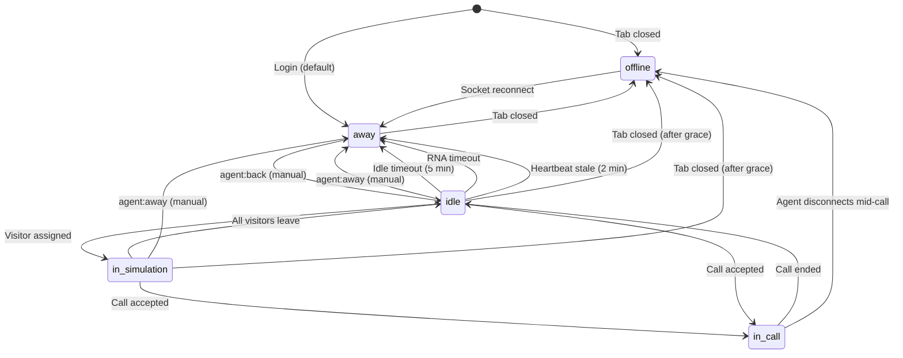

# Feature: Bullpen & Agent States (A1)

## Quick Summary
The Bullpen is the agent's main workspace in the dashboard where they manage their live presence and receive incoming calls. Agent states control availability and routing eligibility. The system tracks five distinct states: `offline`, `idle`, `in_simulation`, `in_call`, and `away`, with automatic transitions based on activity, timeouts, and call events.

## Affected Users
- [x] Website Visitor (indirectly - agent state affects routing)
- [x] Agent
- [ ] Admin
- [ ] Platform Admin

---

## 1. WHAT IT DOES

### Purpose
The Bullpen and Agent States system ensures that:
1. Only available agents receive calls
2. Agents are automatically removed from the pool when inactive
3. Visitors are never routed to unavailable agents
4. The system accurately reflects real-world agent availability

### User Goals
| User Type | What They Want | How This Feature Helps |
|-----------|---------------|----------------------|
| Agent | Control when they receive calls | Status dropdown (Live/Away) gives manual control |
| Agent | Not miss calls while briefly away | Auto-away after idle prevents missed calls |
| Agent | Resume easily after break | "Go Active" button instantly returns to pool |
| Visitor | Reach an available agent | Only `idle`/`in_simulation` agents receive routing |
| System | Accurate availability data | Heartbeat + staleness detection removes ghost agents |

---

## 2. HOW IT WORKS

### High-Level Flow
1. Agent opens Bullpen page → Dashboard connects to signaling server
2. `AGENT_LOGIN` event fires → Agent registered with `away` status by default
3. Agent clicks "Go Active" or dropdown → Status changes to `idle`
4. Agent appears in routing pool → Visitors can be assigned
5. If agent is idle for 5 minutes → Auto-marked as `away`
6. If agent receives incoming call and answers → Status changes to `in_call`
7. When call ends → Status returns to `idle`

### State Machine


### State Definitions
| State | Description | How to Enter | How to Exit |
|-------|-------------|--------------|-------------|
| `offline` | Not connected to signaling server | Close tab, disconnect | Socket reconnect → `away` |
| `away` | Connected but not receiving calls | Manual toggle, idle timeout, RNA timeout, staleness | Manual "Go Active" click |
| `idle` | Available for routing, no active visitors | Manual toggle, call ends, all visitors leave | Visitor assigned, call accepted, any away trigger |
| `in_simulation` | Has visitors watching pre-recorded video | Visitor assigned to agent | All visitors leave, call accepted, away trigger |
| `in_call` | Active call with visitor | Accept incoming call | Call ends (either party) |

---

## 3. DETAILED LOGIC

### Triggers & Events
| Event Name | Where It Fires | What It Does | Side Effects |
|------------|---------------|--------------|--------------|
| `agent:login` | Dashboard → Server | Register agent with socket | Creates AgentState, default status `away` |
| `agent:status` | Dashboard → Server | Direct status change | Updates `agent.profile.status` |
| `agent:away` | Dashboard → Server | Set status to away | Reassigns visitors, cancels pending calls |
| `agent:back` | Dashboard → Server | Set status to idle | Re-assigns unassigned visitors in matched pools |
| `agent:marked_away` | Server → Dashboard | Notify agent of forced away | UI shows away state + reason |
| `login:success` | Server → Dashboard | Confirm login | Restores previous status if reconnecting |
| `heartbeat` | Dashboard → Server | Keep-alive ping | Updates `lastActivityAt` timestamp |

### Key Functions/Components
| Function/Component | File | Purpose |
|-------------------|------|---------|
| `useSignaling()` | `apps/dashboard/src/features/signaling/use-signaling.ts` | Socket connection, state management, away/back handlers |
| `useIdleTimer()` | `apps/dashboard/src/features/workbench/hooks/useIdleTimer.ts` | Detects inactivity, triggers auto-away |
| `useHeartbeat()` | `apps/dashboard/src/features/workbench/hooks/useHeartbeat.ts` | Worker-based heartbeat to prevent Chrome throttling |
| `AgentSidebar` | `apps/dashboard/src/features/workbench/agent-sidebar.tsx` | Status dropdown UI |
| `WorkbenchClient` | `apps/dashboard/src/features/workbench/workbench-client.tsx` | Main bullpen view |
| `SignalingProvider` | `apps/dashboard/src/features/signaling/signaling-provider.tsx` | Context provider, idle timer integration |
| `updateAgentStatus()` | `apps/server/src/features/routing/pool-manager.ts` | Server-side status update |
| `getStaleAgents()` | `apps/server/src/features/routing/pool-manager.ts` | Find agents without recent heartbeat |
| `AGENT_AWAY` handler | `apps/server/src/features/signaling/socket-handlers.ts` | Server-side away processing |
| `AGENT_BACK` handler | `apps/server/src/features/signaling/socket-handlers.ts` | Server-side back processing |

### Data Flow

#### Manual Status Change (Away)
```
Agent clicks "Away" in dropdown
  ↓
useSignaling.setAway("manual") called
  ↓
Emit "agent:away" with ack + retry logic (max 3 retries)
  ↓
Server: AGENT_AWAY handler
  ↓
poolManager.updateAgentStatus(agentId, "away")
  ↓
recordStatusChange(agentId, "away", "manual") - activity tracking
  ↓
poolManager.reassignVisitors(agentId)
  ↓
For each visitor: emit AGENT_UNAVAILABLE or AGENT_REASSIGNED
  ↓
Server sends ack: { success: true, status: "away" }
  ↓
Client: setIsMarkedAway(true), setAwayReason("You set yourself as away")
```

#### Idle Timeout (Auto-Away)
```
5 minutes of no user activity (mouse/keyboard/scroll/touch)
  ↓
useIdleTimer Web Worker posts { type: "idle" }
  ↓
If tab hidden: Show browser notification "Still there?"
  ↓
60 second grace period for response
  ↓
If no response: markIdle() → onIdle callback
  ↓
SignalingProvider.onIdle: setAway("idle")
  ↓
Same flow as manual away, but reason = "idle"
  ↓
Server emits AGENT_MARKED_AWAY { reason: "idle", message: "..." }
```

#### Heartbeat Staleness Check
```
Every 60 seconds: server runs staleness check
  ↓
poolManager.getStaleAgents(120_000) // 2 minute threshold
  ↓
Returns agents where:
  - status === "idle" (only check idle agents)
  - now - lastActivityAt > 120_000
  ↓
For each stale agent:
  poolManager.updateAgentStatus(agentId, "away")
  recordStatusChange(agentId, "away", "heartbeat_stale")
  emit AGENT_MARKED_AWAY to agent
  poolManager.reassignVisitors(agentId)
```

---

## 4. EDGE CASES

### Complete Scenario Matrix

| # | Scenario | Trigger | Current Behavior | Correct? | Notes |
|---|----------|---------|------------------|----------|-------|
| 1 | Happy path: Go active | Click "Live on site" | Status → idle, visitors can route | ✅ | |
| 2 | Happy path: Go away | Click "Away" | Status → away, visitors reassigned | ✅ | |
| 3 | Idle timeout in visible tab | 5 min no activity | Immediately marked away | ✅ | |
| 4 | Idle timeout in background tab | 5 min no activity | Notification shown, 60s grace | ✅ | Worker prevents Chrome throttle |
| 5 | Idle timeout, no notification permission | 5 min no activity, tab hidden | 60s visibility grace period | ✅ | Returns on tab visible |
| 6 | Page refresh while idle | F5 / reload | 10s grace period, status restored | ✅ | `pendingDisconnects` map |
| 7 | Page refresh while in call | F5 / reload | Call ends immediately | ⚠️ | No grace period for active calls |
| 8 | Browser close during call | Close tab | Call ends, agent goes offline | ✅ | Expected behavior |
| 9 | Socket disconnect (network) | Network drop | Auto-reconnect attempts | ✅ | Infinite retries with backoff |
| 10 | Socket reconnect | Network restored | Re-login, status restored | ✅ | `pendingDisconnects` check |
| 11 | RNA timeout | Don't answer in time | Status → away, visitor rerouted | ✅ | |
| 12 | Go away during incoming call | Click away while ringing | Status → away, call cancelled | ✅ | Pending calls cleared |
| 13 | Go away during active call | N/A | Cannot - dropdown hidden during call | ✅ | UI prevents this |
| 14 | Multiple tabs open | Open dashboard in 2 tabs | Second tab takes over socket | ⚠️ | First tab shows disconnected |
| 15 | Staleness (no heartbeat) | Worker dies, socket freezes | After 2 min: marked away | ✅ | Server-side safety net |
| 16 | setAway fails (network) | Emit fails | Retry 3x with exponential backoff | ✅ | Falls back to local state |

### Error States
| Error | When It Happens | What User Sees | Recovery Path |
|-------|-----------------|----------------|---------------|
| Socket disconnect | Network issues | "Reconnecting..." indicator | Auto-reconnect with backoff |
| setAway ack timeout | Server slow/down | Retry 3x, then assume success | Local state updated |
| Worker creation fails | Old browser | Falls back to setTimeout | Still works, may throttle |
| Notification permission denied | Never granted | Visibility-based grace period | Tab must become visible |

---

## 5. UI/UX REVIEW

### User Experience Audit
| Step | User Action | System Response | Clear? | Issues |
|------|------------|-----------------|--------|--------|
| 1 | Open Bullpen | "Connecting..." shown | ✅ | |
| 2 | Connected (away) | "Away" in dropdown | ✅ | |
| 3 | Click "Live on site" | Dropdown updates, camera preview appears | ✅ | |
| 4 | 5 min idle | (If visible) Immediately goes away | ⚠️ | No warning before going away |
| 5 | Tab backgrounded, 5 min idle | Browser notification | ✅ | |
| 6 | Click notification | Tab focuses, stays active | ✅ | |
| 7 | On call | "On Call" badge, dropdown hidden | ✅ | |
| 8 | Call ends | "Live on site" restored | ✅ | |

### Accessibility
- ✅ Keyboard navigation: Dropdown is keyboard accessible
- ⚠️ Screen reader support: Status changes not announced
- ✅ Color contrast: Green/gray status dots meet WCAG
- ✅ Loading states: "Connecting...", "Reconnecting..." indicators

---

## 6. TECHNICAL CONCERNS

### Performance
- ✅ Web Worker for idle timer prevents main thread blocking
- ✅ Web Worker for heartbeat prevents Chrome background throttling
- ✅ Heartbeat interval (25s) balances keepalive with overhead
- ⚠️ Staleness check runs every 60s on server - linear scan of agents map

### Security
- ✅ Token verification on `AGENT_LOGIN`
- ✅ Status changes require valid socket session
- ✅ No sensitive data exposed in status events

### Reliability
- ✅ Socket auto-reconnect with infinite retries
- ✅ setAway/setBack retry with exponential backoff
- ✅ 10s grace period for page refresh
- ✅ Server staleness check catches frozen clients
- ⚠️ If worker terminates unexpectedly, falls back to setTimeout (may throttle)

### Race Conditions
| Scenario | Protection | Code Location |
|----------|------------|---------------|
| setAway during call request | Status check before routing | `socket-handlers.ts:320` |
| Multiple setAway calls | Ack-based confirmation | `use-signaling.ts:425-482` |
| Reconnect during status change | `pendingDisconnects` map | `socket-handlers.ts:63-64` |

---

## 7. FIRST PRINCIPLES REVIEW

### Does This Make Sense?

1. **Is the mental model clear?** ✅ Yes - "Live" = available, "Away" = not available
2. **Is the control intuitive?** ✅ Yes - simple dropdown, clear feedback
3. **Is feedback immediate?** ✅ Yes - status updates instantly (optimistic UI)
4. **Is the flow reversible?** ✅ Yes - can toggle between Live and Away freely
5. **Are errors recoverable?** ✅ Yes - retry logic, auto-reconnect
6. **Is the complexity justified?** ⚠️ Mostly - Worker complexity needed for Chrome background behavior

### Identified Issues
| Issue | Impact | Severity | Suggested Fix |
|-------|--------|----------|---------------|
| No warning before idle timeout | Agent may be surprised by auto-away | 🟡 Medium | Show countdown toast at 4:30 (30s warning) |
| `in_simulation` status unclear | Agent may not understand "Broadcasting" | 🟢 Low | Consider better terminology |
| Page refresh during call ends it | Accidental refresh loses call | 🟡 Medium | Add call recovery grace period (see Q-1202-004) |
| Status dropdown hidden during call | Cannot go away during call | 🟢 Low | Intentional - prevents bad UX |

---

## 8. CODE REFERENCES

| Purpose | File | Lines | Notes |
|---------|------|-------|-------|
| AgentStatus type definition | `packages/domain/src/types.ts` | 13 | `"offline" \| "idle" \| "in_simulation" \| "in_call" \| "away"` |
| Status display labels | `packages/domain/src/constants.ts` | 137-143 | Maps status to UI text |
| Idle timeout constant | `packages/domain/src/constants.ts` | 86 | `5 * 60 * 1000` (5 minutes) |
| Heartbeat interval | `packages/domain/src/constants.ts` | 78 | `25_000` (25 seconds) |
| useIdleTimer hook | `apps/dashboard/src/features/workbench/hooks/useIdleTimer.ts` | 1-333 | Web Worker + fallback |
| useHeartbeat hook | `apps/dashboard/src/features/workbench/hooks/useHeartbeat.ts` | 1-225 | Chrome freeze prevention |
| setAway with retry | `apps/dashboard/src/features/signaling/use-signaling.ts` | 416-482 | Ack + 3x retry logic |
| setBack with retry | `apps/dashboard/src/features/signaling/use-signaling.ts` | 484-545 | Ack + 3x retry logic |
| AGENT_AWAY handler | `apps/server/src/features/signaling/socket-handlers.ts` | 529-609 | Reassigns visitors |
| AGENT_BACK handler | `apps/server/src/features/signaling/socket-handlers.ts` | 613-688 | Re-assigns unassigned visitors |
| Staleness check | `apps/server/src/features/signaling/socket-handlers.ts` | 1519-1547 | 60s interval, 2min threshold |
| updateAgentStatus | `apps/server/src/features/routing/pool-manager.ts` | 439-444 | Simple status update |
| getStaleAgents | `apps/server/src/features/routing/pool-manager.ts` | 469-484 | Returns idle agents without heartbeat |
| Status dropdown UI | `apps/dashboard/src/features/workbench/agent-sidebar.tsx` | 114-170 | Live/Away toggle |
| SignalingProvider idle integration | `apps/dashboard/src/features/signaling/signaling-provider.tsx` | 155-164 | Connects idle timer to setAway |

---

## 9. RELATED FEATURES
- [P2: Agent Assignment Algorithm](../platform/agent-assignment.md) - Status filtering for routing
- [A2: Incoming Call](./incoming-call.md) - Status changes on call accept
- [A3: RNA Timeout](./rna-timeout.md) - Auto-away on no answer
- [P4: Visitor Reassignment](../platform/visitor-reassignment.md) - What happens when agent goes away
- [A10: Background Heartbeat & Tab Visibility](./heartbeat-visibility.md) - Chrome freeze prevention

---

## 10. OPEN QUESTIONS

1. **Q-A1-001:** Should there be a warning toast before idle timeout? Currently goes straight to away after 5 minutes with no warning (unless tab is hidden, which shows notification). A 30-second countdown warning could help.

2. **Q-A1-002:** The `in_simulation` status shows as "Broadcasting" in the UI but agents may not understand this terminology. Is this the right label? Alternatives: "Live", "Active", "Streaming".

3. **Q-A1-003:** Should the idle timeout be configurable per organization? Currently hardcoded to 5 minutes in `TIMING.AGENT_IDLE_TIMEOUT`.

---

## APPENDIX: State vs UI Mapping

| Server Status | UI Status Text | UI Status Dot | Dropdown Visible? |
|---------------|----------------|---------------|-------------------|
| `offline` | "Connecting..." | Gray, pulsing | No |
| `away` | "Away" | Gray | Yes |
| `idle` | "Live on site" | Green, pulsing | Yes |
| `in_simulation` | "Live on site" | Green, pulsing | Yes |
| `in_call` | "On Call" | Purple, pulsing | No (hidden) |
| Reconnecting | "Reconnecting..." | Yellow, pulsing | No |

