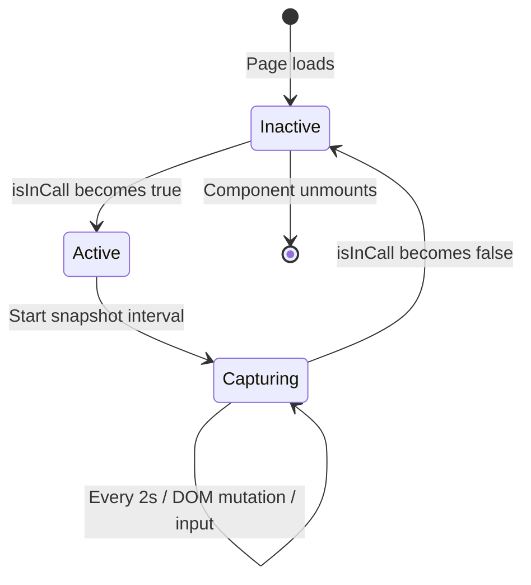

# Feature: Co-Browse Viewer (A5)

## Quick Summary
The Co-Browse Viewer allows agents to see a real-time, read-only view of the visitor's screen during an active call. It displays the visitor's DOM, tracks their mouse cursor position, synchronizes scroll state, and highlights text selections - all without allowing any agent interaction with the visitor's page.

## Affected Users
- [ ] Website Visitor
- [x] Agent
- [ ] Admin
- [ ] Platform Admin

---

## 1. WHAT IT DOES

### Purpose
Co-browsing enables agents to see exactly what the visitor is looking at during a call, facilitating guided support and sales conversations. The agent can say "I see you're on the pricing page - let me explain these options" without needing the visitor to describe their screen.

### User Goals
| User Type | What They Want | How This Feature Helps |
|-----------|---------------|----------------------|
| Agent | See visitor's screen to provide contextual help | Displays live DOM with cursor tracking |
| Agent | Know where visitor is looking/clicking | Shows real-time mouse cursor position |
| Agent | Follow along as visitor scrolls | Scroll position synchronized automatically |
| Agent | See what text visitor selects | Highlights selected text in viewer |
| Agent | Understand visitor's device context | Shows viewport size and device type indicator |

---

## 2. HOW IT WORKS

### High-Level Flow

1. **Call Starts** - Visitor and agent are connected via WebRTC call
2. **Widget Activates Co-Browse** - `useCobrowse` hook detects `isInCall: true`
3. **Initial Snapshot** - DOM is captured, sanitized, and sent to server
4. **Continuous Updates** - DOM snapshots every 2s, mouse at ~20fps, scroll at 10fps
5. **Server Relay** - Events forwarded from visitor socket to agent socket
6. **Agent View** - `CobrowseViewer` renders DOM in sandboxed iframe with overlays
7. **Call Ends** - Co-browse cleanup, stops all tracking

### State Machine



### State Definitions

| State | Description | How to Enter | How to Exit |
|-------|-------------|--------------|-------------|
| Inactive | No co-browsing, no listeners | Initial state, call ends | `isInCall` becomes true |
| Active | Listeners attached, capturing | `isInCall` is true | Call ends, component unmounts |
| Capturing | Actively sending snapshots | Within Active state | Part of Active lifecycle |

---

## 3. DETAILED LOGIC

### Triggers & Events

| Event Name | Where It Fires | What It Does | Side Effects |
|------------|---------------|--------------|--------------|
| `cobrowse:snapshot` | Widget → Server → Dashboard | Sends full DOM HTML with viewport info | Agent iframe updated |
| `cobrowse:mouse` | Widget → Server → Dashboard | Sends cursor x,y coordinates | Red cursor dot moves |
| `cobrowse:scroll` | Widget → Server → Dashboard | Sends scrollX, scrollY | Iframe content transforms |
| `cobrowse:selection` | Widget → Server → Dashboard | Sends selected text + bounding rect | Selection highlight appears |

### Key Functions/Components

| Function/Component | File | Purpose |
|-------------------|------|---------|
| `useCobrowse` | `apps/widget/src/features/cobrowse/useCobrowse.ts` | Captures and sends DOM/mouse/scroll/selection |
| `CobrowseViewer` | `apps/dashboard/src/features/cobrowse/CobrowseViewer.tsx` | Renders visitor's screen for agent |
| `captureSnapshot()` | `useCobrowse.ts:37-122` | Clones DOM, sanitizes, serializes to HTML |
| `handleMouseMove()` | `useCobrowse.ts:127-139` | Throttled mouse position sending |
| `handleScroll()` | `useCobrowse.ts:144-156` | Throttled scroll position sending |
| `handleSelection()` | `useCobrowse.ts:161-186` | Captures text selection with rect |
| Socket handlers | `socket-handlers.ts:1287-1369` | Server-side relay from visitor to agent |

### Data Flow

```
┌─────────────────────────────────────────────────────────────────────────┐
│                            VISITOR (Widget)                              │
│                                                                          │
│  ┌───────────────┐     ┌──────────────┐     ┌─────────────────────────┐ │
│  │ DOM Snapshot  │     │ Mouse Track  │     │ Scroll/Selection Track  │ │
│  │ (2s interval) │     │ (50ms throttle)    │ (100ms throttle)        │ │
│  └───────┬───────┘     └──────┬───────┘     └────────────┬────────────┘ │
│          │                    │                          │               │
│          └────────────────────┼──────────────────────────┘               │
│                               │                                          │
│                               ▼                                          │
│                    ┌──────────────────┐                                  │
│                    │   Socket.io      │                                  │
│                    │   (emit events)  │                                  │
│                    └────────┬─────────┘                                  │
└─────────────────────────────┼────────────────────────────────────────────┘
                              │
                              ▼
┌─────────────────────────────────────────────────────────────────────────┐
│                         SIGNALING SERVER                                 │
│                                                                          │
│  ┌─────────────────────────────────────────────────────────────────┐    │
│  │ 1. Verify visitor is in active call (getActiveCallByVisitorId)  │    │
│  │ 2. Find agent for that call (poolManager.getAgent)              │    │
│  │ 3. Forward event to agent socket (agentSocket.emit)             │    │
│  └─────────────────────────────────────────────────────────────────┘    │
└─────────────────────────────┼────────────────────────────────────────────┘
                              │
                              ▼
┌─────────────────────────────────────────────────────────────────────────┐
│                          AGENT (Dashboard)                               │
│                                                                          │
│  ┌─────────────────────────────────────────────────────────────────┐    │
│  │                      CobrowseViewer                              │    │
│  │  ┌─────────────────────────────────────────────────────────┐    │    │
│  │  │ Sandboxed Iframe (allow-same-origin only)               │    │    │
│  │  │ - pointer-events: none (no interaction)                 │    │    │
│  │  │ - user-select: none (no text selection)                 │    │    │
│  │  │ - overflow: hidden (no native scroll)                   │    │    │
│  │  │ - transform: translate() for scroll sync                │    │    │
│  │  └─────────────────────────────────────────────────────────┘    │    │
│  │                                                                  │    │
│  │  [Mouse Cursor Overlay] ← Red dot with MousePointer2 icon       │    │
│  │  [Selection Highlight] ← Blue rect over selected text           │    │
│  │  [Device/Viewport Info] ← Header showing dimensions             │    │
│  └─────────────────────────────────────────────────────────────────┘    │
└─────────────────────────────────────────────────────────────────────────┘
```

---

## 4. EDGE CASES

### Complete Scenario Matrix

| # | Scenario | Trigger | Current Behavior | Correct? | Notes |
|---|----------|---------|------------------|----------|-------|
| 1 | Happy path | Call starts | DOM displayed, cursor tracked | ✅ | Works smoothly |
| 2 | Large DOM (>1MB) | Complex page | Sent as-is, may lag | ⚠️ | No compression or chunking |
| 3 | Frequent DOM changes | React app re-renders | MutationObserver triggers | ✅ | Debouncing via significant change filter |
| 4 | Visitor has same-origin iframe | Embedded content | iframe content captured via srcdoc | ✅ | TKT-053: Full support |
| 4a | Visitor has cross-origin iframe | Embedded content | Styled placeholder shown | ✅ | TKT-053: Security restriction |
| 5 | Visitor has canvas | Charts/graphics | Canvas shows blank | ⚠️ | Canvas state not captured |
| 6 | Visitor has video | Video player | Video element visible but not playing | ✅ | Expected - DOM only |
| 7 | Sensitive data in forms | Password fields | Text visible in DOM | 🔴 | See Security section |
| 8 | Call drops mid-cobrowse | Network issue | Cobrowse stops, resumes on reconnect | ✅ | `isInCall` gate |
| 9 | Agent resizes window | Small screen | Viewport scales down | ✅ | Scale calculation handles this |
| 10 | Mobile visitor | Small viewport | Device indicator shows "Mobile" | ✅ | Viewport-based detection |
| 11 | Selection clears | Visitor clicks elsewhere | Selection overlay removed | ✅ | Tracks empty selection |
| 12 | Rapid scrolling | Fast scroll events | Throttled to 100ms | ✅ | Smooth but not overwhelming |

### Error States

| Error | When It Happens | What User Sees | Recovery Path |
|-------|-----------------|----------------|---------------|
| Snapshot capture fails | JS error in DOM clone | Console error, no update | Next interval retries |
| Socket disconnected | Network issue | Last snapshot frozen | Auto-reconnect handles |
| Iframe write fails | Security restriction | Blank viewer | Refresh dashboard page |

---

## 5. UI/UX REVIEW

### User Experience Audit

| Step | User Action | System Response | Clear? | Issues |
|------|------------|-----------------|--------|--------|
| Call starts | Agent answers | Co-browse viewer appears | ✅ | Could show loading state |
| Viewing | Agent looks at viewer | See visitor's page | ✅ | Clear "Live View" badge |
| Cursor track | Visitor moves mouse | Red cursor moves | ✅ | High visibility cursor |
| Scroll sync | Visitor scrolls | View updates | ✅ | Slight delay acceptable |
| Selection | Visitor selects text | Blue highlight + text shown | ✅ | Footer shows selected text |
| End call | Call ends | Viewer shows placeholder | ✅ | "Visitor's screen will appear here" |

### Accessibility

| Area | Status | Notes |
|------|--------|-------|
| Keyboard navigation | N/A | View-only, no interaction needed |
| Screen reader | ⚠️ | Could add aria-label for viewer |
| Color contrast | ✅ | Red cursor on white bg, good contrast |
| Loading states | ⚠️ | No explicit "Loading DOM..." state |

---

## 6. TECHNICAL CONCERNS

### Performance

| Concern | Current State | Risk Level | Recommendation |
|---------|---------------|------------|----------------|
| Large DOM snapshots | No compression | 🟡 Medium | Consider gzip or delta encoding |
| Frequent mutations | MutationObserver fires often | 🟡 Medium | Significant change filter helps |
| Mouse event volume | 50ms throttle (~20 events/s) | ✅ Low | Well-tuned |
| Memory in iframe | New iframe content each snapshot | 🟡 Medium | Could diff and patch |
| Scale calculation | On every snapshot | ✅ Low | Only runs on viewport change |

### Security

| Concern | Current State | Risk Level | Notes |
|---------|---------------|------------|-------|
| **Password fields visible** | Input values captured in DOM | 🔴 High | Passwords typed into `<input type="password">` are in HTML |
| Script removal | Scripts stripped from snapshot | ✅ Safe | Prevents XSS in agent's iframe |
| Sandbox | `allow-same-origin` only | ✅ Safe | No script execution |
| Cross-origin resources | Converted to absolute URLs | ✅ Safe | May fail for CORS-restricted resources |
| Agent interaction | All pointer-events disabled | ✅ Safe | Agent cannot interact with content |

**CRITICAL: Password fields are currently captured.** The DOM snapshot includes form input values. While `<input type="password">` visually obscures the password, the `value` attribute may be present in the DOM depending on how the site handles it.

**Recommendation:** Add sanitization to strip or mask password input values:
```typescript
// In captureSnapshot(), after cloning:
docClone.querySelectorAll('input[type="password"]').forEach((input) => {
  input.setAttribute("value", "••••••••");
});
```

### Reliability

| Scenario | Impact | Mitigation |
|----------|--------|------------|
| Server restart mid-cobrowse | Cobrowse stops until reconnect | Socket auto-reconnect |
| Database slow | No impact | Cobrowse doesn't use DB |
| WebRTC fails | Call ends, cobrowse ends | Expected behavior |
| Visitor closes browser | Call ends, cobrowse ends | Expected behavior |

---

## 7. FIRST PRINCIPLES REVIEW

### Does This Make Sense?

| Question | Answer | Notes |
|----------|--------|-------|
| **Mental model clear?** | ✅ Yes | Agent sees what visitor sees - intuitive |
| **Control intuitive?** | ✅ Yes | Fully automatic, no controls needed |
| **Feedback immediate?** | ⚠️ Mostly | 2s snapshot interval + network latency |
| **Flow reversible?** | N/A | View-only, nothing to undo |
| **Errors recoverable?** | ✅ Yes | Snapshots auto-retry |
| **Complexity justified?** | ✅ Yes | DOM streaming is inherently complex |

### Identified Issues

| Issue | Impact | Severity | Suggested Fix |
|-------|--------|----------|--------------|
| Password fields visible in DOM | Privacy/security risk | 🔴 High | Sanitize password inputs before snapshot |
| No loading state | Agent sees stale/blank before first snapshot | 🟡 Medium | Add "Loading visitor's screen..." |
| ~~Iframes not captured~~ | ~~Embedded content invisible~~ | ~~🟡 Medium~~ | ✅ Fixed by TKT-053 |
| Canvas blank | Charts/graphs invisible | 🟡 Medium | Could convert canvas to image |
| No delta encoding | Large payloads | 🟢 Low | Consider diff-based updates |

---

## 8. CODE REFERENCES

| Purpose | File | Lines | Notes |
|---------|------|-------|-------|
| Co-browse sender hook | `apps/widget/src/features/cobrowse/useCobrowse.ts` | 1-292 | Complete sender implementation |
| DOM snapshot capture | `apps/widget/src/features/cobrowse/useCobrowse.ts` | 37-122 | Clone, sanitize, serialize |
| Mouse tracking | `apps/widget/src/features/cobrowse/useCobrowse.ts` | 127-139 | Throttled mouse events |
| Scroll tracking | `apps/widget/src/features/cobrowse/useCobrowse.ts` | 144-156 | Throttled scroll events |
| Selection tracking | `apps/widget/src/features/cobrowse/useCobrowse.ts` | 161-186 | Text selection + rect |
| MutationObserver | `apps/widget/src/features/cobrowse/useCobrowse.ts` | 250-279 | DOM change detection |
| Co-browse viewer | `apps/dashboard/src/features/cobrowse/CobrowseViewer.tsx` | 1-317 | Agent-side viewer |
| Iframe rendering | `apps/dashboard/src/features/cobrowse/CobrowseViewer.tsx` | 85-132 | Sandboxed iframe setup |
| Scale calculation | `apps/dashboard/src/features/cobrowse/CobrowseViewer.tsx` | 49-82 | Viewport scaling logic |
| Scroll sync | `apps/dashboard/src/features/cobrowse/CobrowseViewer.tsx` | 135-152 | CSS transform for scroll |
| Cursor overlay | `apps/dashboard/src/features/cobrowse/CobrowseViewer.tsx` | 265-287 | Red dot + icon |
| Selection highlight | `apps/dashboard/src/features/cobrowse/CobrowseViewer.tsx` | 249-262 | Blue rect overlay |
| Server relay - snapshot | `apps/server/src/features/signaling/socket-handlers.ts` | 1287-1318 | Forward to agent |
| Server relay - mouse | `apps/server/src/features/signaling/socket-handlers.ts` | 1320-1335 | Forward to agent |
| Server relay - scroll | `apps/server/src/features/signaling/socket-handlers.ts` | 1337-1352 | Forward to agent |
| Server relay - selection | `apps/server/src/features/signaling/socket-handlers.ts` | 1354-1369 | Forward to agent |
| Types - Snapshot | `packages/domain/src/types.ts` | 394-400 | CobrowseSnapshotPayload |
| Types - Mouse | `packages/domain/src/types.ts` | 402-406 | CobrowseMousePayload |
| Types - Scroll | `packages/domain/src/types.ts` | 408-412 | CobrowseScrollPayload |
| Types - Selection | `packages/domain/src/types.ts` | 414-418 | CobrowseSelectionPayload |
| Timing constants | `apps/widget/src/constants.ts` | 40-72 | COBROWSE_TIMING |
| Widget integration | `apps/widget/src/Widget.tsx` | 419-423 | useCobrowse hook call |

---

## 9. RELATED FEATURES

- [Visitor Call (V3)](../visitor/visitor-call.md) - Co-browse activates when call starts
- [WebRTC Signaling (P5)](../platform/webrtc-signaling.md) - Shares same socket connection
- [Call Lifecycle (P3)](../platform/call-lifecycle.md) - Co-browse tied to call state

---

## 10. OPEN QUESTIONS

1. **Should we sanitize/mask password input values?**
   - Currently password fields are captured in DOM snapshots
   - This is a potential security/privacy concern
   - Recommendation: Add input[type="password"] sanitization

2. **Should there be a "co-browse disabled" option?**
   - Some visitors might prefer privacy during calls
   - No toggle currently exists - cobrowse is automatic

3. ~~**How should iframe content be handled?**~~
   - ~~Cross-origin iframes cannot be captured due to CORS~~
   - ~~Same-origin iframes could theoretically be recursively captured~~
   - ~~Current: Iframe element shown but content blank~~
   - **✅ RESOLVED by TKT-053:** Same-origin iframes are now recursively captured via srcdoc. Cross-origin iframes show styled placeholders.

4. **Should canvas elements be converted to images?**
   - `canvas.toDataURL()` could capture current state
   - Would add significant complexity and size
   - Charts/graphs currently appear blank

5. **Is 2-second snapshot interval optimal?**
   - Trade-off between freshness and bandwidth
   - Current setting seems reasonable for most use cases
   - Could be org-configurable in the future

---

## SPECIAL FOCUS ANSWERS

### How is the DOM reconstructed?

1. **Widget Side (Sender):**
   - `document.cloneNode(true)` creates a deep copy of the entire DOM
   - Widget element (`#ghost-greeter-widget`) is removed from clone
   - All `<script>` tags are removed for security
   - Relative URLs are converted to absolute (images, stylesheets, background images)
   - Serialized via `outerHTML` to get full HTML string

2. **Agent Side (Viewer):**
   - HTML string written directly to sandboxed iframe via `iframeDoc.write()`
   - Base tag set to visitor's origin for relative resource loading
   - Strict CSS disables all interaction (pointer-events, user-select, overflow)

### How is the cursor position mapped?

1. **Capture:** `e.clientX` and `e.clientY` from MouseEvent (viewport-relative)
2. **Relay:** Coordinates sent as-is through socket
3. **Display:** Coordinates multiplied by `scale` factor to match scaled viewport
4. **Offset:** `transform: translate(-4px, -4px)` centers the cursor dot

```typescript
// Cursor positioning in CobrowseViewer
style={{
  left: mousePosition.x * scale,
  top: mousePosition.y * scale,
  transform: "translate(-4px, -4px)",
}}
```

### What about iframes, canvas, video elements?

| Element Type | Captured? | What Agent Sees | Notes |
|--------------|-----------|-----------------|-------|
| **iframe (same-origin)** | ✅ Yes (TKT-053) | Full iframe content | Recursively captured via srcdoc |
| **iframe (cross-origin)** | Placeholder (TKT-053) | Styled placeholder div | CORS prevents access - shows "Embedded content - not visible to agent" |
| **canvas** | Element only | Blank box | No canvas.toDataURL() |
| **video** | Element only | Video element (paused) | Video not streaming |
| **SVG** | ✅ Yes | Full SVG content | Serializes correctly |
| **img** | ✅ Yes | Images load | URLs converted to absolute |

### Security considerations (passwords, sensitive data)

**Current Implementation:**
- Scripts are removed (✅ prevents XSS)
- Iframe is sandboxed to `allow-same-origin` only (✅ no script execution)
- All pointer-events disabled (✅ agent can't interact)

**Security Gaps:**
1. **Password fields**: Input values may be visible in DOM snapshot
2. **Credit card fields**: Same issue as passwords
3. **Personal data**: Any visible data on page is captured
4. **Session tokens**: If displayed on page, captured

**Recommended Mitigations:**
```typescript
// Add to captureSnapshot() after cloning:

// Mask password inputs
docClone.querySelectorAll('input[type="password"]').forEach((input) => {
  input.setAttribute("value", "••••••••");
  input.removeAttribute("data-value"); // Remove any data attributes
});

// Consider also masking:
// - input[type="tel"]
// - input[autocomplete="cc-number"]
// - Elements with data-sensitive="true"
```

---

*Documentation created by Doc Agent 15 | Last updated: 2024-12-03*

