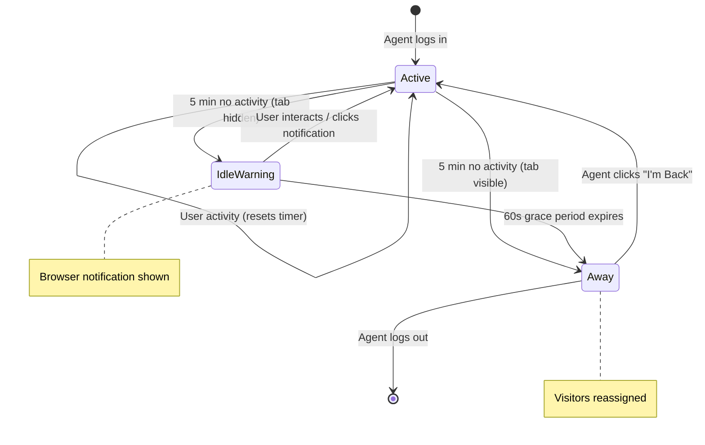

# Feature: Idle Timer (F2)

## Quick Summary
Agent idle detection that warns and eventually auto-logs-out inactive agents. Protects against abandoned sessions affecting routing and availability. The system uses Web Workers for reliable timing even in background tabs and coordinates client-side idle detection with server-side heartbeat staleness checks.

## Affected Users
- [ ] Website Visitor (indirectly - widget shows idle warning, but primarily affects agent)
- [x] Agent
- [ ] Admin
- [ ] Platform Admin

---

## 1. WHAT IT DOES

### Purpose
The Idle Timer prevents "ghost agents" — agents who are logged in but not actually at their desk. Without idle detection:
- Visitors would be routed to unresponsive agents
- Call requests would repeatedly ring with no answer
- RNA (Ring-No-Answer) timeouts would occur unnecessarily
- Agents could monopolize visitor slots without being present
- Metrics would be skewed by phantom availability

### User Goals
| User Type | What They Want | How This Feature Helps |
|-----------|---------------|----------------------|
| Agent | Not unfairly penalized for brief inactivity | 5-minute threshold with warning |
| Agent | Know when they're about to be marked away | Browser notification if tab hidden |
| Agent | Quick recovery when they return | Single click "I'm Back" to restore status |
| Visitor | Responsive agents | Idle agents removed from routing pool |
| Visitor | Not waiting for agents who won't respond | Idle detection prevents dead-end routing |
| Platform | Accurate availability metrics | Idle detection filters inactive agents |

---

## 2. HOW IT WORKS

### High-Level Flow (Happy Path)
1. Agent logs in → idle timer starts (5 minute countdown)
2. Agent moves mouse, types, scrolls → timer resets
3. No activity for 5 minutes → if tab visible: mark away immediately
4. If tab hidden → show browser notification "Still there?"
5. Agent clicks notification → timer resets, stay online
6. No response in 60 seconds → mark away
7. Visitors reassigned to other agents
8. Agent clicks "I'm Back" → status restored

### State Machine



### State Definitions

| State | Description | How to Enter | How to Exit |
|-------|-------------|--------------|-------------|
| `Active` | Agent is actively using the dashboard | Login, any user activity, click "I'm Back" | 5 min inactivity |
| `IdleWarning` | Tab hidden, notification shown | 5 min inactivity while tab hidden | User interaction, 60s timeout |
| `Away` | Agent marked unavailable, visitors reassigned | Idle timeout, notification timeout, manual | Click "I'm Back" |

---

## 3. DETAILED LOGIC

### Triggers & Events

| Event/Trigger | Where It Fires | What It Does | Side Effects |
|--------------|---------------|--------------|--------------|
| `mousemove` | Dashboard window | Resets idle timer | None |
| `mousedown` | Dashboard window | Resets idle timer | None |
| `keydown` | Dashboard window | Resets idle timer | None |
| `scroll` | Dashboard window | Resets idle timer | None |
| `touchstart` | Dashboard window | Resets idle timer | None |
| `wheel` | Dashboard window | Resets idle timer | None |
| Worker `idle` message | Web Worker → useIdleTimer | Triggers idle timeout handling | Checks visibility, shows notification or marks away |
| `AGENT_AWAY` | Dashboard → Server | Agent marked as away | Server reassigns visitors, records status change |
| `AGENT_MARKED_AWAY` | Server → Dashboard | Notifies agent they were marked away | UI shows "marked away" notification |
| `AGENT_BACK` | Dashboard → Server | Agent coming back online | Server updates status, may assign new visitors |

### Key Functions/Components

| Function/Component | File | Purpose |
|-------------------|------|---------|
| `useIdleTimer` | `apps/dashboard/src/features/workbench/hooks/useIdleTimer.ts` | Main idle detection hook with Web Worker |
| `SignalingProvider` | `apps/dashboard/src/features/signaling/signaling-provider.tsx` | Integrates idle timer with signaling, calls `setAway("idle")` |
| `setAway("idle")` | `apps/dashboard/src/features/signaling/use-signaling.ts` | Emits AGENT_AWAY event to server |
| `AGENT_AWAY` handler | `apps/server/src/features/signaling/socket-handlers.ts` | Server processes away status |
| `getStaleAgents()` | `apps/server/src/features/routing/pool-manager.ts` | Server-side backup staleness check |
| Web Worker (inline) | `useIdleTimer.ts:41-80` | Reliable timing in background tabs |

### Data Flow

```
┌─────────────────────────────────────────────────────────────────────────┐
│                      DASHBOARD (Agent Client)                            │
│                                                                          │
│  ┌──────────────────┐     ┌──────────────────┐                          │
│  │   Web Worker     │     │  Activity        │                          │
│  │   setInterval    │     │  Listeners       │                          │
│  │   (1 second)     │     │  (6 event types) │                          │
│  └────────┬─────────┘     └────────┬─────────┘                          │
│           │                        │                                     │
│           ▼                        ▼                                     │
│  ┌────────────────────────────────────────────────────────────────────┐ │
│  │                         useIdleTimer Hook                          │ │
│  │                                                                     │ │
│  │  Worker posts "tick" every 1s → updates timeUntilIdle state       │ │
│  │  Activity event → postMessage("reset") to Worker                  │ │
│  │  Worker posts "idle" after 5 min → handleIdleTimeout()            │ │
│  │                                                                     │ │
│  │  handleIdleTimeout():                                              │ │
│  │    if (tab visible) → markIdle() immediately                      │ │
│  │    if (tab hidden) → show notification, 60s grace period          │ │
│  └────────────────────────────────────────────────────────────────────┘ │
│           │                                                              │
│           ▼                                                              │
│  ┌────────────────────────────────────────────────────────────────────┐ │
│  │                    SignalingProvider                               │ │
│  │                                                                     │ │
│  │  onIdle callback: setAway("idle")                                 │ │
│  │  enabled: false during activeCall (never idle during calls)       │ │
│  └────────────────────────────────────────────────────────────────────┘ │
│           │                                                              │
│           ▼                                                              │
│  socket.emit("agent:away", { reason: "idle" })                         │
│                                                                          │
└─────────────────────────────────────────────────────────────────────────┘
                                    │
                                    ▼
┌─────────────────────────────────────────────────────────────────────────┐
│                              SERVER                                      │
│                                                                          │
│  socket.on("agent:away") handler                                        │
│       │                                                                 │
│       ├─► poolManager.updateAgentStatus(agentId, "away")               │
│       │                                                                 │
│       ├─► recordStatusChange(agentId, "away", "idle")                  │
│       │                                                                 │
│       ├─► ack({ success: true, status: "away" })                       │
│       │                                                                 │
│       ├─► poolManager.reassignVisitors(agentId)                        │
│       │                                                                 │
│       └─► For each visitor: emit AGENT_UNAVAILABLE or AGENT_REASSIGNED │
│                                                                          │
│  ┌──────────────────────────────────────────────────────────────────┐   │
│  │           BACKUP: Heartbeat Staleness Check                       │   │
│  │           (every 60s, threshold: 2 min)                           │   │
│  │                                                                   │   │
│  │  If agent.status === "idle" AND no heartbeat for 2 min:          │   │
│  │    → Mark away, reassign visitors                                │   │
│  │    → Handles cases where client crashed without sending away     │   │
│  └──────────────────────────────────────────────────────────────────┘   │
│                                                                          │
└─────────────────────────────────────────────────────────────────────────┘
```

### Timing Constants

| Constant | Value | Location | Purpose |
|----------|-------|----------|---------|
| `AGENT_IDLE_TIMEOUT` | 5 min (300,000 ms) | `packages/domain/src/constants.ts:86` | Main idle timeout |
| `DEFAULT_IDLE_TIMEOUT` | 5 min (300,000 ms) | `useIdleTimer.ts:27` | Default if not specified |
| `NOTIFICATION_GRACE_PERIOD` | 60 sec (60,000 ms) | `useIdleTimer.ts:28` | Time to respond to notification |
| `HEARTBEAT_INTERVAL` | 25 sec (25,000 ms) | `packages/domain/src/constants.ts:78` | Client heartbeat frequency |
| `STALENESS_THRESHOLD` | 2 min (120,000 ms) | `socket-handlers.ts:1503` | Server backup check threshold |
| `STALENESS_CHECK_INTERVAL` | 60 sec (60,000 ms) | `socket-handlers.ts:1502` | How often server checks |

---

## 4. EDGE CASES

### Complete Scenario Matrix

| # | Scenario | Trigger | Current Behavior | Correct? | Notes |
|---|----------|---------|------------------|----------|-------|
| 1 | Happy path: agent active | Moves mouse every few minutes | Timer continuously resets | ✅ | |
| 2 | Agent AFK, tab visible | 5 min no activity | Marked away immediately | ✅ | |
| 3 | Agent AFK, tab hidden, notification granted | 5 min no activity | Notification shown, 60s grace | ✅ | Uses browser Notification API |
| 4 | Agent AFK, tab hidden, no notification permission | 5 min no activity | 60s visibility grace period | ✅ | Waits for tab to become visible |
| 5 | Agent clicks notification | Within 60s grace | Timer resets, stays online | ✅ | Window also focused |
| 6 | Agent returns to visible tab | Within 60s visibility grace | Timer resets, stays online | ✅ | Visibility API listener |
| 7 | Idle during incoming call | Call rings while idle | **Timer disabled during call** | ✅ | `enabled: !activeCall` |
| 8 | Idle during active call | In call for 5+ min | **Timer disabled during call** | ✅ | Only enabled when not in call |
| 9 | Browser minimized | Tab technically "hidden" | Notification shows on idle | ✅ | Same as tab hidden |
| 10 | Multiple browser tabs | Agent has multiple tabs | Each tab has own timer | ⚠️ | Only focused tab resets on activity |
| 11 | Network disconnect while idle | Socket drops | Server heartbeat staleness kicks in | ✅ | 2-min backup |
| 12 | Browser crash | No graceful exit | Server heartbeat staleness | ✅ | Agent marked away after 2 min |
| 13 | Chrome tab throttling | Background tab throttled | Web Worker continues | ✅ | Worker not throttled |
| 14 | Mobile browser (backgrounded) | iOS/Android background | Browser may suspend Worker | ⚠️ | Mobile behavior varies |
| 15 | Agent manually goes away | Clicks "Away" button | Already away, idle timer irrelevant | ✅ | |
| 16 | 4:59 of idle, then mouse move | Activity at last second | Timer resets to 5 min | ✅ | |

### Error States

| Error | When It Happens | What User Sees | Recovery Path |
|-------|-----------------|----------------|---------------|
| Notification permission denied | First idle timeout | No notification, 60s grace | Return to tab within 60s OR allow notifications |
| Web Worker creation fails | Browser doesn't support Workers | Falls back to setTimeout | Works but may be throttled in background |
| Socket disconnected during idle | Network issue | May miss away notification | Server staleness check handles |
| Audio unlock required | First notification | May not play sound | Click anywhere to unlock audio |

---

## 5. UI/UX REVIEW

### User Experience Audit

| Step | User Action | System Response | Clear? | Issues |
|------|------------|-----------------|--------|--------|
| 1 | Agent logs in | Idle timer starts silently | ✅ | No UI indicator needed |
| 2 | Agent works normally | Timer resets on activity | ✅ | Invisible, good UX |
| 3 | Agent walks away (tab visible) | After 5 min: marked away, UI shows | ✅ | Clear "You're away" state |
| 4 | Agent walks away (tab hidden) | After 5 min: notification | ⚠️ | Notification easily missed |
| 5 | Agent clicks notification | Returns to tab, timer resets | ✅ | Clear interaction |
| 6 | Agent misses notification | After 60s grace: marked away | ✅ | Agent sees away state on return |
| 7 | Agent clicks "I'm Back" | Status restored to idle | ✅ | Single click recovery |

### Notification Details

**Browser Notification (when tab hidden):**
```
Title: "Still there?"
Body: "Click to stay available for calls"
Icon: /favicon.ico
requireInteraction: true (stays until clicked)
tag: "idle-check" (prevents duplicates)
```

### Accessibility
- Keyboard navigation: ✅ Any keyboard input resets timer
- Screen reader support: ⚠️ Notification may not be announced
- Color contrast: ✅ N/A (browser notification)
- Loading states: ✅ No loading needed

---

## 6. TECHNICAL CONCERNS

### Performance

| Concern | Implementation | Status |
|---------|----------------|--------|
| Timer accuracy in background | Web Worker with setInterval | ✅ Not throttled |
| Memory for Worker | ~100 bytes, single instance | ✅ Minimal |
| Event listener overhead | Passive listeners, 6 events | ✅ Minimal |
| CPU usage | 1 tick/second in Worker | ✅ Negligible |

### Security

| Concern | Mitigation |
|---------|------------|
| Timer manipulation | Server-side heartbeat staleness as backup |
| Spoofed activity events | Only resets client timer, server has heartbeat check |
| Notification abuse | Single notification at a time via `tag` |

### Reliability

| Concern | Mitigation |
|---------|------------|
| Web Worker not supported | Fallback to setTimeout (may be throttled) |
| Notification permission denied | Visibility grace period fallback |
| Browser crash | Server heartbeat staleness (2 min) |
| Socket disconnection | Heartbeat staleness detection |
| Tab freezing (Chrome) | Web Worker continues independently |

---

## 7. FIRST PRINCIPLES REVIEW

### Does This Make Sense?

1. **Is the mental model clear?** ✅ Yes - "No activity = marked away" is intuitive

2. **Is the control intuitive?** ✅ Yes - No manual control needed, automatic detection

3. **Is feedback immediate?** ⚠️ Delayed by design - 5 minute threshold prevents false positives from brief pauses

4. **Is the flow reversible?** ✅ Yes - Single click "I'm Back" to restore status

5. **Are errors recoverable?** ✅ Yes - Always can click "I'm Back" to restore

6. **Is the complexity justified?** ✅ Yes - Web Worker complexity needed for background tab reliability

### Identified Issues

| Issue | Impact | Severity | Suggested Fix |
|-------|--------|----------|--------------|
| No countdown UI | Agent doesn't know time remaining | 🟢 Low | Could add optional countdown indicator |
| Multiple tabs confusing | Activity in one tab doesn't reset others | 🟢 Low | Could use SharedWorker or localStorage sync |
| Notification easily missed | Mobile/quiet environments | 🟡 Medium | Could add audio alert with notification |
| No admin configuration | Fixed 5-min timeout | 🟢 Low | Could make timeout configurable per-org |
| Mobile browser suspends Worker | May not detect idle properly | 🟡 Medium | Server staleness check handles, but delayed |

---

## 8. CODE REFERENCES

| Purpose | File | Lines | Notes |
|---------|------|-------|-------|
| Main idle hook | `apps/dashboard/src/features/workbench/hooks/useIdleTimer.ts` | 1-333 | Full implementation |
| Web Worker code | `apps/dashboard/src/features/workbench/hooks/useIdleTimer.ts` | 41-80 | Inline Worker blob |
| Activity events | `apps/dashboard/src/features/workbench/hooks/useIdleTimer.ts` | 31-38 | ACTIVITY_EVENTS array |
| Handle idle timeout | `apps/dashboard/src/features/workbench/hooks/useIdleTimer.ts` | 157-204 | Notification logic |
| SignalingProvider integration | `apps/dashboard/src/features/signaling/signaling-provider.tsx` | 154-164 | useIdleTimer usage |
| onIdle callback | `apps/dashboard/src/features/signaling/signaling-provider.tsx` | 157-161 | Calls setAway("idle") |
| Timing constant | `packages/domain/src/constants.ts` | 86 | AGENT_IDLE_TIMEOUT |
| Server AGENT_AWAY handler | `apps/server/src/features/signaling/socket-handlers.ts` | 527-606 | Processes idle away |
| Server staleness check | `apps/server/src/features/signaling/socket-handlers.ts` | 1505-1533 | Backup detection |
| getStaleAgents | `apps/server/src/features/routing/pool-manager.ts` | 469-484 | Filters stale agents |
| updateAgentActivity | `apps/server/src/features/routing/pool-manager.ts` | 457-462 | Heartbeat timestamp update |

---

## 9. RELATED FEATURES

- [Bullpen & Agent States (A1)](./bullpen-states.md) - Away/online status UI, "I'm Back" button
- [Heartbeat & Staleness (P6)](../platform/heartbeat-staleness.md) - Server-side backup for idle detection
- [RNA Timeout (A3)](./rna-timeout.md) - Also marks agents away (for missed calls)
- [Incoming Call (A2)](./incoming-call.md) - Idle timer disabled during incoming calls
- [Agent Active Call (A4)](./agent-active-call.md) - Idle timer disabled during active calls
- [Call Lifecycle (P3)](../platform/call-lifecycle.md) - How away status affects call routing

---

## 10. OPEN QUESTIONS

1. **Should there be a warning before idle timeout?** Currently agent gets no warning at 4:30. Could show subtle countdown indicator in UI.

2. **Should idle timeout be configurable per organization?** Currently fixed at 5 minutes. Some orgs may want shorter/longer timeouts.

3. **Should idle timer track activity in iframe preview?** Agent viewing co-browse iframe is "active" but not moving mouse in main window.

4. **Multiple tab behavior?** Currently each tab has independent timer. Should activity in one tab reset timer in all tabs (via SharedWorker or localStorage)?

5. **Audio notification?** Currently notification is visual only. Should there be an optional audio alert for idle warning?

6. **Mobile browser handling?** iOS Safari and Android Chrome may suspend background Workers. How do we ensure idle detection on mobile devices? (Server heartbeat staleness is the current backup.)

---

## VISITOR-SIDE IDLE TIMER (Widget)

**Note:** The widget also has an idle warning system for visitors, separate from agent idle timer:

### Widget Idle Warning

| Setting | Value | File |
|---------|-------|------|
| Warning Threshold | 4:30 (270,000 ms) | `apps/widget/src/constants.ts:104` |
| Warning Duration | 25 sec (25,000 ms) | `apps/widget/src/constants.ts:110` |

**Behavior:**
- Shows toast "Still there? Tap to stay connected" after 4:30 of page inactivity
- Visitor can tap/click anywhere to dismiss and reset timer
- Auto-dismisses after 25 seconds
- Only active when widget is in "open" state with an agent assigned
- Tracked activity events: click, scroll, keydown, touchstart, mousemove

**Purpose:** Prevents visitors from occupying agent slots indefinitely while AFK. Server handles actual disconnection via visitor session timeout.

**Code References:**
- `IdleWarningToast` component: `apps/widget/src/Widget.tsx:120-141`
- `resetIdleTimer` function: `apps/widget/src/Widget.tsx:586-617`
- `handleStayConnected` function: `apps/widget/src/Widget.tsx:622-634`
- Activity listeners: `apps/widget/src/Widget.tsx:665-691`

