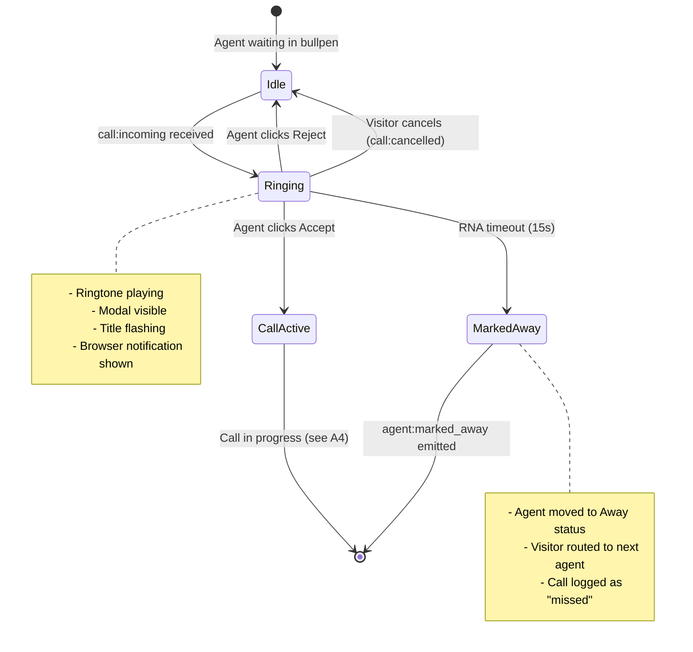

# Feature: A2 - Incoming Call

## Quick Summary
When a visitor requests a call, the assigned agent receives a full-screen notification modal with ringtone, browser notification, and title flash. The agent has a configurable timeout (default 15 seconds) to accept or reject before Ring-No-Answer (RNA) kicks in and routes the visitor elsewhere.

## Affected Users
- [x] Agent (receives notification, accepts/rejects)
- [x] Website Visitor (waits for agent response)
- [x] Admin (configures RNA timeout in settings)
- [ ] Platform Admin

---

## 1. WHAT IT DOES

### Purpose
Notifies agents of incoming call requests with multiple attention-grabbing mechanisms and provides a simple accept/reject interface.

### User Goals
| User Type | What They Want | How This Feature Helps |
|-----------|---------------|----------------------|
| Agent | Know immediately when visitor wants to talk | Multi-channel notification (audio, visual, browser) |
| Agent | Decide quickly whether to take call | Clear modal with visitor context and big buttons |
| Agent | Not be penalized for being away | RNA timeout auto-marks as away, visitor gets rerouted |
| Visitor | Fast connection to agent | 15s timeout ensures they don't wait forever |

---

## 2. HOW IT WORKS

### High-Level Flow

1. **Visitor clicks "Call"** → Server receives `call:request`
2. **Server sends `call:incoming`** → Dashboard receives notification
3. **Ringtone starts** → Audio loops until action taken
4. **Modal appears** → Shows visitor info, accept/reject buttons
5. **Agent acts** → Accept starts call, Reject/Ignore routes to next agent

### State Machine



### Notification Channels

The incoming call uses **four** simultaneous attention mechanisms:

| Channel | Implementation | Works When Tab Backgrounded? |
|---------|---------------|------------------------------|
| **Ringtone** | Web Audio API dual-tone (440Hz + 480Hz) | ❌ No (AudioContext suspended) |
| **Modal** | Full-screen overlay with pulsing animation | ❌ No (not visible) |
| **Browser Notification** | Notification API with `requireInteraction: true` | ✅ Yes |
| **Title Flash** | Document.title alternating messages | ✅ Yes (shows in tab bar) |
| **Fallback Alert** | In-browser floating div | ❌ No (not visible) |

### Audio Behavior

```
Ring Pattern:
├── 1000ms: Dual-tone ring (440Hz + 480Hz sine wave)
├── 2000ms: Pause
└── Repeat until stopped
```

**Important**: AudioContext requires user interaction to initialize. The dashboard auto-initializes on first click/keydown/touchstart.

---

## 3. DETAILED LOGIC

### Triggers & Events

| Event Name | Direction | When It Fires | What It Does |
|------------|-----------|---------------|--------------|
| `call:incoming` | Server → Dashboard | Visitor requests call | Triggers all notifications |
| `call:accept` | Dashboard → Server | Agent clicks Accept | Clears RNA timer, starts call |
| `call:reject` | Dashboard → Server | Agent clicks Reject | Routes visitor to next agent |
| `call:cancelled` | Server → Dashboard | Visitor cancels | Clears notification |
| `call:rna_timeout` | Server → Dashboard | Agent doesn't respond in time | Informational only |
| `agent:marked_away` | Server → Dashboard | RNA timeout triggered | Updates agent status |

### Key Functions/Components

| Function/Component | File | Purpose |
|-------------------|------|---------|
| `IncomingCallModal` | `apps/dashboard/src/features/workbench/incoming-call-modal.tsx` | UI modal component |
| `useIncomingCall` | `apps/dashboard/src/features/workbench/hooks/useIncomingCall.ts` | Audio, notifications, title flash |
| `startRinging()` | `useIncomingCall.ts:259-297` | Initiates all notification channels |
| `stopRinging()` | `useIncomingCall.ts:300-323` | Cleans up all notification channels |
| `startRNATimeout()` | `socket-handlers.ts:1541-1684` | Server-side RNA timer with grace period |
| `clearRNATimeout()` | `socket-handlers.ts:1689-1696` | Cancels RNA timer on accept/reject |

### What Agent Sees in Modal

| Field | Source | Display |
|-------|--------|---------|
| Visitor ID | `visitor.visitorId` | First 20 chars + "..." |
| Page URL | `visitor.pageUrl` | Truncated with ellipsis |
| Location | `visitor.location` | Country flag + city, region |
| Time on Page | `visitor.connectedAt` | Calculated elapsed time |
| Countdown | Local state | "Request expires in Xs" |

### Timing Configuration

| Parameter | Default | Configurable? | Source |
|-----------|---------|---------------|--------|
| RNA Timeout | 15 seconds | ✅ Yes | `organizations.recording_settings.rna_timeout_seconds` |
| UI Countdown Display | 30 seconds | ❌ No | Hardcoded in `incoming-call-modal.tsx` |
| Ring Duration | 1000ms | ❌ No | Hardcoded in `useIncomingCall.ts` |
| Ring Pause | 2000ms | ❌ No | Hardcoded in `useIncomingCall.ts` |

**⚠️ UI/Server Mismatch**: The modal shows a 30-second countdown but RNA actually fires at 15 seconds (or org-configured value). See finding Q-1202-003 below.

### Data Flow

```
┌─────────────────────────────────────────────────────────────────┐
│                    VISITOR CLICKS "CALL"                         │
│                   (call:request sent)                            │
└────────────────────────────┬────────────────────────────────────┘
                             │
                             ▼
┌─────────────────────────────────────────────────────────────────┐
│                      SERVER PROCESSING                           │
│  1. Get org call settings (RNA timeout)                          │
│  2. Create CallRequest in pool manager                           │
│  3. Log call to database (ring_started_at = now)                 │
│  4. Send call:incoming to agent                                  │
│  5. Start RNA timeout (org-configured, default 15s)              │
└────────────────────────────┬────────────────────────────────────┘
                             │
                             ▼
┌─────────────────────────────────────────────────────────────────┐
│                    DASHBOARD RECEIVES                            │
│  1. useSignaling sets incomingCall state                         │
│  2. SignalingProvider calls startRinging()                       │
│  3. Modal renders with visitor info                              │
└────────────────────────────┬────────────────────────────────────┘
                             │
          ┌──────────────────┼──────────────────┐
          │                  │                  │
          ▼                  ▼                  ▼
┌─────────────────┐ ┌─────────────────┐ ┌─────────────────┐
│  AGENT ACCEPTS  │ │  AGENT REJECTS  │ │  RNA TIMEOUT    │
│                 │ │                 │ │                 │
│ 1. stopRinging()│ │ 1. stopRinging()│ │ 1. 100ms grace  │
│ 2. call:accept  │ │ 2. call:reject  │ │ 2. Mark away    │
│ 3. Clear RNA    │ │ 3. Clear RNA    │ │ 3. call:cancelled│
│ 4. call:started │ │ 4. Route next   │ │ 4. mark_away    │
└─────────────────┘ └─────────────────┘ │ 5. Route next   │
                                        └─────────────────┘
```

---

## 4. EDGE CASES

### Complete Scenario Matrix

| # | Scenario | Trigger | Current Behavior | Correct? | Notes |
|---|----------|---------|------------------|----------|-------|
| 1 | Happy path - accept | Agent clicks Accept within 15s | Call starts, ringtone stops | ✅ | Standard flow |
| 2 | Agent rejects | Agent clicks Reject | Routes to next agent, ringtone stops | ✅ | Visitor doesn't wait |
| 3 | RNA timeout | Agent doesn't respond | Agent marked away, routes to next | ✅ | Protects visitor experience |
| 4 | Visitor cancels | Visitor hangs up while ringing | call:cancelled clears notification | ✅ | Clean cleanup |
| 5 | Accept at exact RNA moment | Agent clicks Accept as RNA fires | **100ms grace period lets accept win** | ✅ | Race condition handled |
| 6 | Tab in background | Agent has other tabs open | Browser notification + title flash work | ✅ | Multi-channel notification |
| 7 | Tab frozen (throttled) | Browser throttles background tab | Heartbeat staleness marks away | ✅ | Eventually recovers |
| 8 | Multiple tabs open | Agent logged in on 2 tabs | Both receive notification | ⚠️ | Accepting on one clears both |
| 9 | Already in call | Agent in active call | Won't receive incoming (status = in_call) | ✅ | Server filters by status |
| 10 | AudioContext blocked | User never interacted with page | Ringtone won't play, other channels work | ⚠️ | Browser limitation |
| 11 | Notifications denied | User denied notification permission | Fallback alert + title flash still work | ✅ | Multiple fallbacks |
| 12 | No agents available after reject | Agent rejects, no one else online | Visitor gets AGENT_UNAVAILABLE | ✅ | Widget shows "got pulled away" |

### Error States

| Error | When It Happens | What User Sees | Recovery Path |
|-------|-----------------|----------------|---------------|
| No ringtone | AudioContext not initialized | Silent notification, visual still works | User clicks anywhere first |
| Notification blocked | Permission denied | Title flash + fallback alert | Request permission in settings |
| Agent disconnected | Network drop | Modal disappears, visitor rerouted | Auto-handled by server |

---

## 5. UI/UX REVIEW

### IncomingCallModal Visual Elements

```
┌─────────────────────────────────────────────────────────────┐
│                    INCOMING REQUEST                          │
│              A visitor wants to connect live                 │
│                                                              │
│  ┌──────────────────────────────────────────────────────┐   │
│  │  👤 Visitor ID    visitor_17234234234234234...       │   │
│  │  🌐 Page URL      https://example.com/pricing        │   │
│  │  📍 Location      🇺🇸 San Francisco, California      │   │
│  │  ⏱️ Time on page  2:34                                │   │
│  └──────────────────────────────────────────────────────┘   │
│                                                              │
│              Request expires in 25s                          │
│              ████████████░░░░░░░░░░░░░                       │
│                                                              │
│     ┌───────────────┐        ┌───────────────┐              │
│     │    Decline    │        │    Accept     │              │
│     └───────────────┘        └───────────────┘              │
└─────────────────────────────────────────────────────────────┘
```

### User Experience Audit

| Step | User Action | System Response | Clear? | Issues |
|------|------------|-----------------|--------|--------|
| 1 | Visitor requests call | Ringtone + modal + notification | ✅ | Multiple channels |
| 2 | Agent sees modal | Visitor context displayed | ⚠️ | Countdown shows 30s, RNA at 15s |
| 3 | Agent clicks Accept | Ringtone stops, call starts | ✅ | Immediate transition |
| 4 | Agent clicks Reject | Ringtone stops, modal closes | ✅ | Clean |
| 5 | Agent ignores | Marked away, visitor rerouted | ✅ | Appropriate consequence |

### Accessibility
- Keyboard navigation: Accept/Reject buttons are focusable
- Screen reader: Modal has semantic structure (h2, button roles)
- Visual feedback: Pulsing animation, progress bar
- Color contrast: Green Accept, Red Reject - standard phone colors

---

## 6. TECHNICAL CONCERNS

### Performance
- **Audio**: Web Audio API is lightweight, creates oscillators on-demand
- **Notifications**: Native browser API, minimal overhead
- **Title flash**: Simple setInterval, no performance impact

### Race Conditions Analysis

| Concern | Risk | Mitigation |
|---------|------|------------|
| Accept at exact RNA timeout | Medium | ✅ 100ms grace period added in `startRNATimeout()` |
| Double-click Accept | Low | ✅ Button disabled after click (modal closes) |
| Socket disconnect during accept | Low | ✅ Server validates request still exists |
| Multiple tabs accepting | Low | ⚠️ First accept wins, others get error |

### The 100ms Grace Period Fix

Found in `socket-handlers.ts:1559-1579`:

```typescript
// RACE CONDITION FIX: Add a small grace period to let any pending CALL_ACCEPT
// handlers complete. This handles the edge case where the agent clicks Accept
// at the exact moment the timeout fires.
await new Promise(resolve => setTimeout(resolve, 100)); // 100ms grace period

// Get the request (it may have been handled already during grace period)
const request = poolManager.getCallRequest(requestId);
if (!request) {
  console.log(`[RNA] Request ${requestId} no longer exists (likely accepted during grace period), skipping`);
  return;
}
```

**Analysis**: This is a well-designed fix. The grace period ensures the agent's accept action always wins if they clicked in time, even if the timeout callback was already queued.

### Ringtone Can Get Stuck?

The `stopRinging()` function is called in:
1. `handleAcceptCall()` - when agent accepts
2. `handleRejectCall()` - when agent rejects
3. `useEffect` watching `incomingCall` state - when `call:cancelled` clears state
4. Component unmount cleanup

**Analysis**: ✅ All exit paths covered. Ringtone cannot get stuck because state change triggers `stopRinging()` via the `useEffect` in `signaling-provider.tsx:186-192`.

### Security
- Agent identity verified via JWT on login
- Call request validated against pool manager state
- No sensitive data exposed in modal (visitor ID truncated)

---

## 7. FIRST PRINCIPLES REVIEW

### Does This Make Sense?

1. **Is the mental model clear?** 
   - ✅ Yes - "Phone rings, pick up or decline"
   
2. **Is the control intuitive?** 
   - ✅ Yes - Accept (green) and Decline (red) are phone conventions
   
3. **Is feedback immediate?** 
   - ✅ Yes - Ringtone + visual + notification all fire instantly
   
4. **Is the flow reversible?** 
   - ❌ No - Reject is final for that call (but visitor gets rerouted)
   
5. **Are errors recoverable?** 
   - ✅ Yes - RNA timeout is not punitive, just marks away
   
6. **Is the complexity justified?** 
   - ✅ Yes - Multiple notification channels are necessary for reliability

### Identified Issues

| Issue | Impact | Severity | Suggested Fix |
|-------|--------|----------|--------------|
| UI shows 30s countdown, RNA fires at 15s | Agent expects more time than they have | 🟡 MEDIUM | Sync UI countdown with org's RNA timeout |
| AudioContext requires interaction | Silent notification on first load | 🟢 LOW | Add "Enable audio" prompt in bullpen |
| Multiple tabs get notification | Confusing if accepting on wrong tab | 🟢 LOW | Document expected behavior |

---

## 8. CODE REFERENCES

| Purpose | File | Lines | Notes |
|---------|------|-------|-------|
| Incoming call modal UI | `apps/dashboard/src/features/workbench/incoming-call-modal.tsx` | 1-163 | Full component |
| Audio + notifications hook | `apps/dashboard/src/features/workbench/hooks/useIncomingCall.ts` | 1-357 | All notification channels |
| Signaling hook (state management) | `apps/dashboard/src/features/signaling/use-signaling.ts` | 252-264 | `CALL_INCOMING` handler |
| Context provider integration | `apps/dashboard/src/features/signaling/signaling-provider.tsx` | 186-192 | Start/stop ringing effect |
| Server CALL_REQUEST handler | `apps/server/src/features/signaling/socket-handlers.ts` | 283-384 | Sends `call:incoming` |
| RNA timeout logic | `apps/server/src/features/signaling/socket-handlers.ts` | 1541-1696 | Timeout + grace period |
| CALL_ACCEPT handler | `apps/server/src/features/signaling/socket-handlers.ts` | 692-773 | Clears RNA, starts call |
| CALL_REJECT handler | `apps/server/src/features/signaling/socket-handlers.ts` | 775-866 | Routes to next agent |
| CallIncomingPayload type | `packages/domain/src/types.ts` | 355-358 | Payload structure |
| RNA_TIMEOUT constant | `packages/domain/src/constants.ts` | 84 | Default 15 seconds |
| Recording settings | `packages/domain/src/database.types.ts` | 49-60 | `rna_timeout_seconds` field |

---

## 9. RELATED FEATURES

- [V3: Visitor Call Request](../visitor/call-request.md) - What happens on visitor side
- [A3: RNA Timeout](./rna-timeout.md) - Deep dive on Ring-No-Answer behavior
- [A4: Active Call](./active-call.md) - What happens after agent accepts
- [P2: Agent Assignment](../platform/agent-assignment.md) - How rerouting works after reject/RNA
- [P6: Heartbeat & Staleness](../platform/heartbeat-staleness.md) - Background tab detection

---

## 10. OPEN QUESTIONS

1. **Should UI countdown match org's RNA timeout?** Currently hardcoded to 30s in modal, but RNA actually fires based on org settings (default 15s).

2. **What should happen with multiple tabs open?** Currently both receive notification and either can accept. Should we only show on "primary" tab?

3. **Should there be a "snooze" option?** Agent might want to finish something before taking call but not reject entirely.

4. **Is 15s RNA timeout appropriate for all use cases?** Some orgs might want longer timeouts during high-volume periods.

---

## Session Summary

**Documented by:** Doc Agent 3  
**Feature:** A2 - Incoming Call  
**Date:** 2024-12-02  

### Feature Overview
The incoming call notification system uses four parallel channels (ringtone, modal, browser notification, title flash) to maximize the chance of getting the agent's attention. The agent has a configurable timeout (default 15s) to respond before being marked as "away" and the visitor being rerouted.

### Key Finding
A race condition between accept and RNA timeout is properly handled with a 100ms grace period. However, there's a UI/server mismatch where the modal shows a 30-second countdown but RNA actually fires at 15 seconds (or org-configured value).

### Confidence: High
The feature is well-implemented with multiple fallbacks and proper race condition handling.

