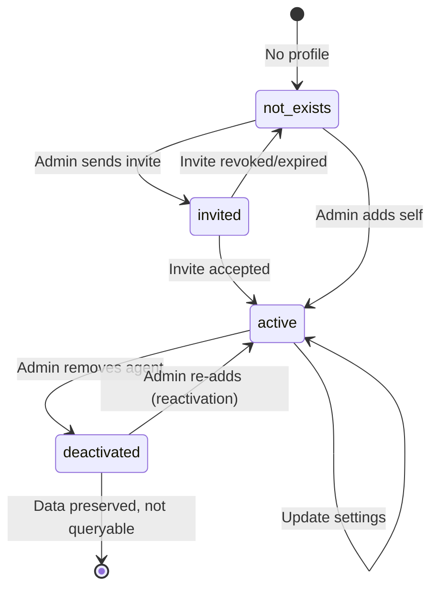

# Feature: Agent API (API1)

## Quick Summary
The Agent API provides operations for managing agent lifecycle including listing, creating (via invites or self-add), updating, and soft-deleting agents. It's a hybrid architecture using direct Supabase client calls for most operations combined with REST API endpoints for billing-integrated actions like remove and invites.

## Affected Users
- [ ] Website Visitor
- [x] Agent
- [x] Admin
- [x] Platform Admin

---

## 1. WHAT IT DOES

### Purpose
The Agent API enables admins to manage their agent team: add new agents (via invite or self-add), update agent settings (display name, pool assignments, video URLs), and remove agents while preserving call history. It integrates with the billing system to manage seat allocation.

### User Goals
| User Type | What They Want | How This Feature Helps |
|-----------|---------------|----------------------|
| Admin | Add team members to take calls | Send invites or add themselves as an agent |
| Admin | Organize agents into pools | Pool assignment APIs allow flexible routing |
| Admin | Remove agents who left | Soft delete preserves history, credits seat |
| Admin | Update agent display names | Direct update via Supabase |
| Agent | Join an organization | Accept invite flow creates agent profile |

---

## 2. HOW IT WORKS

### High-Level Flow (Happy Path)

**List Agents:**
1. Admin navigates to `/admin/agents`
2. Server component queries Supabase for active agents
3. Agents displayed with stats, pool memberships, status

**Create Agent (Invite):**
1. Admin fills invite form (email, name, role)
2. POST `/api/invites/send` creates invite, adds billing seat
3. Email sent with invite link
4. Invitee accepts, creates auth user + agent profile
5. Agent appears in team list

**Create Agent (Self-Add):**
1. Admin clicks "Add Myself"
2. Client calls `/api/billing/seats` to add seat
3. Client creates agent_profile via Supabase
4. Client adds agent to catch-all pool
5. Admin now appears as agent

**Remove Agent:**
1. Admin clicks remove on agent
2. POST `/api/agents/remove` with agentProfileId
3. Server soft deletes (is_active = false)
4. Server removes from all pools
5. Server credits seat back

### State Machine



### State Definitions
| State | Description | How to Enter | How to Exit |
|-------|-------------|--------------|-------------|
| `not_exists` | No agent profile for user | Initial state | Invite sent or self-add |
| `invited` | Pending invite exists | Admin sends invite | Accept invite, revoke, or expire |
| `active` | Agent profile with `is_active=true` | Invite accepted or self-add | Admin removes agent |
| `deactivated` | Agent profile with `is_active=false` | Admin removes | Admin re-adds same user |

---

## 3. DETAILED LOGIC

### Triggers & Events
| Event/Trigger | Where It Fires | What It Does | Side Effects |
|--------------|---------------|--------------|--------------|
| Send Invite | `/api/invites/send` | Creates invite record, adds billing seat | Email sent, pending invite count updated |
| Accept Invite | `/accept-invite` page | Creates auth user, user record, agent profile | Billing seat consumed |
| Revoke Invite | `/api/invites/revoke` | Deletes invite record | Seat credited back |
| Add Self | `agents-client.tsx` | Creates/reactivates agent profile | Billing seat added, pool membership created |
| Remove Agent | `/api/agents/remove` | Soft deletes agent, removes pool memberships | Seat credited back, call logs preserved |
| Update Name | `agents-client.tsx` | Updates display_name in agent_profiles | Immediate UI update |
| Add to Pool | `agents-client.tsx` | Creates agent_pool_members record | Agent routable to pool's traffic |
| Remove from Pool | `agents-client.tsx` | Deletes agent_pool_members record | Agent no longer routed for pool |

### Key Functions/Components
| Function/Component | File | Purpose |
|-------------------|------|---------|
| `AgentsPage` (Server) | `apps/dashboard/src/app/(app)/admin/agents/page.tsx` | Fetch agents, pools, stats, billing info |
| `AgentsClient` | `apps/dashboard/src/app/(app)/admin/agents/agents-client.tsx` | UI + client-side CRUD operations |
| `handleAddMyself` | `agents-client.tsx:199-361` | Self-add flow with billing integration |
| `handleConfirmInvite` | `agents-client.tsx:370-437` | Confirm and send invite |
| `handleRemoveAgent` | `agents-client.tsx:467-515` | Trigger soft delete |
| `handleRevokeInvite` | `agents-client.tsx:441-463` | Cancel pending invite |
| `handleAddToPool` | `agents-client.tsx:549-575` | Add agent to pool |
| `handleRemoveFromPool` | `agents-client.tsx:578-600` | Remove agent from pool |
| `handleSaveName` | `agents-client.tsx:615-642` | Update agent display name |
| POST `/api/agents/remove` | `apps/dashboard/src/app/api/agents/remove/route.ts` | Server-side soft delete + billing |
| POST `/api/invites/send` | `apps/dashboard/src/app/api/invites/send/route.ts` | Create invite + send email + billing |
| POST `/api/invites/revoke` | `apps/dashboard/src/app/api/invites/revoke/route.ts` | Delete invite + credit seat |
| POST `/api/billing/seats` | `apps/dashboard/src/app/api/billing/seats/route.ts` | Add/remove billing seats |
| `AcceptInviteContent` | `apps/dashboard/src/app/accept-invite/page.tsx` | Handle invite acceptance |

### Data Flow

```
ADMIN SENDS INVITE
    │
    ├─► Client: POST /api/invites/send
    │   └─► Body: { email, fullName, role }
    │
    ├─► Server: Verify admin role
    │   ├─► supabase.from("users").select("role, organization_id")
    │   └─► Check profile.role === "admin"
    │
    ├─► Server: Check for duplicates
    │   ├─► supabase.from("users").select().eq("email", email)
    │   └─► supabase.from("invites").select().eq("email", email).is("accepted_at", null)
    │
    ├─► Server: Create invite record
    │   └─► supabase.from("invites").insert({ email, full_name, role, token, ... })
    │
    ├─► Server: Add billing seat (if role === "agent")
    │   └─► fetch("/api/billing/seats", { action: "add", quantity: 1 })
    │
    ├─► Server: Send email via Resend
    │   └─► resend.emails.send({ to: email, html: inviteTemplate })
    │
    └─► Response: { success: true, invite: { id, email } }


INVITEE ACCEPTS INVITE
    │
    ├─► Client: Load /accept-invite?token=xxx
    │
    ├─► Client: Fetch invite details
    │   └─► supabase.from("invites").select("*, organization:organizations(name)")
    │       .eq("token", token).is("accepted_at", null)
    │
    ├─► User fills form (name, password)
    │
    ├─► Client: Create auth user
    │   └─► supabase.auth.signUp({ email, password, options: { data: { full_name } } })
    │
    ├─► Client: Create user record
    │   └─► supabase.from("users").insert({ id, organization_id, email, full_name, role })
    │
    ├─► Client: Create agent profile (if role=agent OR admin chose to take calls)
    │   ├─► If admin + willTakeCalls: POST /api/billing/seats { action: "add" }
    │   └─► supabase.from("agent_profiles").insert({ user_id, organization_id, display_name, is_active: true })
    │
    ├─► Client: Mark invite accepted
    │   └─► supabase.from("invites").update({ accepted_at: now }).eq("id", invite.id)
    │
    └─► Redirect to /admin


ADMIN REMOVES AGENT
    │
    ├─► Client: POST /api/agents/remove
    │   └─► Body: { agentProfileId }
    │
    ├─► Server: Verify admin + org
    │   └─► supabase.from("users").select("role, organization_id")
    │
    ├─► Server: Verify agent exists + belongs to org
    │   └─► supabase.from("agent_profiles")
    │       .select("id, user_id, organization_id, is_active")
    │       .eq("id", agentProfileId)
    │       .eq("organization_id", profile.organization_id)
    │
    ├─► Server: Check not already deactivated
    │   └─► if (!agent.is_active) → 400 "Already deactivated"
    │
    ├─► Server: Soft delete
    │   └─► supabase.from("agent_profiles").update({
    │       is_active: false,
    │       deactivated_at: now,
    │       deactivated_by: user.id,
    │       status: "offline"
    │   })
    │
    ├─► Server: Remove from all pools
    │   └─► supabase.from("agent_pool_members").delete().eq("agent_profile_id", agentProfileId)
    │
    ├─► Server: Credit billing seat
    │   └─► fetch("/api/billing/seats", { action: "remove", quantity: 1 })
    │
    └─► Response: { success: true }


ADMIN ADDS SELF AS AGENT
    │
    ├─► Client: Check for existing profile
    │   └─► supabase.from("agent_profiles")
    │       .select("id, display_name, is_active")
    │       .eq("user_id", currentUserId)
    │       .eq("organization_id", organizationId)
    │
    ├─► Client: Add billing seat (if new or reactivating)
    │   └─► POST /api/billing/seats { action: "add", quantity: 1 }
    │
    ├─► Client: Create or reactivate profile
    │   ├─► If exists + inactive: update { is_active: true, deactivated_at: null }
    │   └─► If not exists: insert { user_id, organization_id, display_name, is_active: true }
    │
    ├─► Client: Add to catch-all pool
    │   └─► supabase.from("agent_pool_members")
    │       .insert({ agent_profile_id, pool_id: catchAllPool.id })
    │
    └─► Update local state: agents list, billing info, isCurrentUserAgent flag
```

---

## 4. EDGE CASES

### Complete Scenario Matrix
| # | Scenario | Trigger | Current Behavior | Correct? | Notes |
|---|----------|---------|------------------|----------|-------|
| 1 | Happy path invite | Normal flow | Invite created, email sent, seat added | ✅ | |
| 2 | Happy path self-add | Click "Add Myself" | Profile created, seat added, pool assigned | ✅ | |
| 3 | Happy path remove | Click remove | Soft delete, pools cleared, seat credited | ✅ | |
| 4 | Create agent at seat limit | Invite with 0 available seats | Expands billing, creates invite | ✅ | Pre-paid model auto-expands |
| 5 | Create agent when user already exists | Invite existing user | Returns 400 "User already exists" | ✅ | |
| 6 | Create agent when invite exists | Invite same email twice | Returns 400 "Invite already sent" | ✅ | |
| 7 | Delete agent with active calls | Remove while in_call | Soft delete proceeds, call_logs preserved | ✅ | FK uses SET NULL |
| 8 | Update agent currently in call | Change name during call | Name updates immediately | ✅ | No call disruption |
| 9 | List agents with no results | New org, no agents | Empty list displayed | ✅ | |
| 10 | Invalid agent ID format | Random UUID to remove | Returns 404 "Agent not found" | ✅ | |
| 11 | Unauthorized API access | No auth cookie | Returns 401 "Unauthorized" | ✅ | |
| 12 | Agent role tries to remove | Non-admin calls remove | Returns 403 "Admin access required" | ✅ | |
| 13 | Remove already deactivated | Double-remove | Returns 400 "Already deactivated" | ✅ | |
| 14 | Self-add when already agent | Admin who is agent clicks add | No-op, button hidden | ✅ | `isCurrentUserAgent` check |
| 15 | Invite expired token | Accept 8+ day old invite | Returns "Invalid or expired" | ✅ | |
| 16 | Admin invite, no calls | Admin accepts, doesn't take calls | No agent profile created, no seat | ✅ | |
| 17 | Admin invite, will take calls | Admin accepts, chooses calls | Agent profile created, seat added | ✅ | |
| 18 | Re-add deactivated agent | Admin adds self after removal | Reactivates existing profile | ✅ | Preserves original data |
| 19 | Revoke pending invite | Cancel before accepted | Invite deleted, seat credited | ✅ | |
| 20 | Remove agent from org you don't own | Cross-org attack | Returns 404 "Agent not found" | ✅ | Org scoping in query |
| 21 | Concurrent invite + revoke | Race condition | Last operation wins | ⚠️ | No explicit locking |
| 22 | Email send failure | Resend API down | Invite created, email not sent | ⚠️ | Silent failure, URL logged in dev |

### Error States
| Error | When It Happens | What User Sees | Recovery Path |
|-------|-----------------|----------------|---------------|
| Unauthorized (401) | No valid session | "Unauthorized" | Log in again |
| Admin access required (403) | Non-admin calls admin API | "Admin access required" | Contact admin |
| User already exists (400) | Invite existing user | "User already exists in org" | Check team list |
| Invite already sent (400) | Duplicate invite | "Invite already sent" | Revoke old invite first |
| Agent not found (404) | Invalid or cross-org agent ID | "Agent not found" | Check correct agent |
| Already deactivated (400) | Remove inactive agent | "Agent already deactivated" | Agent already gone |
| Failed to create invite (500) | DB error | "Failed to create invite" | Retry, check logs |
| Failed to remove agent (500) | DB update error | "Failed to remove agent" | Retry, check logs |
| Failed to add billing seat (400) | Stripe error | "Failed to add billing seat" | Check payment method |

---

## 5. UI/UX REVIEW

### User Experience Audit

**Invite Flow:**
| Step | User Action | System Response | Clear? | Issues |
|------|------------|-----------------|--------|--------|
| 1 | Click "Add Agent" | Modal opens with options | ✅ | |
| 2 | Choose "Invite Someone" | Shows email/name/role form | ✅ | |
| 3 | Fill form, click Continue | Shows cost confirmation | ✅ | Clear billing impact |
| 4 | Confirm invite | Invite sent, success toast | ✅ | |
| 5 | View pending | Pending invites shown below agents | ✅ | |

**Self-Add Flow:**
| Step | User Action | System Response | Clear? | Issues |
|------|------------|-----------------|--------|--------|
| 1 | Click "Add Myself" | Button shows loading | ✅ | |
| 2 | Auto-complete | Success message, added to list | ✅ | Fast, single click |

**Remove Flow:**
| Step | User Action | System Response | Clear? | Issues |
|------|------------|-----------------|--------|--------|
| 1 | Click remove on agent card | Confirmation modal appears | ✅ | |
| 2 | Review consequences | Shows history preserved, seat freed | ✅ | |
| 3 | Confirm removal | Agent removed from list | ✅ | |

### Accessibility
- Keyboard navigation: ✅ All buttons accessible via tab
- Screen reader support: ⚠️ Not verified
- Color contrast: ✅ Uses design system tokens
- Loading states: ✅ Loader2 spinners on all async operations
- Error messages: ✅ Red error banners with clear text

---

## 6. TECHNICAL CONCERNS

### Performance
| Concern | Implementation | Status |
|---------|----------------|--------|
| Agent list query | Server-side fetch with joins | ✅ Single query with includes |
| Stats aggregation | Computed on page load | ⚠️ Could be slow with large call_logs |
| Pool membership updates | Single Supabase calls | ✅ Fast |
| Billing API calls | Internal fetch, not external | ✅ Low latency |

### Security
| Concern | Mitigation |
|---------|------------|
| Cross-org access | All queries scoped by organization_id |
| Admin-only operations | Role check on all API routes |
| Auth bypass | Supabase auth.getUser() validates JWT |
| Token guessing | UUID v4 tokens are cryptographically random |
| Invite expiration | 7-day expiry enforced in queries |
| Soft delete integrity | deactivated_by tracks who removed |

### Reliability
| Concern | Mitigation |
|---------|------------|
| Billing sync failure | Invite deleted on seat add failure (rollback) |
| Email send failure | Non-blocking, invite still created |
| Concurrent modifications | Supabase handles via MVCC |
| Foreign key integrity | CASCADE/SET NULL properly configured |
| Data preservation | Soft delete keeps agent data, SET NULL on call_logs |

---

## 7. FIRST PRINCIPLES REVIEW

### Does This Make Sense?

1. **Is the mental model clear?** ✅ Yes - Add agents via invite or self, remove via soft delete
2. **Is the control intuitive?** ✅ Yes - Single "Add Agent" button with clear options
3. **Is feedback immediate?** ✅ Yes - Loading states, success messages, instant list updates
4. **Is the flow reversible?** ✅ Yes - Removed agents can be re-added (reactivation)
5. **Are errors recoverable?** ✅ Yes - Clear error messages, retry possible
6. **Is the complexity justified?** ⚠️ Hybrid architecture (REST + direct Supabase) adds complexity but integrates billing correctly

### Identified Issues
| Issue | Impact | Severity | Suggested Fix |
|-------|--------|----------|--------------|
| No dedicated list/get/update REST endpoints | All CRUD except delete via client Supabase | 🟢 Low | Works, just unconventional |
| Email failure silent | User thinks invite sent but email fails | 🟡 Medium | Show warning if email fails |
| No concurrent invite protection | Rare race condition possible | 🟢 Low | Add unique constraint on email+org+pending |
| Stats query on page load | Could slow with history | 🟡 Medium | Move to async/background fetch |

---

## 8. CODE REFERENCES

| Purpose | File | Lines | Notes |
|---------|------|-------|-------|
| Agent list server fetch | `apps/dashboard/src/app/(app)/admin/agents/page.tsx` | 38-66 | Supabase query with joins |
| Agent client CRUD | `apps/dashboard/src/app/(app)/admin/agents/agents-client.tsx` | 1-1200 | Main UI + all client operations |
| Self-add logic | `apps/dashboard/src/app/(app)/admin/agents/agents-client.tsx` | 199-361 | handleAddMyself function |
| Invite confirmation | `apps/dashboard/src/app/(app)/admin/agents/agents-client.tsx` | 370-437 | handleConfirmInvite function |
| Remove agent UI | `apps/dashboard/src/app/(app)/admin/agents/agents-client.tsx` | 467-515 | handleRemoveAgent function |
| Pool management | `apps/dashboard/src/app/(app)/admin/agents/agents-client.tsx` | 549-600 | handleAddToPool/handleRemoveFromPool |
| Name update | `apps/dashboard/src/app/(app)/admin/agents/agents-client.tsx` | 615-642 | handleSaveName function |
| Remove API endpoint | `apps/dashboard/src/app/api/agents/remove/route.ts` | 1-81 | POST handler for soft delete |
| Send invite API | `apps/dashboard/src/app/api/invites/send/route.ts` | 1-181 | POST handler with email |
| Revoke invite API | `apps/dashboard/src/app/api/invites/revoke/route.ts` | 1-71 | POST handler for delete |
| Billing seats API | `apps/dashboard/src/app/api/billing/seats/route.ts` | 1-118 | Seat add/remove with Stripe |
| Accept invite page | `apps/dashboard/src/app/accept-invite/page.tsx` | 1-376 | Full invite acceptance flow |
| Agent profiles schema | `supabase/migrations/20251125200000_initial_schema.sql` | 77-95 | Base table definition |
| Soft delete columns | `supabase/migrations/20251127800000_soft_delete_and_billing.sql` | 14-27 | is_active, deactivated_at |
| Pool members schema | `supabase/migrations/20251126005000_create_agent_pools.sql` | 23-32 | agent_pool_members table |

---

## 9. RELATED FEATURES
- [Agent Assignment (P2)](../platform/agent-assignment.md) - How agents are assigned to visitors
- [Bullpen States (A1)](../agent/bullpen-states.md) - Agent status management
- [Pool Management (D1)](../admin/pool-management.md) - Creating and configuring pools
- [Tiered Routing (D3)](../admin/tiered-routing.md) - Priority-based agent selection within pools
- [Billing API (API2)](./billing-api.md) - Seat billing integration
- [Invites API (API3)](./invites-api.md) - Detailed invite handling (separate doc)

---

## 10. OPEN QUESTIONS

1. **Should there be dedicated REST endpoints for list/get/update?** - Currently uses direct Supabase calls from client, which works but is unconventional for an "API" layer.

2. **What happens if Stripe is down during invite?** - The invite record is created then rolled back on billing failure, but should there be a retry mechanism?

3. **Should deactivated agents be visible to admins?** - Currently they're fully hidden. Some admins might want to see historical team members.

4. **Is 7-day invite expiry the right duration?** - Hardcoded. Should this be configurable per-organization?

5. **Should email failures block the invite?** - Currently silent failure. Trade-off between reliability (always create invite) vs UX (user thinks email sent).

