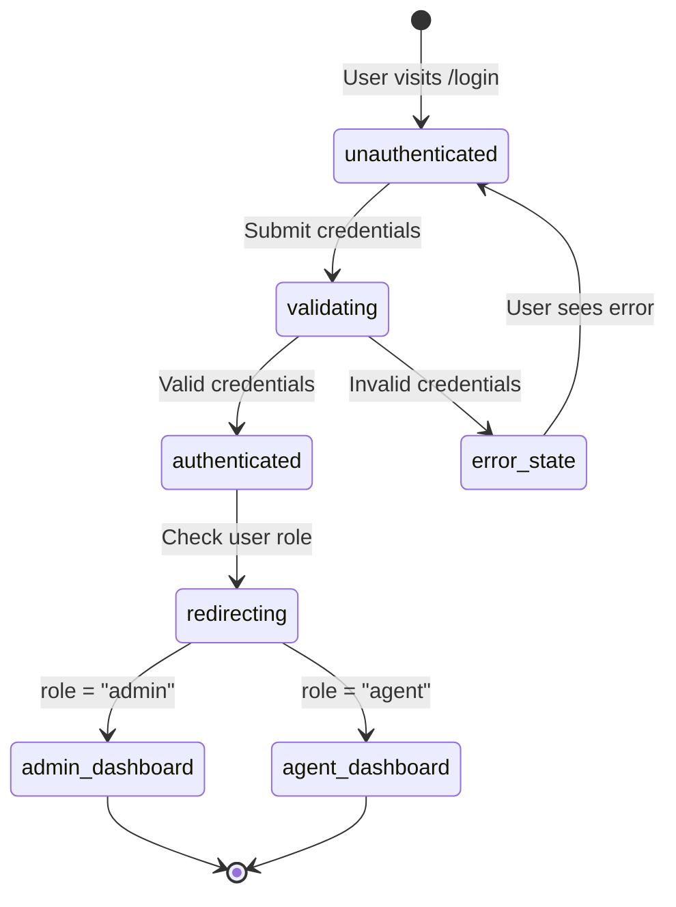
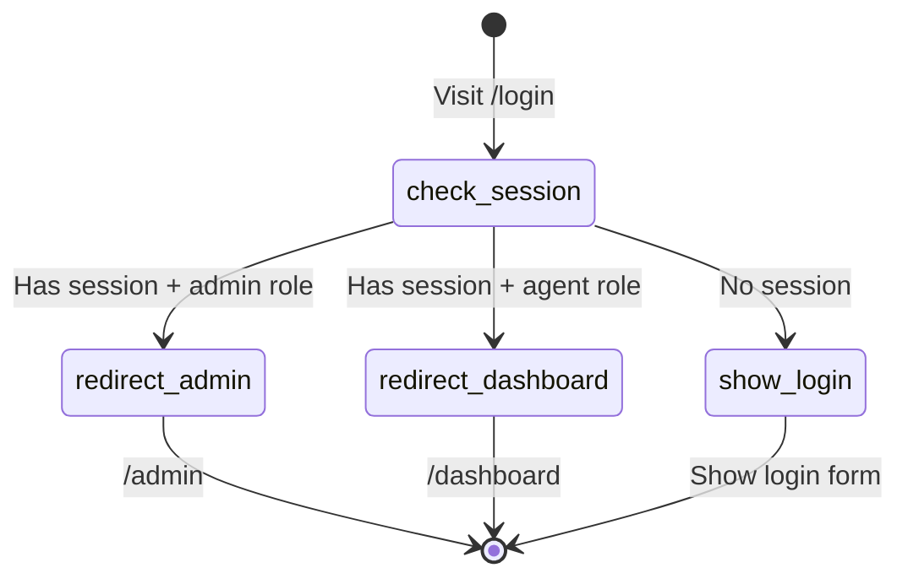

# Feature: Login Flow (AUTH2)

## Quick Summary
Email/password login using Supabase authentication, including form validation, session creation via cookies, role-based redirect handling (admin vs agent), and failed login attempt handling.

## Affected Users
- [ ] Website Visitor
- [x] Agent
- [x] Admin
- [x] Platform Admin

---

## 1. WHAT IT DOES

### Purpose
Provides secure authentication for agents and admins to access the dashboard. Validates credentials against Supabase Auth, creates a session stored in HTTP-only cookies, and redirects users to appropriate dashboards based on their role (admin → `/admin`, agent → `/dashboard`).

### User Goals
| User Type | What They Want | How This Feature Helps |
|-----------|---------------|----------------------|
| Agent | Access to bullpen/call management | Validates credentials and redirects to `/dashboard` |
| Admin | Access to admin settings and agent management | Validates credentials and redirects to `/admin` |
| Platform Admin | Access to platform-wide settings | Validates credentials, checks `is_platform_admin` flag, redirects to `/platform` |
| Returning User | Quick re-login | Session persists in cookies, auto-redirects if already authenticated |

---

## 2. HOW IT WORKS

### High-Level Flow (Happy Path)
1. User navigates to `/login`
2. If already authenticated, middleware redirects to appropriate dashboard
3. User enters email and password
4. User clicks "Sign in" button
5. Client calls Supabase `signInWithPassword`
6. Supabase validates credentials and returns session
7. Client queries `users` table for user's role
8. Client redirects to `/admin` (if admin) or `/dashboard` (if agent)
9. Middleware sets session cookies for subsequent requests

### State Machine



### Already Authenticated Flow



### State Definitions
| State | Description | How to Enter | How to Exit |
|-------|-------------|--------------|-------------|
| `unauthenticated` | User on login page without session | Navigate to `/login`, sign out | Submit valid credentials |
| `validating` | Credentials being verified | Submit login form | Validation complete |
| `authenticated` | Credentials valid, session created | Successful `signInWithPassword` | Role check complete |
| `error_state` | Login failed | Invalid credentials | Retry login |
| `redirecting` | Checking role for destination | Authentication successful | Redirect complete |

---

## 3. DETAILED LOGIC

### Triggers & Events
| Event/Trigger | Where It Fires | What It Does | Side Effects |
|--------------|---------------|--------------|--------------|
| Form submit | `page.tsx` | Calls `signInWithPassword` | Sets loading state |
| `signInWithPassword` success | Supabase Auth | Returns session + user | Sets auth cookies |
| Role query | `page.tsx` | Queries `users` table for role | None |
| `window.location.href` | `page.tsx` | Hard redirect to dashboard | Clears React state |
| Middleware check | `middleware.ts` | Validates session on protected routes | Refreshes session cookies |
| Auth state change | `useAuth` hook | Updates client state | Re-renders components |

### Key Functions/Components
| Function/Component | File | Purpose |
|-------------------|------|---------|
| `LoginPage` | `apps/dashboard/src/app/(auth)/login/page.tsx` | Login form UI and submission logic |
| `handleSubmit` | `apps/dashboard/src/app/(auth)/login/page.tsx` | Form submission handler |
| `signIn` (server action) | `apps/dashboard/src/lib/auth/actions.ts` | Server-side sign-in (alternative to client-side) |
| `updateSession` | `apps/dashboard/src/lib/supabase/middleware.ts` | Middleware session refresh |
| `createClient` (browser) | `apps/dashboard/src/lib/supabase/client.ts` | Browser Supabase client |
| `createClient` (server) | `apps/dashboard/src/lib/supabase/server.ts` | Server Supabase client |
| `useAuth` | `apps/dashboard/src/lib/auth/hooks.ts` | Client-side auth state hook |
| `getCurrentUser` | `apps/dashboard/src/lib/auth/actions.ts` | Server-side user data fetch |

### Data Flow

```
USER SUBMITS LOGIN FORM
    │
    ├─► Client: setIsLoading(true), setError(null)
    │
    ├─► Client: supabase.auth.signInWithPassword({ email, password })
    │
    ├─► Supabase Auth API
    │   ├─► Validates email/password against auth.users table
    │   ├─► On success: Returns { data: { user, session }, error: null }
    │   └─► On failure: Returns { data: null, error: { message: "Invalid login credentials" } }
    │
    ├─► If error:
    │   ├─► setError(error.message)
    │   ├─► setIsLoading(false)
    │   └─► STOP (show error to user)
    │
    ├─► Client: Query users table for role
    │   └─► supabase.from("users").select("role").eq("id", user.id).single()
    │
    ├─► Determine redirect destination
    │   ├─► profile.role === "admin" → "/admin"
    │   └─► profile.role === "agent" → "/dashboard"
    │
    └─► window.location.href = redirectUrl
        └─► Hard redirect ensures cookies sent with request

MIDDLEWARE ON PROTECTED ROUTES
    │
    ├─► updateSession(request)
    │   ├─► Read cookies from request
    │   ├─► Create Supabase server client
    │   └─► supabase.auth.getUser() ← Validates/refreshes session
    │
    ├─► If protected path (/dashboard, /admin, /settings, /platform):
    │   └─► No user? Return (incomplete redirect logic - see issues)
    │
    └─► If auth path (/login, /signup) + user exists:
        ├─► Query user role
        └─► Redirect to /admin or /dashboard
```

---

## 4. EDGE CASES

### Complete Scenario Matrix
| # | Scenario | Trigger | Current Behavior | Correct? | Notes |
|---|----------|---------|------------------|----------|-------|
| 1 | Happy path login | Valid credentials | Redirects to appropriate dashboard | ✅ | |
| 2 | Invalid password | Wrong password | Shows "Invalid login credentials" | ✅ | Generic message for security |
| 3 | Non-existent email | Unknown email | Shows "Invalid login credentials" | ✅ | Same as wrong password (security) |
| 4 | Empty email field | Submit without email | Browser validation blocks | ✅ | HTML5 `required` attribute |
| 5 | Empty password field | Submit without password | Browser validation blocks | ✅ | HTML5 `required` attribute |
| 6 | Invalid email format | "notanemail" | Browser validation blocks | ✅ | HTML5 `type="email"` |
| 7 | Already logged in | Visit `/login` | Middleware redirects to dashboard | ✅ | |
| 8 | Admin visits login | Visit `/login` while admin | Redirects to `/admin` | ✅ | |
| 9 | Agent visits login | Visit `/login` while agent | Redirects to `/dashboard` | ✅ | |
| 10 | Session expired | Access protected route | Shows login page | ⚠️ | Middleware redirect incomplete |
| 11 | Login with unverified email | Unconfirmed signup | Supabase handles - depends on config | ⚠️ | May allow or block based on Supabase settings |
| 12 | Login with deactivated agent | `is_active: false` | Login succeeds, but features limited | ⚠️ | No explicit check at login |
| 13 | Network error during login | Connection lost | Supabase error displayed | ✅ | |
| 14 | Server error (500) | Server issue | Error displayed | ✅ | |
| 15 | Special characters in password | `P@ss!#$%` | Works correctly | ✅ | |
| 16 | Very long password | 1000+ chars | Supabase handles | ✅ | |
| 17 | SQL injection attempt | `' OR '1'='1` | Supabase parameterizes queries | ✅ | |
| 18 | XSS in email field | `<script>` | Sanitized/escaped | ✅ | |
| 19 | Rapid login attempts | Spam click | No client-side rate limit | ⚠️ | Server has rate limits (socket), not login |
| 20 | User with no profile row | Auth exists, no users row | Returns null, redirects fail | ⚠️ | May cause issues |
| 21 | Platform admin login | `is_platform_admin: true` | Redirects to /admin (not /platform) | ⚠️ | Platform check happens in layout |
| 22 | Login from new device | Different browser | Works (no device tracking) | ✅ | |
| 23 | Concurrent sessions | Multiple tabs/devices | All sessions valid | ✅ | Supabase allows multiple |

### Error States
| Error | When It Happens | What User Sees | Recovery Path |
|-------|-----------------|----------------|---------------|
| Invalid login credentials | Wrong email or password | Red banner: "Invalid login credentials" | Re-enter correct credentials |
| Network error | No internet | Supabase error message | Check connection, retry |
| Email not confirmed | Signup without confirmation | "Email not confirmed" (if enabled) | Check email for verification link |
| Auth callback error | OAuth code exchange fails | Redirect to `/login?error=auth_callback_error` | Try login again |

---

## 5. UI/UX REVIEW

### User Experience Audit
| Step | User Action | System Response | Clear? | Issues |
|------|------------|-----------------|--------|--------|
| 1 | Navigate to /login | Login form displayed | ✅ | Beautiful glass-effect card |
| 2 | Enter email | Input focused with icon | ✅ | Clear placeholder |
| 3 | Enter password | Masked input with icon | ✅ | |
| 4 | Click "Sign in" | Loading spinner + "Signing in..." | ✅ | Button disabled during load |
| 5 | Success | Redirect to dashboard | ✅ | Hard redirect (flash) |
| 6 | Error | Red error banner | ✅ | Clear error message |
| 7 | Click "Forgot password?" | Navigate to reset page | ✅ | Link visible near password |
| 8 | Click "Sign up" | Navigate to signup | ✅ | Link at bottom |

### Visual Design
- **Background:** Gradient with blur effects (purple/primary)
- **Card:** Glass-morphism effect (`glass` class)
- **Icons:** Email (Mail), Password (Lock) icons from Lucide
- **Loading:** Animated spinner (Loader2)
- **Error:** Destructive color banner

### Accessibility
- Keyboard navigation: ✅ Tab through form fields works
- Screen reader support: ⚠️ Labels present but not explicitly associated
- Color contrast: ✅ Good contrast in dark theme
- Loading states: ✅ Button text changes, spinner shown
- Focus indicators: ✅ Ring on focus

---

## 6. TECHNICAL CONCERNS

### Performance
| Concern | Implementation | Status |
|---------|----------------|--------|
| Form submit speed | Direct Supabase call, no server action | ✅ Fast |
| Redirect latency | Hard redirect vs client navigation | ⚠️ Page flash |
| Cookie size | Supabase manages session token | ✅ Optimized |

### Security
| Concern | Mitigation |
|---------|------------|
| Credential exposure | HTTPS only, no logging passwords |
| Session hijacking | HTTP-only cookies, SameSite=Lax |
| Brute force | Supabase rate limiting (server-side) |
| CSRF | Supabase cookie-based auth |
| Password in URL | POST body only, not in URL |
| Generic error messages | "Invalid login credentials" for both wrong email/password |

### Reliability
| Concern | Mitigation |
|---------|------------|
| Supabase outage | No local fallback, user sees error |
| Cookie blocked | Login fails, user needs cookies enabled |
| JavaScript disabled | Form won't work (client-side only) |

---

## 7. FIRST PRINCIPLES REVIEW

### Does This Make Sense?
1. **Is the mental model clear?** ✅ Yes - Standard email/password login
2. **Is the control intuitive?** ✅ Yes - Single form, clear button
3. **Is feedback immediate?** ✅ Yes - Loading state, instant error display
4. **Is the flow reversible?** N/A - Login is a one-way action
5. **Are errors recoverable?** ✅ Yes - Can retry immediately
6. **Is the complexity justified?** ✅ Yes - Minimal complexity for auth

### Identified Issues
| Issue | Impact | Severity | Suggested Fix |
|-------|--------|----------|--------------|
| No client-side rate limiting | Spam attacks possible | 🟡 Medium | Add debounce or attempt counter |
| Deactivated agents can login | Confusing UX | 🟢 Low | Check `is_active` after login |
| Middleware redirect incomplete | Security gap | 🔴 High | Complete the `if (!user)` block |
| Hard redirect causes flash | UX polish | 🟢 Low | Use Next.js router after session set |
| No "Remember me" option | User convenience | 🟢 Low | Supabase handles session duration |
| No login attempt logging | Security audit gap | 🟡 Medium | Log failed attempts |

---

## 8. CODE REFERENCES

| Purpose | File | Lines | Notes |
|---------|------|-------|-------|
| Login page component | `apps/dashboard/src/app/(auth)/login/page.tsx` | 1-155 | Main login form |
| Form submission handler | `apps/dashboard/src/app/(auth)/login/page.tsx` | 16-55 | `handleSubmit` function |
| Server sign-in action | `apps/dashboard/src/lib/auth/actions.ts` | 32-56 | Alternative server action |
| Middleware session handling | `apps/dashboard/src/lib/supabase/middleware.ts` | 1-79 | Session refresh + protection |
| Main middleware entry | `apps/dashboard/middleware.ts` | 1-21 | Route matching config |
| Browser Supabase client | `apps/dashboard/src/lib/supabase/client.ts` | 1-10 | Client-side auth |
| Server Supabase client | `apps/dashboard/src/lib/supabase/server.ts` | 1-34 | Server-side auth with cookies |
| Auth hooks | `apps/dashboard/src/lib/auth/hooks.ts` | 1-131 | `useAuth` hook |
| Get current user | `apps/dashboard/src/lib/auth/actions.ts` | 64-106 | Server-side user data |
| Auth callback (OAuth) | `apps/dashboard/src/app/auth/callback/route.ts` | 1-35 | Code exchange |
| Dashboard layout guard | `apps/dashboard/src/app/(app)/dashboard/layout.tsx` | 1-27 | Redirect if not authenticated |
| Admin layout guard | `apps/dashboard/src/app/(app)/admin/layout.tsx` | 1-31 | Redirect if not admin |
| Database user type | `packages/domain/src/database.types.ts` | 226-241 | User table schema |
| User role type | `packages/domain/src/database.types.ts` | 7 | `"admin" | "agent"` |

---

## 9. RELATED FEATURES
- [AUTH1 - Signup Flow](./signup-flow.md) - User registration (creates auth.users + users row)
- [AUTH3 - Invite Accept](./invite-accept.md) - Invited users accept and set password
- [AUTH4 - Password Reset](./password-reset.md) - Forgot password flow
- [A1 - Bullpen States](../agent/bullpen-states.md) - Agent status after login

---

## 10. OPEN QUESTIONS

1. **Why is the middleware redirect incomplete?** Line 56-57 of `middleware.ts` has `if (isProtectedPath && !user) { return }` but no redirect. Is this intentional or a bug?

2. **Should deactivated agents be blocked at login?** Currently `is_active: false` agents can log in but have limited features. Should login fail entirely?

3. **What's the session duration?** Supabase default is 1 hour with refresh tokens. Is this documented anywhere for users?

4. **Should failed login attempts be logged?** For security auditing, should we track failed attempts per email?

5. **Is email verification required?** The current flow appears to allow login without email verification. Is this intended?

6. **Should there be a "Remember me" checkbox?** Currently no option to extend session duration.

7. **Platform admin redirect:** Platform admins redirect to `/admin`, then must navigate to `/platform`. Should they redirect directly to `/platform`?


