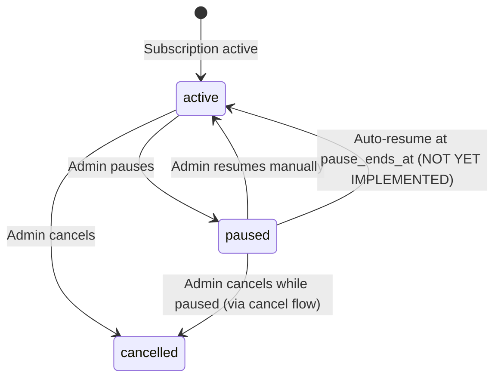

# Feature: Pause Subscription (B4)

## Quick Summary
Temporary subscription pause allowing admins to freeze their account for 1-3 months while preserving all data, settings, and configurations. Presented as a downsell option before cancellation to reduce churn.

## Affected Users
- [ ] Website Visitor
- [ ] Agent
- [x] Admin
- [ ] Platform Admin

---

## 1. WHAT IT DOES

### Purpose
The Pause Subscription feature provides a churn-reduction mechanism by offering admins a free "take a break" option instead of cancelling. It allows organizations to temporarily suspend service without losing any data, making it easier to return when ready.

### User Goals
| User Type | What They Want | How This Feature Helps |
|-----------|---------------|----------------------|
| Admin | Take a temporary break without losing data | Free pause for 1-3 months with full data preservation |
| Admin | Avoid paying during slow periods | No billing during pause period |
| Admin | Easily restart when ready | One-click resume button available |
| Business | Reduce churn | Downsell option keeps customer in ecosystem |

---

## 2. HOW IT WORKS

### High-Level Flow (Happy Path)
1. Admin clicks "Cancel Subscription" on Billing Settings page
2. Pause Account Modal appears as downsell offer
3. Admin selects pause duration (1, 2, or 3 months)
4. Admin optionally provides reason for pausing
5. Admin clicks "Pause for X Month(s)"
6. System updates organization to paused status
7. System records pause event in pause_history table
8. Success confirmation shown with resume date
9. Billing page shows paused banner with resume button

### State Machine



### State Definitions
| State | Description | How to Enter | How to Exit |
|-------|-------------|--------------|-------------|
| `active` | Normal active subscription | Initial state, manual resume, auto-resume | Pause, cancel |
| `paused` | Subscription temporarily frozen | Admin selects pause | Manual resume, auto-resume, cancel |
| `cancelled` | Subscription terminated | Admin completes cancellation | N/A (end state) |

---

## 3. DETAILED LOGIC

### Triggers & Events
| Event/Trigger | Where It Fires | What It Does | Side Effects |
|--------------|---------------|--------------|--------------|
| Click "Cancel Subscription" | Billing Settings | Opens Pause Modal as downsell | None |
| Click "Pause for X Months" | Pause Modal | Calls `pauseAccount()` action | DB: updates org, creates history |
| Click "Resume Now" | Paused Banner | Calls `resumeAccount()` action | DB: clears pause fields, creates history |
| Click "No, cancel and delete all my data" | Pause Modal | Opens Cancel Modal | Closes Pause Modal |
| `pause_ends_at` reached | N/A (NOT YET IMPLEMENTED) | Should auto-resume subscription | N/A |

### Key Functions/Components
| Function/Component | File | Purpose |
|-------------------|------|---------|
| `PauseAccountModal` | `apps/dashboard/src/app/(app)/admin/settings/billing/pause-account-modal.tsx` | UI for pause selection and confirmation |
| `pauseAccount()` | `apps/dashboard/src/app/(app)/admin/settings/billing/actions.ts` | Server action to pause organization |
| `resumeAccount()` | `apps/dashboard/src/app/(app)/admin/settings/billing/actions.ts` | Server action to resume organization |
| `BillingSettingsClient` | `apps/dashboard/src/app/(app)/admin/settings/billing/billing-settings-client.tsx` | Main billing page with paused banner |
| `handleStripeWebhook` | `apps/server/src/features/billing/stripe-webhook-handler.ts` | Handles Stripe subscription status changes |
| `formatDateWithTimezone()` | Both modal and billing-settings-client | Formats dates with timezone info for clarity |

### Data Flow

```
ADMIN CLICKS "CANCEL SUBSCRIPTION"
    │
    └─► UI: Opens PauseAccountModal as downsell
    
ADMIN SELECTS PAUSE DURATION
    │
    ├─► UI: selectedMonths state (1, 2, or 3)
    ├─► UI: Calculate resumeDate = now + selectedMonths
    └─► UI: Optional reason textarea

ADMIN CLICKS "PAUSE"
    │
    ├─► Client: handlePause() → setIsSubmitting(true)
    │
    ├─► Server: pauseAccount(params)
    │   ├─► Validate: pauseMonths must be 1, 2, or 3
    │   ├─► Calculate: pausedAt = now, pauseEndsAt = now + months
    │   │
    │   ├─► DB: UPDATE organizations SET
    │   │       subscription_status = 'paused',
    │   │       paused_at = pausedAt,
    │   │       pause_ends_at = pauseEndsAt,
    │   │       pause_months = pauseMonths,
    │   │       pause_reason = reason
    │   │
    │   ├─► DB: INSERT INTO pause_history
    │   │       (organization_id, user_id, action='paused', pause_months, reason)
    │   │
    │   ├─► TODO: Update Stripe subscription (pause_collection: void)
    │   ├─► TODO: Send confirmation email
    │   ├─► TODO: Schedule reminder email 7 days before resume
    │   ├─► TODO: Disable widget on all sites
    │   │
    │   └─► revalidatePath("/admin/settings/billing")
    │
    └─► Client: setIsComplete(true) → Show success screen

ADMIN RESUMES MANUALLY
    │
    ├─► Client: handleResumeAccount() → setIsResuming(true)
    │
    ├─► Server: resumeAccount(params)
    │   ├─► DB: UPDATE organizations SET
    │   │       subscription_status = 'active',
    │   │       paused_at = null,
    │   │       pause_ends_at = null,
    │   │       pause_months = null,
    │   │       pause_reason = null
    │   │
    │   ├─► DB: INSERT INTO pause_history
    │   │       (organization_id, user_id, action='resumed')
    │   │
    │   ├─► TODO: Resume Stripe subscription
    │   ├─► TODO: Send confirmation email
    │   ├─► TODO: Re-enable widgets
    │   │
    │   └─► revalidatePath("/admin/settings/billing")
    │
    └─► Client: Page reloads with active status
```

---

## 4. EDGE CASES

### Complete Scenario Matrix
| # | Scenario | Trigger | Current Behavior | Correct? | Notes |
|---|----------|---------|------------------|----------|-------|
| 1 | Happy path: Pause for 1 month | Admin pauses | Org status=paused, pause_ends_at set | ✅ | Works |
| 2 | Happy path: Pause for 2 months | Admin pauses | Org status=paused, pause_ends_at set | ✅ | Works |
| 3 | Happy path: Pause for 3 months | Admin pauses | Org status=paused, pause_ends_at set | ✅ | Works |
| 4 | Manual resume | Admin clicks Resume | Status returns to active, pause fields cleared | ✅ | Works |
| 5 | Auto-resume at pause_ends_at | Timer expires | **NOT IMPLEMENTED** | ❌ | No cron job or scheduler exists |
| 6 | Pause requested during active call | Admin pauses mid-call | Pause proceeds immediately | ⚠️ | Call may continue until ended; widget behavior unclear |
| 7 | Manual resume before scheduled auto-resume | Admin resumes early | Works correctly | ✅ | Clears all pause fields |
| 8 | Pause during trial period | Admin pauses while trialing | Allowed - no validation against trial | ⚠️ | May cause billing issues |
| 9 | Pause near end of billing cycle | Admin pauses day before renewal | Pause proceeds; Stripe NOT updated | ⚠️ | May still be charged |
| 10 | Payment method expires during pause | Card expires while paused | No impact during pause | ✅ | Issue only at resume if card not updated |
| 11 | Multiple consecutive pause requests | Rapid clicks | Second click proceeds | ⚠️ | No debounce on UI button |
| 12 | Pause with pending billing changes | Pending seat/frequency changes | Pause proceeds independently | ⚠️ | Changes may conflict |
| 13 | Admin loses access during pause | Admin deleted while paused | Org remains paused, no one can resume | ⚠️ | Edge case; needs platform admin intervention |
| 14 | Invalid pause duration | API called with months=4 | Throws "Invalid pause duration" error | ✅ | Validated on server |
| 15 | Cancel while paused | Admin proceeds to cancel | Opens cancel modal from pause modal | ✅ | Flow works |
| 16 | Widget visibility during pause | Visitor loads site | **Widget still shows** - server doesn't check pause status | ❌ | TODO in code comments |
| 17 | Multiple pauses in sequence | Pause → Resume → Pause | Works, all events logged to history | ✅ | No pause limit enforced |
| 18 | Pause with optional reason blank | Admin leaves reason empty | Reason stored as null | ✅ | Works |
| 19 | User in different timezone | Admin views resume date | Date displayed in their local timezone with abbreviation | ✅ | Prevents confusion about actual resume time |

### Error States
| Error | When It Happens | What User Sees | Recovery Path |
|-------|-----------------|----------------|---------------|
| Invalid pause duration | API called with invalid months | Error thrown | N/A - UI only allows 1/2/3 |
| Database update failure | Supabase error on update | "Failed to pause account" error | Retry action |
| Database history failure | Can't insert to pause_history | Silent failure (pause still works) | N/A - non-critical |
| Resume failure | Supabase error on resume | "Failed to resume account" error | Retry action |

---

## 5. UI/UX REVIEW

### User Experience Audit

**Pause Flow:**
| Step | User Action | System Response | Clear? | Issues |
|------|------------|-----------------|--------|--------|
| 1 | Click "Cancel Subscription" | Pause modal appears as downsell | ✅ | Good - intercepts cancellation |
| 2 | View pause options | Three duration cards shown | ✅ | Clean, visual selection |
| 3 | Select duration | Card highlights, resume date shown | ✅ | Immediate feedback |
| 4 | Enter reason (optional) | Textarea accepts input | ✅ | Clear optional label |
| 5 | Click "Pause for X Months" | Loading spinner, then success | ✅ | Good feedback |
| 6 | View success screen | Shows preserved items, resume date | ✅ | Reassuring confirmation |
| 7 | Click "Done" | Modal closes, page reloads | ✅ | Clean transition |

**Paused State:**
| Step | User Action | System Response | Clear? | Issues |
|------|------------|-----------------|--------|--------|
| 1 | View billing page while paused | Blue "Account Paused" banner shown | ✅ | Clear status |
| 2 | See resume date | Date displayed with time and timezone (e.g., "Dec 15, 2025 at 12:00 AM PST") | ✅ | Clear expectation with timezone context |
| 3 | Click "Resume Now" | Loading, then page reloads active | ✅ | Good feedback |

**Date Formatting:**
- Resume dates are displayed in the user's local timezone with explicit timezone abbreviation (e.g., "PST", "EST")
- Format: "Dec 15, 2025 at 12:00 AM PST"
- This prevents confusion about when the account will actually resume
- A clarification note states "All times shown in your local timezone" in the pause modal

### Accessibility
- Keyboard navigation: ⚠️ Modal focus trap not verified
- Screen reader support: ⚠️ Not verified; needs aria-labels review
- Color contrast: ✅ Blue theme with sufficient contrast
- Loading states: ✅ Spinner shown during submission

---

## 6. TECHNICAL CONCERNS

### Performance
| Concern | Implementation | Status |
|---------|----------------|--------|
| Database queries | Single UPDATE + INSERT per operation | ✅ Acceptable |
| Revalidation | Full page revalidation after actions | ✅ Appropriate |
| No caching concerns | Actions are infrequent | ✅ N/A |

### Security
| Concern | Mitigation |
|---------|------------|
| Unauthorized pause | Action uses authenticated Supabase client |
| Cross-org pause | orgId validated against user's organization |
| Rate limiting | No explicit rate limit on pause/resume actions |

### Reliability
| Concern | Mitigation |
|---------|------------|
| Partial failure | History insert failure doesn't block pause |
| Stripe sync | **NOT IMPLEMENTED** - Stripe not updated |
| Auto-resume | **NOT IMPLEMENTED** - No scheduler exists |
| Widget enforcement | **NOT IMPLEMENTED** - Widget doesn't check pause status |

### Known Implementation Gaps

#### ❌ Issue 1: No Stripe Integration
The `pauseAccount()` and `resumeAccount()` actions update the database but do NOT interact with Stripe. Comments in code indicate this is TODO.

**Impact**: 🔴 High - Customers will still be billed during "pause"
**Code Reference**: `apps/dashboard/src/app/(app)/admin/settings/billing/actions.ts:127-131`

#### ❌ Issue 2: No Auto-Resume Functionality
There is no cron job, scheduled task, or webhook to automatically resume subscriptions when `pause_ends_at` is reached.

**Impact**: 🔴 High - Subscriptions stay paused indefinitely
**Code Reference**: Database has `idx_organizations_pause_ends_at` index ready for querying

#### ❌ Issue 3: Widget Not Disabled During Pause
The server's VISITOR_JOIN handler does not check `subscription_status` before assigning agents. Paused organizations can still receive calls.

**Impact**: 🟡 Medium - Service continues during "pause"
**Code Reference**: `apps/server/src/features/signaling/socket-handlers.ts:97-209`

#### ⚠️ Issue 4: No Email Notifications
Code comments indicate emails should be sent for:
- Pause confirmation
- 7-day reminder before resume
- Resume confirmation

None of these are implemented.

**Impact**: 🟡 Medium - Poor customer communication

---

## 7. FIRST PRINCIPLES REVIEW

### Does This Make Sense?
1. **Is the mental model clear?** ✅ Yes - "Pause" is an intuitive concept
2. **Is the control intuitive?** ✅ Yes - Simple duration picker with visual feedback
3. **Is feedback immediate?** ✅ Yes - Loading states and success confirmation
4. **Is the flow reversible?** ✅ Yes - Can resume at any time
5. **Are errors recoverable?** ✅ Yes - Can retry failed operations
6. **Is the complexity justified?** ✅ Yes - Feature is simple and focused

### Identified Issues
| Issue | Impact | Severity | Suggested Fix |
|-------|--------|----------|--------------|
| No Stripe integration | Billing continues during pause | 🔴 Critical | Implement `subscription.pause_collection` in Stripe |
| No auto-resume | Accounts stay paused forever | 🔴 Critical | Add cron job to check `pause_ends_at` |
| Widget not disabled | Service continues during pause | 🟡 Medium | Check `subscription_status` in VISITOR_JOIN |
| No email notifications | Poor customer experience | 🟡 Medium | Implement transactional emails |
| No pause limit | Unlimited pauses allowed | 🟢 Low | Consider adding yearly pause limit |

---

## 8. CODE REFERENCES

| Purpose | File | Lines | Notes |
|---------|------|-------|-------|
| Pause UI Modal | `apps/dashboard/src/app/(app)/admin/settings/billing/pause-account-modal.tsx` | 1-342 | Full modal component |
| Duration options | `apps/dashboard/src/app/(app)/admin/settings/billing/pause-account-modal.tsx` | 27-43 | 1, 2, 3 months |
| Date formatting (modal) | `apps/dashboard/src/app/(app)/admin/settings/billing/pause-account-modal.tsx` | 62-79 | formatDateWithTimezone utility |
| Resume date display (modal) | `apps/dashboard/src/app/(app)/admin/settings/billing/pause-account-modal.tsx` | 172, 285 | Shows date with timezone |
| Timezone clarification note | `apps/dashboard/src/app/(app)/admin/settings/billing/pause-account-modal.tsx` | 288-290 | "All times shown in your local timezone" |
| Pause action | `apps/dashboard/src/app/(app)/admin/settings/billing/actions.ts` | 70-139 | Server action |
| Resume action | `apps/dashboard/src/app/(app)/admin/settings/billing/actions.ts` | 141-194 | Server action |
| Billing page | `apps/dashboard/src/app/(app)/admin/settings/billing/billing-settings-client.tsx` | 1-967 | Main billing UI |
| Date formatting (billing) | `apps/dashboard/src/app/(app)/admin/settings/billing/billing-settings-client.tsx` | 163-180 | formatDateWithTimezone utility |
| Paused banner | `apps/dashboard/src/app/(app)/admin/settings/billing/billing-settings-client.tsx` | 798-826 | Shows when paused with timezone |
| Resume button handler | `apps/dashboard/src/app/(app)/admin/settings/billing/billing-settings-client.tsx` | 141-153 | handleResumeAccount |
| DB migration | `supabase/migrations/20251127900000_account_pause.sql` | 1-88 | Schema changes |
| Pause history table | `supabase/migrations/20251127900000_account_pause.sql` | 44-88 | History tracking |
| Type definitions | `packages/domain/src/database.types.ts` | 39, 430-442 | SubscriptionStatus, PauseHistory |
| Stripe webhook (status mapping) | `apps/server/src/features/billing/stripe-webhook-handler.ts` | 32-54 | Maps `paused` status |

---

## 9. RELATED FEATURES
- [Cancel Subscription (B5)](./cancel-subscription.md) - Full cancellation flow after pause is declined
- [Billing Frequency (B3)](./billing-frequency.md) - Billing cycle that pause interrupts
- [Seat Management (B2)](./seat-management.md) - Seats preserved during pause

---

## 10. OPEN QUESTIONS

1. **Should there be a limit on pauses per year?** Currently unlimited pauses are allowed. Consider adding business rule (e.g., max 2 pauses per year, max 6 months total).

2. **What happens to active calls when paused?** Current behavior allows calls to continue. Should we end active calls immediately or let them complete naturally?

3. **Should agents be notified when org is paused?** Currently no notification - agents might not know why they can't log in (if widget disabled).

4. **How should auto-resume be implemented?** Options:
   - Supabase Edge Function on cron
   - External cron job (Railway, Vercel)
   - Stripe webhook on subscription resume

5. **Should pause extend trial period?** If a user pauses during trial, should remaining trial days be preserved?

6. **What's the Stripe implementation plan?** Options:
   - `subscription.pause_collection` with `behavior: void`
   - Swap to $0 "paused" price
   - Cancel and recreate subscription on resume

7. **Should we track pause_ends_at approaching?** Consider sending reminder email 7 days before auto-resume as indicated in code comments.


