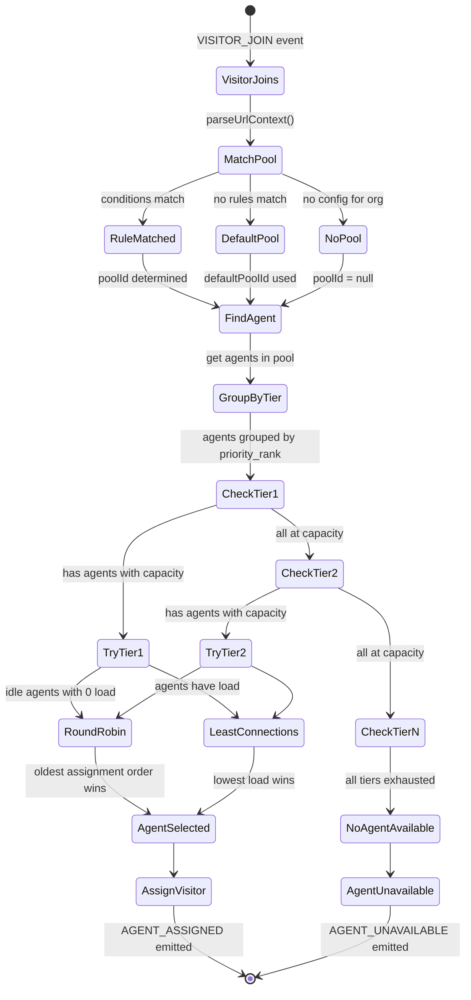

# Feature: P2 - Agent Assignment Algorithm

## Quick Summary
The Agent Assignment Algorithm determines which agent handles which visitor using **tiered priority routing** with **round-robin + least-connections** load balancing within each tier. Visitors are first matched to pools via URL routing rules, then assigned to the best available agent in that pool.

## Affected Users
- [x] Website Visitor (receives assigned agent)
- [x] Agent (receives visitor assignments)
- [x] Admin (configures pools, routing rules, priority tiers)
- [ ] Platform Admin

---

## 1. WHAT IT DOES

### Purpose
Routes website visitors to the optimal available agent based on:
1. **Pool matching** - Which pool handles visitors on this URL?
2. **Tiered priority** - Senior reps get first priority, junior reps overflow
3. **Fair distribution** - Equal load across agents in the same tier

### User Goals
| User Type | What They Want | How This Feature Helps |
|-----------|---------------|----------------------|
| Visitor | Talk to someone who can help | Routes to agent specialized for their page/product |
| Agent | Fair workload distribution | Round-robin ensures no agent is overloaded |
| Admin | Senior reps handle most calls | Priority tiers let senior agents get leads first |
| Admin | Route by URL | Path rules match /pricing to sales team, /support to support team |

---

## 2. HOW IT WORKS

### High-Level Flow

1. **Visitor joins** (`VISITOR_JOIN` event with `orgId` and `pageUrl`)
2. **Pool matching** - URL is matched against org's routing rules to find target pool
3. **Agent selection** - Best agent is found using tiered routing algorithm
4. **Assignment** - Visitor is assigned to agent, both notified

### State Machine



### Algorithm Pseudocode

```
function findBestAgent(poolId, excludeAgentId):
    candidates = getAgentsInPool(poolId)
    candidates = candidates.filter(a => a.id !== excludeAgentId)
    
    if (!poolId):
        return findBestAgentInTier(candidates)  // no tiering
    
    // Group by priority rank
    tiers = groupBy(candidates, agent => getPriorityInPool(agent, poolId))
    sortedTierRanks = sort(tiers.keys())  // lower rank = higher priority
    
    for tierRank in sortedTierRanks:
        tierAgents = tiers[tierRank]
        agent = findBestAgentInTier(tierAgents)
        if (agent):
            return agent
        // else: tier at capacity, try next
    
    return undefined  // no agents available

function findBestAgentInTier(agents):
    bestAgent = undefined
    lowestLoad = Infinity
    oldestOrder = Infinity
    
    for agent in agents:
        // Skip unavailable agents
        if agent.status in ['in_call', 'offline', 'away']:
            continue
        
        // Skip agents at capacity
        if agent.currentSimulations.length >= agent.maxSimultaneousSimulations:
            continue
        
        assignmentOrder = lastAssignmentOrder[agent.id] ?? 0
        load = agent.currentSimulations.length
        
        // For idle agents with no load: round-robin (oldest assignment wins)
        if agent.status === 'idle' AND load === 0:
            if assignmentOrder < oldestOrder:
                oldestOrder = assignmentOrder
                bestAgent = agent
            continue
        
        // For agents with load: least-connections (lowest load wins)
        if load < lowestLoad:
            lowestLoad = load
            bestAgent = agent
    
    return bestAgent
```

### State Definitions

| State | Description | How to Enter | How to Exit |
|-------|-------------|--------------|-------------|
| `browsing` | Visitor not assigned to agent | Initial state | Agent assigned |
| `watching_simulation` | Visitor watching agent's video | Agent assigned | Call requested or agent unavailable |
| `call_requested` | Visitor waiting for agent to answer | Clicks "Call" | Agent accepts/rejects/RNA |
| `in_call` | Active WebRTC call | Agent accepts | Call ends |

---

## 3. DETAILED LOGIC

### Triggers & Events

| Event Name | Where It Fires | What It Does | Side Effects |
|------------|---------------|--------------|--------------|
| `visitor:join` | Widget on page load | Registers visitor, triggers assignment | Increments pool visitor count |
| `agent:assigned` | Server → Widget | Notifies visitor of their agent | Widget shows agent video |
| `agent:unavailable` | Server → Widget | No agents available | Widget shows unavailable state |
| `agent:reassigned` | Server → Widget | Previous agent became unavailable | Widget switches to new agent |
| `agent:login` | Dashboard on connect | Registers agent, triggers reassignment of unassigned visitors | Updates pool availability |
| `agent:away` | Dashboard status change | Agent becomes unavailable | Triggers visitor reassignment |

### Key Functions/Components

| Function/Component | File | Purpose |
|-------------------|------|---------|
| `findBestAgent(poolId, excludeAgentId)` | `pool-manager.ts:588-635` | Main tiered routing algorithm |
| `findBestAgentInTier(agents)` | `pool-manager.ts:641-678` | Round-robin + least-connections within a tier |
| `findBestAgentForVisitor(orgId, pageUrl, excludeAgentId)` | `pool-manager.ts:688-709` | Combines pool matching + agent finding |
| `matchPathToPool(orgId, pageUrl)` | `pool-manager.ts:169-201` | URL → Pool routing |
| `assignVisitorToAgent(visitorId, agentId)` | `pool-manager.ts:714-745` | Performs assignment, updates state |
| `matchConditions(urlContext, conditions)` | `pool-manager.ts:245-248` | Evaluates routing rule conditions (AND logic) |
| `getAgentPriorityInPool(agentId, poolId)` | `pool-manager.ts:161-163` | Gets agent's priority rank in a pool |

### Data Structures

```typescript
// Agent tracking
agents: Map<string, AgentState>                    // agentId → state
agentPools: Map<string, Set<string>>               // agentId → Set<poolId>
agentPoolPriorities: Map<string, Map<string, number>> // agentId → (poolId → priorityRank)

// Pool tracking  
poolMemberships: Map<string, Set<string>>          // poolId → Set<agentId>
orgConfigs: Map<string, OrgConfig>                 // orgId → { defaultPoolId, pathRules }

// Fair distribution
assignmentCounter: number                          // Monotonically increasing
lastAssignmentOrder: Map<string, number>           // agentId → order when last assigned

// Visitor tracking
visitors: Map<string, VisitorSession>              // visitorId → session
```

### Data Flow

```
┌──────────────────────────────────────────────────────────────────┐
│                         VISITOR_JOIN                              │
│              (orgId, pageUrl, visitorId?)                         │
└─────────────────────────────┬────────────────────────────────────┘
                              │
                              ▼
┌──────────────────────────────────────────────────────────────────┐
│                     POOL MATCHING                                 │
│  1. Get orgConfig for orgId                                       │
│  2. Parse URL → { domain, path, queryParams }                     │
│  3. For each rule (sorted by priority DESC):                      │
│     - If conditions match → return rule.poolId                    │
│  4. Fallback to defaultPoolId                                     │
└─────────────────────────────┬────────────────────────────────────┘
                              │
                              ▼
┌──────────────────────────────────────────────────────────────────┐
│                    AGENT SELECTION                                │
│  1. Get agents in pool (poolMemberships.get(poolId))              │
│  2. Group by priority rank (lower = higher priority)              │
│  3. For each tier:                                                │
│     a. Filter: status not in [in_call, offline, away]             │
│     b. Filter: currentSimulations < maxSimultaneous               │
│     c. For idle + 0 load: pick oldest assignmentOrder             │
│     d. For agents with load: pick lowest currentSimulations       │
│     e. If found → return agent                                    │
│  4. If all tiers exhausted → return undefined                     │
└─────────────────────────────┬────────────────────────────────────┘
                              │
              ┌───────────────┴───────────────┐
              │                               │
              ▼                               ▼
┌─────────────────────────┐     ┌─────────────────────────┐
│     AGENT FOUND         │     │    NO AGENT FOUND       │
│  1. assignVisitorToAgent│     │  1. Store poolId in     │
│  2. Increment counter   │     │     visitor.matchedPoolId│
│  3. Update lastAssign   │     │  2. Emit AGENT_UNAVAILABLE│
│  4. Update agent status │     └─────────────────────────┘
│  5. Emit AGENT_ASSIGNED │
└─────────────────────────┘
```

---

## 4. EDGE CASES

### Complete Scenario Matrix

| # | Scenario | Trigger | Current Behavior | Correct? | Notes |
|---|----------|---------|------------------|----------|-------|
| 1 | Happy path - single agent available | Visitor joins | Assigned to agent | ✅ | Standard flow |
| 2 | Multiple agents same tier, same load | Two idle agents | Round-robin by assignment order | ✅ | Older assignment order wins |
| 3 | Multiple agents same tier, different load | Agent A has 2, B has 1 visitor | Agent B selected (least-connections) | ✅ | Lower load prioritized |
| 4 | Tier 1 at capacity, Tier 2 available | All Tier 1 agents have max simulations | Routes to Tier 2 | ✅ | Overflow working |
| 5 | All agents at max capacity | Every agent maxed out | AGENT_UNAVAILABLE sent | ✅ | Widget shows unavailable |
| 6 | No agents online | Pool has 0 connected agents | AGENT_UNAVAILABLE sent | ✅ | Widget shows unavailable |
| 7 | Agent in call | Agent status = "in_call" | Skipped in selection | ✅ | Can't handle simulations while in call |
| 8 | Agent away | Agent status = "away" | Skipped in selection | ✅ | Away agents don't receive visitors |
| 9 | Two visitors request exact same moment | Race condition? | Sequential handling (JS single-threaded) | ✅ | assignmentCounter ensures fairness |
| 10 | Agent disconnects right after selection | Socket disconnects post-assignment | 10s grace period, then reassign | ✅ | Handles page refresh |
| 11 | Agent goes away during RNA | Agent marked away before answering | Routes to next agent | ✅ | Visitor not stuck |
| 12 | No routing rules match | URL doesn't match any condition | Falls back to defaultPoolId | ✅ | Always has fallback |
| 13 | No default pool configured | Org has no default pool | Falls back to any agent (poolId=null) | ⚠️ | May route to wrong pool |
| 14 | Agent in multiple pools | Agent belongs to Pool A (rank 1) and Pool B (rank 2) | Uses rank specific to matched pool | ✅ | Priority is per-pool |
| 15 | Never-assigned agent vs recently-assigned | One agent never had visitor, other had one 5 min ago | Never-assigned agent wins (order=0) | ✅ | New agents get priority |

### Error States

| Error | When It Happens | What User Sees | Recovery Path |
|-------|-----------------|----------------|---------------|
| AGENT_NOT_FOUND | No agents in pool | Widget shows "unavailable" | Wait for agent to log in |
| AGENT_UNAVAILABLE | All agents at capacity | Widget shows "unavailable" | Widget tracks trigger_delay, records missed opportunity |
| Network disconnect | Visitor loses connection | Reconnection via socket.io | Auto-reconnect built into socket.io |
| Agent socket stale | Agent tab frozen | Heartbeat staleness detection | Marked away after 2 min no heartbeat |

---

## 5. UI/UX REVIEW

### User Experience Audit

| Step | User Action | System Response | Clear? | Issues |
|------|------------|-----------------|--------|--------|
| 1 | Visitor loads page | Widget appears with agent video | ✅ | None |
| 2 | Visitor sees "agent unavailable" | Widget shows waiting state | ⚠️ | No estimated wait time |
| 3 | Agent becomes available | Widget auto-assigns | ✅ | Smooth transition |
| 4 | Admin changes agent priority | Takes effect immediately | ✅ | No restart needed |

### Accessibility
- Keyboard navigation: N/A (automatic assignment)
- Screen reader support: Agent name announced
- Color contrast: N/A
- Loading states: Widget shows loading during assignment

---

## 6. TECHNICAL CONCERNS

### Performance
- **Pool lookup**: O(n) where n = number of routing rules (typically <10)
- **Agent selection**: O(m * log(t)) where m = agents in pool, t = tiers
- **Assignment**: O(1) - Map operations
- **No bottlenecks identified**: All operations are synchronous and fast

### Race Conditions Analysis

| Concern | Risk | Mitigation |
|---------|------|------------|
| Two visitors assigned same agent simultaneously | Low | JS single-threaded, assignments are synchronous |
| Agent status changes during selection | Low | Status is checked at moment of selection |
| assignmentCounter overflow | None | JavaScript Number can safely represent integers up to 2^53 |
| Concurrent pool membership updates | Low | Socket handlers are async but pool ops are sync |

### Potential Issue: **Reassignment doesn't respect pool routing**

```typescript:765:806:apps/server/src/features/routing/pool-manager.ts
  reassignVisitors(fromAgentId: string, excludeVisitorId?: string): { 
    reassigned: Map<string, string>; 
    unassigned: string[];
  } {
    // ...
    for (const visitorId of visitorsToReassign) {
      const newAgent = this.findBestAgent();  // ⚠️ NO POOL ID!
      // ...
    }
  }
```

**Analysis**: When reassigning visitors (agent goes away/offline), `reassignVisitors()` calls `findBestAgent()` with no `poolId`, which bypasses pool-based routing. This means a visitor originally matched to "Sales Pool" could be reassigned to an agent in "Support Pool".

**Impact**: Medium - Visitors may get agents who aren't specialized for their page context.

**This is logged as Q-1202-001 in findings.**

### Security
- No exposed data in assignment process
- Authorization: Agents verified via JWT on login
- No injection points

### Reliability
- **Server restart**: Visitors must reconnect, re-trigger assignment
- **Database slow**: Assignment uses in-memory state, not DB
- **Redis failure**: Would affect horizontal scaling, not single-server

---

## 7. FIRST PRINCIPLES REVIEW

### Does This Make Sense?

1. **Is the mental model clear?** 
   - ✅ Yes - "Senior agents get calls first, then overflow to junior"
   
2. **Is the control intuitive?** 
   - ✅ Yes - Priority numbers (1, 2, 3) are clear
   
3. **Is feedback immediate?** 
   - ✅ Yes - Assignment happens in milliseconds
   
4. **Is the flow reversible?** 
   - N/A - Assignments are automatic, not user-controlled
   
5. **Are errors recoverable?** 
   - ✅ Yes - Unavailable state allows retry
   
6. **Is the complexity justified?** 
   - ✅ Yes - Tiered routing is a real business need

### Identified Issues

| Issue | Impact | Severity | Suggested Fix |
|-------|--------|----------|--------------|
| `reassignVisitors()` ignores pool routing | Visitors may get wrong-specialty agents | 🟡 MEDIUM | Pass visitor's `orgId` + `pageUrl` and use `findBestAgentForVisitor()` |
| No tiebreaker for same-order agents | Arbitrary selection if two agents have identical assignment order | 🟢 LOW | Add secondary tiebreaker (e.g., agentId) |
| `maxSimultaneousSimulations` hardcoded to 25 | Can't customize per org/agent | 🟢 LOW | Make configurable |

---

## 8. CODE REFERENCES

| Purpose | File | Lines | Notes |
|---------|------|-------|-------|
| Main tiered routing algorithm | `apps/server/src/features/routing/pool-manager.ts` | 588-635 | `findBestAgent()` |
| Within-tier selection | `apps/server/src/features/routing/pool-manager.ts` | 641-678 | `findBestAgentInTier()` |
| Pool matching from URL | `apps/server/src/features/routing/pool-manager.ts` | 169-201 | `matchPathToPool()` |
| Combined agent + pool finding | `apps/server/src/features/routing/pool-manager.ts` | 688-709 | `findBestAgentForVisitor()` |
| Condition matching | `apps/server/src/features/routing/pool-manager.ts` | 245-294 | `matchConditions()`, `matchCondition()` |
| Assignment execution | `apps/server/src/features/routing/pool-manager.ts` | 714-745 | `assignVisitorToAgent()` |
| Priority retrieval | `apps/server/src/features/routing/pool-manager.ts` | 161-163 | `getAgentPriorityInPool()` |
| Visitor reassignment | `apps/server/src/features/routing/pool-manager.ts` | 767-806 | `reassignVisitors()` - **has pool routing issue** |
| VISITOR_JOIN handler | `apps/server/src/features/signaling/socket-handlers.ts` | 97-210 | Where assignment is triggered |
| Agent login assignment | `apps/server/src/features/signaling/socket-handlers.ts` | 477-509 | Assigns unassigned visitors |
| Agent types | `packages/domain/src/types.ts` | 31-40 | `AgentState` definition |
| Visitor types | `packages/domain/src/types.ts` | 58-70 | `VisitorSession` definition |
| Socket events | `packages/domain/src/constants.ts` | 6-59 | Event name constants |
| Pool member schema | `packages/domain/src/database.types.ts` | 379-391 | `agent_pool_members` with `priority_rank` |

---

## 9. RELATED FEATURES

- [P3: Call Lifecycle](./call-lifecycle.md) - What happens after assignment when call is requested
- [P4: Visitor Reassignment](./visitor-reassignment.md) - How visitors are moved between agents
- [A3: RNA Timeout](../agent/rna-timeout.md) - What happens when assigned agent doesn't answer
- [P6: Heartbeat & Staleness](./heartbeat-staleness.md) - How agents are detected as stale/away
- [D2: Routing Rules](../admin/routing-rules.md) - How URL → Pool matching is configured
- [D3: Tiered Routing](../admin/tiered-routing.md) - How priority ranks are configured

---

## 10. OPEN QUESTIONS

1. **Should `reassignVisitors()` respect original pool routing?** Currently it finds any agent, not necessarily in the same pool.

2. **What's the intended behavior when all Tier 1 agents are "away" but have capacity?** Currently they're skipped. Should they be included as last resort before Tier 2?

3. **Is there a maximum number of tiers supported?** Code handles any number, but is there a UX limit in the admin UI?

4. **Should round-robin track per-pool or globally?** Currently it's global (`lastAssignmentOrder` is per-agent, not per-pool). Agent in multiple pools gets same order everywhere.

---

## Session Summary

**Documented by:** Doc Agent 1  
**Feature:** P2 - Agent Assignment Algorithm  
**Date:** 2024-12-02  

### Algorithm Overview
The agent assignment algorithm uses a **tiered priority system** with **round-robin + least-connections** load balancing:

1. **Pool Matching**: URL routing rules determine which pool handles the visitor
2. **Tiered Priority**: Agents grouped by `priority_rank` (1 = highest priority)
3. **Within-Tier Selection**:
   - Idle agents with 0 load → Round-robin (oldest assignment order wins)
   - Agents with load → Least-connections (lowest simulation count wins)
4. **Overflow**: If a tier is at capacity, falls through to next tier

### Key Finding
The `reassignVisitors()` function doesn't respect pool-based routing - it calls `findBestAgent()` without a pool ID, potentially routing visitors to agents outside their matched pool.

