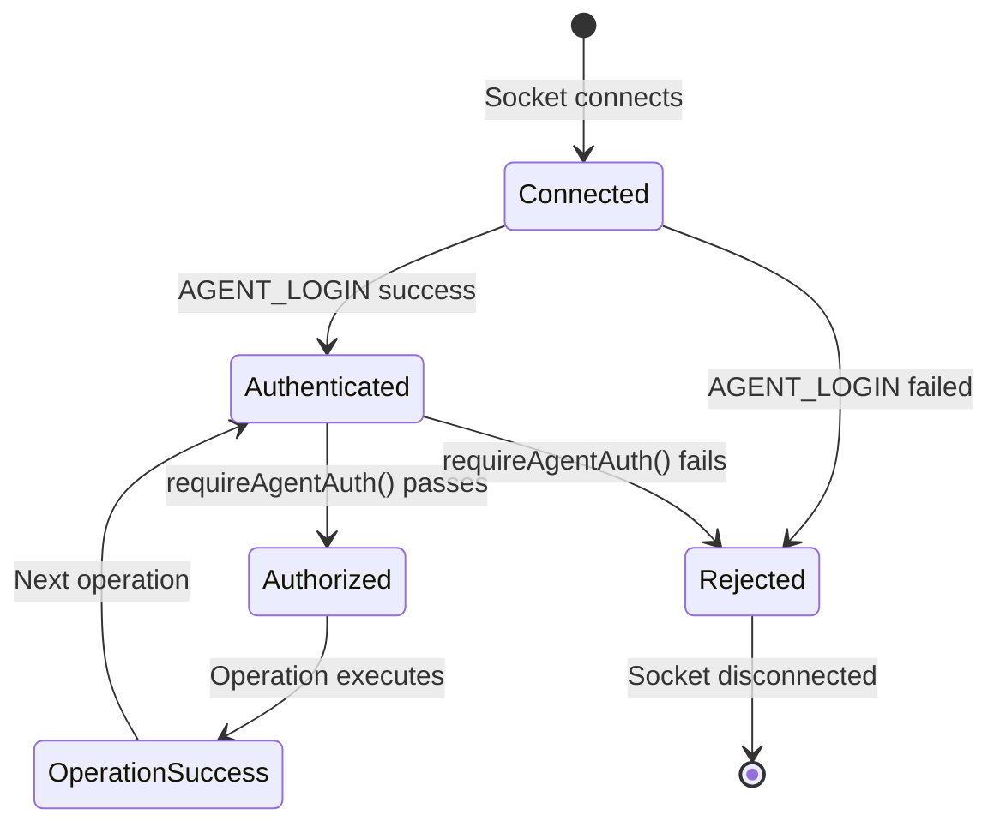

# Feature: API Authentication Enforcement (SEC-001)

## Quick Summary
Comprehensive authentication enforcement across HTTP routes and socket handlers to ensure only authenticated agents can perform privileged operations and metrics endpoints require API keys in production environments.

## Affected Users
- [ ] Website Visitor
- [x] Agent
- [ ] Admin
- [x] Platform Admin

---

## 1. WHAT IT DOES

### Purpose
This security feature ensures that:
1. All agent socket operations verify authentication before execution
2. Production metrics endpoints require API keys to prevent unauthorized access
3. Internal monitoring systems can access metrics via special headers
4. Security misconfigurations are logged as warnings
5. Authentication failures provide clear, actionable error messages

### User Goals
| User Type | What They Want | How This Feature Helps |
|-----------|---------------|----------------------|
| Agent | Secure access to call operations | Prevents unauthorized socket operations via token verification |
| Platform Admin | Secure metrics endpoint | Requires API key in production, supports internal monitoring |
| Platform Admin | Clear security audit trail | Logs authentication failures and security warnings |
| Developer | Easy local development | Allows bypass in dev mode without breaking workflow |

---

## 2. HOW IT WORKS

### High-Level Flow (Agent Authentication)
1. Agent attempts login with Supabase JWT token
2. Server verifies token via `verifyAgentToken()`
3. On success, server sets `socket.data.agentId`
4. All subsequent operations call `requireAgentAuth()` to verify `socket.data.agentId` exists
5. If missing, operation rejected with `AUTH_REQUIRED` error

### High-Level Flow (Metrics Authentication)
1. Request arrives at `/metrics` endpoint
2. Server checks if production mode
3. If production:
   - Check for `x-internal-request: true` header (bypass for monitoring)
   - Otherwise, require API key via query param or `x-metrics-api-key` header
   - Log warning if `METRICS_API_KEY` not configured
4. If dev mode with API key configured, still enforce it
5. Return 401 (no key) or 403 (wrong key) or 200 (success)

### Security Model

```
AUTHENTICATION LAYERS:

┌─────────────────────────────────────────────────────────┐
│ Layer 1: HTTP Routes (Express Middleware)              │
│ - CORS origin validation                                │
│ - Rate limiting (Redis-backed in production)            │
│ - Metrics endpoint API key enforcement                  │
└─────────────────────────────────────────────────────────┘
                          │
                          ▼
┌─────────────────────────────────────────────────────────┐
│ Layer 2: Socket.io Connection                          │
│ - CORS origin validation                                │
│ - Socket connection established                         │
└─────────────────────────────────────────────────────────┘
                          │
                          ▼
┌─────────────────────────────────────────────────────────┐
│ Layer 3: Agent Authentication (AGENT_LOGIN)            │
│ - Verify Supabase JWT token                            │
│ - Match claimed agentId with token                      │
│ - Set socket.data.agentId on success                    │
└─────────────────────────────────────────────────────────┘
                          │
                          ▼
┌─────────────────────────────────────────────────────────┐
│ Layer 4: Operation Authorization                       │
│ - requireAgentAuth() checks socket.data.agentId        │
│ - Called at start of every agent operation             │
│ - Emits AUTH_REQUIRED error if missing                 │
└─────────────────────────────────────────────────────────┘

VISITOR AUTHENTICATION:
- No authentication required (public widget)
- Ephemeral visitorId assigned on VISITOR_JOIN
- Rate limiting at HTTP layer prevents abuse
```

### State Machine



### State Definitions

| State | Description | How to Enter | How to Exit |
|-------|-------------|--------------|-------------|
| Connected | Socket established, not authenticated | Socket.io handshake complete | AGENT_LOGIN attempt |
| Authenticated | Valid agentId set on socket | AGENT_LOGIN success | Disconnect or auth failure |
| Authorized | Specific operation verified | requireAgentAuth() returns agentId | Operation complete |
| Rejected | Authentication/authorization failed | Token invalid or missing agentId | Disconnect |

---

## 3. DETAILED LOGIC

### Triggers & Events

| Event/Trigger | Where It Fires | What It Does | Side Effects |
|--------------|---------------|--------------|--------------|
| AGENT_LOGIN | Dashboard → Server | Verifies token, sets socket.data.agentId | Logs auth success/failure, fetches pool memberships |
| AGENT_STATUS | Dashboard → Server | Updates agent availability | Calls requireAgentAuth() first |
| CALL_ACCEPT | Dashboard → Server | Agent accepts incoming call | Calls requireAgentAuth() first |
| CALL_REJECT | Dashboard → Server | Agent rejects incoming call | Calls requireAgentAuth() first |
| GET /metrics | HTTP Client → Server | Returns server metrics | Checks API key in production |
| requireAgentAuth() | All agent operations | Guards operation execution | Emits AUTH_REQUIRED if fails |

### Key Functions/Components

| Function/Component | File | Purpose |
|-------------------|------|---------|
| `verifyAgentToken()` | `apps/server/src/lib/auth.ts:16` | Verifies Supabase JWT and matches claimed agentId |
| `requireAgentAuth()` | `apps/server/src/lib/auth.ts:192` | Guards agent socket operations, returns agentId or null |
| `GET /metrics handler` | `apps/server/src/index.ts:245` | Enforces API key authentication in production |
| `AGENT_LOGIN handler` | `apps/server/src/features/signaling/socket-handlers.ts` | Sets socket.data.agentId on successful login |
| Socket handlers | `apps/server/src/features/signaling/socket-handlers.ts` | Call requireAgentAuth() before operations |

### Data Flow

```
AGENT LOGIN:
    │
    ├─► Dashboard: emit AGENT_LOGIN { agentId, token }
    │
    ├─► Server: verifyAgentToken(token, agentId)
    │   ├─► Supabase: getUser(token) → user
    │   ├─► Supabase: fetch agent_profiles → agentProfile
    │   ├─► Verify: agentProfile.id === claimedAgentId
    │   └─► Return: { valid: true, agentId, orgId }
    │
    ├─► Server: socket.data.agentId = agentId ← KEY STEP
    │
    ├─► Server: fetchAgentPoolMemberships(agentId)
    │
    └─► Server: emit AGENT_LOGIN_SUCCESS

AGENT OPERATION (e.g., AGENT_STATUS):
    │
    ├─► Dashboard: emit AGENT_STATUS { status }
    │
    ├─► Server: requireAgentAuth(socket, "AGENT_STATUS")
    │   ├─► Check: socket.data.agentId exists?
    │   ├─► If NO: emit error AUTH_REQUIRED, return null
    │   └─► If YES: return agentId
    │
    ├─► Server: if (agentId === null) return; ← Guard
    │
    └─► Server: Update agent status in pool

METRICS REQUEST (Production):
    │
    ├─► HTTP Client: GET /metrics?key=xxx
    │   OR: GET /metrics (header: x-metrics-api-key: xxx)
    │   OR: GET /metrics (header: x-internal-request: true)
    │
    ├─► Server: IS_PRODUCTION check
    │
    ├─► Server: if (!METRICS_API_KEY) → warn security misconfiguration
    │
    ├─► Server: Check headers/query
    │   ├─► If x-internal-request=true → ALLOW
    │   ├─► If no key → 401 Unauthorized
    │   ├─► If wrong key → 403 Forbidden
    │   └─► If correct key → ALLOW
    │
    └─► Server: Return metrics JSON
```

---

## 4. EDGE CASES

### Complete Scenario Matrix

| # | Scenario | Trigger | Current Behavior | Correct? | Notes |
|---|----------|---------|------------------|----------|-------|
| 1 | Agent login with valid token | AGENT_LOGIN with JWT | socket.data.agentId set, pools loaded | ✅ | Happy path |
| 2 | Agent login with invalid token | AGENT_LOGIN with bad JWT | Login rejected, socket not authenticated | ✅ | Token verification fails |
| 3 | Agent login with mismatched ID | AGENT_LOGIN token for different user | Login rejected, ID mismatch error | ✅ | Security check |
| 4 | Agent operation without login | AGENT_STATUS without prior login | AUTH_REQUIRED error emitted | ✅ | requireAgentAuth() guard |
| 5 | Metrics access in prod with key | GET /metrics?key=xxx | Metrics returned | ✅ | Authenticated access |
| 6 | Metrics access in prod without key | GET /metrics | 401 Unauthorized | ✅ | Security enforcement |
| 7 | Metrics access in prod wrong key | GET /metrics?key=wrong | 403 Forbidden | ✅ | Invalid credentials |
| 8 | Metrics access internal request | x-internal-request: true | Metrics returned | ✅ | Monitoring bypass |
| 9 | Metrics in prod without API key configured | No METRICS_API_KEY env var | Warning logged, only internal allowed | ✅ | Security misconfiguration detected |
| 10 | Metrics access in dev without key | GET /metrics (dev mode) | Metrics returned | ✅ | Dev convenience |
| 11 | Dev mode with API key configured | Dev + METRICS_API_KEY set | Key still enforced | ✅ | Explicit security |
| 12 | Socket reconnect after server restart | Socket reconnects | Must re-authenticate with AGENT_LOGIN | ✅ | socket.data cleared |
| 13 | Agent page refresh during call | Browser refresh | 10s grace period, must re-auth | ✅ | Session persistence |
| 14 | Supabase not configured (dev) | No Supabase env vars | Token verification skipped, trust claimed ID | ✅ | Dev fallback |

### Error States

| Error | When It Happens | What User Sees | Recovery Path |
|-------|-----------------|----------------|---------------|
| AUTH_REQUIRED | Agent operation without login | "Not authenticated as agent. Please login first." | Refresh page, login again |
| Token verification failed | Invalid/expired JWT | Login failure, return to login screen | Re-authenticate with Supabase |
| Agent ID mismatch | Token doesn't match claimed ID | Login failure, security error logged | Contact support (possible attack) |
| 401 Unauthorized | Metrics without key | {"error": "API key required"} | Provide API key |
| 403 Forbidden | Metrics with wrong key | {"error": "Invalid API key"} | Use correct API key |
| Agent profile not found | JWT valid but no profile in DB | Login failure | Contact support |

---

## 5. UI/UX REVIEW

### User Experience Audit

| Step | User Action | System Response | Clear? | Issues |
|------|------------|-----------------|--------|--------|
| 1 | Agent opens dashboard | Login screen appears | ✅ | Standard flow |
| 2 | Agent authenticates via Supabase | JWT token obtained | ✅ | Handled by Supabase SDK |
| 3 | Dashboard connects to socket | Socket.io connection established | ✅ | Transparent to user |
| 4 | Dashboard sends AGENT_LOGIN | Token verified, socket authenticated | ✅ | Loading state shown |
| 5 | Agent attempts status change | requireAgentAuth() validates | ✅ | Immediate response |
| 6 | Auth check fails | Error emitted to socket | ✅ | User sees error message |
| 7 | Agent refreshes page mid-call | Must re-authenticate | ⚠️ | 10s grace period helps |
| 8 | Monitoring system requests metrics | Key validation happens | ✅ | No user facing |

### Accessibility
- Keyboard navigation: N/A (server-side security)
- Screen reader support: N/A (server-side security)
- Color contrast: N/A (server-side security)
- Loading states: ✅ Auth happens during connection loading

---

## 6. TECHNICAL CONCERNS

### Performance
| Concern | Implementation | Status |
|---------|----------------|--------|
| Token verification latency | Cached in socket.data after first login | ✅ Optimized |
| Supabase round-trip time | ~100-200ms on first login, then cached | ✅ Acceptable |
| requireAgentAuth() overhead | Simple in-memory check, < 1ms | ✅ Negligible |
| Metrics endpoint without rate limiting | Rate limiting applied to /api/* routes | ⚠️ Metrics outside rate limit |

### Security
| Concern | Mitigation |
|---------|------------|
| Token replay attacks | JWT expiration enforced by Supabase |
| Socket hijacking | socket.data.agentId set per-connection, not transferable |
| Metrics endpoint exposure | API key required in production, internal header for monitoring |
| API key in query params | Also supported via header, Railway adds x-internal-request |
| Missing API key in production | Warning logged on every request, operational visibility |
| Man-in-the-middle | WSS (WebSocket Secure) required in production |
| Brute force API key guessing | Rate limiting at HTTP layer prevents mass attempts |

### Reliability
| Concern | Mitigation |
|---------|------------|
| Supabase outage | Dev mode fallback: trust claimed IDs, log warning |
| Socket disconnection | Must re-authenticate on reconnect (socket.data cleared) |
| Server restart | All sockets cleared, agents must re-login |
| Multiple tabs | Each socket independently authenticated |

---

## 7. FIRST PRINCIPLES REVIEW

### Does This Make Sense?

1. **Is the mental model clear?**
   - ✅ Yes - Clear separation: login sets auth, operations check auth
   - Agent must authenticate once, then all operations verified

2. **Is the control intuitive?**
   - ✅ Yes - Authentication happens automatically during login flow
   - Developers don't manually call requireAgentAuth(), it's embedded in handlers

3. **Is feedback immediate?**
   - ✅ Yes - AUTH_REQUIRED error emitted immediately on auth failure
   - Metrics endpoint returns 401/403 instantly

4. **Is the flow reversible?**
   - ✅ Yes - Refresh page to reset auth state
   - Re-login always possible

5. **Are errors recoverable?**
   - ✅ Yes - All auth errors prompt re-login
   - Clear error messages guide recovery

6. **Is the complexity justified?**
   - ✅ Yes - Security requirement for production system
   - Minimal overhead: single check per operation

### Identified Issues

| Issue | Impact | Severity | Suggested Fix |
|-------|--------|----------|--------------|
| Metrics endpoint outside rate limiting | Could be abused for DoS | 🟡 Medium | Add rate limiting to /metrics or require auth for all |
| API key in URL query params | Visible in logs, browser history | 🟡 Medium | Prefer header-based auth (already supported) |
| No audit log for auth failures | Hard to detect attacks | 🟡 Medium | Add persistent audit log for failed auth attempts |
| Warning on every metrics request | Log spam if misconfigured | 🟢 Low | Log warning once on startup, not per request |

---

## 8. CODE REFERENCES

| Purpose | File | Lines | Notes |
|---------|------|-------|-------|
| Token verification | `apps/server/src/lib/auth.ts` | 16-67 | Verifies JWT with Supabase, matches agentId |
| Agent auth guard | `apps/server/src/lib/auth.ts` | 192-208 | requireAgentAuth() helper function |
| Metrics endpoint auth | `apps/server/src/index.ts` | 245-327 | API key enforcement in production |
| Security model docs | `apps/server/src/features/signaling/socket-handlers.ts` | 1-27 | Authentication model documentation |
| AGENT_LOGIN handler | `apps/server/src/features/signaling/socket-handlers.ts` | ~300-400 | Sets socket.data.agentId on success |
| AGENT_STATUS handler | `apps/server/src/features/signaling/socket-handlers.ts` | ~400-500 | Calls requireAgentAuth() |
| CALL_ACCEPT handler | `apps/server/src/features/signaling/socket-handlers.ts` | ~600-700 | Calls requireAgentAuth() |
| CALL_REJECT handler | `apps/server/src/features/signaling/socket-handlers.ts` | ~800-900 | Calls requireAgentAuth() |

---

## 9. RELATED FEATURES

- [Call Lifecycle](./call-lifecycle.md) - Relies on agent authentication for call operations
- [WebRTC Signaling](./webrtc-signaling.md) - Requires authenticated socket for signaling
- [Agent Assignment](./agent-assignment.md) - Uses authenticated agent identity for routing
- [Heartbeat Staleness](./heartbeat-staleness.md) - Tracks authenticated agent connections

---

## 10. OPEN QUESTIONS

1. **Should metrics endpoint have rate limiting?**
   - Currently /api/* routes have rate limiting, but /metrics does not
   - Could be abused for DoS by repeatedly requesting metrics
   - Consider: Apply rate limiting to /metrics or move to /api/metrics

2. **Should we log all auth failures to persistent storage?**
   - Currently only console.warn() for auth failures
   - No audit trail for security investigations
   - Consider: Add auth_audit_log table for compliance

3. **Should API key warning be less noisy?**
   - Warning logged on every metrics request in production if no key
   - Could spam logs if monitoring polls frequently
   - Consider: Log once on startup, not per request

4. **Should visitors have any authentication?**
   - Currently completely unauthenticated (by design for public widget)
   - Could add optional webhook verification for embed security
   - Consider: Add signature verification for widget loads

5. **Should socket.data.agentId be cryptographically signed?**
   - Currently just stored in socket.data (memory)
   - Could be tampered with if socket.io internals compromised
   - Consider: HMAC signature of agentId stored separately

6. **Should we support API key rotation?**
   - Currently single METRICS_API_KEY env var
   - No way to rotate without downtime
   - Consider: Support comma-separated keys, deprecate old ones
