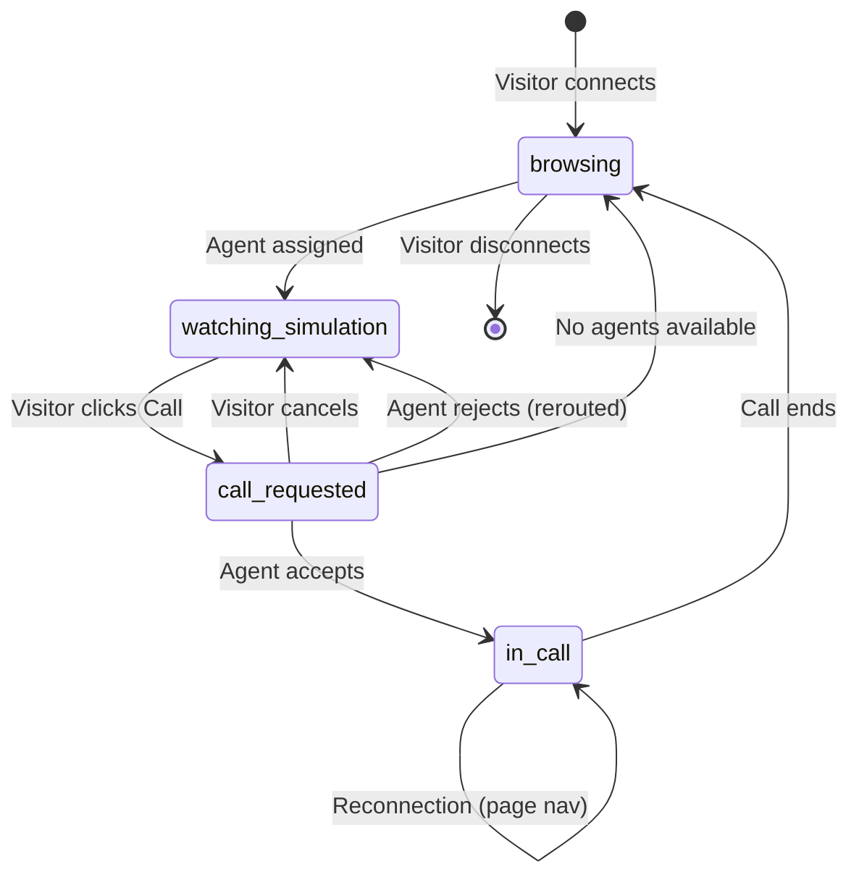
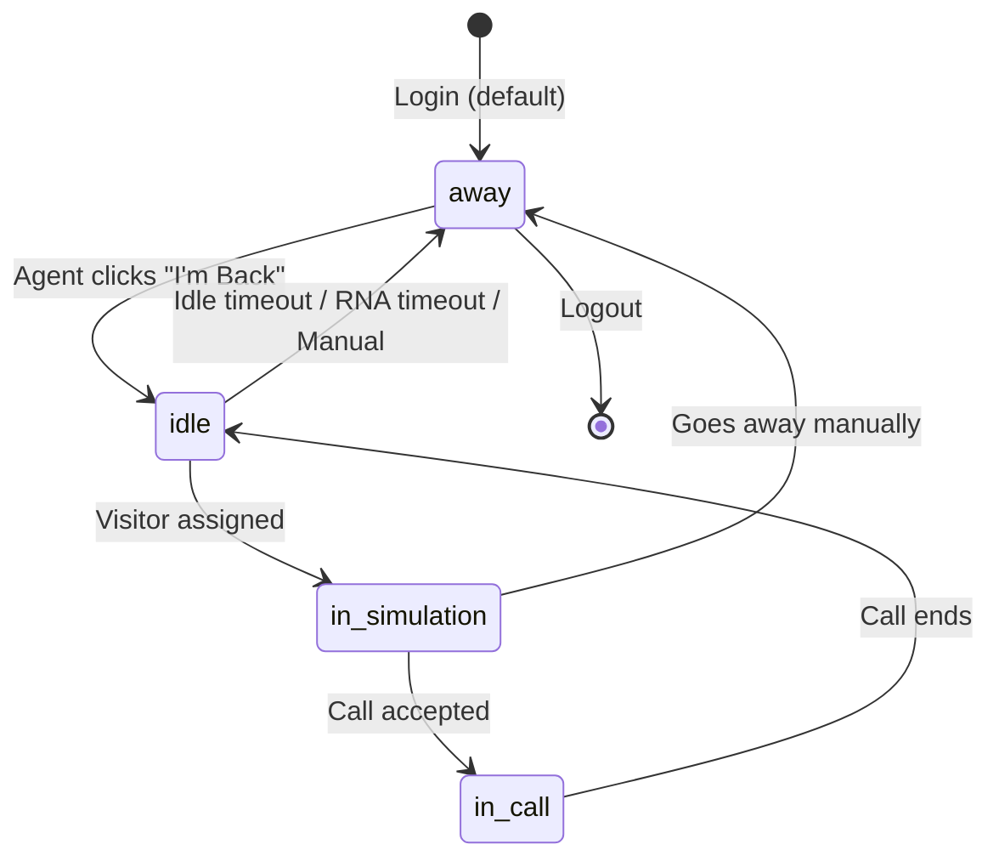

# Feature: Call Lifecycle (P3)

## Quick Summary
The Call Lifecycle is the core state machine orchestrating all video calls between website visitors and agents. It manages the complete flow from call request → ringing → acceptance/rejection → active call → call end, plus reconnection scenarios for page navigation and server restarts.

## Affected Users
- [x] Website Visitor
- [x] Agent
- [ ] Admin
- [ ] Platform Admin

---

## 1. WHAT IT DOES

### Purpose
The Call Lifecycle ensures reliable, real-time video call handshakes between visitors and agents. It handles:
- Matching call requests to available agents
- Managing ring timeouts (RNA - Ring No Answer)
- State synchronization between all parties
- Call persistence across page navigations
- Recovery from server restarts
- Graceful fallbacks when agents become unavailable

### User Goals
| User Type | What They Want | How This Feature Helps |
|-----------|---------------|----------------------|
| Visitor | Instant connection to a live person | Routes to best available agent, auto-reroutes on failure |
| Visitor | Call survives page navigation | Stores reconnect token in localStorage |
| Agent | Clear notification of incoming calls | CALL_INCOMING event with visitor info |
| Agent | Control over availability | Accept/reject calls, auto-away on RNA timeout |
| Agent | Call survives page refresh | 10-second grace period for reconnection |

---

## 2. HOW IT WORKS

### High-Level Flow (Happy Path)
1. Visitor clicks "Call" button in widget
2. Widget emits `call:request` with assigned agent ID
3. Server creates CallRequest, logs to database, emits `call:incoming` to agent
4. Server fetches org's call settings (RNA timeout), starts configurable RNA timeout (default 15s)
5. Agent receives modal, clicks "Accept"
6. Agent emits `call:accept`
7. Server clears RNA timeout, creates ActiveCall, generates reconnect token
8. Server fetches org's call settings, starts max call duration timeout (default 2 hours)
9. Server emits `call:accepted` to visitor, `call:started` to agent
10. Both parties establish WebRTC connection
11. Either party ends call via `call:end` OR max duration timeout fires
12. Server clears max duration timeout (if not expired), emits `call:ended` to both parties, logs completion

### State Machine



### Agent Status States During Call



### State Definitions

| State | Description | How to Enter | How to Exit |
|-------|-------------|--------------|-------------|
| `browsing` | Visitor on page, no agent interaction | Initial state, call ended, agent unavailable | Agent assigned, disconnect |
| `watching_simulation` | Visitor sees agent video (ghost greeter) | Agent assigned, call cancelled/rejected | Call requested, agent unavailable |
| `call_requested` | Call ringing on agent's dashboard | Visitor clicks Call button | Accept, reject, cancel, RNA timeout |
| `in_call` | Active video call in progress | Agent accepts call | Call ended by either party |

---

## 3. DETAILED LOGIC

### Triggers & Events

| Event Name | Where It Fires | What It Does | Side Effects |
|------------|---------------|--------------|--------------|
| `call:request` | Widget → Server | Creates CallRequest, notifies agent | DB: creates call_log (pending), starts RNA timeout (configurable) |
| `call:accept` | Dashboard → Server | Converts request to ActiveCall | DB: marks accepted, generates reconnect token, starts max duration timeout |
| `call:reject` | Dashboard → Server | Removes request, tries next agent | DB: marks rejected, may create new call_log |
| `call:cancel` | Widget → Server | Removes request | DB: deletes call_log |
| `call:end` | Either → Server | Ends active call | DB: marks completed with duration, clears max duration timeout |
| `call:reconnect` | Either → Server | Attempts to restore interrupted call | DB: updates reconnect token |
| `call:incoming` | Server → Dashboard | Shows incoming call modal | Agent UI: ring sound, notification |
| `call:accepted` | Server → Widget | Notifies visitor call connected | Widget: shows WebRTC view, stores token |
| `call:ended` | Server → Both | Notifies call terminated | Both: reset to pre-call state |
| `call:rna_timeout` | Server → Dashboard | Notifies RNA timeout occurred | Agent marked away, call rerouted |
| *max_duration_timeout* | Server Internal | Auto-ends call after configured max duration | Emits `call:ended` with reason "max_duration" |

### Key Functions/Components

| Function/Component | File | Purpose |
|-------------------|------|---------|
| `setupSocketHandlers` | `apps/server/src/features/signaling/socket-handlers.ts` | Main event handler registration |
| `PoolManager.createCallRequest` | `apps/server/src/features/routing/pool-manager.ts` | Creates pending call request |
| `PoolManager.acceptCall` | `apps/server/src/features/routing/pool-manager.ts` | Converts request to active call |
| `startRNATimeout` | `apps/server/src/features/signaling/socket-handlers.ts` | Starts configurable ring timeout (default 15s) |
| `startMaxCallDurationTimeout` | `apps/server/src/features/signaling/socket-handlers.ts` | Starts max call duration timeout (default 2h) |
| `getCallSettings` | `apps/server/src/lib/call-settings.ts` | Fetches org's call settings (RNA timeout, max duration) |
| `createCallLog` | `apps/server/src/lib/call-logger.ts` | Persists call to database |
| `useSignaling` | `apps/widget/src/features/signaling/useSignaling.ts` | Widget socket connection |
| `useSignaling` | `apps/dashboard/src/features/signaling/use-signaling.ts` | Dashboard socket connection |

### Data Flow

```
VISITOR CLICKS CALL
    │
    ├─► Widget: emit call:request { agentId }
    │
    ├─► Server: getCallSettings(orgId) → { rna_timeout_seconds, max_call_duration_minutes }
    │
    ├─► Server: createCallRequest()
    │   ├─► pendingCalls.set(requestId, CallRequest)
    │   ├─► visitor.state = "call_requested"
    │   └─► createCallLog() → DB: call_logs (status: pending)
    │
    ├─► Server: emit call:incoming → Agent Dashboard
    │   └─► Dashboard: setIncomingCall(data), play sound
    │
    └─► Server: startRNATimeout(rna_timeout_seconds * 1000) ← Configurable!

AGENT ACCEPTS
    │
    ├─► Dashboard: emit call:accept { requestId }
    │
    ├─► Server: clearRNATimeout(requestId)
    │
    ├─► Server: getCallSettings(orgId) → { max_call_duration_minutes }
    │
    ├─► Server: acceptCall(requestId)
    │   ├─► activeCalls.set(callId, ActiveCall)
    │   ├─► pendingCalls.delete(requestId)
    │   ├─► visitor.state = "in_call"
    │   └─► agent.status = "in_call"
    │
    ├─► Server: markCallAccepted() → DB + reconnect token
    │
    ├─► Server: startMaxCallDurationTimeout(max_call_duration_minutes * 60 * 1000) ← NEW!
    │
    ├─► Server: emit call:accepted → Widget
    │   └─► Widget: store reconnect token, start WebRTC
    │
    └─► Server: emit call:started → Dashboard
        └─► Dashboard: setActiveCall(data), start WebRTC

CALL ENDS (Normal or Max Duration)
    │
    ├─► Either: emit call:end { callId } OR max duration timeout fires
    │
    ├─► Server: clearMaxCallDurationTimeout(callId) ← If not expired
    │
    ├─► Server: endCall(callId)
    │   ├─► call.endedAt = now
    │   ├─► visitor.state = "browsing"
    │   └─► agent.status = "idle"
    │
    ├─► Server: markCallEnded() → DB: status=completed, duration
    │
    └─► Server: emit call:ended → Both parties
        └─► reason: "visitor_ended" | "agent_ended" | "max_duration"
```

---

## 4. EDGE CASES

### Complete Scenario Matrix

| # | Scenario | Trigger | Current Behavior | Correct? | Notes |
|---|----------|---------|------------------|----------|-------|
| 1 | Happy path | Normal flow | Works as designed | ✅ | |
| 2 | Agent doesn't answer (RNA) | 15s timeout | Agent marked away, call rerouted | ✅ | |
| 3 | Visitor cancels during ring | Cancel button | Request deleted from pending, DB deleted | ✅ | |
| 4 | Agent rejects call | Reject button | Reroutes to next agent or hides widget | ✅ | |
| 5 | All agents busy at request | Agent in_call | Finds alternative agent immediately | ✅ | |
| 6 | No agents available | None online | Widget hidden with "got pulled away" | ✅ | |
| 7 | Visitor page navigates during call | Page change | Reconnects via localStorage token | ✅ | 5 min expiry |
| 8 | Agent refreshes page | Page refresh | 10s grace period, then offline | ✅ | |
| 9 | Server restarts during call | Server crash | Both parties have 30s to reconnect | ✅ | |
| 10 | Agent accepts at exact RNA timeout | Race condition | 100ms grace period protects agent | ✅ | |
| 11 | Visitor has existing call, requests new | Rapid calls | Old call cleaned up first | ✅ | |
| 12 | Agent disconnects during call | Network loss | Call ends, visitor notified | ✅ | |
| 13 | Visitor disconnects during call | Network loss | Call ends, agent notified | ✅ | |
| 14 | Call reconnect token expired | >5 min gap | Reconnect fails, normal flow | ✅ | |
| 15 | Agent offline at call request | Status offline | Immediately finds alternative | ✅ | |
| 16 | Agent goes away during ring | Manual away | Call rerouted to next agent | ✅ | |
| 17 | Call request for wrong org | Different org | Token validation prevents reconnect | ✅ | |
| 18 | Double-click on Call button | Rapid clicks | Server handles via existing call cleanup | ⚠️ | No widget-side debounce visible |
| 19 | Visitor back-navigates during call | Browser back | Same as page nav - reconnects | ✅ | |
| 20 | Both parties disconnect simultaneously | Network | Both get reconnect window | ✅ | |
| 21 | **Server restarts during ring** | Server crash while visitor waiting | Widget auto-retries `call:request` on reconnect | ✅ | **NEW** - Option E |

### Error States

| Error | When It Happens | What User Sees | Recovery Path |
|-------|-----------------|----------------|---------------|
| CALL_NOT_FOUND | Accept expired/invalid request | Toast error | Auto-clears, wait for next call |
| AGENT_NOT_FOUND | Agent logged out mid-flow | Widget hides | Try call again later |
| VISITOR_NOT_FOUND | Visitor disconnected | N/A (agent side) | Auto-clears incoming call |
| RNA_TIMEOUT | Agent AFK for configured timeout (10-60s) | Agent: "marked away" modal | Click "I'm Back" |
| MAX_DURATION | Call exceeds max duration (30min-4hr) | "Call automatically ended" message | Start new call |
| RECONNECT_TIMEOUT | Neither reconnected in 30s | "Call ended" | Start new call |
| RECONNECT_FAILED | One party didn't reconnect | "Agent/Visitor disconnected" | Start new call |

---

## 5. UI/UX REVIEW

### User Experience Audit

**Visitor Flow:**
| Step | User Action | System Response | Clear? | Issues |
|------|------------|-----------------|--------|--------|
| 1 | Click Call button (camera/mic) | Self-view preview shown | ✅ | |
| 2 | Wait for answer | Sees agent's **loop video** playing | ✅ | Intentional: visitor thinks *they* are connecting |
| 3 | Agent answers | Smooth switch to WebRTC video | ✅ | "Ghost greeter" illusion maintained |
| 4 | Navigate page | Call persists via token | ✅ | Seamless experience |
| 5 | End call | Widget minimizes | ✅ | |

**Key UX Insight:** During the "ringing" phase (visitor waiting for agent to accept), the visitor sees the agent's **loop video** continuously playing. This is **intentional** - the goal is to maintain the "ghost greeter" illusion where the agent appears to be live and waiting. From the visitor's perspective, it feels like *their* side is connecting to the already-present agent, not that the agent is being called. This creates a more premium, concierge-like experience.

**Agent Flow:**
| Step | User Action | System Response | Clear? | Issues |
|------|------------|-----------------|--------|--------|
| 1 | Incoming call | Modal + sound + tab flash | ✅ | Good attention-grabbing |
| 2 | Accept call | Modal closes, call starts | ✅ | |
| 3 | Reject call | Modal closes | ✅ | No confirmation needed |
| 4 | Miss call (RNA) | Marked away modal | ✅ | Clear explanation provided |
| 5 | End call | Returns to bullpen | ✅ | |

### Accessibility
- Keyboard navigation: ⚠️ Not verified
- Screen reader support: ⚠️ Not verified
- Color contrast: ⚠️ Not verified
- Loading states: ✅ Connection states shown

---

## 6. TECHNICAL CONCERNS

### Performance
- **In-memory state**: All call state in PoolManager Maps - scales with concurrent calls
- **Timer management**: RNA timeouts tracked in Map, properly cleared
- **Database calls**: Fire-and-forget pattern used for logging (non-blocking)

### Security
- **Token verification**: Agent login verifies Supabase JWT
- **Reconnect tokens**: Cryptographically random (32 bytes hex)
- **Org isolation**: Reconnect tokens validated against orgId
- **No exposed data**: Visitor IDs are opaque, generated server-side

### Reliability

| Concern | Mitigation |
|---------|------------|
| Server restart | Reconnect tokens in DB, 30s window |
| Agent page refresh | 10s grace period |
| Visitor page nav | localStorage token, 5 min window |
| Database down | Fire-and-forget logging, calls still work |
| Race conditions | 100ms grace period on RNA timeout |

### Potential Issues Found

#### ✅ Issue 1: In-Memory State Loss on Server Restart (MITIGATED)
The `pendingCalls` and `activeCalls` Maps are in-memory only. While there's reconnection logic using database tokens, if the server restarts:
- ~~Pending calls (ringing) are lost completely~~ **FIXED**: Widget now retries `call:request` on socket reconnect (Option E)
- Active calls can reconnect via tokens, but only if both parties react fast enough

**Status**: Mitigated via client-side retry. Widget tracks `pendingCallAgentIdRef` and re-emits `call:request` after reconnecting. Server handles gracefully via existing call cleanup logic.

**Implementation**: `apps/widget/src/features/signaling/useSignaling.ts`

#### ⚠️ Issue 2: callLogIds Map Not Persistent
The mapping from requestId/callId to database call_logs.id is in-memory. On server restart:
- New calls won't link to old call_logs entries
- This could cause orphaned database records

**Impact**: Low - Affects analytics accuracy, not core functionality

#### ⚠️ Issue 3: No Widget-Side Debounce on Call Button
Looking at the widget code, there's no explicit debounce on the Call button. The server handles duplicate requests by cleaning up existing calls, but this could cause unnecessary server load and race conditions.

**Impact**: Low - Server handles it, but suboptimal

---

## 7. FIRST PRINCIPLES REVIEW

### Does This Make Sense?

1. **Is the mental model clear?** ✅ Yes - "Call" → "Ringing" → "Connected" is intuitive
2. **Is the control intuitive?** ✅ Yes - Single call button, standard accept/reject
3. **Is feedback immediate?** ⚠️ Mostly - Ringing state could be more explicit to visitor
4. **Is the flow reversible?** ✅ Yes - Can cancel during ring, end during call
5. **Are errors recoverable?** ✅ Yes - Auto-rerouting, reconnection, retry paths
6. **Is the complexity justified?** ✅ Yes - Reconnection logic is essential for UX

### Identified Issues

| Issue | Impact | Severity | Status |
|-------|--------|----------|--------|
| ~~No explicit "ringing" indicator~~ | N/A - Intentional UX | N/A | ✅ By design (ghost greeter illusion) |
| ~~pendingCalls lost on restart~~ | Visitors in ring state dropped | 🟡 Medium | ✅ Fixed via client-side retry (Option E) |
| ~~Hardcoded RNA timeout~~ | Orgs couldn't customize | 🟢 Low | ✅ Now configurable (10-60s) |
| ~~No max call duration~~ | Forgotten calls run forever | 🟡 Medium | ✅ Now enforced (default 2 hours) |
| callLogIds not persistent | Analytics gaps on restart | 🟢 Low | Open - Could query DB by reconnect_token |
| No call button debounce in widget | Extra server load | 🟢 Low | Open - Add 1s debounce on widget side |

### Implemented Enhancements

| Enhancement | Description | Target Location | Status |
|-------------|-------------|-----------------|--------|
| Configurable RNA Timeout | Orgs can customize RNA timeout from 10-60 seconds (default 15s) | Admin → Settings → Call Settings | ✅ Complete |
| Max Call Duration | Auto-end calls after configured duration (30min-4hr, default 2hr) | Admin → Settings → Call Settings + Server-side timer | ✅ Complete |
| Client-Side Retry | Widget retries pending `call:request` after socket reconnect | Widget signaling hook | ✅ Complete |

### Future Enhancements

| Enhancement | Description | Target Location | Status |
|-------------|-------------|-----------------|--------|
| Graceful Shutdown | Drain pending calls before server restart (for planned deploys) | Server shutdown handler | 🔜 Planned |

---

## 8. CODE REFERENCES

| Purpose | File | Lines | Notes |
|---------|------|-------|-------|
| Main socket handlers | `apps/server/src/features/signaling/socket-handlers.ts` | 1-1950+ | All call events |
| CALL_REQUEST handler | `apps/server/src/features/signaling/socket-handlers.ts` | 279-380 | Request flow + fetch call settings |
| CALL_ACCEPT handler | `apps/server/src/features/signaling/socket-handlers.ts` | 687-775 | Accept flow + start max duration timeout |
| RNA timeout logic | `apps/server/src/features/signaling/socket-handlers.ts` | 1530-1680 | Configurable timeout + reroute |
| Max call duration timeout | `apps/server/src/features/signaling/socket-handlers.ts` | 1683-1760 | Auto-end long calls |
| Call settings fetcher | `apps/server/src/lib/call-settings.ts` | 1-95 | Org's RNA timeout + max duration |
| Reconnection logic | `apps/server/src/features/signaling/socket-handlers.ts` | 920-1220 | Full reconnect flow |
| PoolManager call methods | `apps/server/src/features/routing/pool-manager.ts` | 810-980 | State management |
| Call logger | `apps/server/src/lib/call-logger.ts` | 1-512 | DB persistence |
| Widget signaling | `apps/widget/src/features/signaling/useSignaling.ts` | 1-630 | Client-side + pending call retry |
| **Pending call retry (Option E)** | `apps/widget/src/features/signaling/useSignaling.ts` | 222-230, 303-318 | `pendingCallAgentIdRef` tracking |
| Dashboard signaling | `apps/dashboard/src/features/signaling/use-signaling.ts` | 1-589 | Agent-side |
| Call Settings UI | `apps/dashboard/src/app/(app)/admin/settings/recordings/` | - | RNA timeout + max duration config |
| RecordingSettings type | `packages/domain/src/database.types.ts` | 48-59 | Includes `rna_timeout_seconds`, `max_call_duration_minutes` |
| Timing constants (defaults) | `packages/domain/src/constants.ts` | 71-93 | Default timeouts |

---

## 9. RELATED FEATURES
- [Agent Assignment Algorithm (P2)](./agent-assignment.md) - How agents are selected
- [Visitor Call (V3)](../visitor/visitor-call.md) - Visitor-side call experience
- [Incoming Call (A2)](../agent/incoming-call.md) - Agent-side incoming call
- [RNA Timeout (A3)](../agent/rna-timeout.md) - Ring-no-answer handling
- [Visitor Reassignment (P4)](./visitor-reassignment.md) - Fallback routing
- [WebRTC Signaling (P5)](./webrtc-signaling.md) - Actual video connection
- [Heartbeat & Staleness (P6)](./heartbeat-staleness.md) - Agent availability

---

## 10. OPEN QUESTIONS

1. ~~**Should pending calls be persisted to Redis/DB?**~~ → **Resolved**: Client-side retry (Option E) provides sufficient resilience without infrastructure changes
2. **What's the expected call volume?** - In-memory Maps scale with server memory; may need Redis at scale for horizontal scaling
3. ~~**Should visitor see explicit "Ringing..." state?**~~ → **Resolved**: No - intentionally show loop video to maintain "ghost greeter" illusion. Visitor should think agent is already live.
4. ~~**Is 15s RNA timeout the right duration?**~~ → **Resolved**: RNA timeout is now configurable per-org (10-60 seconds, default 15s) in Admin → Settings → Call Settings
5. ~~**Should call duration have a max limit?**~~ → **Resolved**: Max call duration is now configurable per-org (30min-4hr, default 2hr) in Admin → Settings → Call Settings

