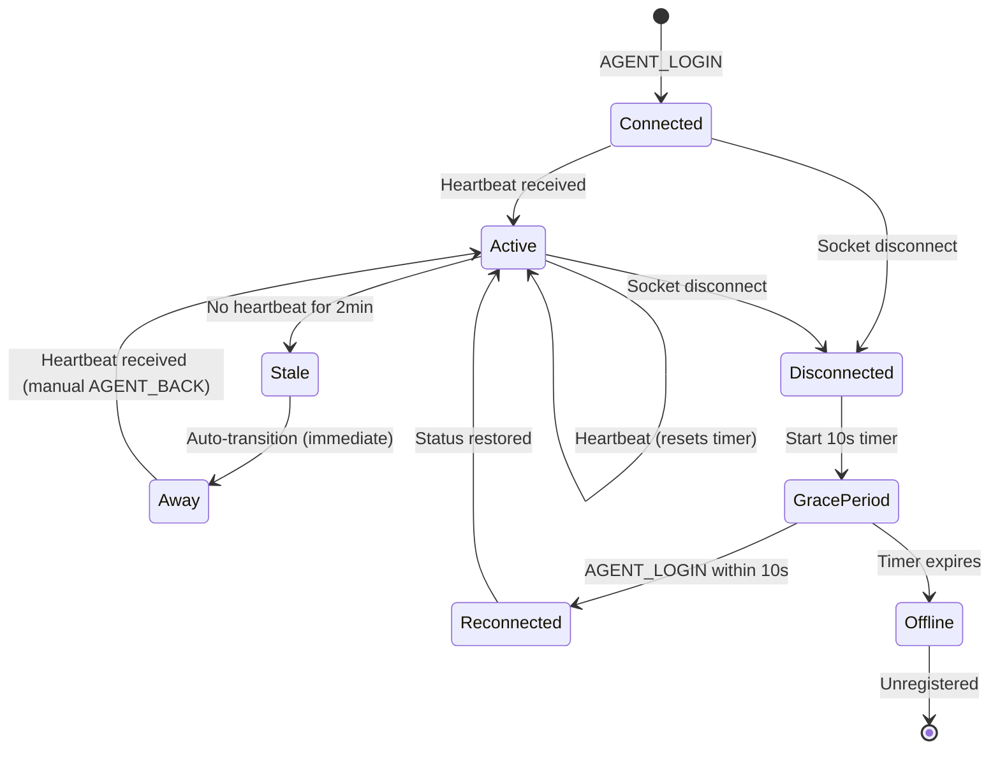

# Feature: P6 - Heartbeat & Staleness Detection

## Quick Summary
Heartbeat and staleness detection ensures agents are actually present and responsive. Agents send periodic heartbeat signals to the server; if no heartbeat is received for 2 minutes, the agent is marked as "away" and their visitors are reassigned to other agents.

## Affected Users
- [x] Website Visitor (indirectly - reassigned when agent goes stale)
- [x] Agent (directly - marked away, notified)
- [ ] Admin
- [ ] Platform Admin

---

## 1. WHAT IT DOES

### Purpose
The heartbeat system ensures routing decisions are based on **actual agent availability**, not stale connection state. Without heartbeat detection:
- Agents who walk away from their desk would appear "online"
- Visitors would be routed to unresponsive agents
- Call requests would time out repeatedly without explanation
- Browser freezes (Chrome tab throttling) could leave "ghost agents" in the pool

### User Goals
| User Type | What They Want | How This Feature Helps |
|-----------|---------------|----------------------|
| Visitor | Quick response when requesting a call | Stale agents removed from routing pool |
| Visitor | Not assigned to an agent who won't respond | Heartbeat ensures agent is actually present |
| Agent | Not unfairly penalized for brief disconnects | 10-second grace period for page refresh |
| Agent | Know when they've been marked away | `AGENT_MARKED_AWAY` notification sent |
| Platform | Accurate metrics on agent availability | Staleness tracking filters ghost agents |

---

## 2. HOW IT WORKS

### High-Level Flow

1. **Agent connects** → `AGENT_LOGIN` → `lastActivityAt` set to `Date.now()`
2. **Client sends heartbeat** every 25 seconds (via `heartbeat` event)
3. **Server updates** `agent.lastActivityAt` on each heartbeat
4. **Periodic check** runs every 60 seconds
5. **If idle agent** has no heartbeat for 120+ seconds:
   - Mark agent as "away"
   - Record status change with reason `"heartbeat_stale"`
   - Send `AGENT_MARKED_AWAY` event to agent
   - Reassign visitors watching agent's simulation
6. **On reconnect** (within 10s grace period): restore previous status

### State Machine



### State Definitions

| State | Description | How to Enter | How to Exit |
|-------|-------------|--------------|-------------|
| Connected | Agent just logged in | `AGENT_LOGIN` event | Heartbeat received → Active |
| Active | Agent sending heartbeats | Any heartbeat | No heartbeat for 2min → Stale |
| Stale | Internal flag (no heartbeat) | 2min without heartbeat | Immediate auto-transition to Away |
| Away | Agent marked unavailable | Staleness detected, or manual | Agent clicks "Go Online" |
| GracePeriod | Temporary after disconnect | Socket disconnect | Reconnect (10s) or expire |
| Offline | Fully disconnected | Grace period expires | Agent reconnects (new session) |

---

## 3. DETAILED LOGIC

### Triggers & Events

| Event Name | Where It Fires | What It Does | Side Effects |
|------------|---------------|--------------|--------------|
| `heartbeat` | Dashboard client (every 25s) | Updates `lastActivityAt` | None |
| (Staleness check) | Server setInterval (every 60s) | Finds agents with stale heartbeat | Marks away, reassigns visitors |
| `AGENT_MARKED_AWAY` | Server → Agent | Notifies agent they were marked away | Agent sees notification |
| `disconnect` | Socket.io | Starts grace period or ends call | Grace period timer starts |
| `AGENT_LOGIN` | Dashboard → Server | Checks for pending disconnect | May restore previous status |

### Key Functions/Components

| Function/Component | File | Purpose |
|-------------------|------|---------|
| `heartbeat` handler | `socket-handlers.ts:691-697` | Updates agent activity timestamp |
| `updateAgentActivity()` | `pool-manager.ts:457-462` | Sets `lastActivityAt = Date.now()` |
| `getStaleAgents()` | `pool-manager.ts:469-484` | Finds agents with no recent heartbeat |
| Staleness check interval | `socket-handlers.ts:1516-1547` | Periodic check every 60s |
| `pendingDisconnects` Map | `socket-handlers.ts:62-64` | Tracks grace period for reconnects |
| `AGENT_DISCONNECT_GRACE_PERIOD` | `socket-handlers.ts:64` | 10 second constant |

### Data Flow

```
┌─────────────────────────────────────────────────────────────────────────┐
│                         CLIENT (Dashboard)                               │
│                                                                          │
│  ┌──────────────────┐                                                   │
│  │   setInterval    │──── Every 25 seconds ────┐                        │
│  │   (heartbeat)    │                          │                        │
│  └──────────────────┘                          ▼                        │
│                                    socket.emit("heartbeat", {           │
│                                      timestamp: Date.now()              │
│                                    })                                   │
└──────────────────────────────────────────────────────────────────────────┘
                                         │
                                         ▼
┌─────────────────────────────────────────────────────────────────────────┐
│                           SERVER                                         │
│                                                                          │
│  socket.on("heartbeat")                                                 │
│       │                                                                 │
│       ▼                                                                 │
│  poolManager.updateAgentActivity(agent.agentId)                         │
│       │                                                                 │
│       ▼                                                                 │
│  agent.lastActivityAt = Date.now()   ◄─── In-memory AgentState          │
│                                                                          │
│  ┌──────────────────────────────────────────────────────────────────┐   │
│  │              Staleness Check (setInterval, every 60s)            │   │
│  │                                                                   │   │
│  │  const staleAgents = poolManager.getStaleAgents(120_000)         │   │
│  │       │                                                          │   │
│  │       ▼                                                          │   │
│  │  For each stale agent:                                           │   │
│  │    1. poolManager.updateAgentStatus(agentId, "away")             │   │
│  │    2. recordStatusChange(agentId, "away", "heartbeat_stale")     │   │
│  │    3. agentSocket.emit(AGENT_MARKED_AWAY, {...})                 │   │
│  │    4. poolManager.reassignVisitors(agentId)                      │   │
│  │    5. notifyReassignments(...) → visitors get new agents         │   │
│  └──────────────────────────────────────────────────────────────────┘   │
└─────────────────────────────────────────────────────────────────────────┘
```

### Timing Constants

| Constant | Value | Location | Purpose |
|----------|-------|----------|---------|
| `HEARTBEAT_INTERVAL` | 25,000ms (25s) | `constants.ts:78` | How often client sends heartbeat |
| `STALENESS_CHECK_INTERVAL` | 60,000ms (60s) | `socket-handlers.ts:1516` | How often server checks for stale agents |
| `STALENESS_THRESHOLD` | 120,000ms (2min) | `socket-handlers.ts:1517` | How long without heartbeat = stale |
| `AGENT_DISCONNECT_GRACE_PERIOD` | 10,000ms (10s) | `socket-handlers.ts:64` | Grace period for page refresh |
| `CONNECTION_TIMEOUT` | 60,000ms (60s) | `constants.ts:76` | Socket.io connection timeout (different) |

---

## 4. EDGE CASES

### Complete Scenario Matrix

| # | Scenario | Trigger | Current Behavior | Correct? | Notes |
|---|----------|---------|------------------|----------|-------|
| 1 | Happy path - agent online | Heartbeats every 25s | `lastActivityAt` updated continuously | ✅ | Agent stays active |
| 2 | Agent walks away (no close) | No heartbeat for 2min | Marked away, visitors reassigned | ✅ | Core use case |
| 3 | Agent refreshes page | Disconnect + reconnect <10s | Previous status restored | ✅ | Grace period works |
| 4 | Agent's laptop sleeps | No heartbeat (Chrome frozen) | Marked away after 2min | ✅ | Handles OS sleep |
| 5 | Brief network blip (<10s) | Disconnect + reconnect | Status restored via grace period | ✅ | Grace period handles |
| 6 | Network out >10s | Disconnect, grace expires | Fully unregistered, reassign visitors | ✅ | As designed |
| 7 | Agent in call, no heartbeat | 2min without heartbeat | **NOT marked stale** | ✅ | Only idle agents checked |
| 8 | Agent already "away" | 2min without heartbeat | **NOT marked stale** | ✅ | Only idle agents checked |
| 9 | Tab goes to background | Chrome throttles JS | Heartbeat may slow down | ⚠️ | Could false-positive after 2min |
| 10 | Server restarts | All connections lost | Agents reconnect, grace period may help | ⚠️ | Depends on restart speed |
| 11 | Redis failure | State may be inconsistent | In-memory state unaffected | ✅ | Heartbeat is in-memory only |

### Error States

| Error | When It Happens | What User Sees | Recovery Path |
|-------|-----------------|----------------|---------------|
| Agent marked stale incorrectly | Tab throttled, slow network | "You've been marked as Away" notification | Click "Go Online" to restore status |
| Visitors lose agent mid-simulation | Staleness triggers reassignment | Widget shows handoff message or hides | Auto-reassigned to new agent or widget hides |
| Grace period expires too fast | Slow reconnect after refresh | Full re-login required | Agent must login fresh, loses status |

---

## 5. UI/UX REVIEW

### User Experience Audit

| Step | User Action | System Response | Clear? | Issues |
|------|------------|-----------------|--------|--------|
| 1 | Agent goes idle | Heartbeat continues | ✅ | Silent, no user action needed |
| 2 | Agent walks away | Nothing (no UI) | ✅ | Intentional - no warning before 2min |
| 3 | Staleness detected | Agent marked away | ⚠️ | Agent may not see notification if tab hidden |
| 4 | Agent returns | Sees "marked as Away" + away status | ✅ | Clear what happened |
| 5 | Agent clicks "Go Online" | Status restored, visitors re-assigned | ✅ | Clear action |

### Agent Notification Details

When staleness is detected, agent receives:
```typescript
socket.emit(SOCKET_EVENTS.AGENT_MARKED_AWAY, {
  reason: "idle",
  message: "You've been marked as Away due to connection inactivity.",
});
```

**Note:** The reason is `"idle"` even for heartbeat staleness (same as manual idle timeout). The message clarifies it's "connection inactivity" vs just idle time.

### Accessibility
- ✅ No keyboard navigation issues (backend feature)
- ⚠️ Screen reader: notification should be announced when marked away
- ✅ Color contrast: N/A for backend
- ✅ Loading states: N/A for backend

---

## 6. TECHNICAL CONCERNS

### Performance
- **setInterval overhead:** 60s check interval is very low overhead
- **getStaleAgents() iteration:** O(n) where n = connected agents. Acceptable.
- **Memory:** Each agent adds ~100 bytes to track `lastActivityAt`

### Security
- ✅ No exposed data - heartbeat is just a timestamp
- ✅ No authorization gaps - agent must be logged in
- ✅ No injection points - payload is validated

### Reliability

| Scenario | Impact | Mitigation |
|----------|--------|------------|
| Server restarts | All heartbeat state lost | Agents must reconnect; grace period helps |
| Database is slow | No impact | Heartbeat is in-memory only |
| Redis is slow | No impact | Heartbeat is in-memory only |
| High agent count | Slightly slower staleness check | Still O(n), acceptable |

### Potential Race Conditions

| Race | Description | Current Handling | Risk |
|------|-------------|------------------|------|
| Heartbeat vs Staleness check | Agent sends heartbeat same moment as staleness fires | `lastActivityAt` updated atomically; staleness check re-reads | 🟢 Low - JS single-threaded |
| Status change vs Staleness | Agent manually goes away while staleness fires | Staleness only checks `status === "idle"` | 🟢 None - filtered out |
| Disconnect vs Heartbeat | Agent disconnects right after heartbeat | Grace period handles reconnection | 🟢 Low |

---

## 7. FIRST PRINCIPLES REVIEW

### Does This Make Sense?

1. **Is the mental model clear?** ✅ Yes - heartbeat = "I'm here", no heartbeat = "I might be gone"

2. **Is the control intuitive?** ✅ Yes - agent just needs to have the tab open; no manual action required

3. **Is feedback immediate?** ⚠️ Delayed by design - 2 minute threshold before action. This is intentional to avoid false positives.

4. **Is the flow reversible?** ✅ Yes - agent can click "Go Online" to restore status

5. **Are errors recoverable?** ✅ Yes - agent just needs to indicate they're back

6. **Is the complexity justified?** ✅ Yes - simple implementation for essential functionality

### Identified Issues

| Issue | Impact | Severity | Suggested Fix |
|-------|--------|----------|--------------|
| Tab throttling can cause false positives | Agent may be present but marked away | 🟡 Medium | Consider using Web Worker for heartbeat, or visibility API to pause timer |
| No warning before staleness | Agent doesn't know they're about to be marked away | 🟢 Low | Could add warning at 1.5min mark |
| `reason: "idle"` is confusing | Message says "inactivity" but reason is generic | 🟢 Low | Use distinct reason like `"heartbeat_stale"` in payload |
| Staleness only checks idle agents | In-simulation agents without heartbeat could be stale | 🟡 Medium | Consider checking `in_simulation` status too (visitors watching) |

---

## 8. CODE REFERENCES

| Purpose | File | Lines | Notes |
|---------|------|-------|-------|
| Heartbeat socket handler | `socket-handlers.ts` | 691-697 | Updates agent activity |
| Staleness check interval | `socket-handlers.ts` | 1516-1547 | Main detection logic |
| Update agent activity | `pool-manager.ts` | 457-462 | Sets lastActivityAt |
| Get stale agents | `pool-manager.ts` | 469-484 | Filters by threshold and status |
| Grace period constant | `socket-handlers.ts` | 64 | 10 second constant |
| Pending disconnects map | `socket-handlers.ts` | 62-63 | Tracks grace period |
| Agent reconnect handling | `socket-handlers.ts` | 424-429 | Clears pending disconnect, restores status |
| Disconnect handler | `socket-handlers.ts` | 1375-1465 | Starts grace period |
| Timing constants | `constants.ts` | 72-93 | HEARTBEAT_INTERVAL, etc. |
| AgentState type | `types.ts` | 32-40 | lastActivityAt field |

### Key Code Snippets

**Heartbeat Handler:**
```typescript
// socket-handlers.ts:691-697
socket.on("heartbeat" as never, (_data: { timestamp: number }) => {
  const agent = poolManager.getAgentBySocketId(socket.id);
  if (agent) {
    poolManager.updateAgentActivity(agent.agentId);
  }
});
```

**Staleness Check:**
```typescript
// socket-handlers.ts:1516-1547
const STALENESS_CHECK_INTERVAL = 60_000; // 60 seconds
const STALENESS_THRESHOLD = 120_000; // 2 minutes without heartbeat = stale

setInterval(async () => {
  const staleAgents = poolManager.getStaleAgents(STALENESS_THRESHOLD);
  
  for (const agent of staleAgents) {
    console.log(`[Staleness] ⚠️ Agent ${agent.agentId} is stale...`);
    
    // Mark agent as away
    poolManager.updateAgentStatus(agent.agentId, "away");
    
    // Track away status for activity reporting
    recordStatusChange(agent.agentId, "away", "heartbeat_stale");
    
    // Notify the agent they've been marked away
    const agentSocket = io.sockets.sockets.get(agent.socketId);
    if (agentSocket) {
      agentSocket.emit(SOCKET_EVENTS.AGENT_MARKED_AWAY, {
        reason: "idle",
        message: "You've been marked as Away due to connection inactivity.",
      });
    }
    
    // Reassign visitors watching this agent's simulation
    const reassignments = poolManager.reassignVisitors(agent.agentId);
    // ...notify reassignments...
  }
}, STALENESS_CHECK_INTERVAL);
```

**Get Stale Agents:**
```typescript
// pool-manager.ts:469-484
getStaleAgents(threshold: number): AgentState[] {
  const now = Date.now();
  const staleAgents: AgentState[] = [];
  
  for (const agent of this.agents.values()) {
    // Only check idle agents - don't mark agents as stale if they're in a call or already away
    if (agent.profile.status === "idle") {
      const timeSinceActivity = now - agent.lastActivityAt;
      if (timeSinceActivity > threshold) {
        staleAgents.push(agent);
      }
    }
  }
  
  return staleAgents;
}
```

---

## 9. RELATED FEATURES

- [Agent Assignment Algorithm (P2)](./agent-assignment.md) - Uses agent status to filter candidates
- [Visitor Reassignment (P4)](./visitor-reassignment.md) - Triggered when staleness detected
- [RNA Timeout (A3)](../agent/rna-timeout.md) - Also marks agents away, similar notification
- [Bullpen & Agent States (A1)](../agent/bullpen-states.md) - Status dropdown, idle timeout (client-side)
- [Background Heartbeat & Tab Visibility (A10)](../agent/heartbeat-visibility.md) - Client-side heartbeat implementation

---

## 10. OPEN QUESTIONS

1. **Q-P6-001:** Should `in_simulation` agents also be checked for staleness? Currently only `idle` agents are checked. If an agent is broadcasting to visitors but hasn't sent a heartbeat in 2 minutes, they're probably gone.

2. **Q-P6-002:** Should there be a warning notification at 1.5 minutes before marking away? This would give agents a chance to interact before being marked away.

3. **Q-P6-003:** Is 2 minutes the right threshold? The combination of 25s heartbeat + 60s check + 2min threshold means worst case is 2min + 60s = 3 minutes before detection.

4. **Q-P6-004:** How does the client-side heartbeat implementation handle Chrome's aggressive tab throttling for background tabs? (Need to verify A10 documentation)

---

## SUMMARY

The heartbeat and staleness detection system is **well-implemented** with clear separation of concerns:
- **Client** sends heartbeat every 25 seconds
- **Server** tracks `lastActivityAt` in memory
- **Periodic check** every 60 seconds finds stale agents
- **Staleness threshold** is 2 minutes without heartbeat
- **Only idle agents** are checked (not in_call, not away)
- **Grace period** of 10 seconds handles page refreshes
- **Agent notification** via `AGENT_MARKED_AWAY` event

The main potential issue is **tab throttling causing false positives** - if Chrome throttles the background tab's JavaScript, heartbeats may slow down and trigger staleness detection incorrectly.

