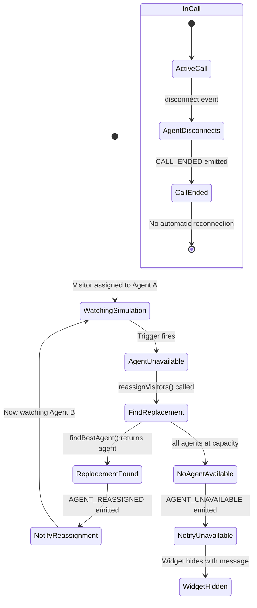

# Feature: P4 - Visitor Reassignment

## Quick Summary
Visitor Reassignment handles what happens when an agent becomes unavailable (disconnects, goes away, rejects, or times out) and a visitor needs to be handed off to another agent. The system attempts to find a replacement agent or gracefully notifies the visitor if none are available.

## Affected Users
- [x] Website Visitor (experiences the handoff)
- [x] Agent (receives reassigned visitors)
- [x] Admin (sees reassignment in call logs)
- [ ] Platform Admin

---

## 1. WHAT IT DOES

### Purpose
Ensures visitors don't get stuck with an unresponsive or unavailable agent by:
1. **Detecting unavailability** - Agent disconnect, away status, call rejection, or RNA timeout
2. **Finding replacement** - Routes visitor to next best available agent
3. **Graceful degradation** - If no agent available, hides widget with "got pulled away" message

### User Goals
| User Type | What They Want | How This Feature Helps |
|-----------|---------------|----------------------|
| Visitor | Not stuck waiting forever | Automatic handoff to available agent |
| Visitor | Know what's happening | "Agent got pulled away" message explains transition |
| Agent | Fair workload when others drop | Reassigned visitors distributed evenly |
| Admin | No lost leads | Visitors routed to someone even if original agent unavailable |

---

## 2. HOW IT WORKS

### High-Level Flow

```
Agent Becomes Unavailable
        │
        ├─── Pre-Call (watching simulation) ──► AGENT_REASSIGNED or AGENT_UNAVAILABLE
        │
        └─── Mid-Call (in call) ──► CALL_ENDED (no automatic reconnection)
```

### All Reassignment Triggers

| # | Trigger | Event/Function | What Happens |
|---|---------|----------------|--------------|
| 1 | Agent goes Away (manual) | `AGENT_AWAY` | Reassign all simulation viewers |
| 2 | Agent goes Offline | `AGENT_STATUS` with "offline" | Reassign all simulation viewers |
| 3 | Agent disconnects | Socket `disconnect` event | 10s grace period, then reassign |
| 4 | Agent accepts call | `CALL_ACCEPT` | Reassign OTHER simulation viewers (not caller) |
| 5 | Agent rejects call | `CALL_REJECT` | Route calling visitor to next agent |
| 6 | RNA timeout | 15s no answer | Mark agent away, route to next agent |
| 7 | Heartbeat stale | 2 min no heartbeat | Mark agent away, reassign viewers |

### State Machine



### Pre-Call vs Mid-Call: Key Difference

| Scenario | What Happens | Visitor Experience | Recovery |
|----------|--------------|-------------------|----------|
| **Pre-Call** (watching simulation) | Visitor reassigned to new agent | "Agent A got pulled away. Agent B is taking over." | Seamless - new agent's video plays |
| **Mid-Call** (active WebRTC call) | Call ends immediately | "Call ended" overlay | NO automatic reconnection - visitor must start new call |

---

## 3. DETAILED LOGIC

### Triggers & Events

| Event Name | Where It Fires | What It Does | Side Effects |
|------------|---------------|--------------|--------------|
| `agent:away` | Dashboard → Server | Triggers `reassignVisitors()` | Cancels pending call requests |
| `agent:reassigned` | Server → Widget | Notifies visitor of new agent | Widget shows handoff message |
| `agent:unavailable` | Server → Widget | No replacement found | Widget hides |
| `call:rejected` | Server (from agent) | Routes visitor to different agent | Creates new call request |
| `call:ended` | Server → Widget | Call terminated | No auto-reconnection |

### Key Functions/Components

| Function/Component | File | Purpose |
|-------------------|------|---------|
| `reassignVisitors(fromAgentId, excludeVisitorId?)` | `pool-manager.ts:767-806` | Reassign all visitors from one agent to others |
| `notifyReassignments(io, poolManager, result, reason)` | `socket-handlers.ts:1907-1961` | Emit AGENT_REASSIGNED/AGENT_UNAVAILABLE to affected visitors |
| `startRNATimeout(...)` | `socket-handlers.ts:1541-1684` | Timer that triggers reassignment on RNA |
| `AGENT_AWAY` handler | `socket-handlers.ts:528-606` | Handles manual away, triggers reassignment |
| `disconnect` handler | `socket-handlers.ts:1361-1494` | Agent disconnect with grace period |
| `CALL_REJECT` handler | `socket-handlers.ts:775-866` | Routes rejected visitor to next agent |

### Reassignment Algorithm

```typescript
function reassignVisitors(fromAgentId, excludeVisitorId?): {
  reassigned: Map<visitorId, newAgentId>,
  unassigned: visitorId[]
} {
  const result = { reassigned: Map(), unassigned: [] };
  const fromAgent = agents.get(fromAgentId);
  
  // Get all visitors to reassign (excluding the one in call)
  const visitorsToReassign = fromAgent.currentSimulations
    .filter(id => id !== excludeVisitorId);
  
  for (const visitorId of visitorsToReassign) {
    // ⚠️ ISSUE: findBestAgent() called with NO pool ID
    // This ignores the visitor's original pool routing!
    const newAgent = findBestAgent(); // Should be findBestAgentForVisitor(...)
    
    if (newAgent && newAgent.agentId !== fromAgentId) {
      assignVisitorToAgent(visitorId, newAgent.agentId);
      result.reassigned.set(visitorId, newAgent.agentId);
    } else {
      // No agent available
      visitor.assignedAgentId = null;
      result.unassigned.push(visitorId);
    }
  }
  
  return result;
}
```

### Data Flow: Agent Goes Away

```
┌──────────────────────────────────────────────────────────────────┐
│                         AGENT_AWAY                                │
│              (agent clicks "Go Away" in dashboard)                │
└─────────────────────────────┬────────────────────────────────────┘
                              │
                              ▼
┌──────────────────────────────────────────────────────────────────┐
│                     UPDATE AGENT STATUS                          │
│  1. poolManager.updateAgentStatus(agentId, "away")               │
│  2. recordStatusChange(agentId, "away", "manual")                │
└─────────────────────────────┬────────────────────────────────────┘
                              │
                              ▼
┌──────────────────────────────────────────────────────────────────┐
│                    REASSIGN VISITORS                             │
│  1. Get agent's currentSimulations list                          │
│  2. For each visitor:                                            │
│     a. findBestAgent() to find replacement                       │
│     b. If found: assignVisitorToAgent()                          │
│     c. If not: add to unassigned list                            │
│  3. Return { reassigned: Map, unassigned: [] }                   │
└─────────────────────────────┬────────────────────────────────────┘
                              │
              ┌───────────────┴───────────────┐
              │                               │
              ▼                               ▼
┌─────────────────────────┐     ┌─────────────────────────┐
│     REASSIGNED          │     │    UNASSIGNED           │
│  Emit AGENT_REASSIGNED: │     │  Emit AGENT_UNAVAILABLE:│
│  - previousAgentId      │     │  - visitorId            │
│  - newAgent profile     │     │  - widgetSettings       │
│  - reason: "agent_away" │     │  - previousAgentName    │
└─────────────────────────┘     │  - reason: "agent_away" │
                                └─────────────────────────┘
```

### Data Flow: Agent Disconnects

```
┌──────────────────────────────────────────────────────────────────┐
│                      SOCKET DISCONNECT                            │
│              (network issue, tab close, refresh)                  │
└─────────────────────────────┬────────────────────────────────────┘
                              │
                              ▼
┌──────────────────────────────────────────────────────────────────┐
│                IF AGENT IN CALL → END IMMEDIATELY                │
│  1. endCall(activeCall.callId)                                   │
│  2. markCallEnded()                                              │
│  3. Emit CALL_ENDED to visitor                                   │
│  (No grace period - can't leave visitor hanging mid-call)        │
└─────────────────────────────┬────────────────────────────────────┘
                              │
                              ▼
┌──────────────────────────────────────────────────────────────────┐
│                   10-SECOND GRACE PERIOD                         │
│  pendingDisconnects.set(agentId, { timeout, previousStatus })    │
│  Agent status set to "offline"                                   │
│  (Allows for page refresh without reassignment)                  │
└─────────────────────────────┬────────────────────────────────────┘
                              │
              ┌───────────────┴───────────────┐
              │                               │
       Reconnects                      Doesn't Reconnect
              │                               │
              ▼                               ▼
┌─────────────────────────┐     ┌─────────────────────────┐
│   CANCEL TIMEOUT        │     │   GRACE PERIOD EXPIRES  │
│  Clear pendingDisconnect│     │  1. endSession()        │
│  Restore previous status│     │  2. unregisterAgent()   │
│  Continue as normal     │     │  3. reassignVisitors()  │
└─────────────────────────┘     │  4. Notify visitors     │
                                └─────────────────────────┘
```

### Data Flow: Call Rejection → Re-routing

```
┌──────────────────────────────────────────────────────────────────┐
│                        CALL_REJECT                                │
│              (agent clicks "Reject" on incoming call)             │
└─────────────────────────────┬────────────────────────────────────┘
                              │
                              ▼
┌──────────────────────────────────────────────────────────────────┐
│                   MARK CALL REJECTED                             │
│  1. clearRNATimeout(requestId)                                   │
│  2. markCallRejected(requestId) in DB                            │
│  3. poolManager.rejectCall(requestId)                            │
└─────────────────────────────┬────────────────────────────────────┘
                              │
                              ▼
┌──────────────────────────────────────────────────────────────────┐
│                 FIND DIFFERENT AGENT                             │
│  findBestAgentForVisitor(orgId, pageUrl, excludeAgentId)         │
│  (Excludes the agent who just rejected)                          │
└─────────────────────────────┬────────────────────────────────────┘
                              │
              ┌───────────────┴───────────────┐
              │                               │
       Agent Found                     No Agent Available
              │                               │
              ▼                               ▼
┌─────────────────────────┐     ┌─────────────────────────┐
│   ROUTE TO NEW AGENT    │     │   HIDE WIDGET           │
│  1. createCallRequest() │     │  1. Set visitor.assigned│
│  2. createCallLog()     │     │     AgentId = null      │
│  3. Emit CALL_INCOMING  │     │  2. Emit AGENT_UNAVAIL- │
│     to new agent        │     │     ABLE with agent name│
│  4. startRNATimeout()   │     │  Widget shows "got      │
└─────────────────────────┘     │  pulled away" message   │
                                └─────────────────────────┘
```

---

## 4. VISITOR UX DURING REASSIGNMENT

### What the Visitor Sees

| Scenario | Visual | Duration | Message |
|----------|--------|----------|---------|
| Reassigned to new agent | Handoff overlay | 3 seconds | "Sarah got pulled away. John is taking over." |
| No agent available | Widget hides | Permanent (until refresh) | "Sarah got pulled away." (then hides) |
| Mid-call disconnect | Call ended overlay | Until dismissed | "Call ended" |
| RNA timeout | Widget hides | Permanent | "Sarah got pulled away." |

### Widget Handling (Widget.tsx)

```typescript
// On AGENT_REASSIGNED
onAgentReassigned: (data) => {
  const previousName = agent?.displayName ?? "Your assistant";
  const newName = data.newAgent.displayName;
  setHandoffMessage(`${previousName} got pulled away. ${newName} is taking over.`);
  setAgent(data.newAgent);
  
  // Reset intro sequence for new agent
  clearStoredWidgetState();
  setHasCompletedIntroSequence(false);
  
  // Clear message after HANDOFF_MESSAGE_DURATION (3s)
  setTimeout(() => setHandoffMessage(null), 3000);
}

// On AGENT_UNAVAILABLE
onAgentUnavailable: (data) => {
  // Clean up camera/mic preview
  previewStream?.getTracks().forEach(track => track.stop());
  
  if (data.previousAgentName) {
    // Show "got pulled away" message briefly before hiding
    setHandoffMessage(`${data.previousAgentName} got pulled away.`);
    setTimeout(() => {
      setAgent(null);
      setState("hidden");
    }, 3000);
  } else {
    // No agent name - hide immediately
    setAgent(null);
    setState("hidden");
  }
}
```

---

## 5. EDGE CASES

### Complete Scenario Matrix

| # | Scenario | Trigger | Current Behavior | Correct? | Notes |
|---|----------|---------|------------------|----------|-------|
| 1 | Agent away, replacement available | AGENT_AWAY | Reassigned, handoff message shown | ✅ | Happy path |
| 2 | Agent away, no replacement | AGENT_AWAY | Widget hides with "got pulled away" | ✅ | Graceful degradation |
| 3 | Agent disconnects, reconnects within 10s | disconnect | No reassignment, continues normally | ✅ | Page refresh handling |
| 4 | Agent disconnects, doesn't reconnect | disconnect | Grace period expires, reassign | ✅ | Clean exit |
| 5 | Agent disconnects mid-call | disconnect | Call ends immediately, CALL_ENDED | ✅ | Can't leave visitor in broken call |
| 6 | Agent rejects call, another available | CALL_REJECT | Routes to next agent automatically | ✅ | Seamless for visitor |
| 7 | Agent rejects, no others available | CALL_REJECT | AGENT_UNAVAILABLE, widget hides | ✅ | "Got pulled away" message |
| 8 | RNA timeout (15s), another available | RNA timer | Agent marked away, routes to next | ✅ | Visitor not stuck |
| 9 | RNA timeout, no others | RNA timer | AGENT_UNAVAILABLE sent | ✅ | Widget hides |
| 10 | All agents cascade-away | Multiple AGENT_AWAY | Each reassignment tries next agent | ⚠️ | Could chain-reassign same visitor multiple times |
| 11 | Visitor in call, agent goes away | Can't happen | Call prevents away status | ✅ | Agent can't go away mid-call |
| 12 | Two visitors same agent, one in call | CALL_ACCEPT | Only non-calling visitor reassigned | ✅ | `excludeVisitorId` parameter |
| 13 | Reassigned visitor's pool mismatch | AGENT_AWAY | May get agent from different pool | ⚠️ | **Q-1202-001** - pool routing ignored |
| 14 | Widget receives AGENT_UNAVAILABLE twice | Race condition | First one wins, already hidden | ✅ | State check prevents double handling |
| 15 | Page navigation during reassignment | AGENT_REASSIGNED mid-nav | Widget reinits on new page | ✅ | localStorage state cleared |

### Error States

| Error | When It Happens | What User Sees | Recovery Path |
|-------|-----------------|----------------|---------------|
| No agents in pool | All agents offline/away | Widget hides with message | Wait for agent to come back |
| WebRTC cleanup failure | Mid-call disconnect | May see frozen video briefly | CALL_ENDED triggers cleanup |
| Socket reconnect during reassignment | Network instability | May see duplicate events | Widget state machine handles |
| localStorage full | Can't store widget state | Intro plays again on nav | Non-critical, cosmetic only |

---

## 6. TECHNICAL CONCERNS

### Performance
- **Reassignment**: O(n * m) where n = visitors, m = agents (for each visitor, tries all agents)
- **Notification**: O(n) socket emits for n affected visitors
- **No bottlenecks** for typical workloads (<100 visitors per agent)

### Race Conditions Analysis

| Concern | Risk | Mitigation |
|---------|------|------------|
| Agent reconnects during reassignment | Medium | Grace period is async, but reassignment is sync within timeout callback |
| Multiple agents go away simultaneously | Low | Each AGENT_AWAY handler is independent |
| Visitor navigates during reassignment | Low | Socket disconnect cleans up visitor state |
| CALL_REJECT and RNA timeout same time | Low | `clearRNATimeout()` called in CALL_REJECT handler |

### ⚠️ Known Issue: Pool Routing Ignored in Reassignment

```typescript:767:806:apps/server/src/features/routing/pool-manager.ts
reassignVisitors(fromAgentId: string, excludeVisitorId?: string) {
  for (const visitorId of visitorsToReassign) {
    const newAgent = this.findBestAgent(); // ⚠️ NO POOL ID PASSED!
    // ...
  }
}
```

**Impact**: A visitor originally matched to "Sales Pool" via URL routing could be reassigned to an agent in "Support Pool" when their original agent becomes unavailable.

**This is logged as Q-1202-001 in findings.**

**Suggested Fix**: Change to `findBestAgentForVisitor(visitor.orgId, visitor.pageUrl)` which respects pool routing and falls back to any agent if no pool agents available.

### Security
- No visitor data exposed during reassignment
- Agent profile sent is same as original assignment (public info only)

### Reliability
- **Server restart mid-reassignment**: Visitors reconnect, get fresh assignment
- **Double AGENT_UNAVAILABLE**: Widget state machine ignores if already hidden
- **Orphaned call state**: RNA timeout and grace period both have cleanup handlers

---

## 7. FIRST PRINCIPLES REVIEW

### Does This Make Sense?

1. **Is the mental model clear?** 
   - ✅ Yes - "If your agent disappears, we'll try to find you another one"
   
2. **Is the feedback immediate?** 
   - ✅ Yes - Handoff message appears instantly
   
3. **Is there transparency?** 
   - ⚠️ Partial - Visitor knows agent "got pulled away" but not why
   
4. **Are errors recoverable?** 
   - ⚠️ Partial - Mid-call disconnect ends call with no reconnection option
   
5. **Is the complexity justified?** 
   - ✅ Yes - Visitor experience would be terrible without reassignment

### Identified Issues

| Issue | Impact | Severity | Suggested Fix |
|-------|--------|----------|--------------|
| Pool routing ignored in `reassignVisitors()` | Visitors may get wrong-specialty agents | 🟡 MEDIUM | Use `findBestAgentForVisitor()` with visitor's orgId/pageUrl |
| Mid-call disconnect ends call permanently | Visitor must restart call | 🟡 MEDIUM | Consider reconnection grace period for calls |
| No cascade protection | Many agents going away = many reassignments | 🟢 LOW | Add cooldown or batch reassignment |
| HANDOFF_MESSAGE_DURATION not configurable | Fixed 3s duration | 🟢 LOW | Make duration configurable |

---

## 8. CODE REFERENCES

| Purpose | File | Lines | Notes |
|---------|------|-------|-------|
| Main reassignment function | `apps/server/src/features/routing/pool-manager.ts` | 767-806 | `reassignVisitors()` - **has pool routing issue** |
| Notify helper | `apps/server/src/features/signaling/socket-handlers.ts` | 1907-1961 | `notifyReassignments()` |
| AGENT_AWAY handler | `apps/server/src/features/signaling/socket-handlers.ts` | 528-606 | Handles manual away |
| disconnect handler | `apps/server/src/features/signaling/socket-handlers.ts` | 1361-1494 | Agent disconnect with grace period |
| CALL_REJECT handler | `apps/server/src/features/signaling/socket-handlers.ts` | 775-866 | Routes to next agent |
| RNA timeout | `apps/server/src/features/signaling/socket-handlers.ts` | 1541-1684 | `startRNATimeout()` |
| Staleness check | `apps/server/src/features/signaling/socket-handlers.ts` | 1502-1533 | Heartbeat-based away marking |
| Widget reassignment UX | `apps/widget/src/Widget.tsx` | 282-341 | `onAgentReassigned`, `onAgentUnavailable` |
| AgentReassignedPayload type | `packages/domain/src/types.ts` | 291-296 | Event payload definition |
| AgentUnavailablePayload type | `packages/domain/src/types.ts` | 298-304 | Event payload definition |
| Socket events | `packages/domain/src/constants.ts` | 39-40 | `AGENT_REASSIGNED`, `AGENT_UNAVAILABLE` |
| Grace period constant | `apps/server/src/features/signaling/socket-handlers.ts` | 64 | `AGENT_DISCONNECT_GRACE_PERIOD = 10000` |

---

## 9. RELATED FEATURES

- [P2: Agent Assignment Algorithm](./agent-assignment.md) - Initial assignment that reassignment builds on
- [P3: Call Lifecycle](./call-lifecycle.md) - What happens during active calls
- [A3: RNA Timeout](../agent/rna-timeout.md) - One trigger for reassignment
- [V8: Agent Unavailable](../visitor/visitor-call.md) - Visitor-side UX when no agents
- [P6: Heartbeat & Staleness](./heartbeat-staleness.md) - Staleness-based reassignment trigger

---

## 10. OPEN QUESTIONS

1. **Should `reassignVisitors()` respect original pool routing?** Currently finds any agent. See Q-1202-001.

2. **Should mid-call agent disconnect have a grace period?** Currently call ends immediately. Could add 10s wait for agent to reconnect.

3. **Is there cascade protection?** If all 5 agents go away in sequence, visitor gets 5 handoff messages. Should there be a "final" message?

4. **Should visitor be notified of rejection reason?** Currently just says "got pulled away" regardless of whether agent rejected vs timed out vs went away.

---

## Session Summary

**Documented by:** Doc Agent 5  
**Feature:** P4 - Visitor Reassignment  
**Date:** 2024-12-02  

### Algorithm Overview
When an agent becomes unavailable, the system:
1. **Detects the trigger** (away, disconnect, reject, RNA timeout, staleness)
2. **Distinguishes pre-call vs mid-call**:
   - Pre-call → Try to reassign to another agent
   - Mid-call → End call immediately (no auto-reconnection)
3. **Finds replacement** using `findBestAgent()` (⚠️ ignores pool routing)
4. **Notifies visitor** with `AGENT_REASSIGNED` or `AGENT_UNAVAILABLE`

### Key Findings
1. **Pool routing is ignored** during reassignment - visitor matched to "Sales Pool" could be reassigned to "Support Pool" agent
2. **Mid-call disconnect ends call permanently** - no grace period or reconnection attempt
3. **Grace period for disconnect is 10 seconds** - allows for page refresh
4. **Handoff message duration is fixed at 3 seconds**

### Reassignment Triggers (7 total)
| Trigger | Grace Period | Pool Routing |
|---------|-------------|--------------|
| Agent Away (manual) | None | ❌ Ignored |
| Agent Offline | None | ❌ Ignored |
| Agent Disconnect | 10 seconds | ❌ Ignored |
| Agent Accepts Call | None | ❌ Ignored |
| Agent Rejects Call | None | ✅ Respected (uses excludeAgentId) |
| RNA Timeout | None | ✅ Respected (routes to next) |
| Heartbeat Stale | None | ❌ Ignored |

