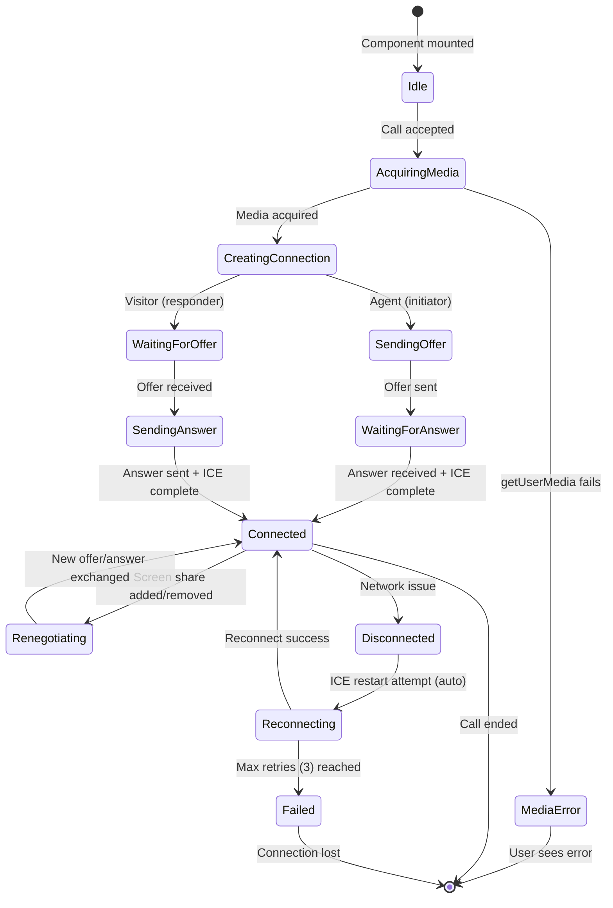

# Feature: WebRTC Signaling

## Quick Summary
WebRTC Signaling enables real-time peer-to-peer video/audio connections between visitors (widget) and agents (dashboard) by exchanging SDP offers/answers and ICE candidates through the signaling server. The system uses Socket.io as the relay mechanism and configures both STUN and TURN servers for NAT traversal.

## Affected Users
- [x] Website Visitor
- [x] Agent
- [ ] Admin
- [ ] Platform Admin

---

## 1. WHAT IT DOES

### Purpose
WebRTC Signaling solves the fundamental "chicken and egg" problem of peer-to-peer connections: two parties need to exchange connection information before they can communicate directly, but they can't communicate directly until they've exchanged that information. The signaling server acts as the trusted intermediary that relays:

1. **Session Description Protocol (SDP)** - Media capabilities, codecs, and connection parameters
2. **ICE Candidates** - Network paths (IP addresses, ports) that peers can use to reach each other

### User Goals
| User Type | What They Want | How This Feature Helps |
|-----------|---------------|----------------------|
| Visitor | Start a video call with an agent | Automatically negotiates the best network path to connect |
| Visitor | Continue call after network change | ICE restart/renegotiation handles network transitions |
| Agent | Accept incoming call and see visitor | Initiates WebRTC offer that visitor responds to |
| Agent | Share screen during call | Triggers renegotiation to add new media tracks |

---

## 2. HOW IT WORKS

### High-Level Flow

1. **Call Accepted**: Agent accepts incoming call → Server notifies visitor via `call:accepted`
2. **Media Acquisition**: Both parties request camera/microphone access via `getUserMedia()`
3. **Offer Creation**: Agent (initiator) creates SDP offer with local media
4. **Offer Relay**: Agent sends offer via `webrtc:signal` → Server relays to visitor
5. **Answer Creation**: Visitor sets remote description, creates answer
6. **Answer Relay**: Visitor sends answer via `webrtc:signal` → Server relays to agent
7. **ICE Gathering**: Both parties gather ICE candidates as STUN/TURN servers are queried
8. **ICE Exchange**: Each party sends candidates via `webrtc:signal` → Server relays to peer
9. **Connection Established**: ICE completes, direct peer connection established
10. **Media Flows**: Video/audio streams directly between peers (bypassing server)

### State Machine


### State Definitions
| State | Description | How to Enter | How to Exit |
|-------|-------------|--------------|-------------|
| Idle | Hook mounted, no active call | Component mount | `isCallAccepted` becomes true |
| AcquiringMedia | Requesting camera/mic permission | Call accepted | `getUserMedia` resolves/rejects |
| MediaError | Camera/mic access denied or unavailable | `getUserMedia` throws | User dismisses error |
| CreatingConnection | RTCPeerConnection created, tracks added | Media acquired | First signal sent |
| WaitingForOffer | Visitor waiting for agent's SDP offer | Peer connection created (visitor) | Offer received |
| SendingOffer | Agent creating and sending SDP offer | Peer connection created (agent) | `setLocalDescription` completes |
| WaitingForAnswer | Agent waiting for visitor's SDP answer | Offer sent | Answer received |
| SendingAnswer | Visitor creating and sending SDP answer | Offer processed | `setLocalDescription` completes |
| Connected | Peer connection established, media flowing | `connectionState` = "connected" | Screen share or disconnect |
| Renegotiating | Adding/removing screen share tracks | `addTrack` or `removeTrack` called | New answer received |
| Disconnected | Temporary network interruption | `connectionState` = "disconnected" | ICE restart begins automatically |
| Reconnecting | ICE restart in progress | `performIceRestart()` called | Success or max attempts reached |
| Failed | Connection cannot be established | Max ICE restart attempts (3) exhausted | User ends call |

---

## 3. DETAILED LOGIC

### Triggers & Events
| Event Name | Where It Fires | What It Does | Side Effects |
|------------|---------------|--------------|--------------|
| `call:accepted` | Server → Widget | Visitor learns call was accepted, triggers WebRTC init | Starts `initializeCall()` |
| `call:started` | Server → Dashboard | Agent learns call started, triggers WebRTC init | Starts `initializeCall()` |
| `webrtc:signal` | Client → Server → Client | Relays SDP offers/answers/ICE candidates | Peer connection negotiation |
| `ontrack` | RTCPeerConnection | Remote media track received | Sets `remoteStream`, marks connected |
| `onicecandidate` | RTCPeerConnection | Local ICE candidate gathered | Sends to peer via `webrtc:signal` |
| `onconnectionstatechange` | RTCPeerConnection | Peer connection state changed | Updates `isConnected`/`isConnecting` |
| `oniceconnectionstatechange` | RTCPeerConnection | ICE-specific state changed | Detects ICE failures |

### Key Functions/Components
| Function/Component | File | Purpose |
|-------------------|------|---------|
| `useWebRTC` (dashboard) | `apps/dashboard/src/features/webrtc/use-webrtc.ts` | React hook managing agent-side WebRTC |
| `useWebRTC` (widget) | `apps/widget/src/features/webrtc/useWebRTC.ts` | Preact hook managing visitor-side WebRTC |
| `ActiveCallStage` | `apps/dashboard/src/features/webrtc/active-call-stage.tsx` | UI component for active call display |
| `WEBRTC_SIGNAL` handler | `apps/server/src/features/signaling/socket-handlers.ts:1255-1281` | Server relay logic for signals |
| `processSignal` | Widget `useWebRTC.ts:169-197` | Processes incoming offer/answer/ICE |

### Data Flow

```
┌─────────────────────────────────────────────────────────────────────────────┐
│                           SIGNALING FLOW                                     │
├─────────────────────────────────────────────────────────────────────────────┤
│                                                                              │
│  ┌─────────────┐          ┌─────────────┐          ┌─────────────┐         │
│  │   AGENT     │          │   SERVER    │          │   VISITOR   │         │
│  │ (Dashboard) │          │ (Socket.io) │          │  (Widget)   │         │
│  └──────┬──────┘          └──────┬──────┘          └──────┬──────┘         │
│         │                        │                        │                 │
│         │ ① call:accept          │                        │                 │
│         │ ─────────────────────► │                        │                 │
│         │                        │ ② call:accepted        │                 │
│         │                        │ ─────────────────────► │                 │
│         │                        │                        │                 │
│         │ ③ getUserMedia()       │        getUserMedia() ③│                 │
│         │ ◄──── local ────►      │        ◄──── local ───►│                 │
│         │                        │                        │                 │
│         │ ④ Create RTCPeerConnection, add tracks          │                 │
│         │ ◄───────────────────────────────────────────────│                 │
│         │                        │                        │                 │
│         │ ⑤ createOffer()        │                        │                 │
│         │ setLocalDescription()  │                        │                 │
│         │ ─────────────────────► │                        │                 │
│         │    webrtc:signal       │ ⑥ webrtc:signal        │                 │
│         │    (offer)             │ ─────────────────────► │                 │
│         │                        │                        │ ⑦ setRemoteDesc │
│         │                        │                        │   createAnswer()│
│         │                        │                        │   setLocalDesc  │
│         │                        │ ⑧ webrtc:signal        │                 │
│         │                        │ ◄───────────────────── │                 │
│         │ ⑨ webrtc:signal        │    (answer)            │                 │
│         │ ◄───────────────────── │                        │                 │
│         │ setRemoteDescription() │                        │                 │
│         │                        │                        │                 │
│         │ ⑩ ICE Candidates exchanged bi-directionally     │                 │
│         │ ◄─────────── webrtc:signal (candidate) ────────►│                 │
│         │                        │                        │                 │
│         │ ⑪ P2P Connection Established                    │                 │
│         │ ◄══════════════════════════════════════════════►│                 │
│         │           (Video/Audio flows directly)          │                 │
│                                                                              │
└─────────────────────────────────────────────────────────────────────────────┘
```

### ICE Server Configuration

Both widget and dashboard use identical ICE server configuration:

```typescript
const ICE_SERVERS = [
  // STUN Servers (discover public IP)
  { urls: "stun:stun.l.google.com:19302" },           // Google's free STUN
  { urls: "stun:greetnow.metered.live:80" },          // Metered.live STUN
  
  // TURN Servers (relay when direct fails)
  {
    urls: "turn:greetnow.metered.live:80?transport=udp",
    username: "...",
    credential: "...",
  },
  {
    urls: "turn:greetnow.metered.live:80?transport=tcp",
    username: "...",
    credential: "...",
  },
  {
    urls: "turn:greetnow.metered.live:443?transport=tcp",
    username: "...",
    credential: "...",
  },
  {
    urls: "turns:greetnow.metered.live:5349?transport=tcp",  // TLS-secured TURN
    username: "...",
    credential: "...",
  },
];
```

**Why this order matters:**
1. STUN tried first (cheaper, faster if direct connection possible)
2. TURN UDP on port 80 (most permissive, best quality)
3. TURN TCP on port 80 (fallback if UDP blocked)
4. TURN TCP on port 443 (looks like HTTPS, passes most firewalls)
5. TURNS on port 5349 (TLS-encrypted, for strictest corporate networks)

---

## 4. EDGE CASES

### Complete Scenario Matrix

| # | Scenario | Trigger | Current Behavior | Correct? | Notes |
|---|----------|---------|------------------|----------|-------|
| 1 | Happy path - direct connection | Both peers on open networks | STUN succeeds, P2P connection established | ✅ | Most common case |
| 2 | Symmetric NAT (one peer) | Corporate firewall on one side | TURN relay kicks in automatically | ✅ | ICE tries all candidates |
| 3 | Symmetric NAT (both peers) | Both behind strict firewalls | TURN relay used, slightly higher latency | ✅ | Still works |
| 4 | Camera permission denied | User clicks "Block" on permission | Clear error message with instructions | ✅ | Widget shows 🔒 icon guidance |
| 5 | No camera detected | Desktop without webcam | "Couldn't find a camera" message | ✅ | Specific error handling |
| 6 | Camera in use by another app | Zoom/Teams has camera locked | "Try closing other apps" message | ✅ | NotReadableError handled |
| 7 | Network drops mid-call | WiFi disconnects briefly | ICE restart attempted (up to 3 times) | ✅ | Automatic reconnection logic |
| 8 | Offer arrives before peer ready | Race condition on call accept | Signals queued in `pendingSignalsRef` | ✅ | Processed when peer created |
| 9 | Agent starts screen share | Agent clicks share button | Renegotiation offer sent to visitor | ✅ | Visitor accepts automatically |
| 10 | Visitor starts screen share | Visitor clicks share button | Renegotiation offer sent to agent | ✅ | Agent accepts automatically |
| 11 | Screen share stopped via browser | User clicks "Stop sharing" | `track.onended` triggers cleanup | ✅ | Renegotiation removes track |
| 12 | WebRTC connection timeout | No response after 30s | Error shown, retry button offered | ✅ | `WEBRTC_CONNECTION_TIMEOUT = 30000` |
| 13 | Server restart during call | Server process restarts | Socket disconnects, call ends | ⚠️ | Call reconnection is separate feature |
| 14 | ICE connection fails | All candidates exhausted | `iceConnectionState` = "failed", error shown | ✅ | Connection fails gracefully |

### Error States
| Error | When It Happens | What User Sees | Recovery Path |
|-------|-----------------|----------------|---------------|
| NotAllowedError | Camera/mic permission denied | "We need camera access. Click the 🔒 icon..." | User grants permission, retry |
| NotFoundError | No camera device detected | "We couldn't find a camera on this device." | Connect camera, refresh |
| NotReadableError | Camera used by another app | "Camera is being used by another application." | Close other app, retry |
| Connection timeout | No response in 30s | "Connection is taking longer than usual." | Retry button shown |
| ICE restart in progress | Connection temporarily lost | "Reconnecting..." status | Automatic ICE restart (up to 3 attempts) |
| ICE failed after retries | All restart attempts exhausted | "Connection failed after multiple attempts" | Manual retry button shown |
| Connection lost | Network interruption | Automatic recovery attempt, then error | Automatic retry, then manual |

---

## 5. UI/UX REVIEW

### User Experience Audit

| Step | User Action | System Response | Clear? | Issues |
|------|------------|-----------------|--------|--------|
| Call accepted | Agent clicks "Accept" | Loading spinner, "Connecting to visitor..." | ✅ | - |
| Media request | Browser permission prompt | Clear permission dialog | ✅ | Browser-controlled |
| Connecting | Waiting for WebRTC | "Connecting to visitor..." with spinner | ✅ | - |
| Connected | Connection established | Remote video appears, "Connected" badge | ✅ | - |
| Screen share | Agent clicks share button | Screen picker dialog | ✅ | Browser-controlled |
| Mute toggle | Click mic button | Icon changes, track disabled | ✅ | Immediate feedback |
| Video toggle | Click camera button | Icon changes, track disabled | ✅ | Immediate feedback |
| Connection lost | Network drops | Status may not update immediately | ⚠️ | Could show "Reconnecting..." |
| Error | Connection fails | Error message with retry option | ✅ | Friendly non-technical messages |

### Accessibility
- **Keyboard navigation**: Video controls are keyboard accessible ✅
- **Screen reader support**: ARIA labels defined in widget constants ✅
- **Color contrast**: Uses theme tokens (light/dark compatible) ✅
- **Loading states**: Clear spinner and status indicators ✅

---

## 6. TECHNICAL CONCERNS

### Performance
- **ICE gathering**: Can take 2-5s on slow networks; UI shows loading state
- **TURN relay latency**: Adds ~50-100ms when TURN is used; unavoidable for restrictive networks
- **Memory**: MediaStream objects properly cleaned up in `cleanup()` function
- **Bandwidth**: No explicit bandwidth limits; relies on WebRTC adaptive bitrate

### Security
- **TURN credentials**: Hardcoded in client code (visible in bundle) ⚠️
  - *Mitigation*: Metered.live credentials are per-domain restricted
  - *Recommendation*: Consider rotating credentials periodically
- **Signal relay**: Server doesn't inspect/modify SDP content, just relays ✅
- **Media encryption**: WebRTC uses DTLS-SRTP by default (encrypted) ✅

### Reliability
- **Server restart**: Active calls will drop; handled by call reconnection feature
- **TURN server down**: Fallback to other TURN servers in array
- **Google STUN down**: Fallback to Metered.live STUN

### Race Conditions
| Potential Race | Protection Mechanism |
|----------------|---------------------|
| Signal arrives before peer created | `pendingSignalsRef` queues signals, processed when ready |
| Double initialization | `isInitializingRef` prevents concurrent `initializeCall()` calls |
| Cleanup during connection | `isUnmountingRef` prevents state updates after unmount |
| Multiple track events | First stream assigned to camera, subsequent to screen share |

---

## 7. FIRST PRINCIPLES REVIEW

### Does This Make Sense?

1. **Is the mental model clear?** 
   - ✅ Yes - User understands they're in a video call, connection status is visible

2. **Is the control intuitive?** 
   - ✅ Yes - Standard video call controls (mute, camera, end call)

3. **Is feedback immediate?** 
   - ✅ Mute/video toggle: Immediate
   - ⚠️ Connection state changes: May lag 1-2s behind reality

4. **Is the flow reversible?** 
   - ✅ Yes - User can end call at any time

5. **Are errors recoverable?** 
   - ✅ Yes - Retry buttons for connection failures
   - ⚠️ Media errors require user action (grant permission)

6. **Is the complexity justified?** 
   - ✅ Yes - WebRTC is inherently complex; the abstraction hides it well

### Identified Issues
| Issue | Impact | Severity | Suggested Fix |
|-------|--------|----------|--------------|
| TURN credentials in client bundle | Credentials visible in browser dev tools | 🟢 Low | Already domain-restricted; consider token rotation |
| Widget/dashboard ICE config duplicated | Maintenance burden, could drift | 🟢 Low | Extract to `@ghost-greeter/domain` |
| Connection timeout callback not always called | `onConnectionTimeout` prop but may not fire in all failure modes | 🟢 Low | Ensure timeout fires for all error paths |

---

## 8. CODE REFERENCES

| Purpose | File | Lines | Notes |
|---------|------|-------|-------|
| Widget WebRTC hook | `apps/widget/src/features/webrtc/useWebRTC.ts` | 1-509 | Visitor-side connection management |
| Dashboard WebRTC hook | `apps/dashboard/src/features/webrtc/use-webrtc.ts` | 1-369 | Agent-side connection management |
| Active call UI | `apps/dashboard/src/features/webrtc/active-call-stage.tsx` | 1-341 | Agent call display component |
| Signal relay handler | `apps/server/src/features/signaling/socket-handlers.ts` | 1251-1281 | Server signal relay logic |
| WebRTC signal type | `packages/domain/src/types.ts` | 260-264 | `WebRTCSignalPayload` definition |
| Socket events | `packages/domain/src/constants.ts` | 29 | `WEBRTC_SIGNAL` event name |
| Widget timing constants | `apps/widget/src/constants.ts` | 98-128 | `WEBRTC_CONNECTION_TIMEOUT` = 30s |

---

## 9. RELATED FEATURES

- [Call Lifecycle](./call-lifecycle.md) - Overall call state management
- [Visitor Call](../visitor/visitor-call.md) - Visitor-side call initiation
- [Incoming Call](../agent/incoming-call.md) - Agent-side call acceptance
- [Visitor Reassignment](./visitor-reassignment.md) - What happens if agent disconnects

---

## 10. OPEN QUESTIONS

1. **Q-P5-002**: The widget and dashboard have identical `ICE_SERVERS` arrays. Should this be centralized in `@ghost-greeter/domain` to prevent drift?

2. **Q-P5-003**: TURN credentials are visible in the client bundle. Are there plans to implement short-lived tokens via server-side credential vending?

3. **Q-P5-004**: What happens if BOTH STUN servers and ALL TURN servers fail? Should there be a fallback to notify the user that video calling is unavailable?

---

## APPENDIX: Signal Types Reference

### SDP Offer
Sent by agent (initiator) after `createOffer()`:
```typescript
{
  targetId: "visitor_abc123",
  signal: {
    type: "offer",
    sdp: "v=0\r\no=- 1234567890 2 IN IP4 127.0.0.1..."
  }
}
```

### SDP Answer
Sent by visitor (responder) after `createAnswer()`:
```typescript
{
  targetId: "agent_xyz789",
  signal: {
    type: "answer",
    sdp: "v=0\r\no=- 9876543210 2 IN IP4 127.0.0.1..."
  }
}
```

### ICE Candidate
Sent by both parties as candidates are discovered:
```typescript
{
  targetId: "visitor_abc123",
  signal: {
    type: "candidate",
    candidate: {
      candidate: "candidate:1 1 UDP 2122194687 192.168.1.1 54321 typ host",
      sdpMid: "0",
      sdpMLineIndex: 0
    }
  }
}
```

### Renegotiation (Screen Share)
When adding screen share, initiator sends new offer:
```typescript
{
  targetId: "visitor_abc123",
  signal: {
    type: "offer",  // New offer with additional m= line for screen
    sdp: "v=0\r\n..."
  }
}
```

