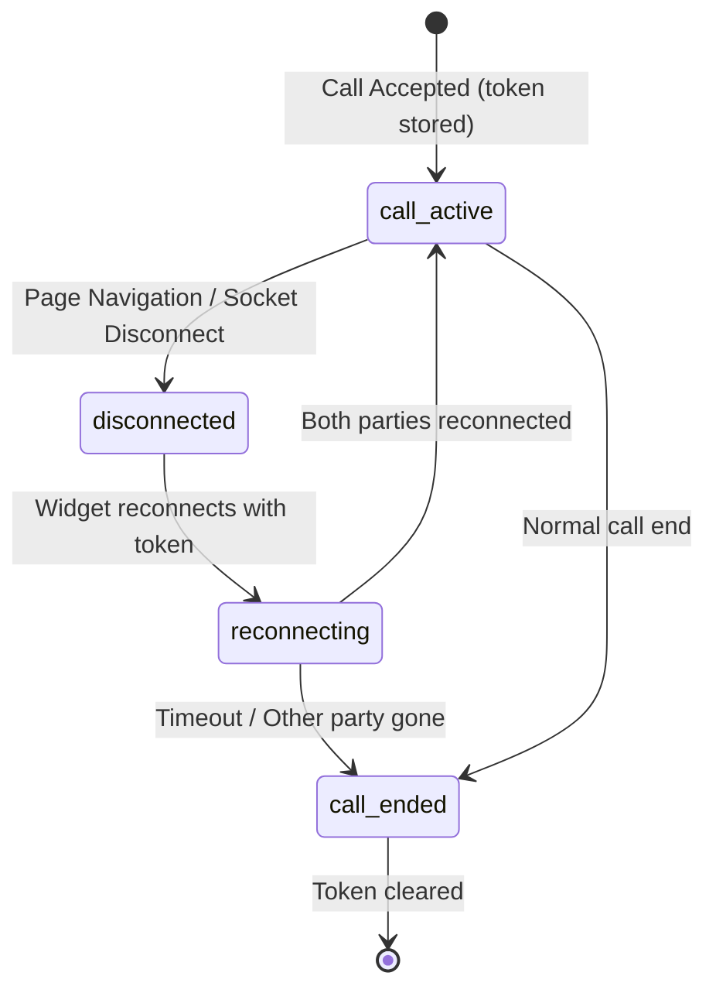

# Feature: Call Reconnection (V4)

## Quick Summary

Call Reconnection allows visitors to maintain their active call state when navigating between pages on a website, or when recovering from brief network interruptions. The system stores a reconnect token in localStorage that enables both the visitor and agent to re-establish their WebRTC connection without losing the call.

## Affected Users
- [x] Website Visitor
- [x] Agent
- [ ] Admin
- [ ] Platform Admin

---

## 1. WHAT IT DOES

### Purpose

Modern websites are often SPAs or have multi-page journeys (e.g., browsing → product → checkout). Without call reconnection, a visitor in an active video call would lose the call whenever they navigate to a different page. This feature ensures call continuity across page navigation, providing a seamless experience for both visitors and agents.

### User Goals

| User Type | What They Want | How This Feature Helps |
|-----------|---------------|----------------------|
| Visitor | Continue call while browsing | Call persists across page navigation |
| Visitor | Recover from network hiccups | Automatic reconnection within timeout window |
| Agent | Not lose calls due to visitor navigation | Call state maintained, WebRTC re-established |
| Agent | Know if visitor disconnected intentionally vs accidentally | Clear reconnection vs ended states |

---

## 2. HOW IT WORKS

### High-Level Flow

**Visitor Page Navigation (Normal Case):**

1. Visitor is in active call with agent
2. Call is accepted → server generates `reconnectToken` and sends to visitor
3. Visitor stores `{ reconnectToken, callId, agentId, orgId, timestamp }` in localStorage
4. Visitor navigates to new page (widget re-initializes)
5. Widget connects to signaling server
6. Widget checks localStorage for stored call (within 5-minute expiry)
7. Widget emits `CALL_RECONNECT` with the stored token
8. Server looks up call by token in database
9. Server verifies call is still active (agent still `in_call`)
10. Server re-registers visitor with their original `visitorId`
11. Server notifies both parties of successful reconnection
12. WebRTC connection is re-established (new peer connection)
13. New `reconnectToken` is generated for future reconnections

### State Machine



### State Definitions

| State | Description | How to Enter | How to Exit |
|-------|-------------|--------------|-------------|
| `call_active` | Active WebRTC call between visitor and agent | Call accepted; call reconnected | Page nav; call ended |
| `disconnected` | Socket disconnected, call state persisted | Page navigation; network issue | Reconnect attempt |
| `reconnecting` | Attempting to restore call via token | Socket connected with stored token | Reconnected; timeout |
| `call_ended` | Call terminated, token invalidated | Normal end; reconnect timeout; agent ended | Clean state |

---

## 3. DETAILED LOGIC

### Token Storage & Retrieval

**Widget Side (localStorage):**

```typescript
// Storage key and constants
const CALL_STORAGE_KEY = "gg_active_call";
const CALL_EXPIRY_MS = 5 * 60 * 1000; // 5 minutes max call recovery window

// Stored data structure
interface StoredCallData {
  reconnectToken: string;
  callId: string;
  agentId: string;
  orgId: string;
  timestamp: number;
}
```

**Server Side (Database):**

The `call_logs` table stores reconnection state:
- `reconnect_token`: 64-character hex string (32 random bytes)
- `reconnect_eligible`: boolean flag for active calls
- `last_heartbeat_at`: timestamp for orphaned call detection

### Triggers & Events

| Event Name | Where It Fires | What It Does | Side Effects |
|------------|---------------|--------------|--------------|
| `call:accepted` | Server → Widget | Sends `reconnectToken` | Widget stores to localStorage |
| `call:reconnect` | Widget → Server | Attempts call recovery | Server validates token, re-establishes call |
| `call:reconnecting` | Server → Both | Notifies reconnection in progress | UI shows "Reconnecting..." |
| `call:reconnected` | Server → Both | Confirms successful reconnection | New token issued, WebRTC restarts |
| `call:reconnect_failed` | Server → Both | Reconnection failed | Token cleared, call ended |

### Key Functions/Components

| Function/Component | File | Purpose |
|-------------------|------|---------|
| `storeActiveCall()` | `apps/widget/src/features/signaling/useSignaling.ts:128-136` | Saves call data to localStorage |
| `getStoredCall()` | `apps/widget/src/features/signaling/useSignaling.ts:138-163` | Retrieves and validates stored call |
| `clearStoredCall()` | `apps/widget/src/features/signaling/useSignaling.ts:165-172` | Removes call data from localStorage |
| `CALL_RECONNECT` handler | `apps/server/src/features/signaling/socket-handlers.ts:947-1249` | Server-side reconnection logic |
| `getCallByReconnectToken()` | `apps/server/src/lib/call-logger.ts:409-434` | Database lookup by token |
| `markCallReconnected()` | `apps/server/src/lib/call-logger.ts:441-468` | Updates call state after reconnect |
| `startReconnectTimeout()` | `apps/server/src/features/signaling/socket-handlers.ts:1794-1853` | Handles reconnect timeout |

### Data Flow

```
┌─────────────┐                     ┌─────────────┐                     ┌─────────────┐
│   Widget    │                     │   Server    │                     │    Agent    │
└─────────────┘                     └─────────────┘                     └─────────────┘
      │                                   │                                   │
      │  CALL_ACCEPTED (reconnectToken)   │                                   │
      │◄──────────────────────────────────│                                   │
      │                                   │                                   │
      │  [Store token in localStorage]    │                                   │
      │                                   │                                   │
      │  ===== PAGE NAVIGATION =====      │                                   │
      │                                   │                                   │
      │  [Socket disconnects]             │                                   │
      │                                   │                                   │
      │  [New page loads, socket connects]│                                   │
      │                                   │                                   │
      │  CALL_RECONNECT (token)           │                                   │
      │──────────────────────────────────►│                                   │
      │                                   │                                   │
      │                                   │  [Validate token in DB]           │
      │                                   │  [Check agent still in_call]      │
      │                                   │  [Re-register visitor]            │
      │                                   │                                   │
      │  CALL_RECONNECTED (new token)     │  CALL_RECONNECTED (peerId)        │
      │◄──────────────────────────────────│──────────────────────────────────►│
      │                                   │                                   │
      │  [WebRTC re-establishes]          │                                   │◄───────┐
      │◄────────────────────────────────────────────────────────────────────────────────│
      │                                   │                                   │         │
                                                                              ICE/SDP signals
```

---

## 4. EDGE CASES

### Complete Scenario Matrix

| # | Scenario | Trigger | Current Behavior | Correct? | Notes |
|---|----------|---------|------------------|----------|-------|
| 1 | Happy path - page nav | Visitor clicks link | Call reconnects seamlessly | ✅ | < 30s reconnect window |
| 2 | Visitor away 30s-5min | Navigate, wait, return | Token valid in localStorage but server timeout | ⚠️ | See Issue #1 below |
| 3 | Visitor away > 5 min | Navigate, wait > 5 min | Token expired, clean state | ✅ | localStorage expires |
| 4 | Agent ends call while visitor away | Agent clicks End | Visitor reconnect fails | ✅ | Clear error message |
| 5 | Different org | Visit another site with widget | Old token ignored | ✅ | orgId check in `getStoredCall()` |
| 6 | Server restart | Server process restarts | Both parties can reconnect | ✅ | Pending reconnect mechanism |
| 7 | Agent refresh during visitor reconnect | Agent refreshes page | Pending reconnect waits | ✅ | 30s timeout for both |
| 8 | Both parties disconnect simultaneously | Network outage | First to reconnect waits for other | ✅ | `pendingReconnects` Map |
| 9 | Token reuse after call ends | Visitor tries old token | Fails - call status not "accepted" | ✅ | DB query checks `status` |
| 10 | Rapid page navigation | Click, click, click | Multiple reconnects handled | ✅ | Token updated each time |

### Error States

| Error | When It Happens | What User Sees | Recovery Path |
|-------|-----------------|----------------|---------------|
| Token expired | > 5 minutes since last page | Widget shows fresh (minimized) | Start new call |
| Call already ended | Agent ended while visitor away | "Call has already ended" | Start new call |
| Agent not found | Agent logged out | "Agent did not reconnect in time" | Start new call |
| Network timeout | Poor connectivity | "Reconnecting..." then failure | Auto-retry or start new call |
| Server restart | Server process dies | Both parties reconnect via token | Automatic if within 30s |

---

## 5. UI/UX REVIEW

### User Experience Audit

| Step | User Action | System Response | Clear? | Issues |
|------|------------|-----------------|--------|--------|
| Navigate during call | Click link | Brief loading, call resumes | ✅ | May see brief "Reconnecting..." |
| Return after short break | Return to tab | Auto-reconnect attempt | ✅ | - |
| Return after long break | Return to tab | Minimized widget, no error | ⚠️ | No indication call ended silently |
| Agent ends while away | N/A | Widget minimized on return | ✅ | Shows error toast briefly |

### Accessibility
- ✅ `role="status"` and `aria-live="polite"` on reconnecting indicator
- ✅ Error messages displayed in dismissible toast
- ⚠️ No audio cue when call reconnects (could startle user with sudden video/audio)

---

## 6. TECHNICAL CONCERNS

### Performance
- ✅ localStorage operations are synchronous but fast (< 1ms)
- ✅ Token validation is a single indexed DB query
- ✅ No polling - event-driven reconnection

### Security
- ✅ Reconnect token is cryptographically random (32 bytes)
- ✅ Token stored only in visitor's browser (not in URL)
- ✅ Token validated against `orgId` to prevent cross-site hijacking
- ✅ New token issued on each reconnection
- ⚠️ Token visible in localStorage (acceptable for session-like data)

### Reliability
- ✅ Pending reconnect mechanism handles server restart
- ✅ Grace period for agent disconnect (10s) prevents false failures
- ⚠️ In-memory `callLogIds` Map lost on server restart (call logger must re-query DB)

### Race Conditions

**Identified and Handled:**

1. **Both parties reconnect simultaneously** - `pendingReconnects` Map tracks who's waiting
2. **Agent accepts call at exact RNA timeout** - 100ms grace period in RNA handler
3. **Visitor disconnects during pending reconnect** - `handleReconnectPartyDisconnect()` cleans up

---

## 7. FIRST PRINCIPLES REVIEW

### Does This Make Sense?

| Question | Answer |
|----------|--------|
| **Is the mental model clear?** | ⚠️ Partially - users don't know reconnection happens; it just works |
| **Is the control intuitive?** | ✅ Yes - no user action needed, automatic |
| **Is feedback immediate?** | ⚠️ "Reconnecting..." appears but may be too brief to notice |
| **Is the flow reversible?** | ✅ N/A - reconnection is automatic, failure just ends call |
| **Are errors recoverable?** | ✅ Clear path - start new call |
| **Is the complexity justified?** | ✅ Yes - critical for multi-page websites |

### Identified Issues

| Issue | Impact | Severity | Suggested Fix |
|-------|--------|----------|--------------|
| localStorage expiry (5 min) mismatches server timeout (30s) | Visitor may see false hope of reconnection | 🟡 Medium | Align localStorage expiry with server timeout OR extend server timeout |
| No heartbeat during active call | Can't detect if call is truly alive | 🟢 Low | Heartbeat mechanism exists in types but not fully implemented client-side |
| Agent may not know visitor is reconnecting | Agent sees frozen video, no "reconnecting" UI | 🟡 Medium | Add visual indicator to agent dashboard |

---

## 8. CODE REFERENCES

| Purpose | File | Lines | Notes |
|---------|------|-------|-------|
| Token storage utilities | `apps/widget/src/features/signaling/useSignaling.ts` | 22-172 | localStorage helpers |
| Widget reconnect callbacks | `apps/widget/src/Widget.tsx` | 356-375 | `onCallReconnected`, `onCallReconnectFailed` |
| Server CALL_RECONNECT handler | `apps/server/src/features/signaling/socket-handlers.ts` | 947-1249 | Main reconnection logic |
| Pending reconnect management | `apps/server/src/features/signaling/socket-handlers.ts` | 1794-1917 | Timeout handling |
| Database token operations | `apps/server/src/lib/call-logger.ts` | 409-512 | `getCallByReconnectToken`, `markCallReconnected` |
| Reconnection types | `packages/domain/src/types.ts` | 324-348 | `CallReconnectingPayload`, `CallReconnectedPayload` |
| Timing constants | `packages/domain/src/constants.ts` | 88 | `CALL_RECONNECT_TIMEOUT: 30_000` |

---

## 9. RELATED FEATURES

- [Call Lifecycle](../platform/call-lifecycle.md) - Overall call state machine
- [WebRTC Signaling](../platform/webrtc-signaling.md) - How WebRTC connection is re-established
- [Widget Lifecycle](./widget-lifecycle.md) - Widget initialization that triggers reconnect
- [Visitor Reassignment](../platform/visitor-reassignment.md) - What happens if reconnect fails

---

## 10. OPEN QUESTIONS

1. **Q-001**: Should the localStorage expiry (5 min) be reduced to match the server timeout (30s)? Currently, visitors may try to reconnect with a valid localStorage token but the server has already timed out.

2. **Q-002**: Is the call heartbeat mechanism (`CALL_HEARTBEAT` event type defined but `CALL_HEARTBEAT_INTERVAL: 10_000`) actively sending during calls? The widget doesn't appear to emit heartbeats, only the event type is defined.

3. **Q-003**: What should happen if visitor has multiple browser tabs open during a call and navigates in one tab? Currently, all tabs would have the same localStorage token.

4. **Q-004**: Should there be an audio/visual cue when call successfully reconnects to alert both parties that the call is back?

---

## APPENDIX: Key Constants

| Constant | Value | Location | Purpose |
|----------|-------|----------|---------|
| `CALL_STORAGE_KEY` | `"gg_active_call"` | Widget useSignaling.ts | localStorage key |
| `CALL_EXPIRY_MS` | 5 minutes | Widget useSignaling.ts | Client-side token expiry |
| `CALL_RECONNECT_TIMEOUT` | 30 seconds | Domain constants.ts | Server-side wait time |
| `AGENT_DISCONNECT_GRACE_PERIOD` | 10 seconds | Server socket-handlers.ts | Grace before marking offline |
| `ORPHANED_CALL_MAX_AGE` | 60 seconds | Domain constants.ts | Max age for recovery |


