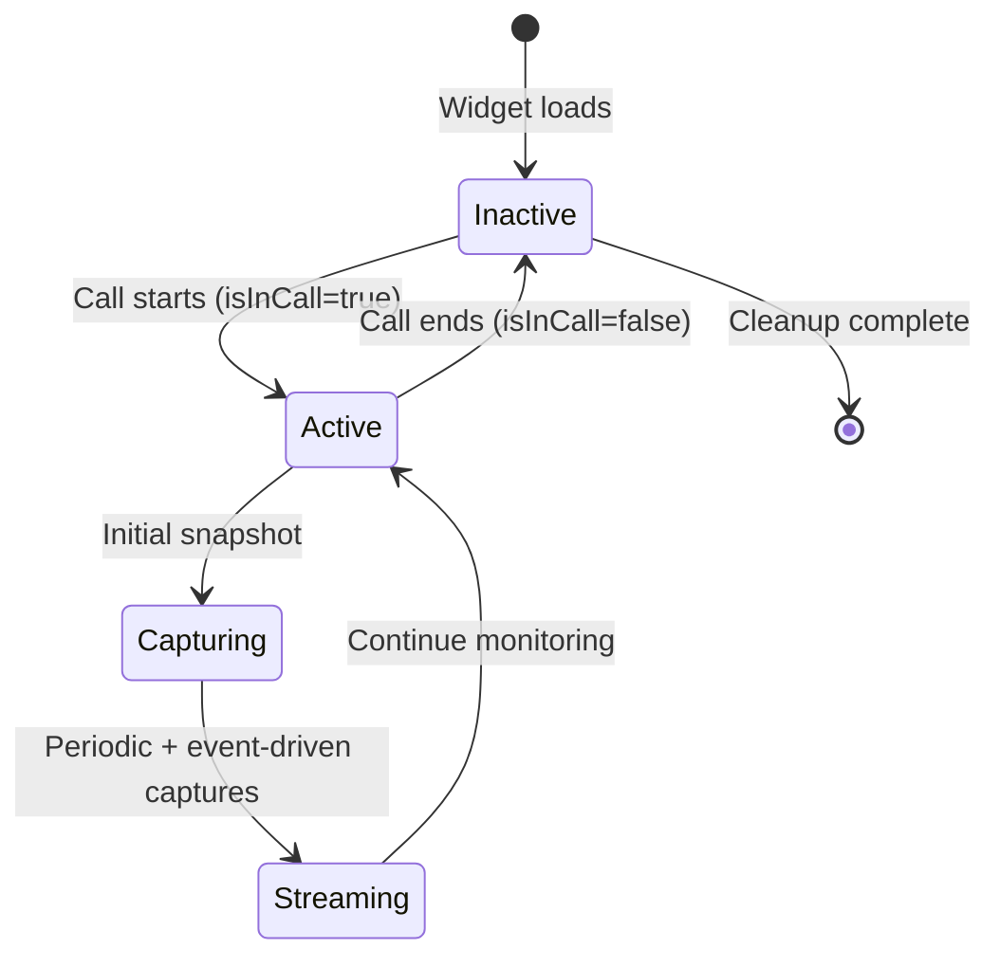

# Feature: V5 - Co-Browse Sender

## Quick Summary
The Co-Browse Sender captures and streams the visitor's browsing experience (DOM snapshots, mouse position, scroll position, and text selection) to the agent during an active call, enabling real-time screen sharing without requiring explicit visitor permission or browser extensions.

## Affected Users
- [x] Website Visitor
- [x] Agent
- [ ] Admin
- [ ] Platform Admin

---

## 1. WHAT IT DOES

### Purpose
Enables agents to see exactly what visitors are looking at on the website during a video call, facilitating better assistance by providing visual context. This is a one-way view (visitor's screen to agent) that works automatically when a call is active.

### User Goals
| User Type | What They Want | How This Feature Helps |
|-----------|---------------|----------------------|
| Visitor | Get help navigating the website | Agent can see their current page and guide them visually |
| Visitor | Not have to explain what they're looking at | Agent automatically sees the same content |
| Agent | Understand visitor's context quickly | Real-time view of visitor's screen without asking |
| Agent | Guide visitors through the site | Can reference specific elements visitor is viewing |

---

## 2. HOW IT WORKS

### High-Level Flow
1. Visitor enters a call (state changes to `in_call`)
2. `useCobrowse` hook activates, capturing initial DOM snapshot
3. Hook sets up periodic snapshot interval (every 2 seconds)
4. Hook attaches event listeners for mouse, scroll, resize, input, and selection
5. MutationObserver watches for significant DOM changes
6. All captured data is sent via Socket.io to the server
7. Server relays data to the assigned agent
8. When call ends, all listeners/observers are cleaned up

### State Machine


### State Definitions
| State | Description | How to Enter | How to Exit |
|-------|-------------|--------------|-------------|
| Inactive | No co-browsing, listeners not attached | Default state, or call ends | Call starts |
| Active | Listeners attached, capturing enabled | `isInCall` becomes true | `isInCall` becomes false |
| Capturing | Actively taking snapshot or sending data | Event fires or interval ticks | Capture complete |
| Streaming | Continuous data flow to agent | After initial capture | Call ends |

---

## 3. DETAILED LOGIC

### Triggers & Events
| Event Name | Where It Fires | What It Does | Side Effects |
|------------|---------------|--------------|--------------|
| `cobrowse:snapshot` | Widget → Server | Sends full DOM HTML, URL, title, viewport | Server relays to agent |
| `cobrowse:mouse` | Widget → Server | Sends x, y coordinates | Server relays to agent |
| `cobrowse:scroll` | Widget → Server | Sends scrollX, scrollY | Server relays to agent |
| `cobrowse:selection` | Widget → Server | Sends selected text and bounding rect | Server relays to agent |

### Key Functions/Components
| Function/Component | File | Purpose |
|-------------------|------|---------|
| `useCobrowse()` | `apps/widget/src/features/cobrowse/useCobrowse.ts` | Main hook managing all co-browse logic |
| `captureSnapshot()` | `apps/widget/src/features/cobrowse/useCobrowse.ts:37-122` | Clones DOM, sanitizes, serializes to HTML |
| `handleMouseMove()` | `apps/widget/src/features/cobrowse/useCobrowse.ts:127-139` | Throttled mouse position sender |
| `handleScroll()` | `apps/widget/src/features/cobrowse/useCobrowse.ts:144-156` | Throttled scroll position sender |
| `handleSelection()` | `apps/widget/src/features/cobrowse/useCobrowse.ts:161-186` | Text selection sender |
| `handleInput()` | `apps/widget/src/features/cobrowse/useCobrowse.ts:191-196` | Delayed snapshot after form input |
| `handleResize()` | `apps/widget/src/features/cobrowse/useCobrowse.ts:201-206` | Delayed snapshot after window resize |
| `cleanup()` | `apps/widget/src/features/cobrowse/useCobrowse.ts:211-233` | Removes all listeners and observers |

### Data Flow
```
┌─────────────────────────────────────────────────────────────────────────┐
│                           WIDGET (Visitor)                               │
├─────────────────────────────────────────────────────────────────────────┤
│                                                                          │
│  ┌──────────────────┐   ┌─────────────────┐   ┌────────────────────┐   │
│  │ Event Listeners  │   │ MutationObserver │   │ Interval (2s)      │   │
│  │ - mousemove      │   │ - childList      │   │ - periodic snapshot│   │
│  │ - scroll         │   │ - attributes     │   │                    │   │
│  │ - resize         │   │ - subtree: true  │   │                    │   │
│  │ - selectionchange│   │                  │   │                    │   │
│  │ - input/change   │   │                  │   │                    │   │
│  └────────┬─────────┘   └────────┬─────────┘   └──────────┬─────────┘   │
│           │                      │                         │             │
│           └──────────────────────┼─────────────────────────┘             │
│                                  │                                       │
│                                  ▼                                       │
│                    ┌─────────────────────────┐                          │
│                    │    useCobrowse Hook     │                          │
│                    │  - Throttling           │                          │
│                    │  - Change detection     │                          │
│                    │  - Socket emission      │                          │
│                    └───────────┬─────────────┘                          │
│                                │                                         │
└────────────────────────────────┼─────────────────────────────────────────┘
                                 │ Socket.io
                                 ▼
┌─────────────────────────────────────────────────────────────────────────┐
│                              SERVER                                      │
├─────────────────────────────────────────────────────────────────────────┤
│  ┌─────────────────────────────────────────────────────────────────┐    │
│  │ Socket Handlers                                                  │    │
│  │ - Verify active call exists                                     │    │
│  │ - Rate limiting (Redis-backed)                                  │    │
│  │ - Relay to agent's socket                                       │    │
│  └─────────────────────────────────────────────────────────────────┘    │
└────────────────────────────────┬─────────────────────────────────────────┘
                                 │ Socket.io
                                 ▼
┌─────────────────────────────────────────────────────────────────────────┐
│                         DASHBOARD (Agent)                                │
├─────────────────────────────────────────────────────────────────────────┤
│  ┌─────────────────────────────────────────────────────────────────┐    │
│  │ CobrowseViewer Component                                        │    │
│  │ - Renders DOM in sandboxed iframe                               │    │
│  │ - Displays mouse cursor overlay                                 │    │
│  │ - Shows selection highlight                                     │    │
│  │ - Syncs scroll position                                         │    │
│  └─────────────────────────────────────────────────────────────────┘    │
└─────────────────────────────────────────────────────────────────────────┘
```

### DOM Snapshot Capture Process

The `captureSnapshot()` function performs these steps:

1. **Clone Document**: `document.cloneNode(true)` creates a deep copy
2. **Remove Widget**: Removes `#ghost-greeter-widget` from snapshot (prevents recursion)
3. **Remove Scripts**: All `<script>` tags removed (security)
4. **Fix Image URLs**: Relative `src` attributes converted to absolute
5. **Fix Stylesheet URLs**: Relative `href` attributes converted to absolute
6. **Fix Background Images**: Inline style `url()` references converted to absolute
7. **Serialize**: `docClone.documentElement.outerHTML` produces HTML string
8. **Deduplication**: Change detection via `length-prefix500chars` key
9. **Emit**: Send payload with html, url, title, viewport, timestamp

### Throttling/Debouncing Strategy

| Event Type | Strategy | Interval | Rationale |
|------------|----------|----------|-----------|
| DOM Snapshot | Interval + Event | 2000ms | Balance freshness vs bandwidth |
| Mouse Move | Throttle | 50ms (~20fps) | Smooth cursor following |
| Scroll | Throttle | 100ms (10fps) | Scrolling is inherently chunky |
| Form Input | Debounce | 100ms delay | Let DOM settle after input |
| Window Resize | Debounce | 200ms delay | Let layout complete |
| Selection | Immediate | - | User expects instant feedback |
| Mutation | Immediate | - | Only for "significant" changes |

### Server-Side Rate Limiting

From `apps/server/src/features/signaling/socket-rate-limit.ts`:

| Event | Max Per Minute | Purpose |
|-------|----------------|---------|
| `cobrowse:snapshot` | 10 | Prevent payload flooding |
| `cobrowse:mouse` | 300 (5/sec) | Allow smooth cursor |
| `cobrowse:scroll` | 120 (2/sec) | Reasonable scroll rate |

---

## 4. EDGE CASES

### Complete Scenario Matrix

| # | Scenario | Trigger | Current Behavior | Correct? | Notes |
|---|----------|---------|------------------|----------|-------|
| 1 | Happy path - call active | Call starts | Snapshot sent, listeners active | ✅ | Works as designed |
| 2 | Call ends mid-capture | `isInCall` → false | All listeners removed, intervals cleared | ✅ | Clean shutdown |
| 3 | Socket disconnects during call | Network drop | Events queue, sent on reconnect (or lost) | ⚠️ | No local buffering |
| 4 | Very large DOM | Page has >100KB HTML | Full snapshot sent | ⚠️ | No size limit - Q-V5-001 |
| 5 | Frequent DOM mutations | Animation/ticker | MutationObserver filters "significant" only | ✅ | Q-V5-002 addressed |
| 6 | Password field visible | Form on page | Value may be captured | 🔴 | CRIT-A5-001 logged |
| 7 | Iframe content | Page has iframes | Blank in snapshot | ✅ | Cross-origin security |
| 8 | Canvas content | Charts/graphs | Blank in snapshot | ✅ | Canvas not serializable |
| 9 | No agent assigned | Edge case | useCobrowse not activated | ✅ | Requires active call |
| 10 | Tab backgrounded | User switches tabs | Events continue (browser may throttle) | ⚠️ | Chrome throttling |

### Error States
| Error | When It Happens | What User Sees | Recovery Path |
|-------|-----------------|----------------|---------------|
| Snapshot capture fails | DOM clone error | Nothing (console error) | Next interval retries |
| Socket not connected | Network down | Nothing visible | Events lost, reconnect auto-retries |
| Rate limited | Too many events | Events dropped server-side | Automatic - next event in window |

---

## 5. UI/UX REVIEW

### User Experience Audit
| Step | User Action | System Response | Clear? | Issues |
|------|------------|-----------------|--------|--------|
| 1 | Visitor enters call | Co-browse auto-starts | ⚠️ | No indication to visitor |
| 2 | Visitor moves mouse | Agent sees cursor | ✅ | Agent UI shows red dot |
| 3 | Visitor scrolls | Agent view syncs | ✅ | Transform-based sync |
| 4 | Visitor selects text | Agent sees highlight | ✅ | Blue rect overlay |
| 5 | Visitor fills form | Snapshot updates | ⚠️ | Password concern (CRIT-A5-001) |
| 6 | Call ends | All tracking stops | ✅ | Clean cleanup |

### Accessibility
- **Keyboard navigation?** N/A - passive observation
- **Screen reader support?** N/A - no visitor-facing UI
- **Color contrast?** N/A
- **Loading states?** Agent side has "Loading..." state (Q-A5-003 logged)

---

## 6. TECHNICAL CONCERNS

### Performance
| Concern | Analysis | Severity |
|---------|----------|----------|
| DOM clone on every snapshot | `cloneNode(true)` is O(n) for DOM size | 🟡 Medium - mitigated by 2s interval |
| HTML serialization | `outerHTML` creates large strings | 🟡 Medium - no size limit |
| Event listener overhead | Passive listeners, minimal | 🟢 Low |
| MutationObserver callback | Only triggers capture on significant changes | 🟢 Low |
| Memory usage | Snapshot strings GC'd after send | 🟢 Low |

### Security
| Concern | Analysis | Severity |
|---------|----------|----------|
| Password fields captured | CRIT-A5-001 - no sanitization | 🔴 Critical |
| Scripts removed from snapshot | Yes, prevents execution | ✅ |
| Cross-origin iframes | Cannot be captured | ✅ |
| Visitor unaware of sharing | Q-A5-001 - no indicator | 🟡 Medium |

### Reliability
| Concern | Analysis | Severity |
|---------|----------|----------|
| Server restart | Events lost in transit | 🟢 Low - call reconnect handles |
| Redis failure | Rate limiting fails open | 🟢 Low |
| Network latency | Agent sees delayed view | 🟢 Low - expected |
| Browser crash | Events stop, call ends | ✅ Normal behavior |

---

## 7. FIRST PRINCIPLES REVIEW

### Does This Make Sense?
| Question | Answer | Notes |
|----------|--------|-------|
| **Is the mental model clear?** | ⚠️ Partially | Visitor may not know screen is being shared |
| **Is the control intuitive?** | ✅ Yes | Automatic - no user action required |
| **Is feedback immediate?** | ✅ Yes | 50ms mouse, 100ms scroll throttles |
| **Is the flow reversible?** | ❌ No | Visitor cannot opt out during call |
| **Are errors recoverable?** | ✅ Yes | Intervals and events retry automatically |
| **Is the complexity justified?** | ✅ Yes | Core feature for remote assistance |

### Identified Issues
| Issue | Impact | Severity | Suggested Fix |
|-------|--------|----------|--------------|
| Password fields not sanitized | Privacy violation, compliance risk | 🔴 Critical | Mask `<input type="password">` values before serializing |
| No visitor awareness indicator | Trust/privacy concern | 🟡 Medium | Add "Screen shared with agent" indicator |
| No payload size limit | Potential bandwidth/memory issues | 🟡 Medium | Add max size check or compression |
| iframes/canvas blank | Limited visibility for complex pages | 🟢 Low | Document as known limitation |

---

## 8. CODE REFERENCES

| Purpose | File | Lines | Notes |
|---------|------|-------|-------|
| Main hook | `apps/widget/src/features/cobrowse/useCobrowse.ts` | 1-293 | Complete implementation |
| Widget integration | `apps/widget/src/Widget.tsx` | 420-424 | Hook invocation |
| Timing constants | `apps/widget/src/constants.ts` | 40-72 | COBROWSE_TIMING |
| Socket event types | `packages/domain/src/types.ts` | 114-117 | Cobrowse event definitions |
| Payload types | `packages/domain/src/types.ts` | 394-418 | CobrowseSnapshotPayload etc. |
| Server rate limits | `apps/server/src/features/signaling/socket-rate-limit.ts` | 36-38 | Cobrowse rate limits |
| Socket events constant | `packages/domain/src/constants.ts` | - | SOCKET_EVENTS.COBROWSE_* |

---

## 9. RELATED FEATURES
- [A5: Co-Browse Viewer](../agent/cobrowse-viewer.md) - Agent-side rendering
- [P3: Call Lifecycle](../platform/call-lifecycle.md) - Determines when co-browse activates
- [V3: Visitor Call](./visitor-call.md) - Call initiation that triggers co-browse

---

## 10. OPEN QUESTIONS

1. **Q-V5-001:** Should there be payload size limits for DOM snapshots? Large pages could generate 100KB+ payloads. Currently no limit enforced.

2. **Q-V5-002:** Should MutationObserver be more selective? On pages with frequent animations, could trigger excessive snapshots despite filtering.

3. **Privacy indicator:** Should visitors see an indicator that their screen is being shared? (Relates to Q-A5-001)

4. **Canvas capture:** Should canvas elements be converted to images via `toDataURL()`? Currently show as blank.

5. **Same-origin iframes:** Should we recursively capture same-origin iframe content? Currently excluded.

---

## CRITICAL ISSUES REFERENCED

### CRIT-A5-001: Password fields visible in co-browse DOM snapshots
- **Status:** Logged in findings
- **File:** `apps/widget/src/features/cobrowse/useCobrowse.ts:37-122`
- **Impact:** Privacy violation - agents can see visitor's passwords
- **Suggested Fix:** Add sanitization to mask `<input type="password">` values before serializing

---

## VERIFICATION CHECKLIST
- [x] Every state is documented
- [x] Every transition is documented
- [x] Every error case is documented
- [x] Every user type's perspective is covered
- [x] Code references are accurate with line numbers
- [x] Mermaid diagrams render correctly
- [x] All "what if?" scenarios are answered
- [x] First principles review is honest and critical
