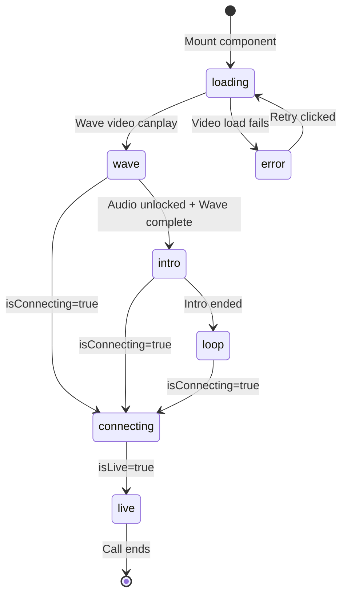

# Feature: Video Sequencer

## Quick Summary
The Video Sequencer manages the 3-part "ghost greeter" video experience for visitors: a muted looping wave video, followed by an audio-enabled intro video, then an infinite loop video. It creates the illusion of a live agent greeting the visitor by seamlessly transitioning between pre-recorded video segments while handling buffering, preloading, errors, and call state interruptions.

## Affected Users
- [x] Website Visitor
- [ ] Agent
- [ ] Admin
- [ ] Platform Admin

---

## 1. WHAT IT DOES

### Purpose
The Video Sequencer creates the core "ghost greeter" experience that differentiates this product. It makes pre-recorded agent videos appear as a live, personal greeting by:
1. Playing a muted wave/attention-grabber until the visitor interacts with the page
2. Transitioning to an audio-enabled intro video after user interaction unlocks audio
3. Looping a "waiting" video indefinitely until a call begins

### User Goals
| User Type | What They Want | How This Feature Helps |
|-----------|---------------|----------------------|
| Visitor | Feel personally greeted | Creates illusion of live agent watching and greeting them |
| Visitor | Immediate engagement | Wave video plays instantly (muted for autoplay) |
| Visitor | Audio experience | Intro plays with audio after first interaction |
| Visitor | Seamless experience | No visible video switching or black flashes |

---

## 2. HOW IT WORKS

### High-Level Flow
1. Widget mounts and receives agent video URLs (`waveVideoUrl`, `introVideoUrl`, `loopVideoUrl`)
2. **Wave video** starts playing immediately (muted, looping) - only this video loads initially
3. Once wave video starts playing, **intro and loop videos begin preloading** in background
4. User interacts with page (click/scroll/touch) → AudioContext unlocked
5. Wave video must **complete at least one full playback** before transitioning
6. Once audio is unlocked AND wave completed → **Intro video** plays once with audio
7. When intro ends → **Loop video** plays indefinitely with audio
8. If call begins → Videos pause, live WebRTC video takes over

### State Machine


### State Definitions
| State | Description | How to Enter | How to Exit |
|-------|-------------|--------------|-------------|
| `loading` | Waiting for wave video to be playable | Initial state on mount | Wave video fires `canplay` |
| `wave` | Wave video playing muted on loop | Wave video ready | Audio unlocked + wave completed at least once |
| `intro` | Intro video playing once with audio | Audio unlocked, wave completed, intro buffered | Intro video `ended` event |
| `loop` | Loop video playing forever with audio | Intro completed (or no intro URL) | Call connects (isLive) |
| `connecting` | WebRTC establishing | `isConnecting` prop becomes true | `isLive` prop becomes true |
| `live` | Active WebRTC call | `isLive` prop becomes true | External (Widget handles) |
| `error` | Video failed to load | Load error after max retries | Retry button clicked |

---

## 3. DETAILED LOGIC

### Triggers & Events
| Event Name | Where It Fires | What It Does | Side Effects |
|------------|---------------|--------------|--------------|
| `timeupdate` | Wave video, every ~250ms | Checks if wave reached end (within 0.3s) | Sets `waveCompletedOnce` |
| `canplaythrough` | Intro video | Marks intro as ready for playback | Sets `introReady` |
| `ended` | Intro video | Triggers transition to loop | Validates via min duration check |
| `error` | Any video element | Triggers retry or error state | Increments `retryCount` |
| `play` | Wave video | Signals wave started | Triggers deferred loading of intro/loop |

### Key Functions/Components
| Function/Component | File | Purpose |
|-------------------|------|---------|
| `VideoSequencer` | `apps/widget/src/features/simulation/VideoSequencer.tsx` | Main component managing video state machine |
| `switchToIntro` | VideoSequencer.tsx:123-161 | Pause wave, play intro with audio |
| `switchToLoop` | VideoSequencer.tsx:84-118 | Pause others, play loop with audio |
| `handleIntroEnded` | VideoSequencer.tsx:259-292 | Validate and trigger transition to loop |
| `handleVideoError` | VideoSequencer.tsx:166-182 | Handle errors with retry logic |
| `handleRetry` | VideoSequencer.tsx:187-197 | Reset state and reload videos |

### Data Flow
```
Widget.tsx
    ↓ passes agent video URLs + call state
VideoSequencer.tsx
    ↓ manages 3 <video> elements
    ↓ tracks state: loading → wave → intro → loop
    ↓ defers loading of intro/loop until wave starts
    ↓ handles audioUnlocked signal from parent
    ↓ calls onIntroComplete when reaching loop
Widget.tsx
    ↓ stores state in localStorage (via storeWidgetState)
    ↓ enables skipToLoop on page navigation
```

### Video Element Strategy (Triple Buffering)
The sequencer uses **three separate video elements** to prevent black flashes during transitions:

```tsx
// All three videos exist simultaneously, visibility controlled via CSS
<video ref={waveVideoRef} className={activeVideo !== "wave" ? "gg-video-hidden" : ""} />
<video ref={introVideoRef} className={activeVideo !== "intro" ? "gg-video-hidden" : ""} />
<video ref={loopVideoRef} className={activeVideo !== "loop" ? "gg-video-hidden" : ""} />
```

Hidden videos use `content-visibility: hidden` to skip rendering entirely while staying in DOM for instant swap.

### Preloading Strategy (Bandwidth Optimization)
Videos load in **deferred sequence** to optimize initial page load:

1. **On mount**: Only wave video loads (`preload="auto"`)
2. **Wave starts playing**: Triggers `setWaveStartedPlaying(true)`
3. **After wave plays**: Intro and loop videos load (`preload="none"` → dynamic `load()`)

This reduces initial bandwidth by ~50% on slow networks by not loading all 3 videos simultaneously.

---

## 4. EDGE CASES

### Complete Scenario Matrix

| # | Scenario | Trigger | Current Behavior | Correct? | Notes |
|---|----------|---------|------------------|----------|-------|
| 1 | Happy path | User scrolls, wave completes, intro plays, loop plays | Seamless transitions with audio | ✅ | Working as designed |
| 2 | Audio never unlocked | User doesn't interact | Wave loops forever (muted) | ✅ | Intentional - autoplay policy |
| 3 | User interacts before wave completes | Click during first wave playback | Waits for wave to complete before intro | ✅ | Ensures full greeting visible |
| 4 | No intro URL provided | `introUrl` is null | Skips directly to loop after wave | ✅ | `introCompleted` set without playing |
| 5 | No wave URL (only intro) | `waveUrl` is null | Uses introUrl as wave (loops muted) | ⚠️ | May not be optimal UX |
| 6 | Video fails to load | Network error | Retries 2x, then shows error with retry button | ✅ | User can manually retry |
| 7 | Intro fires spurious `ended` event | Browser quirk | Validates via `introStartedAt` + duration check | ✅ | Safety checks at lines 267-288 |
| 8 | Call connects during intro | Agent accepts call | `isConnecting` overlay shows, videos pause | ✅ | WebRTC takes priority |
| 9 | Page navigation (same agent) | Visitor navigates | `skipToLoop=true` jumps directly to loop | ✅ | localStorage persistence |
| 10 | Page navigation (different agent) | Visitor navigates to different pool | Plays full sequence from wave | ✅ | Video URLs compared |
| 11 | Widget reopened after minimize | State preserved | `skipToLoop=true` if intro was completed | ✅ | Avoids replaying intro |
| 12 | Intro playback fails | Browser blocks audio | Retries once, then skips to loop | ✅ | Fallback at line 153 |
| 13 | Loop playback fails | Browser blocks | Tries muted fallback, then error state | ✅ | Graceful degradation |

### Error States
| Error | When It Happens | What User Sees | Recovery Path |
|-------|-----------------|----------------|---------------|
| Video load timeout | Network very slow | Loading spinner → Error state | Click "Retry" button |
| Video load error | 404, CORS, format issue | Error icon + message | Click "Retry" button |
| Autoplay blocked | Strict browser policy | Wave won't play | User interaction starts it |
| Audio unlock failed | Rare browser issue | Videos play muted | N/A - silent fallback |

---

## 5. UI/UX REVIEW

### User Experience Audit
| Step | User Action | System Response | Clear? | Issues |
|------|------------|-----------------|--------|--------|
| Widget appears | None (passive) | Wave video plays muted | ⚠️ | "Tap to unmute" is small |
| First interaction | Click/scroll anywhere | Audio context created | ✅ | Invisible but works |
| Intro plays | Listen/watch | Intro plays with audio | ✅ | Seamless transition |
| Loop plays | Continue browsing | Loop video loops forever | ✅ | Looks like agent waiting |
| Video fails | N/A | Error message + retry button | ✅ | Clear recovery path |
| Call starts | Click camera/mic | "Connecting..." overlay | ✅ | Progress indicator visible |

### Accessibility
- **Keyboard navigation**: No direct keyboard controls for video playback
- **Screen reader support**: ARIA labels present on controls but not on video content
- **Color contrast**: N/A - video content
- **Loading states**: Visual spinner shown during loading

### Muted Indicator UX
When video is muted (before audio unlock), an overlay shows:
- Pulsing muted icon (red)
- Text: "Tap anywhere to unmute"
- Located at bottom-left of video area

**Potential Issue**: On smaller widget sizes, this may be easy to miss.

---

## 6. TECHNICAL CONCERNS

### Performance
- **Deferred loading**: Only wave video loads initially, reducing initial bandwidth
- **content-visibility: hidden**: Hidden videos skip rendering entirely
- **GPU acceleration**: Videos use `transform: translateZ(0)` for hardware acceleration
- **Memory**: Three video elements exist in DOM but only one decodes at a time

### Memory Leak Prevention
- `clearLoadTimeout()` called on unmount
- Video elements removed from DOM when component unmounts
- No event listeners leak (all cleaned up in useEffect returns)

### Race Conditions
| Potential Race | Prevention |
|----------------|------------|
| Double transition to loop | `introCompleted` state gate |
| Spurious `ended` events | `introStartedAt` + `INTRO_MIN_PLAY_DURATION` check |
| Concurrent play attempts | `switchToIntro`/`switchToLoop` pause other videos first |
| Audio unlock during transition | `hasStartedWithAudio` flag prevents double-trigger |

### Browser Compatibility
- **Autoplay**: Relies on muted autoplay (universal support)
- **AudioContext**: Uses webkit prefix fallback
- **Video formats**: Depends on agent-uploaded format (typically MP4)
- **playsInline**: Required for iOS Safari

---

## 7. FIRST PRINCIPLES REVIEW

### Does This Make Sense?
| Question | Answer |
|----------|--------|
| **Is the mental model clear?** | ✅ Yes - visitor sees "live agent" greeting them |
| **Is the control intuitive?** | ⚠️ Mostly - tap to unmute may not be obvious |
| **Is feedback immediate?** | ✅ Yes - videos play instantly |
| **Is the flow reversible?** | N/A - video sequence is one-way |
| **Are errors recoverable?** | ✅ Yes - retry button available |
| **Is the complexity justified?** | ✅ Yes - creates core product differentiator |

### Identified Issues
| Issue | Impact | Severity | Suggested Fix |
|-------|--------|----------|--------------|
| "Tap to unmute" is small and easy to miss | Visitors may not hear intro audio | 🟡 Medium | Make CTA more prominent or pulse after 2 wave loops |
| No wave URL uses intro as wave | May feel jarring if intro is personal | 🟢 Low | Could show static frame or avatar instead |
| `waveCompletedOnce` tolerance is 0.3s | Very short videos (<0.5s) might not register complete | 🟢 Low | Edge case - videos should be longer |

---

## 8. CODE REFERENCES

| Purpose | File | Lines | Notes |
|---------|------|-------|-------|
| Main component | `apps/widget/src/features/simulation/VideoSequencer.tsx` | 1-567 | Complete implementation |
| Video timing constants | `apps/widget/src/constants.ts` | 15-35 | `VIDEO_TIMING` object |
| Widget integration | `apps/widget/src/Widget.tsx` | 1167-1189 | Props passed to sequencer |
| Video styles | `apps/widget/src/widget-styles.ts` | 371-432 | CSS for video container |
| State persistence | `apps/widget/src/features/signaling/useSignaling.ts` | 39-126 | `storeWidgetState`, `shouldSkipIntroForAgent` |
| Agent video URLs | `packages/domain/src/types.ts` | 16-29 | `AgentProfile` with video fields |

### Key Constants
```typescript
VIDEO_TIMING = {
  INTRO_MIN_PLAY_DURATION: 500,    // ms before accepting 'ended' event
  END_DETECTION_TOLERANCE: 0.5,    // seconds tolerance for "at end" detection  
  INTRO_RETRY_DELAY: 100,          // ms before retrying intro play
}
```

---

## 9. RELATED FEATURES

- [Widget Lifecycle](./widget-lifecycle.md) - Parent component that manages VideoSequencer
- [Visitor Call](./visitor-call.md) - What happens when call connects (video pauses)
- [Widget Theming](./widget-theming.md) - CSS variables affect video container styling

---

## 10. OPEN QUESTIONS

1. **Q-V2-001**: Should there be a configurable "minimum wave loops" before transitioning? Currently it's 1 loop, but some agents may want visitors to see the wave 2-3 times.

2. **Q-V2-002**: What happens if all three video URLs point to the same video file? (e.g., agent only uploaded one video) - Currently would work but show same video three times in sequence which may be odd.

3. **Q-V2-003**: Is there any analytics tracking when videos fail to load? Could be valuable for detecting CDN issues or format compatibility problems.

---

## Documentation Metadata
- **Created**: 2024-12-03
- **Feature ID**: V2
- **Category**: Visitor
- **Doc Agent**: 11

