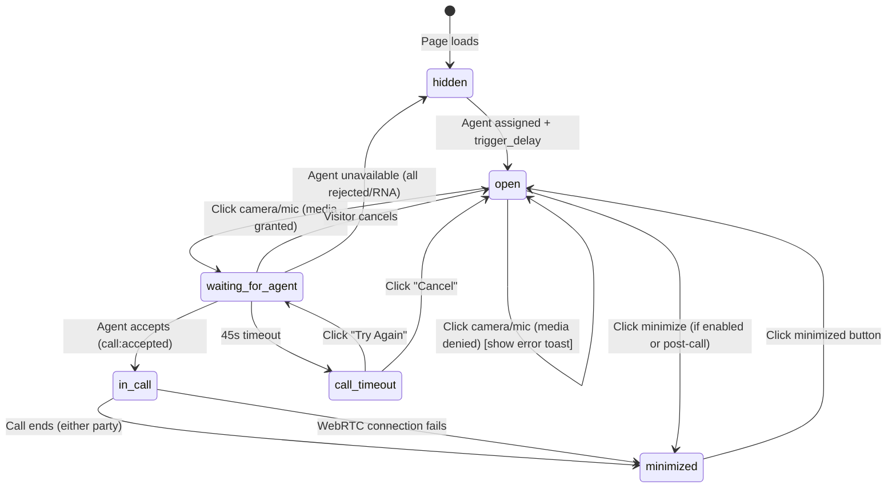

# Feature: V3 - Visitor Call (Call Initiation & Active Call)

## Quick Summary
The complete visitor experience from clicking "Start Call" (via camera/mic buttons) through the video conversation to hangup. This is THE conversion moment - when a browsing visitor becomes an active lead on a live video call with an agent.

## Affected Users
- [x] Website Visitor
- [ ] Agent (covered in A2)
- [ ] Admin
- [ ] Platform Admin

---

## 1. WHAT IT DOES

### Purpose
Enable website visitors to instantly connect with a live agent via video call. This is the core value proposition of Ghost Greeter - converting anonymous website traffic into qualified conversations.

### User Goals
| User Type | What They Want | How This Feature Helps |
|-----------|---------------|----------------------|
| Visitor | Get help/answers immediately | One-click video call with available agent |
| Visitor | Know what's happening | Visual feedback at every step (connecting, live, etc.) |
| Visitor | Stay in control | Can mute, toggle camera, end call at any time |
| Visitor | Not get stuck | Timeouts with retry options, graceful error handling |

---

## 2. HOW IT WORKS

### High-Level Flow
1. Visitor sees widget (agent video playing loop)
2. Visitor clicks camera OR mic button to initiate call
3. Browser requests camera/mic permissions
4. Widget shows "Connecting..." spinner
5. Server notifies agent of incoming call
6. Agent accepts → WebRTC connection established
7. Live video call begins (both see/hear each other)
8. Either party can end → visitor sees minimized widget

### State Machine



### State Definitions
| State | Description | How to Enter | How to Exit |
|-------|-------------|--------------|-------------|
| `hidden` | Widget not visible | Initial state, or no agent available | Agent assigned + trigger_delay elapsed |
| `open` | Widget expanded showing agent video | Agent available, trigger delay passed | Click camera/mic, minimize, or agent unavailable |
| `waiting_for_agent` | Connecting spinner, visitor media active | Click camera/mic with permissions granted | Agent accepts, timeout, cancel, or agent unavailable |
| `call_timeout` | "Taking longer than usual" UI | 45s in waiting_for_agent without agent accept | Retry or cancel |
| `in_call` | Live WebRTC video call | Agent accepted call | Call ends or WebRTC fails |
| `minimized` | Small circular button with agent video/avatar | Post-call, or minimize button clicked | Click to expand |

---

## 3. DETAILED LOGIC

### Triggers & Events

| Event Name | Direction | What It Does | Side Effects |
|------------|-----------|--------------|--------------|
| `call:request` | Widget → Server | Visitor wants to call assigned agent | Creates CallRequest, notifies agent, starts RNA timeout |
| `call:accepted` | Server → Widget | Agent accepted the call | Stores reconnect token, transitions to in_call, triggers WebRTC init |
| `call:rejected` | Server → Widget | Agent rejected (busy, manual reject) | Visitor keeps waiting; server tries next agent |
| `call:cancelled` | Widget → Server | Visitor cancelled pending request | Clears RNA timeout, notifies agent |
| `call:ended` | Bidirectional | Call terminated | Clears call state, transitions to minimized |
| `webrtc:signal` | Bidirectional | WebRTC signaling (offer/answer/ICE) | Establishes peer connection |
| `agent:unavailable` | Server → Widget | No agents can take call | Widget hides, shows "got pulled away" message |

### Key Functions/Components
| Function/Component | File | Purpose |
|-------------------|------|---------|
| `Widget` | `apps/widget/src/Widget.tsx` | Main widget component, manages all states |
| `handleCameraToggle` | `Widget.tsx:858-910` | Initiates call when camera clicked |
| `handleMicToggle` | `Widget.tsx:912-967` | Initiates call when mic clicked |
| `requestCall` | `useSignaling.ts:520-538` | Emits `call:request` socket event |
| `useWebRTC` | `useWebRTC.ts` | Manages WebRTC peer connection |
| `LiveCallView` | `LiveCallView.tsx` | Renders the in-call video UI |
| `CALL_REQUEST handler` | `socket-handlers.ts:283-383` | Server-side call request processing |
| `CALL_ACCEPT handler` | `socket-handlers.ts:692-772` | Server-side call acceptance |

### Data Flow

#### 1. Call Initiation
```
Visitor clicks camera/mic
  ↓
getUserMedia() - browser permission prompt
  ↓
setState("waiting_for_agent")
setPreviewStream(stream)
  ↓
requestCall(agentId) - emits call:request
  ↓
Server: createCallRequest()
Server: createCallLog() - database entry
Server: emit call:incoming to agent
Server: startRNATimeout() - 15s default
```

#### 2. Call Acceptance
```
Agent clicks Accept
  ↓
Server: clearRNATimeout()
Server: acceptCall() - poolManager
Server: markCallAccepted() - generates reconnectToken
  ↓
Server: emit call:accepted to visitor
  {callId, agentId, reconnectToken}
  ↓
Widget: setCallAccepted(true)
Widget: storeActiveCall(localStorage) - for reconnection
Widget: setState("in_call")
  ↓
useWebRTC: initializeCall()
  - getUserMedia() for local stream
  - new RTCPeerConnection(ICE_SERVERS)
  - Wait for agent's offer signal
```

#### 3. WebRTC Connection
```
Agent (initiator):
  createOffer() → setLocalDescription() → emit webrtc:signal(offer)
  ↓
Visitor (responder):
  onSignal(offer) → setRemoteDescription(offer)
  createAnswer() → setLocalDescription() → emit webrtc:signal(answer)
  ↓
Agent:
  setRemoteDescription(answer)
  ↓
Both exchange ICE candidates:
  onicecandidate → emit webrtc:signal({type: "candidate", candidate})
  ↓
Connection established:
  ontrack → setRemoteStream()
  onconnectionstatechange → "connected"
```

---

## 4. EDGE CASES

### Complete Scenario Matrix

| # | Scenario | Trigger | Current Behavior | Correct? | Notes |
|---|----------|---------|------------------|----------|-------|
| 1 | Happy path | Camera click → agent accepts | Call connects in ~2-5s | ✅ | Works well |
| 2 | Camera permission denied | Click camera, deny permission | Error toast: "We need camera access..." | ✅ | Clear guidance to fix |
| 3 | Mic permission denied | Click mic, deny permission | Error toast with fix instructions | ✅ | |
| 4 | Double-click camera | Fast double-click | ⚠️ See Q-1202-001 | ❓ | No explicit debounce |
| 5 | Agent never answers (RNA) | Wait 15s | Agent marked away, tries next agent | ✅ | |
| 6 | All agents RNA | All agents timeout | Widget hides with "got pulled away" | ✅ | |
| 7 | Agent rejects | Agent clicks reject | Routes to next agent silently | ✅ | Visitor unaware |
| 8 | No other agents after reject | Last agent rejects | Widget hides with "got pulled away" | ✅ | |
| 9 | Visitor cancels while waiting | Click end button | Cancels request, back to open state | ✅ | |
| 10 | 45s timeout waiting | No agent accepts for 45s | Shows "Taking longer than usual" retry UI | ✅ | Good UX |
| 11 | WebRTC connection fails | ICE/STUN/TURN failure | Error toast with retry button | ✅ | |
| 12 | WebRTC timeout | 30s without connection | onConnectionTimeout callback | ✅ | |
| 13 | Visitor ends call | Click end button | Call ends, minimized state | ✅ | |
| 14 | Agent ends call | Agent hangs up | Receives call:ended, minimized state | ✅ | |
| 15 | Network drops mid-call | WiFi disconnects | WebRTC: "disconnected" state | ⚠️ | May recover or fail |
| 16 | Page navigation during call | Visitor navigates | Call reconnection via localStorage token | ✅ | V4 feature |
| 17 | Max call duration reached | 120 min (default) | Call auto-ends with message | ✅ | |
| 18 | Socket disconnects during waiting | Server restart | Retries pending call on reconnect | ✅ | Option E implemented |
| 19 | Agent becomes away during call | Agent goes away | Call continues (already in_call) | ✅ | |
| 20 | Camera in use by other app | Click camera | NotReadableError → error toast | ✅ | |

### Error States
| Error | When It Happens | What User Sees | Recovery Path |
|-------|-----------------|----------------|---------------|
| Camera denied | getUserMedia fails (NotAllowedError) | "We need camera access..." toast | Click lock icon instructions |
| Mic denied | getUserMedia fails | "We need microphone access..." toast | Click lock icon instructions |
| No camera | NotFoundError | "We couldn't find a camera..." | Connect camera, refresh |
| Camera in use | NotReadableError | "Camera or microphone is being used..." | Close other apps |
| WebRTC failed | ICE/connection failure | "Video connection dropped" + retry | Click "Try Again" |
| Connection timeout | 30s no connection | Shows timeout callback behavior | Retry available |
| Socket disconnected | Server down/restart | "Connection hiccup – reconnecting..." | Auto-reconnect (5 attempts) |

---

## 5. UI/UX REVIEW

### User Experience Audit

| Step | User Action | System Response | Clear? | Issues |
|------|------------|-----------------|--------|--------|
| 1 | Click camera button | Browser permission prompt | ✅ | |
| 2 | Grant permission | Preview shows in self-view PiP | ✅ | Good immediate feedback |
| 3 | Wait for agent | "Connecting you to [name]..." spinner | ✅ | |
| 4 | (timeout) | "Taking longer than usual" UI | ✅ | Friendly messaging |
| 5 | Call connects | Agent video appears, "LIVE" badge | ✅ | Clear call is active |
| 6 | During call | Mute/camera/end buttons visible | ✅ | Standard video call UX |
| 7 | End call | Widget minimizes | ✅ | Can re-expand if needed |
| 8 | Error occurs | Yellow toast with message | ✅ | Auto-dismisses after 5s |

### Accessibility
- ✅ Keyboard navigation: Escape to minimize, buttons focusable
- ✅ ARIA labels on all buttons and controls
- ✅ Screen reader: role="dialog", aria-live for status messages
- ⚠️ Color contrast: Relies on theme (dark/light/liquid-glass)
- ✅ Loading states: Spinners and text feedback

---

## 6. TECHNICAL CONCERNS

### Performance
- ✅ Media streams properly cleaned up on call end (`cleanupPreviewStream`)
- ✅ WebRTC peer connection closed and handlers nullified
- ✅ Timeouts cleared on state transitions
- ⚠️ LocalStorage operations on every call (small but synchronous)

### Security
- ✅ Camera/mic permissions browser-controlled
- ✅ STUN/TURN credentials not exposed to client (server config)
- ✅ Reconnect tokens are UUID-based, time-limited (5 min)
- ✅ Call requests validated against visitor session

### Reliability
- ✅ Socket.io auto-reconnect (5 attempts with exponential backoff)
- ✅ Pending call request recovery after socket reconnect (Option E)
- ✅ Call reconnection after page navigation (localStorage token)
- ✅ Multiple TURN servers (UDP, TCP, TLS) for firewall traversal

---

## 7. FIRST PRINCIPLES REVIEW

### Does This Make Sense?

1. **Is the mental model clear?** 
   ✅ Yes - camera/mic buttons → call starts. Standard video call paradigm.

2. **Is the control intuitive?**
   ✅ Yes - familiar video call controls (mute, camera, end)

3. **Is feedback immediate?**
   ✅ Yes - spinner appears instantly, connecting message shows agent name

4. **Is the flow reversible?**
   ✅ Yes - can cancel while waiting, end call anytime, minimize widget

5. **Are errors recoverable?**
   ✅ Yes - retry buttons, clear error messages with instructions

6. **Is the complexity justified?**
   ✅ Yes - WebRTC is inherently complex, but abstracted well for users

### Identified Issues
| Issue | Impact | Severity | Suggested Fix |
|-------|--------|----------|--------------|
| No explicit double-click protection | Could send duplicate call:request | 🟡 | See Q-1202-001 |
| Reconnect token exposed in localStorage | Theoretical security concern | 🟢 | 5-min expiry mitigates |

---

## 8. CODE REFERENCES

| Purpose | File | Lines | Notes |
|---------|------|-------|-------|
| Main widget component | `apps/widget/src/Widget.tsx` | 1-1381 | All state management |
| Widget state type | `Widget.tsx` | 82 | `"hidden" \| "minimized" \| "open" \| "waiting_for_agent" \| "call_timeout" \| "in_call"` |
| Camera toggle (call init) | `Widget.tsx` | 858-910 | Requests media, calls requestCall() |
| Mic toggle (call init) | `Widget.tsx` | 912-967 | Same flow as camera |
| Cancel waiting | `Widget.tsx` | 969-975 | Cleans up preview, resets state |
| End call handler | `Widget.tsx` | 995-1005 | Ends signaling + WebRTC |
| Signaling hook | `apps/widget/src/features/signaling/useSignaling.ts` | 209-661 | Socket.io connection |
| Request call | `useSignaling.ts` | 520-538 | Emits call:request |
| Cancel call | `useSignaling.ts` | 544-557 | Emits call:cancel |
| End call | `useSignaling.ts` | 562-573 | Emits call:end |
| WebRTC hook | `apps/widget/src/features/webrtc/useWebRTC.ts` | 56-509 | RTCPeerConnection management |
| Initialize call | `useWebRTC.ts` | 202-331 | getUserMedia, create peer |
| Process signal | `useWebRTC.ts` | 169-197 | Handle offer/ICE from agent |
| Live call view | `apps/widget/src/features/webrtc/LiveCallView.tsx` | 1-195 | In-call video UI |
| Server call request | `apps/server/src/features/signaling/socket-handlers.ts` | 283-383 | CALL_REQUEST handler |
| Server call accept | `socket-handlers.ts` | 692-772 | CALL_ACCEPT handler |
| RNA timeout | `socket-handlers.ts` | 1541-1684 | Ring-no-answer logic |

---

## 9. RELATED FEATURES
- [A2: Incoming Call](../agent/incoming-call.md) - Agent side of call acceptance
- [V4: Call Reconnection](./call-reconnection.md) - Page navigation during call
- [P3: Call Lifecycle](../platform/call-lifecycle.md) - Full state machine
- [P5: WebRTC Signaling](../platform/webrtc-signaling.md) - Signaling protocol
- [A3: RNA Timeout](../agent/rna-timeout.md) - Agent no-answer handling

---

## 10. OPEN QUESTIONS

1. **Double-click protection:** Is there implicit protection via state checking, or could rapid clicks cause issues? (See Q-1202-001)

2. **WebRTC offer timing:** What if agent's offer arrives before visitor's peer connection is created? 
   - Answer: Signals are queued in `pendingSignalsRef` and processed once peer is ready ✅

3. **Camera already in use:** Does the error message adequately explain what to do?
   - Answer: Yes, "Camera or microphone is being used by another application" ✅

---

*Documentation created: 2024-12-02 by Doc Agent 2*
*Last updated: 2024-12-02*

