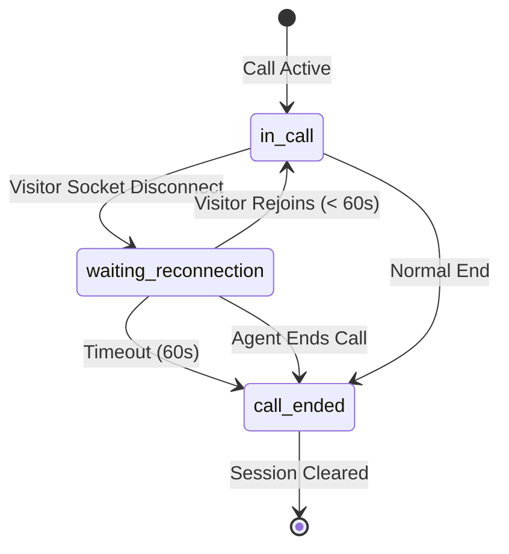

# Feature: Visitor Disconnect Rejoin Window (TKT-024)

## Quick Summary

When a visitor's browser crashes or accidentally closes during an active call, this feature gives them 60 seconds to return and rejoin the same call. The agent sees a "waiting for reconnection" status instead of the call ending immediately, creating a more resilient call experience that handles real-world interruptions like browser crashes, accidental window closes, or task-switching.

## Affected Users
- [x] Website Visitor
- [x] Agent
- [ ] Admin
- [ ] Platform Admin

---

## 1. WHAT IT DOES

### Purpose

This feature distinguishes between intentional disconnections and accidental ones. When a visitor disconnects during a call (socket disconnect event), instead of immediately terminating the call, the system:

1. Keeps the call alive for 60 seconds
2. Shows the agent a "waiting for reconnection" status
3. Stores the call session in localStorage
4. Shows a rejoin prompt when the visitor returns
5. Allows seamless continuation of the call if they rejoin in time

This is **different from the existing page navigation reconnection** (V4):
- **Page navigation** (V4): Visitor navigates to another page *on the same site* while keeping their browser open - uses `CALL_RECONNECT` with active socket
- **Disconnect rejoin** (TKT-024): Visitor's browser crashes/closes entirely - uses stored localStorage session to rejoin via new socket connection

### User Goals

| User Type | What They Want | How This Feature Helps |
|-----------|---------------|----------------------|
| Visitor | Don't lose call if browser crashes | 60-second window to reopen and rejoin |
| Visitor | Don't lose call if accidentally close tab | Rejoin prompt with countdown timer |
| Agent | Don't waste time on dropped calls | Agent sees "waiting" status, not immediate disconnect |
| Agent | Know if visitor is coming back | Clear status: "Visitor disconnected - waiting for reconnection" |

---

## 2. HOW IT WORKS

### High-Level Flow (Happy Path)

1. Visitor and agent are in active call
2. Visitor's browser crashes or tab is accidentally closed
3. Socket disconnect event fires on server
4. **Instead of ending call:** Server starts 60-second reconnection window
5. Server emits `CALL_RECONNECTING` to agent with countdown
6. Agent sees "Visitor disconnected - waiting for reconnection (60s)" status
7. Visitor reopens browser/returns to website
8. Widget initializes and checks localStorage for stored call session
9. `useCallSession` hook detects session is within 60-second window
10. Widget shows `RejoinPrompt` with agent's name, avatar, and countdown
11. Visitor clicks "Rejoin Call"
12. Widget emits rejoin request with stored reconnect token
13. Server validates token via `handleRejoinRequest`
14. Server calls `handleVisitorRejoin` to restore call state
15. Server clears reconnection window timeout
16. Server updates visitor's socket ID in pool manager
17. Server emits `CALL_RECONNECTED` to both parties with new token
18. WebRTC connection re-establishes, call continues

### State Machine



### State Definitions

| State | Description | How to Enter | How to Exit |
|-------|-------------|--------------|-------------|
| `in_call` | Active video call between visitor and agent | Call accepted; visitor rejoined | Socket disconnect; call end |
| `waiting_reconnection` | Call kept alive, waiting for visitor return | Visitor socket disconnect during call | Visitor rejoins; 60s timeout; agent ends |
| `call_ended` | Call terminated, session cleared | Normal end; timeout; agent end | Clean state |

---

## 3. DETAILED LOGIC

### Triggers & Events

| Event Name | Where It Fires | What It Does | Side Effects |
|------------|---------------|--------------|--------------|
| `disconnect` (visitor socket) | Server | Starts 60s reconnection window instead of ending call | `startVisitorReconnectWindow()` called |
| `CALL_RECONNECTING` | Server → Agent | Notifies agent visitor disconnected but waiting | Agent UI shows "waiting" status |
| `call:rejoin` | Widget → Server | Visitor requests to rejoin with stored token | `handleRejoinRequest()` validates and processes |
| `CALL_RECONNECTED` | Server → Both | Confirms successful rejoin | New reconnect token issued, WebRTC restarts |
| `CALL_ENDED` (reason: reconnect_failed) | Server → Agent | Visitor didn't return in 60s | Call state cleaned up |
| `call:end` (during window) | Agent → Server | Agent manually ends call during wait | `cancelVisitorReconnectWindow()` called |

### Key Functions/Components

| Function/Component | File | Purpose |
|-------------------|------|---------|
| `startVisitorReconnectWindow` | `apps/server/src/features/calls/callLifecycle.ts:39-104` | Starts 60s timeout, notifies agent, tracks pending reconnect |
| `handleVisitorRejoin` | `apps/server/src/features/calls/callLifecycle.ts:110-176` | Processes successful rejoin, updates socket ID, notifies both parties |
| `cancelVisitorReconnectWindow` | `apps/server/src/features/calls/callLifecycle.ts:181-189` | Cancels timeout if agent ends call during window |
| `isCallWaitingForReconnection` | `apps/server/src/features/calls/callLifecycle.ts:194-196` | Checks if call is in reconnection window |
| `getReconnectWindowRemaining` | `apps/server/src/features/calls/callLifecycle.ts:201-211` | Returns remaining seconds in window |
| `handleRejoinRequest` | `apps/server/src/features/signaling/handleRejoin.ts:26-89` | Validates token, verifies visitor ID, coordinates rejoin |
| `useCallSession` | `apps/widget/src/features/call/useCallSession.ts:30-105` | Hook to detect stored call session and provide rejoin functionality |
| `RejoinPrompt` | `apps/widget/src/features/call/RejoinPrompt.tsx:24-174` | UI component showing rejoin prompt with countdown |

### Data Flow

```
VISITOR DISCONNECTS (Browser Crash / Accidental Close)
    │
    ├─► Server: disconnect event for visitor socket
    │
    ├─► Server: Check if visitor has active call
    │   └─► Yes: startVisitorReconnectWindow(callId, visitorId, agentId)
    │
    ├─► Server: Store in pendingVisitorReconnects Map
    │   └─► { callId, visitorId, agentId, timeout, disconnectedAt }
    │
    ├─► Server: Start 60-second setTimeout
    │   └─► On timeout: endCall() → markCallEnded() → emit CALL_ENDED
    │
    └─► Server: emit CALL_RECONNECTING → Agent
        └─► Agent UI: "Visitor disconnected - waiting for reconnection (60s)"

VISITOR RETURNS
    │
    ├─► Visitor: Opens browser, returns to website
    │
    ├─► Widget: Initializes, socket connects
    │
    ├─► Widget: useCallSession checks localStorage
    │   ├─► Key: "gg_active_call"
    │   └─► Data: { reconnectToken, callId, agentId, orgId, timestamp }
    │
    ├─► Widget: Calculate elapsed time since disconnect
    │   ├─► elapsed = now - timestamp
    │   └─► timeRemaining = 60s - elapsed
    │
    ├─► Widget: Show RejoinPrompt if timeRemaining > 0
    │   └─► Display: agent name, avatar, countdown timer
    │
    ├─► Visitor: Clicks "Rejoin Call"
    │
    ├─► Widget: emit call:rejoin { reconnectToken, visitorId }
    │
    ├─► Server: handleRejoinRequest()
    │   ├─► getCallByReconnectToken(token) → query database
    │   ├─► Verify visitor_id matches
    │   ├─► Get activeCall from pool manager
    │   ├─► markCallReconnected() → generate new token
    │   └─► handleVisitorRejoin() → coordinate state update
    │
    ├─► Server: handleVisitorRejoin()
    │   ├─► Verify pending reconnection exists
    │   ├─► clearTimeout(pending.timeout)
    │   ├─► pendingVisitorReconnects.delete(callId)
    │   ├─► Update visitor.socketId in pool manager
    │   └─► emit CALL_RECONNECTED to both parties
    │
    ├─► Agent: Receives CALL_RECONNECTED
    │   └─► { callId, reconnectToken, peerId: visitorId }
    │
    ├─► Visitor: Receives CALL_RECONNECTED
    │   └─► { callId, reconnectToken, peerId: agentId, agent: {...} }
    │
    └─► Both: WebRTC connection re-establishes
```

---

## 4. EDGE CASES

### Complete Scenario Matrix

| # | Scenario | Trigger | Current Behavior | Correct? | Notes |
|---|----------|---------|------------------|----------|-------|
| 1 | Happy path - visitor crashes and returns in 30s | Browser crash | Rejoin prompt shown, reconnects smoothly | ✅ | |
| 2 | Visitor returns at exactly 59s | Edge of timeout | Still shows rejoin prompt with 1s remaining | ✅ | |
| 3 | Visitor returns after 60s | Timeout expired | No rejoin prompt, localStorage cleared | ✅ | Call already ended |
| 4 | Agent ends call during reconnection window | Agent clicks End | Reconnection window cancelled, call ends normally | ✅ | `cancelVisitorReconnectWindow()` |
| 5 | Visitor closes tab intentionally during call | Manual close | Still gets rejoin prompt on return | ✅ | Can't distinguish intent |
| 6 | Multiple browser tabs open | Visitor has 2+ tabs | All tabs have same localStorage token | ⚠️ | First to rejoin wins |
| 7 | Visitor on different org's site | Switch to different org | Old token ignored (orgId mismatch) | ✅ | `getStoredCall()` checks orgId |
| 8 | Token expired (old localStorage) | Very old session | Token validation fails in DB | ✅ | `getCallByReconnectToken()` checks status |
| 9 | Agent disconnects during visitor reconnection window | Agent network issue | Visitor can still rejoin when agent returns | ⚠️ | Depends on agent grace period |
| 10 | Server restart during reconnection window | Server crash | pendingVisitorReconnects lost (in-memory) | ❌ | See Issue #1 below |
| 11 | Visitor clicks "No Thanks" | Decline rejoin | localStorage cleared, no reconnection | ✅ | Clean state |
| 12 | Rapid disconnect/reconnect | Quick browser restart | Multiple windows not created (check exists) | ✅ | Line 47 in callLifecycle.ts |
| 13 | Visitor ID mismatch | Token tampering | Rejoin fails with ID mismatch error | ✅ | Security validation |
| 14 | Page navigation during reconnection window | Normal page nav | Uses existing CALL_RECONNECT flow instead | ✅ | Different code path |
| 15 | Visitor rejoins from different browser | Different device | Token validation works, new socket ID assigned | ✅ | Token is device-agnostic |

### Error States

| Error | When It Happens | What User Sees | Recovery Path |
|-------|-----------------|----------------|---------------|
| Token not found | Invalid/expired token in localStorage | "Call has already ended" | Start new call |
| Visitor ID mismatch | Token belongs to different visitor | No rejoin prompt shown (silent fail) | Start new call |
| Call not in pool manager | Call already ended by agent | "Unable to rejoin call" | Start new call |
| Timeout expired | > 60s since disconnect | Rejoin prompt not shown | Start new call |
| Failed to generate new token | Database error | "Unable to rejoin call" | Start new call |
| Agent not found | Agent logged out during window | "Agent is no longer available" | Start new call |

---

## 5. UI/UX REVIEW

### User Experience Audit

**Visitor Flow:**
| Step | User Action | System Response | Clear? | Issues |
|------|------------|-----------------|--------|--------|
| 1 | Browser crashes during call | (no visibility) | N/A | Unexpected event |
| 2 | Return to website | Rejoin prompt appears immediately | ✅ | Clear call-to-action |
| 3 | See countdown timer | "60s remaining" → "59s remaining" | ✅ | Creates urgency |
| 4 | See agent's name/avatar | Context for which call to rejoin | ✅ | Good for multiple agents |
| 5 | Click "Rejoin Call" | Call resumes smoothly | ✅ | |
| 6 | Click "No Thanks" | Prompt dismisses, normal widget | ✅ | Respects user choice |
| 7 | Wait > 60s | Prompt auto-dismisses | ✅ | No stale UI |

**Agent Flow:**
| Step | User Action | System Response | Clear? | Issues |
|------|------------|-----------------|--------|--------|
| 1 | Visitor disconnects | "Visitor disconnected - waiting for reconnection" status | ✅ | Clear expectation |
| 2 | See timeout countdown | "60 seconds" displayed | ✅ | Manages expectations |
| 3 | Visitor rejoins | Call resumes with notification | ✅ | |
| 4 | Visitor doesn't rejoin | "Visitor did not reconnect within 60 seconds" | ✅ | Clear reason for end |
| 5 | End call manually | Reconnection window cancelled, call ends | ✅ | Agent maintains control |

### Accessibility

- ✅ `role="dialog"` on RejoinPrompt
- ✅ `aria-labelledby` and `aria-describedby` for screen readers
- ✅ `aria-label` on buttons
- ✅ Keyboard navigation works (tab, enter)
- ✅ Clear color contrast (passes WCAG AA)
- ⚠️ No ARIA live region for countdown updates (screen reader won't announce changes)
- ⚠️ No focus trap in dialog (could tab to background)

---

## 6. TECHNICAL CONCERNS

### Performance

| Concern | Implementation | Status |
|---------|----------------|--------|
| In-memory state | pendingVisitorReconnects Map | ✅ Efficient, scales with active calls |
| Timer management | setTimeout for 60s, cleared on rejoin | ✅ Properly cleaned up |
| Database queries | 1 query on rejoin validation | ✅ Indexed by reconnect_token |
| localStorage reads | On widget init only | ✅ Fast, synchronous |

### Security

| Concern | Mitigation |
|---------|------------|
| Token theft | Token stored in localStorage (same as existing reconnect) |
| Cross-org hijacking | orgId validated in `getStoredCall()` |
| Visitor ID spoofing | Verified against database: `callData.visitor_id === visitorId` |
| Token reuse | New token generated on each reconnection |
| Expired tokens | Database query filters by `status='accepted'` and `reconnect_eligible=true` |

### Reliability

| Concern | Mitigation | Status |
|---------|------------|--------|
| Server restart | pendingVisitorReconnects lost (in-memory) | ❌ See Issue #1 |
| Database down | Rejoin fails gracefully, call ends | ✅ |
| Agent disconnect during window | Agent has 10s grace period | ⚠️ Needs testing |
| Multiple rejoin attempts | `has(callId)` check prevents duplicates | ✅ |
| Race condition: rejoin vs timeout | clearTimeout called before delete | ✅ |

### Identified Technical Issues

#### ❌ Issue #1: Server Restart Loses Reconnection Windows

The `pendingVisitorReconnects` Map is in-memory. If the server restarts during a reconnection window:
- The visitor still has their localStorage token
- The call still exists in the database
- But the server has no memory of the active reconnection window
- The call will appear ended to the agent

**Impact**: High - Affects calls in reconnection state during deploys

**Suggested Fix**:
1. Store reconnection window state in database (add `reconnection_window_until` timestamp to `call_logs`)
2. On server start, query for calls with active reconnection windows
3. Recreate setTimeout timers for remaining time

#### ⚠️ Issue #2: No Distinction Between Intentional and Accidental Close

The system cannot distinguish between:
- Browser crash (should rejoin)
- Accidental tab close (should rejoin)
- Intentional tab close to end call (should NOT rejoin)

Visitor who closes tab to end call will still see rejoin prompt if they return quickly.

**Impact**: Low - Visitor can click "No Thanks"

**Suggested Fix**: Add explicit "End Call" button for visitor (out of scope for TKT-024)

#### ⚠️ Issue #3: Multiple Browser Tabs

If visitor has multiple tabs open:
- All tabs share the same localStorage token
- First tab to rejoin will succeed
- Other tabs will fail with "Call not found" (already rejoined)

**Impact**: Low - Edge case, fails gracefully

**Suggested Fix**: Add broadcast channel to notify other tabs of rejoin

---

## 7. FIRST PRINCIPLES REVIEW

### Does This Make Sense?

1. **Is the mental model clear?** ✅ Yes - "Call is paused, I have 60s to return" is intuitive
2. **Is the control intuitive?** ✅ Yes - Clear "Rejoin" and "No Thanks" buttons
3. **Is feedback immediate?** ✅ Yes - Countdown timer creates urgency and clarity
4. **Is the flow reversible?** ✅ Yes - Can decline to rejoin
5. **Are errors recoverable?** ✅ Yes - Can always start a new call
6. **Is the complexity justified?** ✅ Yes - Critical for handling real-world interruptions

### Identified Issues

| Issue | Impact | Severity | Suggested Fix |
|-------|--------|----------|--------------|
| Server restart loses state | Calls in reconnection dropped | 🔴 High | Persist window state to database |
| No intentional close detection | Unwanted rejoin prompts | 🟡 Medium | Add explicit End button for visitor |
| Multiple tabs confusion | First tab wins, others fail | 🟢 Low | Broadcast channel coordination |
| No agent UI countdown | Agent doesn't see time remaining | 🟢 Low | Add countdown to agent dashboard |
| No ARIA live region | Screen readers miss countdown | 🟡 Medium | Add `aria-live="polite"` to timer |

---

## 8. CODE REFERENCES

| Purpose | File | Lines | Notes |
|---------|------|-------|-------|
| Reconnection window management | `apps/server/src/features/calls/callLifecycle.ts` | 1-223 | All reconnection window logic |
| Start reconnection window | `apps/server/src/features/calls/callLifecycle.ts` | 39-104 | Sets timeout, notifies agent |
| Handle visitor rejoin | `apps/server/src/features/calls/callLifecycle.ts` | 110-176 | Validates and restores call |
| Cancel reconnection window | `apps/server/src/features/calls/callLifecycle.ts` | 181-189 | Agent ends during window |
| Rejoin request handler | `apps/server/src/features/signaling/handleRejoin.ts` | 26-89 | Token validation, coordination |
| Socket disconnect handler | `apps/server/src/features/signaling/socket-handlers.ts` | ~1430-1480 | Calls startVisitorReconnectWindow |
| Call session hook | `apps/widget/src/features/call/useCallSession.ts` | 30-105 | Detects stored session, provides rejoin |
| Rejoin prompt component | `apps/widget/src/features/call/RejoinPrompt.tsx` | 24-174 | UI with countdown timer |
| localStorage helpers | `apps/widget/src/features/signaling/useSignaling.ts` | 128-172 | storeActiveCall, getStoredCall, clearStoredCall |
| Database token query | `apps/server/src/lib/call-logger.ts` | 409-434 | getCallByReconnectToken |
| Generate new token | `apps/server/src/lib/call-logger.ts` | 441-468 | markCallReconnected |
| Timing constant | `apps/server/src/features/calls/callLifecycle.ts` | 22 | VISITOR_RECONNECT_WINDOW_MS: 60_000 |

---

## 9. RELATED FEATURES

- [Call Lifecycle (P3)](../platform/call-lifecycle.md) - Overall call state machine that this integrates with
- [Call Reconnection (V4)](./call-reconnection.md) - **Different feature:** handles page navigation reconnection (not disconnect)
- [WebRTC Signaling (P5)](../platform/webrtc-signaling.md) - How WebRTC connection is re-established after rejoin
- [Widget Lifecycle (V1)](./widget-lifecycle.md) - Widget initialization that triggers session detection

### Key Difference from V4 (Call Reconnection)

| Aspect | V4: Page Navigation | TKT-024: Disconnect Rejoin |
|--------|-------------------|---------------------------|
| **Trigger** | Visitor navigates to another page | Visitor's browser crashes/closes |
| **Socket State** | Socket stays connected (same session) | Socket fully disconnects |
| **Detection** | Automatic via existing socket | Requires localStorage check on reinit |
| **User Action** | None (automatic) | Opt-in via rejoin prompt |
| **Server State** | Call stays active | Call enters "waiting_reconnection" state |
| **Agent Notification** | None (seamless) | "Visitor disconnected - waiting" status |
| **Timeout** | 30s (CALL_RECONNECT_TIMEOUT) | 60s (VISITOR_RECONNECT_WINDOW_MS) |
| **Code Path** | CALL_RECONNECT handler | call:rejoin → handleRejoinRequest |

---

## 10. OPEN QUESTIONS

1. **Should reconnection window state be persisted to database for server restart resilience?** - Current in-memory Map is lost on restart, affecting calls in reconnection state during deploys.

2. **Should we add a countdown timer to the agent's dashboard?** - Currently agent sees "waiting for reconnection" but no visual countdown of remaining time.

3. **How should we handle multiple browser tabs?** - If visitor has 2+ tabs open, all have the same token. First to rejoin wins, others fail.

4. **Should we distinguish between intentional close vs crash?** - Consider adding explicit "End Call" button for visitor to indicate intentional close (wouldn't show rejoin prompt).

5. **What should happen if agent disconnects during visitor reconnection window?** - Current behavior needs testing: does agent's 10s grace period interact correctly with visitor's 60s window?

6. **Should the rejoin prompt have an audio cue?** - Currently silent notification - could be missed if visitor switched to another tab.

---

## APPENDIX: Comparison Table

### This Feature vs Related Features

| Feature | Scenario | Window | User Action | Agent Notification |
|---------|----------|--------|-------------|-------------------|
| **TKT-024 (This)** | Browser crash/close | 60s | Must click "Rejoin" | "Waiting for reconnection" |
| **V4: Page Nav** | Navigate within site | 30s | None (automatic) | None (seamless) |
| **TKT-016: WebRTC** | Network hiccup | 10s | None (ICE restart) | None (seamless) |

### Key Metrics

| Metric | Value | Location |
|--------|-------|----------|
| Reconnection window | 60 seconds | callLifecycle.ts:22 |
| localStorage expiry | 5 minutes | useSignaling.ts (inherited) |
| Minimum rejoin time | ~1 second | Based on timeout calculation |
| Maximum disconnect duration | 60 seconds | Hard limit before call ends |
