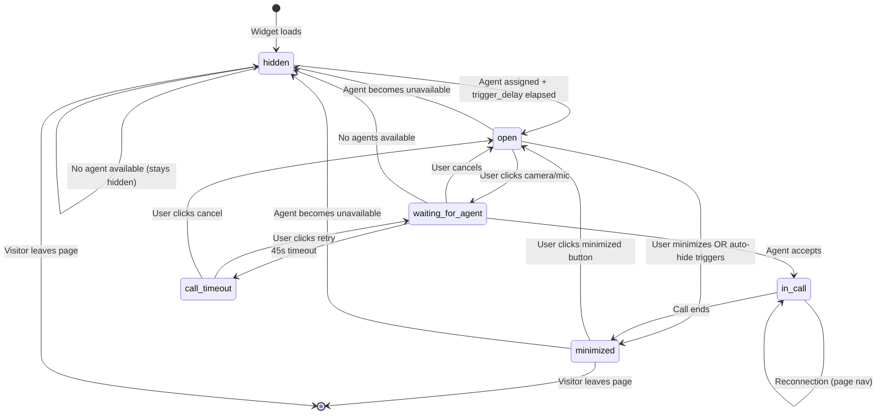

# Feature: Widget Lifecycle (V1)

## Quick Summary
The Widget Lifecycle manages the complete UI state machine of the embedded video widget that website visitors interact with. It handles visibility states (hidden → minimized → open → fullscreen), drag-and-drop positioning with corner snapping, trigger delays, auto-hide behavior, device detection, theme switching, and seamless integration with the video sequencer and call flow.

## Affected Users
- [x] Website Visitor
- [ ] Agent
- [x] Admin (configures widget settings)
- [ ] Platform Admin

---

## 1. WHAT IT DOES

### Purpose
The Widget Lifecycle ensures visitors have a smooth, non-intrusive experience with the "ghost greeter" video widget. It:
- Controls when and how the widget appears on the page
- Manages widget visibility states and transitions
- Provides drag-and-drop repositioning with corner snapping
- Handles fullscreen mode for calls
- Adapts to mobile vs desktop devices
- Supports multiple themes (dark, light, liquid-glass)
- Isolates styles via Shadow DOM to prevent conflicts with host websites

### User Goals
| User Type | What They Want | How This Feature Helps |
|-----------|---------------|----------------------|
| Visitor | Non-intrusive experience | Configurable trigger delay before widget appears |
| Visitor | Control over widget position | Drag-and-drop with 5-point snapping |
| Visitor | Ability to dismiss widget | Minimize button after first call (or if enabled) |
| Visitor | Full-screen video calls | Fullscreen toggle with safe area support |
| Admin | Control widget appearance | Position, size, trigger delay, theme, auto-hide settings |
| Admin | Device targeting | Show widget only on desktop, mobile, or all devices |

---

## 2. HOW IT WORKS

### High-Level Flow (Happy Path)
1. Widget script loads on visitor's page
2. Widget initializes Shadow DOM container for style isolation
3. Widget connects to signaling server via WebSocket
4. Server assigns an available agent and sends widget settings
5. After `trigger_delay` seconds pass, widget transitions from `hidden` → `open`
6. Widget plays video sequence: wave (muted) → intro (with audio) → loop
7. Visitor interacts with widget (mic/camera buttons)
8. Widget transitions to `waiting_for_agent` → `in_call`
9. On call end, widget transitions to `minimized`
10. Visitor can re-expand widget to see loop video

### State Machine



### State Definitions

| State | Description | How to Enter | How to Exit |
|-------|-------------|--------------|-------------|
| `hidden` | Widget not visible | Initial state, no agent, agent unavailable | Agent assigned + trigger delay |
| `minimized` | Small circular button showing agent loop video | User minimize, call ended, auto-hide | User clicks to expand |
| `open` | Full widget with video and controls visible | Trigger delay elapsed, user expands from minimized | Minimize, start call, agent unavailable |
| `waiting_for_agent` | Call requested, showing "Connecting..." overlay | User clicks camera/mic button | Agent accepts, cancel, timeout |
| `call_timeout` | Retry UI shown after 45s with no agent response | 45s passed in waiting_for_agent | Retry, cancel |
| `in_call` | Active WebRTC video call | Agent accepts call | Call ends |

---

## 3. DETAILED LOGIC

### Widget Initialization

```
WIDGET SCRIPT LOADS
    │
    ├─► validateConfig(config) → Validates orgId, serverUrl, position
    │
    ├─► Check duplicate: document.getElementById("greetnow-widget")
    │   └─► If exists: console.warn("already initialized"), return
    │
    ├─► Create container div#greetnow-widget
    │
    ├─► Create Shadow DOM (mode: "open") ← Style isolation!
    │
    ├─► Inject getWidgetStyles() into Shadow DOM <style>
    │
    └─► render(<Widget config={config} />, shadowRoot)
```

### Trigger Delay Logic

```typescript
// Widget.tsx - Show widget after trigger delay
useEffect(() => {
  if (agent && state === "hidden" && !shouldHideForDevice) {
    // Calculate remaining delay based on time already on page
    const triggerDelayMs = (widgetSettings.trigger_delay ?? 3) * 1000;
    const timeOnPage = Date.now() - visitorConnectedAtRef.current;
    const remainingDelayMs = Math.max(0, triggerDelayMs - timeOnPage);
    
    const timer = setTimeout(() => {
      setState("open");
      trackPageview(agent.id);
    }, remainingDelayMs);
    
    return () => clearTimeout(timer);
  }
}, [agent, state, widgetSettings.trigger_delay]);
```

**Key insight**: The `visitorConnectedAt` timestamp comes from the server, not the client. This ensures that if the visitor waits 5 seconds for an agent to become available, and trigger_delay is 3 seconds, the widget appears immediately (0ms remaining delay).

### Auto-Hide Logic

```typescript
// Widget.tsx - Auto-hide after delay if no interaction
useEffect(() => {
  if (state !== "open" || widgetSettings.auto_hide_delay === null) {
    return; // Only active when open with auto_hide configured
  }

  if (userHasInteractedRef.current) {
    return; // Don't auto-hide if user has interacted
  }

  const delayMs = widgetSettings.auto_hide_delay * 1000;
  
  autoHideTimerRef.current = setTimeout(() => {
    setState("minimized");
  }, delayMs);

  return () => clearTimeout(autoHideTimerRef.current);
}, [state, widgetSettings.auto_hide_delay]);
```

**User interaction tracking**: Any click on the widget sets `userHasInteractedRef.current = true` and cancels auto-hide.

### Drag and Drop Behavior

The widget supports drag-and-drop repositioning with snapping to 5 preset positions:

| Position | CSS Classes | Coordinates |
|----------|-------------|-------------|
| `top-left` | `top: 20px; left: 20px;` | Corner |
| `top-right` | `top: 20px; right: 20px;` | Corner |
| `bottom-left` | `bottom: 20px; left: 20px;` | Corner |
| `bottom-right` | `bottom: 20px; right: 20px;` | Corner (default) |
| `center` | `top: 50%; left: 50%; transform: translate(-50%, -50%);` | Center |

**Drag Flow:**

```
USER STARTS DRAG (mousedown/touchstart)
    │
    ├─► Check: Not clicking button/video/control element
    │
    ├─► Record drag start position
    │   ├─► startX, startY (pointer position)
    │   └─► initialX, initialY (widget position)
    │
    ├─► Apply inline transform: translate3d(x, y, 0) ← GPU accelerated
    │
    ├─► Clear CSS positioning (left/top/right/bottom = auto)
    │
    └─► Set isDragging = true (disables CSS transitions)

USER DRAGS (mousemove/touchmove)
    │
    ├─► Calculate delta from start
    │
    ├─► Clamp to viewport bounds
    │
    └─► Update transform directly (no React state) ← 60fps optimization

USER RELEASES (mouseup/touchend)
    │
    ├─► Set isDragging = false
    │
    ├─► Calculate widget center point
    │
    ├─► Find nearest of 5 snap positions
    │
    ├─► Set isSnapping = true (enables CSS transition)
    │
    ├─► Animate to target position via transform
    │
    └─► After 220ms animation:
        ├─► Set draggedPosition to nearest preset
        ├─► Clear inline styles
        └─► Let CSS positioning take over
```

**Performance optimization**: During drag, position updates bypass React state and modify DOM directly via `widget.style.transform`. This prevents re-renders on every frame.

### Device Detection

```typescript
function isMobileDevice(): boolean {
  // Check screen width (768px breakpoint)
  const isSmallScreen = window.innerWidth <= 768;
  
  // Check for touch capability
  const hasTouch = "ontouchstart" in window || navigator.maxTouchPoints > 0;
  
  // Consider mobile if small screen OR touch-only (no fine pointer)
  return isSmallScreen || (hasTouch && !window.matchMedia("(pointer: fine)").matches);
}
```

**Device filtering** is applied when agent is assigned:

```typescript
const isMobile = isMobileDevice();
const devices = data.widgetSettings.devices; // "all" | "desktop" | "mobile"

const shouldHide = 
  (devices === "desktop" && isMobile) || 
  (devices === "mobile" && !isMobile);

setShouldHideForDevice(shouldHide);
```

### Triggers & Events

| Event/Trigger | Where It Fires | What It Does | Side Effects |
|--------------|---------------|--------------|--------------|
| `agent:assigned` | Server → Widget | Stores agent, starts trigger timer | Sets widgetSettings, visitorConnectedAt |
| `agent:unavailable` | Server → Widget | Hides widget, shows handoff message | Clears agent, clears stored widget state |
| `agent:reassigned` | Server → Widget | Updates agent, shows handoff | Clears stored state, resets intro sequence |
| Trigger delay timeout | Widget internal | Shows widget (`hidden` → `open`) | Tracks pageview |
| Auto-hide timeout | Widget internal | Minimizes widget | `open` → `minimized` |
| User click on widget | Widget internal | Cancels auto-hide | Sets userHasInteractedRef |
| Camera/mic click | Widget internal | Starts call flow | `open` → `waiting_for_agent` |
| Call accepted | Server → Widget | Enters call state | `waiting_for_agent` → `in_call` |
| Call ended | Server → Widget | Minimizes widget | `in_call` → `minimized`, sets hasHadCall |
| Expand click | Minimized button | Opens widget | `minimized` → `open` |
| Minimize click | Control button | Minimizes widget | `open` → `minimized` |
| Escape key | Keyboard | Exits fullscreen or minimizes | Context-dependent |

### Key Functions/Components

| Function/Component | File | Purpose |
|-------------------|------|---------|
| `Widget` | `apps/widget/src/Widget.tsx` | Main widget component with state machine |
| `init` | `apps/widget/src/main.tsx` | Widget initialization with Shadow DOM |
| `validateConfig` | `apps/widget/src/main.tsx` | Config validation |
| `getWidgetStyles` | `apps/widget/src/widget-styles.ts` | All CSS styles for Shadow DOM |
| `isMobileDevice` | `apps/widget/src/Widget.tsx` | Device detection |
| `useSignaling` | `apps/widget/src/features/signaling/useSignaling.ts` | Socket connection and events |
| `VideoSequencer` | `apps/widget/src/features/simulation/VideoSequencer.tsx` | Video playback state machine |
| `storeWidgetState` | `apps/widget/src/features/signaling/useSignaling.ts` | localStorage persistence |
| `shouldSkipIntroForAgent` | `apps/widget/src/features/signaling/useSignaling.ts` | Intro skip detection |

### Data Flow

```
WIDGET MOUNTS
    │
    ├─► useSignaling.connect() → WebSocket to signaling server
    │
    ├─► Server: visitor:join { orgId, pageUrl }
    │
    └─► Wait for agent assignment

AGENT ASSIGNED
    │
    ├─► Server: agent:assigned { agent, widgetSettings, visitorConnectedAt }
    │
    ├─► Widget: setAgent(data.agent)
    │
    ├─► Widget: setWidgetSettings(data.widgetSettings)
    │
    ├─► Widget: Check shouldSkipIntroForAgent(agent)
    │   └─► If same agent + same video URLs: setHasCompletedIntroSequence(true)
    │
    ├─► Widget: Check device visibility
    │   └─► If mismatch: setShouldHideForDevice(true), return
    │
    └─► Widget: Start trigger delay timer

TRIGGER DELAY ELAPSED
    │
    ├─► Widget: setState("open")
    │
    ├─► Widget: trackPageview(agent.id) → Server
    │
    └─► VideoSequencer: Starts playing wave video (muted)

USER INTERACTS (First click anywhere on page)
    │
    ├─► Window event listener catches click/touchstart/scroll
    │
    ├─► Widget: setHasInteracted(true)
    │
    ├─► Widget: unlockAudio() → Creates AudioContext, plays silent buffer
    │
    └─► VideoSequencer: Receives audioUnlocked=true, transitions wave → intro

VIDEO SEQUENCE COMPLETES
    │
    ├─► VideoSequencer: Wave completes at least once
    │
    ├─► VideoSequencer: Intro plays with audio
    │
    ├─► VideoSequencer: onIntroComplete() callback
    │
    └─► Widget: storeWidgetState() → localStorage (for page nav persistence)

MINIMIZE BUTTON SHOWN CONDITIONALLY
    │
    ├─► Check: widgetSettings.show_minimize_button === true
    │   OR
    │   hasHadCall === true (enables after first call)
    │
    └─► Render minimize button in video controls
```

---

## 4. EDGE CASES

### Complete Scenario Matrix

| # | Scenario | Trigger | Current Behavior | Correct? | Notes |
|---|----------|---------|------------------|----------|-------|
| 1 | Happy path | Normal flow | Works as designed | ✅ | |
| 2 | No agents available on load | All agents away/offline | Widget stays hidden, tracks missed opportunity | ✅ | |
| 3 | Agent goes away mid-viewing | Agent status change | Widget shows handoff message, then hides | ✅ | |
| 4 | Page navigation during loop video | User clicks link | Widget state persisted in localStorage | ✅ | Same agent = skip intro |
| 5 | Page navigation during call | User clicks link | Call reconnects via localStorage token | ✅ | 5 min expiry |
| 6 | Visitor on mobile, widget set to desktop-only | Device mismatch | Widget never shows | ✅ | shouldHideForDevice |
| 7 | Auto-hide triggers | auto_hide_delay elapsed | Widget minimizes | ✅ | Cancelled on user interaction |
| 8 | User drags to corner | Drag and release | Snaps to nearest preset position | ✅ | Smooth 220ms animation |
| 9 | Fullscreen on mobile | Toggle fullscreen | Safe area insets respected | ✅ | env(safe-area-inset-*) |
| 10 | Theme changes | Admin updates theme | Widget applies theme class to shadow host | ✅ | |
| 11 | Widget already exists | Double script load | Prevents duplicate | ✅ | ID check in init() |
| 12 | Invalid config | Missing orgId | Console error, no widget | ✅ | validateConfig() |
| 13 | Escape key pressed | Keyboard | Exits fullscreen or minimizes | ✅ | Context-dependent |
| 14 | Call timeout (45s) | Agent doesn't answer | Shows retry UI | ✅ | |
| 15 | Agent reassigned to different pool | Routing change | Reset intro sequence | ✅ | Different video URLs = play intro |
| 16 | Audio autoplay blocked | Browser policy | Wave plays muted, unlocks on interaction | ✅ | |
| 17 | Video load error | Network issue | Shows error state with retry | ✅ | 2 retry attempts |
| 18 | Call ends | Either party ends | Widget minimizes, shows loop in minimized button | ✅ | hasHadCall enables future minimize |
| 19 | Rapid clicks on minimize/expand | User spam | State transitions handled correctly | ✅ | React batching |
| 20 | Widget position dragged to center | Drag release | Snaps to center | ✅ | transform: translate(-50%, -50%) |
| 21 | Window resize during drag | User resizes browser | Clamps to new viewport bounds | ✅ | Re-calculated on dragMove |
| 22 | Touch drag on mobile | Touch and swipe | Same as mouse drag | ✅ | Touch events handled |

### Error States

| Error | When It Happens | What User Sees | Recovery Path |
|-------|-----------------|----------------|---------------|
| Connection failed | WebSocket can't connect | Nothing (widget hidden) | Auto-reconnects up to 5 times |
| Agent unavailable | No agents online | Widget hidden | Widget appears when agent available |
| Video load error | Network/CDN issue | Error icon + "Retry" button | Click retry |
| Camera denied | User blocked permission | Error toast with instructions | Click lock icon in browser |
| Mic denied | User blocked permission | Error toast with instructions | Click lock icon in browser |
| Call timeout | No agent response for 45s | "Taking longer than usual" + retry | Click "Try Again" |
| Invalid config | Bad embed code | Console error | Fix embed code |

---

## 5. UI/UX REVIEW

### User Experience Audit

| Step | User Action | System Response | Clear? | Issues |
|------|------------|-----------------|--------|--------|
| 1 | Page loads | Widget appears after trigger delay | ✅ | Configurable delay (default 3s) |
| 2 | Sees widget | Agent video playing, "LIVE" badge | ✅ | Creates "someone is here" illusion |
| 3 | Taps anywhere on page | Audio unmutes, intro plays | ⚠️ | "Tap to unmute" overlay could be more prominent |
| 4 | Clicks camera button | Self-view preview shown | ✅ | |
| 5 | Waits for agent | Sees loop video + "Connecting..." | ✅ | Intentional: maintains ghost greeter illusion |
| 6 | Agent answers | Smooth transition to WebRTC | ✅ | |
| 7 | Wants to move widget | Drag to new position | ✅ | Snaps to corners/center |
| 8 | Wants fullscreen | Click fullscreen button | ✅ | Safe areas handled on mobile |
| 9 | Wants to dismiss | Minimize button (if enabled/after call) | ⚠️ | Not always visible on first visit |
| 10 | Call ends | Widget minimizes automatically | ✅ | |

### Accessibility

- **Keyboard navigation**: ⚠️ Escape key supported, but no full keyboard nav
- **Screen reader support**: ✅ ARIA labels on all interactive elements
- **Color contrast**: ✅ Theme-aware contrast ratios
- **Loading states**: ✅ Spinner and status messages
- **Reduced motion**: ✅ `@media (prefers-reduced-motion)` supported

```css
/* widget-styles.ts */
@media (prefers-reduced-motion: reduce) {
  *,
  *::before,
  *::after {
    animation-duration: 0.01ms !important;
    transition-duration: 0.01ms !important;
  }
}
```

---

## 6. TECHNICAL CONCERNS

### Performance

| Concern | Implementation | Status |
|---------|----------------|--------|
| Video preloading | Wave loads immediately, intro/loop deferred | ✅ Optimized |
| Drag performance | Direct DOM manipulation, no React state during drag | ✅ 60fps |
| CSS containment | `contain: layout style;` on widget | ✅ Isolated |
| GPU acceleration | `transform: translate3d()` for positioning | ✅ Hardware accelerated |
| Memory leaks | Cleanup on unmount, timer clearing | ✅ Properly handled |
| Shadow DOM isolation | All styles scoped to shadow root | ✅ No conflicts |

### Security

| Concern | Mitigation |
|---------|------------|
| XSS via config | validateConfig() sanitizes inputs |
| Style injection | Shadow DOM prevents host style injection |
| Clickjacking | Widget uses `z-index: 2147483647` (max) |
| localStorage tampering | Reconnect tokens validated server-side |

### Reliability

| Concern | Mitigation |
|---------|------------|
| Video CDN down | Error state with retry button, 2 retry attempts |
| WebSocket disconnects | Auto-reconnect with exponential backoff |
| Agent unavailable mid-session | Graceful hide with handoff message |
| Browser autoplay policy | Starts muted, unlocks on user interaction |

---

## 7. FIRST PRINCIPLES REVIEW

### Does This Make Sense?

1. **Is the mental model clear?** ✅ Yes - Widget appears, plays video, enables call
2. **Is the control intuitive?** ⚠️ Mostly - Minimize button visibility rules are complex
3. **Is feedback immediate?** ✅ Yes - All state changes have visual feedback
4. **Is the flow reversible?** ✅ Yes - Can minimize, expand, cancel call
5. **Are errors recoverable?** ✅ Yes - Retry buttons, reconnection, fallbacks
6. **Is the complexity justified?** ✅ Yes - Features serve real UX needs

### Identified Issues

| Issue | Impact | Severity | Suggested Fix |
|-------|--------|----------|--------------|
| Minimize button hidden on first visit | Users can't dismiss widget without calling | 🟡 Medium | Add `show_minimize_button` option (already exists, just needs enabling) |
| No explicit "ringing" state for visitor | Could confuse visitors | 🟢 Low | Intentional - ghost greeter illusion |
| Widget position not persisted | Position resets on page navigation | 🟢 Low | Could add position to localStorage |
| Auto-hide resets on page navigation | User preference not remembered | 🟢 Low | Could store in localStorage |

---

## 8. CODE REFERENCES

| Purpose | File | Lines | Notes |
|---------|------|-------|-------|
| Main widget component | `apps/widget/src/Widget.tsx` | 1-1380 | State machine, all UI logic |
| Widget state type | `apps/widget/src/Widget.tsx` | 82 | `"hidden" \| "minimized" \| "open" \| "waiting_for_agent" \| "call_timeout" \| "in_call"` |
| Widget initialization | `apps/widget/src/main.tsx` | 86-123 | Shadow DOM setup |
| Config validation | `apps/widget/src/main.tsx` | 34-80 | Input validation |
| Default settings | `apps/widget/src/Widget.tsx` | 13-21 | DEFAULT_WIDGET_SETTINGS |
| Mobile detection | `apps/widget/src/Widget.tsx` | 26-35 | isMobileDevice() |
| Audio unlock | `apps/widget/src/Widget.tsx` | 42-69 | unlockAudio() |
| Drag handlers | `apps/widget/src/Widget.tsx` | 623-838 | handleDragStart/Move/End |
| Auto-hide logic | `apps/widget/src/Widget.tsx` | 517-550 | useEffect with timer |
| Trigger delay logic | `apps/widget/src/Widget.tsx` | 454-478 | useEffect with remaining delay |
| Widget styles | `apps/widget/src/widget-styles.ts` | 1-1685 | All CSS |
| CSS variables | `apps/widget/src/widget-styles.ts` | 18-147 | Theme definitions |
| Position styles | `apps/widget/src/widget-styles.ts` | 204-331 | Positioning classes |
| Minimized styles | `apps/widget/src/widget-styles.ts` | 628-702 | Minimized button |
| Size dimensions | `apps/widget/src/constants.ts` | 137-174 | SIZE_DIMENSIONS |
| Timing constants | `apps/widget/src/constants.ts` | 98-128 | CONNECTION_TIMING |
| ARIA labels | `apps/widget/src/constants.ts` | 260-272 | ARIA_LABELS |
| Widget settings type | `packages/domain/src/types.ts` | 267-280 | WidgetSettings interface |
| Video sequencer | `apps/widget/src/features/simulation/VideoSequencer.tsx` | 1-567 | Video state machine |
| Signaling hook | `apps/widget/src/features/signaling/useSignaling.ts` | 1-661 | Socket connection |
| Widget state persistence | `apps/widget/src/features/signaling/useSignaling.ts` | 39-126 | localStorage utilities |

---

## 9. RELATED FEATURES
- [Video Sequencer (V2)](./video-sequencer.md) - Wave → intro → loop video sequence
- [Visitor Call (V3)](./visitor-call.md) - Call initiation and active call
- [Call Reconnection (V4)](./call-reconnection.md) - Page navigation persistence
- [Widget Theming (V6)](./widget-theming.md) - Dark/light/liquid-glass themes
- [Device Detection (V7)](./device-detection.md) - Mobile vs desktop behavior
- [Widget Settings (D5)](../admin/widget-settings.md) - Admin configuration
- [Call Lifecycle (P3)](../platform/call-lifecycle.md) - Server-side state machine

---

## 10. OPEN QUESTIONS

1. **Should widget position persist across page navigations?** - Currently resets to server-configured position
2. **Should auto-hide preference be remembered?** - Currently resets each page load
3. **Should there be a "close" option (not just minimize)?** - Currently widget can only be minimized, not fully closed
4. **Should drag behavior work in fullscreen mode?** - Currently disabled (isFullscreen check)
5. **Should center position use a different minimized location?** - Currently minimized always goes to bottom-right regardless of expanded position

---

## Widget Settings Reference

| Setting | Type | Default | Description |
|---------|------|---------|-------------|
| `size` | `"small" \| "medium" \| "large"` | `"medium"` | Widget dimensions |
| `position` | `"bottom-right" \| "bottom-left" \| "top-right" \| "top-left" \| "center"` | `"bottom-right"` | Initial position |
| `devices` | `"all" \| "desktop" \| "mobile"` | `"all"` | Device targeting |
| `trigger_delay` | `number` (seconds) | `3` | Delay before widget appears |
| `auto_hide_delay` | `number \| null` (seconds) | `null` | Auto-minimize delay (null = never) |
| `show_minimize_button` | `boolean` | `false` | Show minimize button on first visit |
| `theme` | `"dark" \| "light" \| "liquid-glass"` | `"dark"` | Color theme |

---

## Size Dimensions Reference

| Size | Widget Width | Border Radius | Control Button | Minimized Button |
|------|--------------|---------------|----------------|------------------|
| Small | 260px | 16px | 40px | 48px |
| Medium | 320px | 20px | 48px | 60px |
| Large | 380px | 24px | 56px | 72px |

